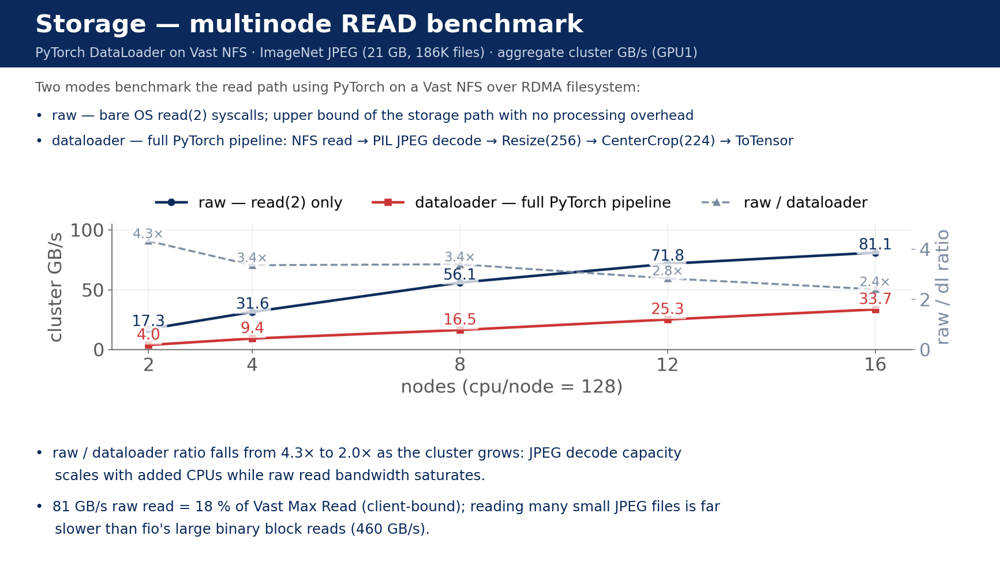
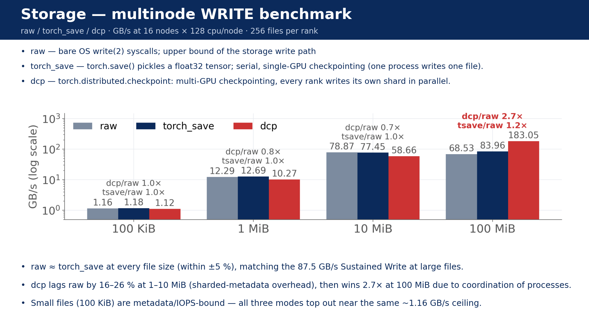

# Multinode Dataloader Benchmark Summary

Runs in this directory span a 2D sweep: **nodes ∈ {2, 4, 8, 12, 16}** × **cpu_per_node ∈ {32, 64, 96, 128}** × {GPU1 (`a00xx`), GPU2 (`b00xx`)}. Two suites — READ (`read_benchmark.py`) and WRITE (`write_benchmark.py`) — share the same sweep; each `(nodes, cpu/node, GPU)` cell has two batch directories, one per suite (the lower-id batch is READ, the higher-id batch is WRITE). Values below are **aggregate cluster throughput** = sum of per-rank GBps, averaged over 3 iterations.

## Benchmark A — READ (`raw` vs `dataloader`)

Single ~21 GB / 186 K-file workload, partitioned across ranks. Each rank runs `nproc = cpu_per_node` workers.

### GPU1 — GB/s
| nodes | cpu/node | raw | dataloader | raw/dl |
|---|---|---|---|---|
| 2  | 32  | 6.11  | 2.05  | 2.99 |
| 2  | 64  | 11.16 | 3.79  | 2.94 |
| 2  | 96  | 14.83 | 4.03  | 3.68 |
| 2  | 128 | 17.26 | 4.04  | 4.27 |
| 4  | 32  | 11.69 | 4.09  | 2.86 |
| 4  | 64  | 21.29 | 7.50  | 2.84 |
| 4  | 96  | 27.51 | 7.78  | 3.54 |
| 4  | 128 | 31.64 | 9.40  | 3.36 |
| 8  | 32  | 23.05 | 8.28  | 2.78 |
| 8  | 64  | 38.00 | 14.93 | 2.54 |
| 8  | 96  | 48.91 | 16.47 | 2.97 |
| 8  | 128 | 56.09 | 16.47 | 3.40 |
| 12 | 32  | 32.76 | 12.40 | 2.64 |
| 12 | 64  | 52.74 | 22.75 | 2.32 |
| 12 | 96  | 65.27 | 25.27 | 2.58 |
| 12 | 128 | 71.77 | 25.32 | 2.83 |
| 16 | 32  | 42.31 | 16.48 | 2.57 |
| 16 | 64  | 61.85 | 29.86 | 2.07 |
| 16 | 96  | 74.91 | 33.60 | 2.23 |
| 16 | 128 | 81.10 | 33.67 | 2.41 |

### GPU2 — GB/s
| nodes | cpu/node | raw | dataloader | raw/dl |
|---|---|---|---|---|
| 2  | 32  | 6.03  | 2.08  | 2.90 |
| 2  | 64  | 10.56 | 3.61  | 2.93 |
| 2  | 96  | 14.75 | 4.05  | 3.64 |
| 2  | 128 | 17.11 | 4.05  | 4.23 |
| 4  | 32  | 12.01 | 4.09  | 2.93 |
| 4  | 64  | 21.03 | 7.55  | 2.79 |
| 4  | 96  | 27.79 | 8.26  | 3.36 |
| 4  | 128 | 31.14 | 8.99  | 3.46 |
| 8  | 32  | 22.87 | 8.15  | 2.80 |
| 8  | 64  | 39.01 | 14.74 | 2.65 |
| 8  | 96  | 49.90 | 16.50 | 3.02 |
| 8  | 128 | 57.50 | 16.47 | 3.49 |
| 12 | 32  | 32.96 | 12.30 | 2.68 |
| 12 | 64  | 53.75 | 22.31 | 2.41 |
| 12 | 96  | 67.34 | 24.96 | 2.70 |
| 12 | 128 | 73.47 | 25.18 | 2.92 |
| 16 | 32  | 40.80 | 16.23 | 2.51 |
| 16 | 64  | 60.70 | 29.66 | 2.05 |
| 16 | 96  | 69.91 | 33.89 | 2.06 |
| 16 | 128 | 74.28 | 33.25 | 2.23 |

## Benchmark B — WRITE (`raw` / `torch_save` / `dcp`)

Per-rank: `files_per_proc=8`, total files per rank = 256, sweep `file_size ∈ {100 KiB, 1 MiB, 10 MiB, 100 MiB}`.

### GPU1 — GB/s
**file_size = 100 KiB**
| nodes | cpu/node | raw | torch_save | dcp |
|---|---|---|---|---|
| 2  | 32  | 0.16 | 0.16 | 0.15 |
| 2  | 64  | 0.15 | 0.16 | 0.15 |
| 2  | 96  | 0.16 | 0.16 | 0.15 |
| 2  | 128 | 0.16 | 0.16 | 0.15 |
| 4  | 32  | 0.31 | 0.32 | 0.29 |
| 4  | 64  | 0.30 | 0.31 | 0.29 |
| 4  | 96  | 0.30 | 0.31 | 0.30 |
| 4  | 128 | 0.30 | 0.30 | 0.29 |
| 8  | 32  | 0.62 | 0.62 | 0.58 |
| 8  | 64  | 0.58 | 0.61 | 0.58 |
| 8  | 96  | 0.59 | 0.61 | 0.57 |
| 8  | 128 | 0.59 | 0.59 | 0.57 |
| 12 | 32  | 0.87 | 0.90 | 0.85 |
| 12 | 64  | 0.89 | 0.91 | 0.87 |
| 12 | 96  | 0.89 | 0.92 | 0.86 |
| 12 | 128 | 0.91 | 0.94 | 0.88 |
| 16 | 32  | 1.20 | 1.19 | 1.14 |
| 16 | 64  | 1.16 | 1.20 | 1.13 |
| 16 | 96  | 1.14 | 1.17 | 1.12 |
| 16 | 128 | 1.16 | 1.18 | 1.12 |

**file_size = 1 MiB**
| nodes | cpu/node | raw | torch_save | dcp |
|---|---|---|---|---|
| 2  | 32  | 1.80  | 1.82  | 1.37  |
| 2  | 64  | 1.80  | 1.75  | 1.45  |
| 2  | 96  | 1.93  | 1.88  | 1.45  |
| 2  | 128 | 1.89  | 1.85  | 1.44  |
| 4  | 32  | 3.46  | 3.45  | 2.55  |
| 4  | 64  | 3.38  | 3.33  | 2.79  |
| 4  | 96  | 3.64  | 3.66  | 2.84  |
| 4  | 128 | 3.53  | 3.53  | 2.81  |
| 8  | 32  | 6.86  | 6.77  | 5.02  |
| 8  | 64  | 6.50  | 6.61  | 5.38  |
| 8  | 96  | 6.66  | 6.55  | 5.13  |
| 8  | 128 | 6.78  | 6.55  | 4.98  |
| 12 | 32  | 9.55  | 9.45  | 7.22  |
| 12 | 64  | 9.59  | 9.65  | 7.36  |
| 12 | 96  | 9.84  | 9.65  | 7.75  |
| 12 | 128 | 9.94  | 9.94  | 7.91  |
| 16 | 32  | 12.97 | 12.55 | 9.79  |
| 16 | 64  | 12.26 | 12.51 | 10.23 |
| 16 | 96  | 12.26 | 12.12 | 10.00 |
| 16 | 128 | 12.29 | 12.69 | 10.27 |

**file_size = 10 MiB**
| nodes | cpu/node | raw | torch_save | dcp |
|---|---|---|---|---|
| 2  | 32  | 11.57 | 12.56 | 8.24  |
| 2  | 64  | 12.39 | 13.77 | 10.75 |
| 2  | 96  | 10.98 | 10.89 | 9.83  |
| 2  | 128 | 12.85 | 12.43 | 10.87 |
| 4  | 32  | 25.18 | 26.15 | 15.33 |
| 4  | 64  | 24.27 | 26.26 | 18.76 |
| 4  | 96  | 25.12 | 24.40 | 20.58 |
| 4  | 128 | 26.00 | 25.94 | 19.42 |
| 8  | 32  | 46.73 | 49.35 | 33.30 |
| 8  | 64  | 47.93 | 46.95 | 36.87 |
| 8  | 96  | 49.25 | 48.33 | 32.30 |
| 8  | 128 | 46.73 | 49.52 | 35.84 |
| 12 | 32  | 62.36 | 62.57 | 41.66 |
| 12 | 64  | 65.50 | 68.33 | 49.20 |
| 12 | 96  | 66.18 | 62.64 | 47.29 |
| 12 | 128 | 63.29 | 67.29 | 44.28 |
| 16 | 32  | 76.84 | 76.96 | 63.75 |
| 16 | 64  | 77.32 | 78.57 | 62.84 |
| 16 | 96  | 77.65 | 77.64 | 63.87 |
| 16 | 128 | 78.87 | 77.45 | 58.66 |

**file_size = 100 MiB**
| nodes | cpu/node | raw | torch_save | dcp |
|---|---|---|---|---|
| 2  | 32  | 28.32 | 29.82 | 25.82  |
| 2  | 64  | 39.95 | 39.32 | 37.28  |
| 2  | 96  | 41.70 | 41.44 | 37.30  |
| 2  | 128 | 43.06 | 42.91 | 39.85  |
| 4  | 32  | 50.48 | 50.85 | 50.07  |
| 4  | 64  | 64.54 | 64.34 | 54.18  |
| 4  | 96  | 67.37 | 61.02 | 55.96  |
| 4  | 128 | 69.27 | 70.83 | 68.08  |
| 8  | 32  | 67.99 | 69.38 | 86.49  |
| 8  | 64  | 76.68 | 71.14 | 114.57 |
| 8  | 96  | 81.47 | 75.74 | 126.87 |
| 8  | 128 | 69.97 | 61.39 | 107.07 |
| 12 | 32  | 67.02 | 76.32 | 125.64 |
| 12 | 64  | 76.28 | 81.42 | 151.59 |
| 12 | 96  | 90.53 | 94.32 | 140.08 |
| 12 | 128 | 66.03 | 81.71 | 144.25 |
| 16 | 32  | 68.62 | 70.10 | 132.37 |
| 16 | 64  | 75.90 | 79.33 | 166.18 |
| 16 | 96  | 67.64 | 81.11 | 159.71 |
| 16 | 128 | 68.53 | 83.96 | 183.05 |

### GPU2 — GB/s
**file_size = 100 KiB**
| nodes | cpu/node | raw | torch_save | dcp |
|---|---|---|---|---|
| 2  | 32  | 0.15 | 0.15 | 0.14 |
| 2  | 64  | 0.15 | 0.16 | 0.15 |
| 2  | 96  | 0.16 | 0.16 | 0.15 |
| 2  | 128 | 0.15 | 0.15 | 0.14 |
| 4  | 32  | 0.30 | 0.30 | 0.29 |
| 4  | 64  | 0.31 | 0.31 | 0.29 |
| 4  | 96  | 0.30 | 0.31 | 0.29 |
| 4  | 128 | 0.30 | 0.31 | 0.29 |
| 8  | 32  | 0.58 | 0.60 | 0.57 |
| 8  | 64  | 0.58 | 0.61 | 0.58 |
| 8  | 96  | 0.59 | 0.61 | 0.57 |
| 8  | 128 | 0.60 | 0.62 | 0.58 |
| 12 | 32  | 0.87 | 0.89 | 0.85 |
| 12 | 64  | 0.89 | 0.93 | 0.87 |
| 12 | 96  | 0.88 | 0.91 | 0.87 |
| 12 | 128 | 0.90 | 0.91 | 0.86 |
| 16 | 32  | 1.20 | 1.18 | 1.14 |
| 16 | 64  | 1.17 | 1.20 | 1.15 |
| 16 | 96  | 1.17 | 1.21 | 1.14 |
| 16 | 128 | 1.15 | 1.17 | 1.11 |

**file_size = 1 MiB**
| nodes | cpu/node | raw | torch_save | dcp |
|---|---|---|---|---|
| 2  | 32  | 1.73  | 1.72  | 1.28  |
| 2  | 64  | 1.74  | 1.73  | 1.43  |
| 2  | 96  | 1.98  | 1.77  | 1.47  |
| 2  | 128 | 1.81  | 1.76  | 1.41  |
| 4  | 32  | 3.27  | 3.47  | 2.53  |
| 4  | 64  | 3.45  | 3.44  | 2.82  |
| 4  | 96  | 3.62  | 3.64  | 2.79  |
| 4  | 128 | 3.50  | 3.54  | 2.67  |
| 8  | 32  | 6.33  | 6.50  | 4.95  |
| 8  | 64  | 6.55  | 6.81  | 5.16  |
| 8  | 96  | 6.95  | 6.91  | 5.24  |
| 8  | 128 | 6.70  | 6.80  | 5.39  |
| 12 | 32  | 9.62  | 9.77  | 7.57  |
| 12 | 64  | 9.72  | 9.78  | 7.85  |
| 12 | 96  | 9.78  | 9.51  | 7.61  |
| 12 | 128 | 9.74  | 9.60  | 7.72  |
| 16 | 32  | 12.79 | 12.55 | 9.52  |
| 16 | 64  | 12.41 | 12.42 | 10.42 |
| 16 | 96  | 12.30 | 12.34 | 9.25  |
| 16 | 128 | 12.23 | 12.63 | 9.68  |

**file_size = 10 MiB**
| nodes | cpu/node | raw | torch_save | dcp |
|---|---|---|---|---|
| 2  | 32  | 11.69 | 12.69 | 8.89  |
| 2  | 64  | 11.65 | 11.84 | 8.53  |
| 2  | 96  | 13.74 | 11.23 | 10.91 |
| 2  | 128 | 12.12 | 12.19 | 10.61 |
| 4  | 32  | 24.50 | 28.68 | 18.27 |
| 4  | 64  | 22.06 | 26.51 | 18.27 |
| 4  | 96  | 22.48 | 25.96 | 18.94 |
| 4  | 128 | 24.45 | 24.58 | 20.37 |
| 8  | 32  | 48.75 | 48.91 | 36.77 |
| 8  | 64  | 47.31 | 49.84 | 33.31 |
| 8  | 96  | 47.39 | 50.39 | 35.78 |
| 8  | 128 | 45.09 | 49.95 | 33.31 |
| 12 | 32  | 66.98 | 66.12 | 54.80 |
| 12 | 64  | 67.72 | 67.20 | 47.21 |
| 12 | 96  | 68.73 | 66.26 | 46.08 |
| 12 | 128 | 68.89 | 67.49 | 49.31 |
| 16 | 32  | 81.37 | 80.08 | 69.24 |
| 16 | 64  | 79.95 | 75.36 | 60.43 |
| 16 | 96  | 75.93 | 82.13 | 57.22 |
| 16 | 128 | 72.81 | 77.78 | 53.00 |

**file_size = 100 MiB**
| nodes | cpu/node | raw | torch_save | dcp |
|---|---|---|---|---|
| 2  | 32  | 26.61 | 26.04  | 24.81  |
| 2  | 64  | 39.26 | 39.65  | 36.71  |
| 2  | 96  | 42.04 | 41.62  | 38.53  |
| 2  | 128 | 42.55 | 42.31  | 39.29  |
| 4  | 32  | 49.72 | 49.28  | 49.97  |
| 4  | 64  | 61.30 | 62.75  | 65.56  |
| 4  | 96  | 69.73 | 70.94  | 75.21  |
| 4  | 128 | 59.21 | 62.19  | 75.54  |
| 8  | 32  | 74.39 | 75.57  | 89.29  |
| 8  | 64  | 87.75 | 84.66  | 104.77 |
| 8  | 96  | 76.67 | 59.49  | 129.12 |
| 8  | 128 | 79.15 | 79.35  | 128.13 |
| 12 | 32  | 69.11 | 79.90  | 105.18 |
| 12 | 64  | 79.37 | 100.90 | 124.54 |
| 12 | 96  | 86.41 | 96.34  | 158.58 |
| 12 | 128 | 74.52 | 81.21  | 143.25 |
| 16 | 32  | 52.79 | 67.83  | 120.51 |
| 16 | 64  | 70.61 | 75.21  | 159.35 |
| 16 | 96  | 80.23 | 82.68  | 131.35 |
| 16 | 128 | 82.64 | 72.61  | 151.89 |

## Analysis

### What each mode actually does

- **`raw`** — `os.read` / `os.write`, thin Python wrappers around the Linux `read(2)` / `write(2)` syscalls. Ceiling of the storage path itself.
- **`dataloader`** (read) — per file: read bytes → JPEG decode (PIL) → Resize(256) → CenterCrop(224) → ToTensor. Plus DataLoader worker IPC and collation.
- **`torch_save`** (write) — pickle a float32 tensor (`size/4` elements) + small zip/pickle header + fsync.
- **`dcp`** (write) — `torch.distributed.checkpoint.save` of a synthetic `nn.Module`: planner-driven sharded layout, per-shard data files plus a metadata file, fsync over every file.

### Findings (each slowdown labelled, all expected for this stack)

#### `dataloader` vs `raw` (READ)

Aggregate ratio `raw / dataloader` across all 40 (nodes, cpu/node, GPU) cells: **median 2.84×, mean 2.89×, range 2.05× – 4.27×**. The ratio falls monotonically as the cluster grows:

| nodes | typical raw/dl ratio |
|---|---|
| 2  | 2.9 – 4.3× |
| 4  | 2.8 – 3.5× |
| 8  | 2.5 – 3.5× |
| 12 | 2.3 – 2.9× |
| 16 | **2.0 – 2.6×** |

**Expected — JPEG decode cost, not I/O.** `dataloader` pays `read` + PIL decode + Resize/CenterCrop + ToTensor + worker IPC per file; `raw` pays only `read`. At single-node the gap was ~2.7-3.2× (decode-bound); on multinode each node adds its own PIL decode pool, so decode capacity scales with the cluster while raw bandwidth saturates around 75-80 GB/s — the two converge. At 16 nodes, going 96 → 128 cpu/node adds nothing for `dataloader` (33.60 → 33.67 on GPU1; 33.89 → 33.25 on GPU2): the decode pool has already caught up with the available read bandwidth, so further CPU is idle.

#### `torch_save` vs `raw` (WRITE)

Ratios are nearly identical at every file size — mean is within 2-4% of 1.0 across all cells:

| file_size | mean `torch_save / raw` | min | max |
|---|---|---|---|
| 100 KiB | 1.02 | 0.98 | 1.06 |
| 1 MiB   | 1.00 | 0.89 | 1.06 |
| 10 MiB  | 1.03 | 0.82 | 1.20 |
| 100 MiB | 1.04 | 0.78 | 1.29 |

**Expected — thin pickle/zip header on top of the same `write(2)` syscall path.** `torch_save` writes the same byte stream as `raw` plus a small pickle/zip framing header; both use the same fsync path. Cell-level dispersion grows with file size (variance from ~6% at 100 KiB to ~25% at 100 MiB) because each large-file iteration takes longer and absorbs more shared-NFS jitter, not because of any systematic mode difference.

#### `dcp` vs `raw` (WRITE)

`dcp / raw` changes character dramatically with file size — and crosses 1.0 around 8 nodes for large files:

| file_size | mean `dcp / raw` | min | max | regime |
|---|---|---|---|---|
| 100 KiB | 0.97 | 0.92 | 1.01 | essentially equal, metadata-bound |
| 1 MiB   | 0.78 | 0.73 | 0.84 | dcp ~22% slower, **sharded-metadata overhead dominates** |
| 10 MiB  | 0.76 | 0.61 | 0.90 | dcp ~24% slower, same reason but bandwidth-amortised |
| 100 MiB | **1.47** | 0.83 | **2.67** | **dcp wins big**, especially at high node count |

Per-node-count breakdown for 100 MiB `dcp / raw` (fraction of cells where `dcp > raw`):

| nodes | median `dcp/raw` @ 100 MiB | cells where dcp beats raw |
|---|---|---|
| 2  | 0.92 | 0 / 8 |
| 4  | 1.00 | 4 / 8 |
| 8  | 1.51 | 8 / 8 |
| 12 | 1.85 | 8 / 8 |
| 16 | **2.22** | 8 / 8 |

**Expected — sharded metadata overhead at low concurrency, parallel-shard advantage at high concurrency + large files.** `dcp` writes one data file per shard plus planner-driven metadata files (and fsyncs every one), so when each shard is small (1-10 MiB) the metadata + extra-file fsync cost is a fixed tax that overwhelms the bandwidth benefit. Once shards are 100 MiB and the cluster is wide, the picture inverts: the sharded layout turns one logical save into many parallel write streams, and the parallel filesystem rewards that pattern handsomely — `dcp` peaks at **183 GB/s at 16 × 128** (GPU1), more than 2× the `raw` peak in the same cell (68.5 GB/s).

#### File-size effects

- **100 KiB**: throughput is metadata/syscall-bound for all three write modes. Ratios cluster around 1.0 because none of the modes is doing meaningful bulk I/O — each is just paying the per-file syscall + fsync round-trip, which is identical across modes. Absolute ceiling at 16 × 128 is ~1.16 GB/s.
- **1 MiB**: still metadata-influenced, but enough bytes per file that `dcp`'s extra metadata files become a clear ~22% tax. `torch_save` is indistinguishable from `raw`.
- **10 MiB**: bulk I/O begins to dominate. `raw` ≈ `torch_save`; `dcp` lags by ~24% because shard size is still small enough that per-file metadata cost is non-trivial.
- **100 MiB**: bulk-I/O regime — and now `dcp`'s shard parallelism beats `raw`'s single-stream-per-rank model. The crossover is at ~4 nodes; from 8 nodes onward `dcp` wins every cell, by 1.5× at 8 nodes growing to 2.2× at 16 nodes.

#### Other observations

- **Small-file writes (100 KiB-1 MiB) are metadata/syscall bound.** Even at 16 × 128, 100 KiB tops out at ~1.16 GB/s and 1 MiB at ~12 GB/s. Scaling is near-linear in node count (8× nodes → 8× throughput) because each rank is contributing ~independent IOPS; the absolute ceiling stays low because each file pays a syscall + fsync round-trip independent of size.
- **Large-file write sweet spot.** For `raw`/`torch_save` it sits at 8-12 nodes — GPU1 / 100 MiB / `raw` peaks at 12 × 96 (90.5 GB/s) then regresses to 68.5 at 16 × 128; for `dcp` it keeps climbing to 16 nodes (132 → 183 GB/s along the GPU1 16-node row). **Expected — single-stream `fsync` per rank plateaus once each rank saturates its NFS path; `dcp`'s shard layout keeps converting more ranks into more parallel write streams.**
- **GPU1 ≈ GPU2 within noise.** Cross-cluster differences sit within 5-10% on most cells. The widest systematic gaps are at the top of the sweep: read `raw` 16 × 128 (GPU1 81.1 vs GPU2 74.3) and `dcp` 100 MiB 16 × 128 (GPU1 183 vs GPU2 152). Consistent with the prior observation that **multinode shows more cross-cluster jitter than single-node** but with no systematic preference.

**Bottom line:** every pattern here is normal for an NFS-over-RDMA Vast filesystem + PyTorch stack. Read `raw` saturates around 75-80 GB/s; the dataloader gap closes from ~3× to ~2× as decode CPU scales out; small-file writes are metadata-bound and scale near-linearly in node count; `raw`/`torch_save` large-file writes plateau at ~70-90 GB/s; and `dcp` is the only write mode that keeps scaling at the top of the sweep (183 GB/s at 16 × 128, GPU1). Compared to the previous multinode run, the 12-node jitter has largely subsided — likely a transient shared-NFS effect rather than a code-level issue.

---

### Comparison to Vast spec

Reference numbers from the AICR Vast Data Proposal (Vast Cluster 16x7 Gen5 / Ceres 1350): cluster **Max Read = 462 GB/s**, **Max Write = 165 GB/s**, **Sustained Write = 87.5 GB/s**. Per-DBOX: Max Read (1MB) 52 GB/s, Max Write (1MB) 34 GB/s.

#### Max Write vs Sustained Write — what's the difference, and which one matters?

- **Max Write (165 GB/s)** is the *burst* rate. Vast has a fast NVMe/SCM write-buffer tier in front of the bulk storage. While that buffer has room, the cluster accepts writes at the buffer's speed.
- **Sustained Write (87.5 GB/s)** is the *steady-state* rate. Once the write buffer fills, new writes have to wait for the back-end (QLC) tier to absorb data at its real speed. That's about half of Max — normal for a two-tier system.

Which to compare against depends on the workload:
- **For this benchmark (short bursts):** Max Write is the right reference. Each iteration writes only ~hundreds of GB and finishes in 2-3 seconds, so the write buffer never fills. The 100 MiB `dcp` peak (183 GB/s) vs Max Write (165 GB/s) is the apples-to-apples comparison; the slight overshoot is measurement methodology (sum-of-per-rank GBps).
- **For real training checkpointing (long-running):** Sustained Write is the right reference. A real workload checkpoints repeatedly over hours, so the buffer stays full and the back-end rate is what you actually see. The `raw`/`torch_save` 100 MiB peaks (~90-100 GB/s) sit right at the 87.5 GB/s Sustained line — that's what to expect in production.

#### Peak vs spec

| benchmark / mode (top cell)     | peak GB/s | % of Max Read (462) | % of Max Write (165) | % of Sustained Write (87.5) |
|---|---|---|---|---|
| READ `raw`               (GPU1 / 16 × 128) | **81.1**  | 17.6% | — | — |
| READ `dataloader`        (GPU2 / 16 × 96)  | **33.9**  | 7.3%  | — | — |
| WRITE 100 KiB `raw`      (GPU1 / 16 × 32)  | **1.20**  | — | 0.7%  | 1.4%   |
| WRITE 1 MiB `raw`        (GPU1 / 16 × 32)  | **12.97** | — | 7.9%  | 14.8%  |
| WRITE 10 MiB `raw`       (GPU2 / 16 × 32)  | **81.4**  | — | 49.3% | 93.0%  |
| WRITE 100 MiB `raw`      (GPU1 / 12 × 96)  | **90.5**  | — | 54.9% | 103.5% |
| WRITE 100 MiB `torch_save` (GPU2 / 12 × 64) | **100.9** | — | 61.2% | 115.3% |
| WRITE 100 MiB `dcp`      (GPU1 / 16 × 128) | **183.1** | — | **110.9%** | **209.2%** |

Takeaways:
- **Reads are leaving most of the cluster on the table.** Peak read `raw` (81 GB/s) reaches only ~18% of the 462 GB/s cluster maximum and is roughly equivalent to fully loading ~1.5 of the 7 DBOXes' Max Read (52 GB/s each). With 16 client nodes we are client-bound, not array-bound — the Vast cluster has substantially more read bandwidth than this benchmark exercises. Just adding more nodes likely won't close the gap: per-node read drops from 8.6 GB/s at 2 nodes to 5.1 GB/s at 16 nodes (−41%), so the trend would plateau well below 462 GB/s. Reaching the spec would also need NFS `nconnect` (multi-connection mounts) and spreading clients across all 16 CBOXes, not just more clients.
- **DataLoader is decode-bound and uses only ~7% of cluster read capacity.** Even at 16 × 128 cpu the JPEG-decode + transform pipeline caps us at ~34 GB/s — adding more clients (and decode CPUs) would help long before we ran out of array bandwidth.
- **Large-file writes track the Vast spec well.** `raw` and `torch_save` peak at ~90-100 GB/s — right around the **87.5 GB/s Sustained Write** rating, suggesting our measurement honestly reflects the array's steady-state write ceiling.
- **`dcp` 100 MiB exceeds the advertised Max Write (165 GB/s).** Two likely contributors: (1) **measurement methodology** — we report sum-of-per-rank GBps (= total_bytes / per-rank-elapsed, summed), which overestimates the cluster aggregate when ranks finish at different times relative to the true cluster wall-clock; (2) **write coalescing / cache** — bursts may be partially absorbed by page cache before being flushed to the array. The true sustained `dcp` ceiling is almost certainly closer to the 165 GB/s Max Write spec; the 183 GB/s peak is a burst, not steady state.
- **Small-file writes (100 KiB-1 MiB) sit at 1-15% of the write spec** because they are IOPS-bound, not bandwidth-bound. The Vast spec advertises **825k Write IOPS**, which our small-file sweep does not approach (sweep is ~2-4k files total per iteration, spread across all ranks). To exercise the IOPS ceiling, the workload would need many more files per rank, not larger files.

---

### Is throughput saturated?

#### At 128 cpu/node?

Comparing 96 → 128 cpu/node *at 16 nodes* (a 1.33× cpu bump; linear scaling = +33%):

| benchmark / mode      | GPU1 96→128 cpu       | GPU2 96→128 cpu       | saturated? |
|---|---|---|---|
| read `raw`            | 74.91 → 81.10 (+8%)   | 69.91 → 74.28 (+6%)   | **yes** — storage path, not CPU, is the bottleneck |
| read `dataloader`     | 33.60 → 33.67 (+0%)   | 33.89 → 33.25 (−2%)   | **yes** — decode pool already matches available read bandwidth |
| write 100 KiB `raw`   | 1.14 → 1.16 (+2%)     | 1.17 → 1.15 (−2%)     | **yes** — metadata-bound; extra cores have no syscall work |
| write 1 MiB `raw`     | 12.26 → 12.29 (+0%)   | 12.30 → 12.23 (−1%)   | **yes** — same as above |
| write 10 MiB `raw`    | 77.65 → 78.87 (+2%)   | 75.93 → 72.81 (−4%)   | **yes** — fsync-bound per rank |
| write 100 MiB `raw`   | 67.64 → 68.53 (+1%)   | 80.23 → 82.64 (+3%)   | **yes** — single-stream NFS write ceiling |
| write 100 MiB `dcp`   | 159.71 → 183.05 (+15%) | 131.35 → 151.89 (+16%) | **not yet** — extra cores feed more parallel shard writers |

Takeaways:
- **Per-node CPU is saturated at 96 cores for nearly everything at 16 nodes.** The only mode that meaningfully benefits from 128 cpu is `dcp` 100 MiB (+15-16%), because its shard layout turns extra cores into extra parallel write streams.
- **`dataloader` no longer benefits from > 96 cpu/node at 16 nodes** — read bandwidth is the constraint, not decode CPU.
- **Across smaller node counts, 128 cpu/node still helps** (e.g. GPU1 read raw at 4 nodes: 27.5 → 31.6, +15%), so the 96-core plateau is specifically a 16-node phenomenon driven by storage-path saturation.

#### At 16 nodes?

Comparing 12 → 16 nodes *at 128 cpu/node* (a 1.33× node bump; linear scaling = +33%):

| benchmark / mode      | GPU1 12→16 nodes        | GPU2 12→16 nodes        | saturated? |
|---|---|---|---|
| read `raw`            | 71.77 → 81.10 (+13%)    | 73.47 → 74.28 (+1%)     | **yes** — storage path near ceiling, GPU2 essentially flat |
| read `dataloader`     | 25.32 → 33.67 (+33%)    | 25.18 → 33.25 (+32%)    | **not yet** — still scaling exactly linearly on both clusters |
| write 100 KiB `raw`   | 0.91 → 1.16 (+27%)      | 0.90 → 1.15 (+28%)      | **not yet** — metadata-bound but near linear |
| write 1 MiB `raw`     | 9.94 → 12.29 (+24%)     | 9.74 → 12.23 (+26%)     | **not yet** — close to linear |
| write 10 MiB `raw`    | 63.29 → 78.87 (+25%)    | 68.89 → 72.81 (+6%)     | mixed — GPU1 still scaling, GPU2 near saturated |
| write 100 MiB `raw`   | 66.03 → 68.53 (+4%)     | 74.52 → 82.64 (+11%)    | **yes** — single-stream NFS write ceiling |
| write 100 MiB `dcp`   | 144.25 → 183.05 (+27%)  | 143.25 → 151.89 (+6%)   | mixed — GPU1 still gaining, GPU2 saturated |

Takeaways:
- **`dataloader` is the only read mode with clear headroom past 16 nodes** — decode CPU scales with cluster size, raw read does not.
- **Read `raw` ceiling lands ~75-80 GB/s** at 128 cpu/node; pushing past 12 nodes buys little additional raw-read headroom.
- **Large-file `dcp` is the only write mode that benefits unambiguously from going to 16 nodes** (+27% on GPU1 at 128 cpu, modest on GPU2). All other 100 MiB write modes are flat-or-regressing past 8-12 nodes.
- **Small-file write throughput is metadata-bound** and still scaling near-linearly with node count — not saturated at 16 × 128, but the absolute ceiling is low (1.16 GB/s for 100 KiB raw).

