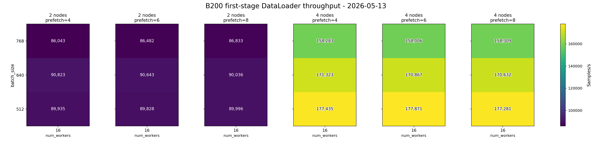
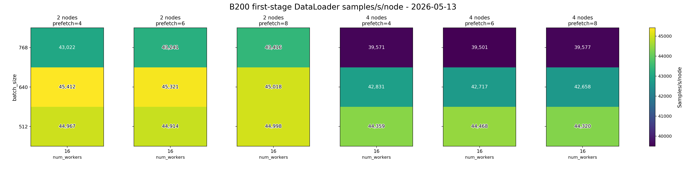
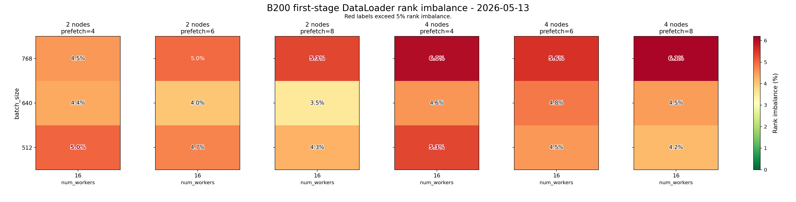
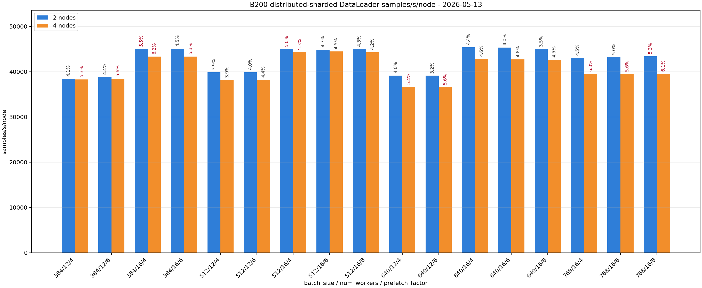
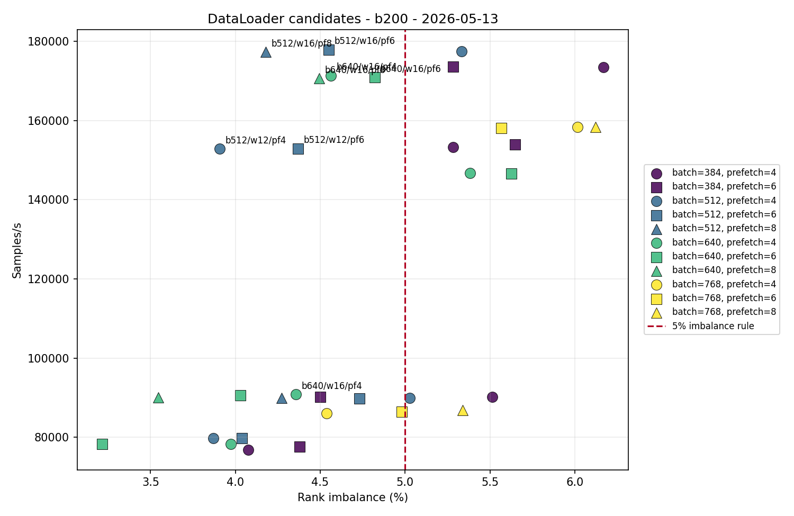

# DataLoader B200 Multi-Node Parameter Selection

<!-- aicr-study-status: published -->


Purpose: report the B200 distributed-sharded DataLoader two-node and four-node
parameter-selection study that follows B200 single-GPU and one-node validation.

This study uses the same reporting pattern as the RTX multi-node DataLoader
study. The first pass tested the `512/640/768`, `num_workers=16`,
`prefetch_factor=4/6/8` scale surface. The follow-up pass added `batch_size=384`
and `num_workers=12` comparisons.

## Command Run

First stage:

```bash
scripts/benchmark/sweep-dataloader.sh \
  --cluster b200 \
  --profile medium \
  --nodes-list 2,4 \
  --gpu-count 8 \
  --mode distributed-sharded \
  --nodelist b0002,b0003,b0004,b0005 \
  --batch-size-list 512,640,768 \
  --num-workers-list 16 \
  --prefetch-factor-list 4,6,8 \
  --pin-memory-list 1 \
  --persistent-workers-list 1 \
  --cpus-per-task 16 \
  --repeat-count 5 \
  --apply \
  -- --warmup-batches 100 --measured-batches 500 --byte-estimate-sample-count 0
```

Follow-up balance pass:

```bash
scripts/benchmark/sweep-dataloader.sh \
  --cluster b200 \
  --profile medium \
  --nodes-list 2,4 \
  --gpu-count 8 \
  --mode distributed-sharded \
  --nodelist b0002,b0003,b0004,b0005 \
  --batch-size-list 384,512,640 \
  --num-workers-list 12,16 \
  --prefetch-factor-list 4,6 \
  --pin-memory-list 1 \
  --persistent-workers-list 1 \
  --cpus-per-task 16 \
  --repeat-count 5 \
  --apply \
  -- --warmup-batches 100 --measured-batches 500 --byte-estimate-sample-count 0
```

## Result Summary

The intended campaign completed as filtered runtime evidence:

| Field | Value |
| --- | --- |
| Cluster | `b200` |
| Mode | `distributed-sharded` |
| Two-node group | `b0002,b0003` |
| Four-node group | `b0002,b0003,b0004,b0005` |
| First-stage batch sizes | `512,640,768` |
| First-stage num workers | `16` |
| First-stage prefetch factors | `4,6,8` |
| Follow-up batch sizes | `384,512,640` |
| Follow-up num workers | `12,16` |
| Follow-up prefetch factors | `4,6` |
| Pin memory / persistent workers | `1` / `1` |
| CPUs per task | `16` |
| Warmup / measured batches | `100` / `500` |
| Repeats | `5` |
| Aggregation | Olympic average, dropping lowest and highest throughput from five repeats |
| Filtered summaries | `170/170` matched intended job IDs, `170/170` passed |

One submitted follow-up job produced no parsed output. The rendered evidence set
excludes that zero-output submission and includes top-off job `18833` for the
same matrix point, so every reported row has five samples.

## Campaign Stages

| Stage | Purpose | Result |
| --- | --- | --- |
| First stage | Test `512/640/768`, `16` workers, `prefetch_factor=4/6/8` on 2 and 4 B200 nodes. | 90/90 summaries passed. Two-node rows were balanced; four-node rows favored `512/16/{6,8}` for balanced throughput. |
| Follow-up balance pass | Add `384` batch size and `12` worker comparisons while keeping the strongest `16` worker rows visible. | Lower-worker rows reduced throughput substantially. The best four-node balanced rows remained at `num_workers=16`. |

## Aggregated Results

Repeated configuration rows use Olympic aggregation. `Jitter` is the retained
throughput range after dropping the lowest and highest throughput samples.
`Samples/s/node` normalizes the headline throughput by node count so the
two-node and four-node rows can be compared directly.

| Nodes | Batch | Workers | Prefetch | Samples | Included | Samples/s | Samples/s/node | Jitter | Rank imbalance % |
| ---: | ---: | ---: | ---: | ---: | ---: | ---: | ---: | ---: | ---: |
| 2 | 384 | 12 | 4 | 5 | 3 | 76,865 | 38,433 | 2,598 | 4.08 |
| 2 | 384 | 12 | 6 | 5 | 3 | 77,622 | 38,811 | 100 | 4.38 |
| 2 | 384 | 16 | 4 | 5 | 3 | 90,153 | 45,077 | 133 | 5.52 |
| 2 | 384 | 16 | 6 | 5 | 3 | 90,146 | 45,073 | 224 | 4.50 |
| 2 | 512 | 12 | 4 | 5 | 3 | 79,787 | 39,894 | 114 | 3.87 |
| 2 | 512 | 12 | 6 | 5 | 3 | 79,802 | 39,901 | 237 | 4.04 |
| 2 | 512 | 16 | 4 | 5 | 3 | 89,935 | 44,967 | 77 | 5.03 |
| 2 | 512 | 16 | 6 | 5 | 3 | 89,828 | 44,914 | 226 | 4.73 |
| 2 | 512 | 16 | 8 | 5 | 3 | 89,996 | 44,998 | 475 | 4.27 |
| 2 | 640 | 12 | 4 | 5 | 3 | 78,307 | 39,153 | 42 | 3.97 |
| 2 | 640 | 12 | 6 | 5 | 3 | 78,284 | 39,142 | 218 | 3.21 |
| 2 | 640 | 16 | 4 | 5 | 3 | 90,823 | 45,412 | 163 | 4.36 |
| 2 | 640 | 16 | 6 | 5 | 3 | 90,643 | 45,321 | 251 | 4.03 |
| 2 | 640 | 16 | 8 | 5 | 3 | 90,036 | 45,018 | 250 | 3.54 |
| 2 | 768 | 16 | 4 | 5 | 3 | 86,043 | 43,022 | 700 | 4.54 |
| 2 | 768 | 16 | 6 | 5 | 3 | 86,482 | 43,241 | 60 | 4.98 |
| 2 | 768 | 16 | 8 | 5 | 3 | 86,833 | 43,416 | 182 | 5.34 |
| 4 | 384 | 12 | 4 | 5 | 3 | 153,252 | 38,313 | 817 | 5.28 |
| 4 | 384 | 12 | 6 | 5 | 3 | 153,907 | 38,477 | 288 | 5.65 |
| 4 | 384 | 16 | 4 | 5 | 3 | 173,492 | 43,373 | 121 | 6.17 |
| 4 | 384 | 16 | 6 | 5 | 3 | 173,535 | 43,384 | 417 | 5.28 |
| 4 | 512 | 12 | 4 | 5 | 3 | 152,869 | 38,217 | 211 | 3.91 |
| 4 | 512 | 12 | 6 | 5 | 3 | 152,908 | 38,227 | 328 | 4.37 |
| 4 | 512 | 16 | 4 | 5 | 3 | 177,435 | 44,359 | 645 | 5.33 |
| 4 | 512 | 16 | 6 | 5 | 3 | 177,871 | 44,468 | 575 | 4.55 |
| 4 | 512 | 16 | 8 | 5 | 3 | 177,281 | 44,320 | 782 | 4.18 |
| 4 | 640 | 12 | 4 | 5 | 3 | 146,759 | 36,690 | 73 | 5.38 |
| 4 | 640 | 12 | 6 | 5 | 3 | 146,550 | 36,637 | 369 | 5.63 |
| 4 | 640 | 16 | 4 | 5 | 3 | 171,323 | 42,831 | 267 | 4.56 |
| 4 | 640 | 16 | 6 | 5 | 3 | 170,867 | 42,717 | 592 | 4.82 |
| 4 | 640 | 16 | 8 | 5 | 3 | 170,632 | 42,658 | 538 | 4.49 |
| 4 | 768 | 16 | 4 | 5 | 3 | 158,283 | 39,571 | 351 | 6.02 |
| 4 | 768 | 16 | 6 | 5 | 3 | 158,006 | 39,501 | 385 | 5.57 |
| 4 | 768 | 16 | 8 | 5 | 3 | 158,309 | 39,577 | 220 | 6.12 |

## Per-Node Comparison

The `samples/s/node` view is the clearest way to compare the two-node and
four-node rows without letting total node count hide per-node throughput.

| View | Nodes | Batch | Workers | Prefetch | Samples/s | Samples/s/node | Rank imbalance % | Note |
| --- | ---: | ---: | ---: | ---: | ---: | ---: | ---: | --- |
| Best two-node retained row | 2 | 640 | 16 | 4 | 90,823 | 45,412 | 4.36 | Highest balanced two-node row in the rendered set. |
| Best two-node balance row | 2 | 640 | 16 | 8 | 90,036 | 45,018 | 3.54 | Slightly lower throughput with the lowest retained imbalance among `16` worker two-node rows. |
| Best four-node retained row | 4 | 512 | 16 | 6 | 177,871 | 44,468 | 4.55 | Highest four-node row below the retained imbalance threshold. |
| Best four-node balance row | 4 | 512 | 16 | 8 | 177,281 | 44,320 | 4.18 | Nearly the same throughput as `512/16/6`, with lower retained imbalance. |
| Larger-batch comparison row | 4 | 640 | 16 | 4 | 171,323 | 42,831 | 4.56 | Balanced, but lower throughput than `512/16/{6,8}`. |
| Lower-worker comparison row | 4 | 512 | 12 | 6 | 152,908 | 38,227 | 4.37 | Balanced, but much slower than `16` workers. |

## Interpretation

The B200 two-node and four-node rows are cleaner than the RTX rows at the same
stage. The best two-node row is `640/16/4`: `90,823 samples/s`, `45,412
samples/s/node`, and `4.36%` retained rank imbalance. The nearby
`640/16/{6,8}` rows are also balanced.

At four nodes, `512/16/6` is the strongest row in the retained balanced region:
`177,871 samples/s`, `44,468 samples/s/node`, `4.55%` retained rank imbalance,
and `575 samples/s` retained jitter. `512/16/8` is a close balance comparator at
`177,281 samples/s`, `44,320 samples/s/node`, and `4.18%` retained rank
imbalance.

The `num_workers=12` rows reduce throughput substantially. They do not justify
moving the B200 scale-facing default away from `num_workers=16`.

## Selected Scale-Probe Matrix

The next B200 scale probe should carry the best four-node region to eight nodes:

| Nodes | Batch sizes | Workers | Prefetch factors | Repeats |
| ---: | --- | ---: | --- | ---: |
| 8 | `512,640` | 16 | `4,6,8` | 5 |

This keeps the strongest four-node setting (`512/16/6`), its balance comparator
(`512/16/8`), and the larger-batch family (`640/16/{4,6,8}`) visible at the
next node count.

## Figures

The durable record for this study is static matplotlib figures plus the tables
above. Heatmaps use batch size from small at the bottom to large at the top.

First-stage figures:







Follow-up balance-pass figures:





## Artifact Bundle

| Artifact | Location |
| --- | --- |
| VAST bundle | `/work/aicr/commissioning/benchmarks/public-study-artifacts/aicr-public/c54a4b2/dataloader/2026-05-13/dataloader-b200-multinode-sharded-olympic-2026-05-13.tar.gz` |
| VAST provenance | `/work/aicr/commissioning/benchmarks/public-study-artifacts/aicr-public/c54a4b2/dataloader/2026-05-13/dataloader-b200-multinode-sharded-olympic-2026-05-13-provenance.json` |
| OSN bundle | <https://uma1.osn.mghpcc.org/csim-bmark/public-study-artifacts/aicr-public/c54a4b2/dataloader/2026-05-13/dataloader-b200-multinode-sharded-olympic-2026-05-13.tar.gz> |
| OSN provenance | <https://uma1.osn.mghpcc.org/csim-bmark/public-study-artifacts/aicr-public/c54a4b2/dataloader/2026-05-13/dataloader-b200-multinode-sharded-olympic-2026-05-13-provenance.json> |
| OSN checksum | <https://uma1.osn.mghpcc.org/csim-bmark/public-study-artifacts/aicr-public/c54a4b2/dataloader/2026-05-13/dataloader-b200-multinode-sharded-olympic-2026-05-13.sha256> |
| Aggregated CSV | <https://uma1.osn.mghpcc.org/csim-bmark/public-study-artifacts/aicr-public/c54a4b2/dataloader/2026-05-13/dataloader-b200-multinode-sharded-olympic-2026-05-13/reports/dataloader-b200-multinode-aggregated-2026-05-13.csv> |
| Detail CSV | <https://uma1.osn.mghpcc.org/csim-bmark/public-study-artifacts/aicr-public/c54a4b2/dataloader/2026-05-13/dataloader-b200-multinode-sharded-olympic-2026-05-13/reports/dataloader-b200-multinode-detail-2026-05-13.csv> |
| Metadata JSON | <https://uma1.osn.mghpcc.org/csim-bmark/public-study-artifacts/aicr-public/c54a4b2/dataloader/2026-05-13/dataloader-b200-multinode-sharded-olympic-2026-05-13/data/metadata.json> |

## Retrieve And Verify

```bash
mkdir -p public-study-artifacts/dataloader-b200-multinode
cd public-study-artifacts/dataloader-b200-multinode
wget https://uma1.osn.mghpcc.org/csim-bmark/public-study-artifacts/aicr-public/c54a4b2/dataloader/2026-05-13/dataloader-b200-multinode-sharded-olympic-2026-05-13.tar.gz
wget https://uma1.osn.mghpcc.org/csim-bmark/public-study-artifacts/aicr-public/c54a4b2/dataloader/2026-05-13/dataloader-b200-multinode-sharded-olympic-2026-05-13.sha256
sha256sum -c dataloader-b200-multinode-sharded-olympic-2026-05-13.sha256
tar -xzf dataloader-b200-multinode-sharded-olympic-2026-05-13.tar.gz
```
