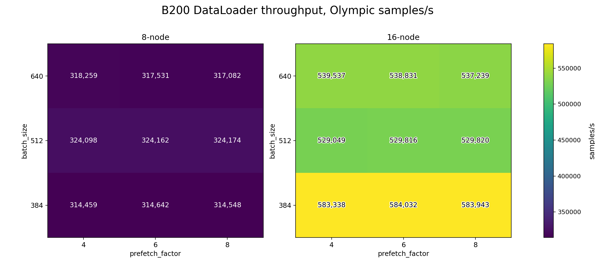
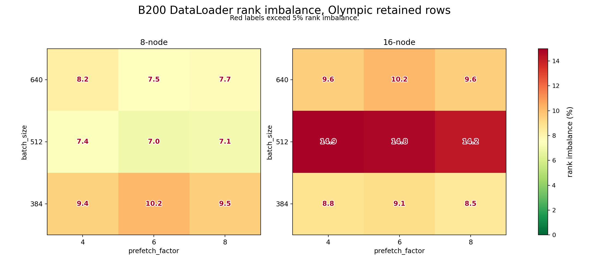
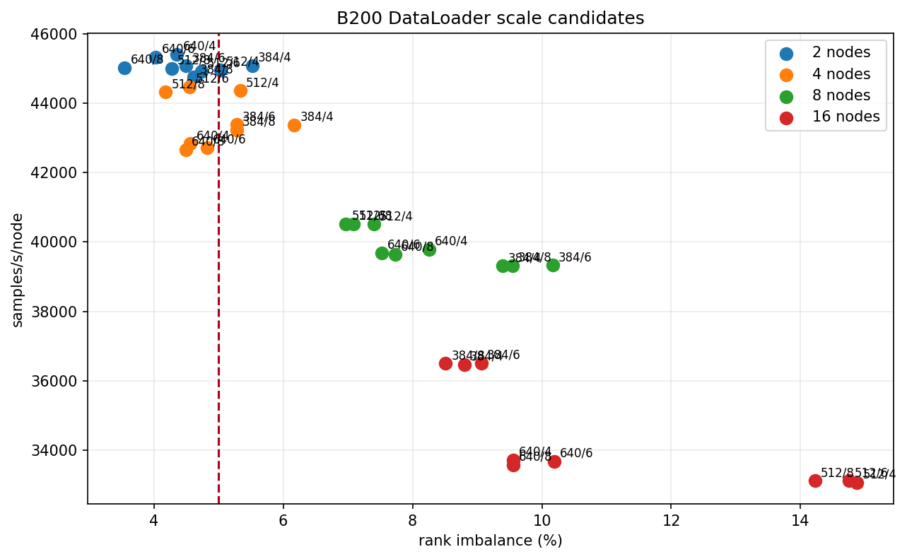
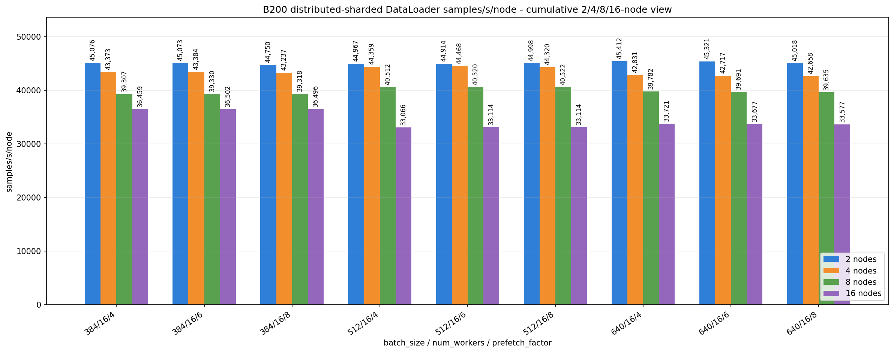
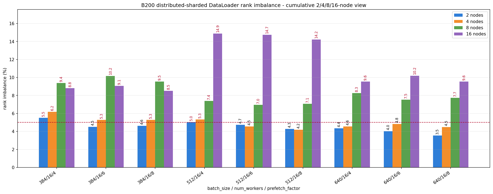

# DataLoader B200 2/4/8/16-Node Scale Probe

<!-- aicr-study-status: published -->


Purpose: report B200 distributed-sharded DataLoader scaling from two to sixteen
nodes using the selected `num_workers=16` workload family.

This study extends the
[B200 multi-node parameter-selection study](b200-multinode-dataloader.md) with
the `384/512/640` batch-size and `prefetch_factor=4/6/8` matrix across `2`,
`4`, `8`, and `16` nodes.

## Command Run

Eight-node and sixteen-node scale probe:

```bash
scripts/benchmark/sweep-dataloader.sh \
  --cluster b200 \
  --profile medium \
  --nodes-list 8,16 \
  --gpu-count 8 \
  --mode distributed-sharded \
  --nodelist b0002,b0003,b0004,b0005,b0006,b0007,b0008,b0009,b0010,b0011,b0012,b0013,b0014,b0015,b0016,b0017 \
  --batch-size-list 512,640 \
  --num-workers-list 16 \
  --prefetch-factor-list 4,6,8 \
  --pin-memory-list 1 \
  --persistent-workers-list 1 \
  --cpus-per-task 16 \
  --repeat-count 5 \
  --apply \
  -- --warmup-batches 100 --measured-batches 500 --byte-estimate-sample-count 0
```

`384` batch-size completion runs:

```bash
scripts/benchmark/sweep-dataloader.sh \
  --cluster b200 \
  --profile medium \
  --nodes-list <nodes> \
  --gpu-count 8 \
  --mode distributed-sharded \
  --nodelist <node-list> \
  --batch-size-list 384 \
  --num-workers-list 16 \
  --prefetch-factor-list <prefetch-factors> \
  --pin-memory-list 1 \
  --persistent-workers-list 1 \
  --cpus-per-task 16 \
  --repeat-count 5 \
  --apply \
  -- --warmup-batches 100 --measured-batches 500 --byte-estimate-sample-count 0
```

The completion runs used `--nodes-list 8,16` with
`--prefetch-factor-list 4,6,8`, plus `--nodes-list 2,4` with
`--prefetch-factor-list 8` to fill the remaining `384/16/8` comparison rows.

## Result Summary

The scale probe completed all intended jobs used in this comparison:

| Field | Value |
| --- | --- |
| Cluster | `b200` |
| Mode | `distributed-sharded` |
| Two-node group | `b0002,b0003` |
| Four-node group | `b0002,b0003,b0004,b0005` |
| Eight-node group | `b0002-b0009` |
| Sixteen-node group | `b0002-b0017` |
| Two/four-node source | `60/60` selected rows passed from the parameter-selection job-id file, plus `10/10` lower-batch completion rows from job IDs `18946-18955` |
| Eight/sixteen-node source | `90/90` rows passed from job IDs `18834-18893`, `18913-18927`, and `18931-18945` |
| Aggregated configs | `36` rows across `2,4,8,16` nodes |
| Batch sizes | `384,512,640` |
| Num workers | `16` |
| Prefetch factors | `4,6,8` |
| Pin memory / persistent workers | `1` / `1` |
| CPUs per task | `16` |
| Warmup / measured batches | `100` / `500` |
| Repeats | `5` |
| Aggregation | Olympic average, dropping lowest and highest throughput from five repeats |

Key results:

| View | Result |
| --- | --- |
| Best two-node row | `640/16/4`: `90,823 samples/s`, `45,412 samples/s/node`, `4.36%` rank imbalance |
| Best four-node row | `512/16/6`: `177,871 samples/s`, `44,468 samples/s/node`, `4.55%` rank imbalance |
| Best eight-node row | `512/16/8`: `324,174 samples/s`, `40,522 samples/s/node`, `7.08%` rank imbalance |
| Best sixteen-node row | `384/16/6`: `584,032 samples/s`, `36,502 samples/s/node`, `9.06%` rank imbalance |
| Lowest sixteen-node imbalance row | `384/16/8`: `583,943 samples/s`, `36,496 samples/s/node`, `8.51%` rank imbalance |

## Aggregate Table

The table uses the selected `384/512/640` batch-size, `16` worker, and `4/6/8`
prefetch rows across two, four, eight, and sixteen nodes.

| Nodes | Batch | Workers | Prefetch | Samples | Included | Samples/s | Samples/s/node | Jitter | Rank imbalance % |
| ---: | ---: | ---: | ---: | ---: | ---: | ---: | ---: | ---: | ---: |
| 2 | 384 | 16 | 4 | 5 | 3 | 90,153 | 45,076 | 133 | 5.52 |
| 2 | 384 | 16 | 6 | 5 | 3 | 90,146 | 45,073 | 224 | 4.50 |
| 2 | 384 | 16 | 8 | 5 | 3 | 89,501 | 44,750 | 2,479 | 4.62 |
| 2 | 512 | 16 | 4 | 5 | 3 | 89,935 | 44,967 | 77 | 5.03 |
| 2 | 512 | 16 | 6 | 5 | 3 | 89,828 | 44,914 | 226 | 4.73 |
| 2 | 512 | 16 | 8 | 5 | 3 | 89,996 | 44,998 | 475 | 4.27 |
| 2 | 640 | 16 | 4 | 5 | 3 | 90,823 | 45,412 | 163 | 4.36 |
| 2 | 640 | 16 | 6 | 5 | 3 | 90,643 | 45,321 | 251 | 4.03 |
| 2 | 640 | 16 | 8 | 5 | 3 | 90,036 | 45,018 | 250 | 3.54 |
| 4 | 384 | 16 | 4 | 5 | 3 | 173,492 | 43,373 | 121 | 6.17 |
| 4 | 384 | 16 | 6 | 5 | 3 | 173,535 | 43,384 | 417 | 5.28 |
| 4 | 384 | 16 | 8 | 5 | 3 | 172,948 | 43,237 | 1,273 | 5.28 |
| 4 | 512 | 16 | 4 | 5 | 3 | 177,435 | 44,359 | 645 | 5.33 |
| 4 | 512 | 16 | 6 | 5 | 3 | 177,871 | 44,468 | 575 | 4.55 |
| 4 | 512 | 16 | 8 | 5 | 3 | 177,281 | 44,320 | 782 | 4.18 |
| 4 | 640 | 16 | 4 | 5 | 3 | 171,323 | 42,831 | 267 | 4.56 |
| 4 | 640 | 16 | 6 | 5 | 3 | 170,867 | 42,717 | 592 | 4.82 |
| 4 | 640 | 16 | 8 | 5 | 3 | 170,632 | 42,658 | 538 | 4.49 |
| 8 | 384 | 16 | 4 | 5 | 3 | 314,459 | 39,307 | 517 | 9.39 |
| 8 | 384 | 16 | 6 | 5 | 3 | 314,642 | 39,330 | 708 | 10.16 |
| 8 | 384 | 16 | 8 | 5 | 3 | 314,548 | 39,318 | 367 | 9.54 |
| 8 | 512 | 16 | 4 | 5 | 3 | 324,098 | 40,512 | 291 | 7.40 |
| 8 | 512 | 16 | 6 | 5 | 3 | 324,162 | 40,520 | 908 | 6.97 |
| 8 | 512 | 16 | 8 | 5 | 3 | 324,174 | 40,522 | 1,731 | 7.08 |
| 8 | 640 | 16 | 4 | 5 | 3 | 318,259 | 39,782 | 770 | 8.25 |
| 8 | 640 | 16 | 6 | 5 | 3 | 317,531 | 39,691 | 1,113 | 7.52 |
| 8 | 640 | 16 | 8 | 5 | 3 | 317,082 | 39,635 | 681 | 7.73 |
| 16 | 384 | 16 | 4 | 5 | 3 | 583,338 | 36,459 | 1,376 | 8.80 |
| 16 | 384 | 16 | 6 | 5 | 3 | 584,032 | 36,502 | 1,134 | 9.06 |
| 16 | 384 | 16 | 8 | 5 | 3 | 583,943 | 36,496 | 524 | 8.51 |
| 16 | 512 | 16 | 4 | 5 | 3 | 529,049 | 33,066 | 1,251 | 14.87 |
| 16 | 512 | 16 | 6 | 5 | 3 | 529,816 | 33,114 | 551 | 14.75 |
| 16 | 512 | 16 | 8 | 5 | 3 | 529,820 | 33,114 | 643 | 14.22 |
| 16 | 640 | 16 | 4 | 5 | 3 | 539,537 | 33,721 | 2,927 | 9.55 |
| 16 | 640 | 16 | 6 | 5 | 3 | 538,831 | 33,677 | 2,655 | 10.19 |
| 16 | 640 | 16 | 8 | 5 | 3 | 537,239 | 33,577 | 1,669 | 9.55 |

## 2/4/8/16-Node Comparison

The `samples/s/node` view compares scale behavior without letting total node
count hide per-node throughput.

| Config | 2-node samples/s/node | 4-node samples/s/node | 8-node samples/s/node | 16-node samples/s/node | 16-node rank imbalance % | Observation |
| --- | ---: | ---: | ---: | ---: | ---: | --- |
| `384/16/4` | 45,076 | 43,373 | 39,307 | 36,459 | 8.80 | Complete lower-batch row; highest eight-node per-node throughput in the 384 family. |
| `384/16/6` | 45,073 | 43,384 | 39,330 | 36,502 | 9.06 | Best sixteen-node total throughput and samples/s/node in this study. |
| `384/16/8` | 44,750 | 43,237 | 39,318 | 36,496 | 8.51 | Complete lower-batch row; closest sixteen-node alternative with the lowest sixteen-node imbalance in the 384 family. |
| `512/16/4` | 44,967 | 44,359 | 40,512 | 33,066 | 14.87 | Highest eight-node total throughput among the selected rows, but high sixteen-node imbalance. |
| `512/16/6` | 44,914 | 44,468 | 40,520 | 33,114 | 14.75 | Nearly tied with 512/16/4 at sixteen nodes, with high retained imbalance. |
| `512/16/8` | 44,998 | 44,320 | 40,522 | 33,114 | 14.22 | Similar throughput to the other 512 rows and slightly lower sixteen-node imbalance. |
| `640/16/4` | 45,412 | 42,831 | 39,782 | 33,721 | 9.55 | Highest two-node per-node row and strongest sixteen-node per-node result in the 640 family. |
| `640/16/6` | 45,321 | 42,717 | 39,691 | 33,677 | 10.19 | Close to 640/16/4 with slightly higher sixteen-node imbalance. |
| `640/16/8` | 45,018 | 42,658 | 39,635 | 33,577 | 9.55 | Lowest sixteen-node throughput among the 640 rows, still stronger per node than the 512 rows at sixteen nodes. |

| View | Nodes | Batch | Workers | Prefetch | Samples/s | Samples/s/node | Rank imbalance % | Note |
| --- | ---: | ---: | ---: | ---: | ---: | ---: | ---: | --- |
| Best two-node retained row | 2 | 640 | 16 | 4 | 90,823 | 45,412 | 4.36 | Highest two-node throughput in the selected comparison set. |
| Best four-node retained row | 4 | 512 | 16 | 6 | 177,871 | 44,468 | 4.55 | Highest four-node throughput in the selected comparison set. |
| Best eight-node retained row | 8 | 512 | 16 | 8 | 324,174 | 40,522 | 7.08 | Highest eight-node throughput among the selected rows. |
| Best sixteen-node retained row | 16 | 384 | 16 | 6 | 584,032 | 36,502 | 9.06 | Highest sixteen-node throughput and highest sixteen-node samples/s/node. |
| Lowest sixteen-node imbalance row | 16 | 384 | 16 | 8 | 583,943 | 36,496 | 8.51 | Lowest retained imbalance among the sixteen-node rows and essentially tied on throughput. |

## Findings

Total throughput increases through sixteen nodes. The best retained two-node
row is `90,823 samples/s`; the best four-node row is `177,871 samples/s`; the
best eight-node row is `324,174 samples/s`; and the best sixteen-node row is
`584,032 samples/s`.

Per-node throughput decreases at larger scale. The best selected two-node row is
`45,412 samples/s/node`; the best selected sixteen-node row is
`36,502 samples/s/node`.

At eight nodes, the `512` batch rows remain the highest-throughput family. At
sixteen nodes, the `384` batch rows are stronger than the `512/640` rows and
have lower retained rank imbalance than the `512` rows. The best sixteen-node
row in this study is `384/16/6`; `384/16/8` is the closest balanced
alternative.

## Figures

The first two heatmaps compare the completed eight-node and sixteen-node rows.
The cumulative figures compare per-node throughput and retained rank imbalance
across two, four, eight, and sixteen nodes.











## Artifact Bundle

| Artifact | Location |
| --- | --- |
| VAST bundle | `/work/aicr/commissioning/benchmarks/public-study-artifacts/aicr-public/bbcc5f7/dataloader/2026-05-14/dataloader-b200-2-4-8-16-scale-probe-2026-05-14.tar.gz` |
| VAST provenance | `/work/aicr/commissioning/benchmarks/public-study-artifacts/aicr-public/bbcc5f7/dataloader/2026-05-14/dataloader-b200-2-4-8-16-scale-probe-2026-05-14-provenance.json` |
| OSN bundle | <https://uma1.osn.mghpcc.org/csim-bmark/public-study-artifacts/aicr-public/bbcc5f7/dataloader/2026-05-14/dataloader-b200-2-4-8-16-scale-probe-2026-05-14.tar.gz> |
| OSN provenance | <https://uma1.osn.mghpcc.org/csim-bmark/public-study-artifacts/aicr-public/bbcc5f7/dataloader/2026-05-14/dataloader-b200-2-4-8-16-scale-probe-2026-05-14-provenance.json> |
| OSN checksum | <https://uma1.osn.mghpcc.org/csim-bmark/public-study-artifacts/aicr-public/bbcc5f7/dataloader/2026-05-14/dataloader-b200-2-4-8-16-scale-probe-2026-05-14.sha256> |
| Aggregated CSV | <https://uma1.osn.mghpcc.org/csim-bmark/public-study-artifacts/aicr-public/bbcc5f7/dataloader/2026-05-14/dataloader-b200-2-4-8-16-scale-probe-2026-05-14/reports/dataloader-b200-scale-probe-aggregated-2026-05-14.csv> |
| Detail CSV | <https://uma1.osn.mghpcc.org/csim-bmark/public-study-artifacts/aicr-public/bbcc5f7/dataloader/2026-05-14/dataloader-b200-2-4-8-16-scale-probe-2026-05-14/reports/dataloader-b200-scale-probe-detail-2026-05-14.csv> |
| Metadata JSON | <https://uma1.osn.mghpcc.org/csim-bmark/public-study-artifacts/aicr-public/bbcc5f7/dataloader/2026-05-14/dataloader-b200-2-4-8-16-scale-probe-2026-05-14/data/metadata.json> |

## Retrieve And Verify

```bash
mkdir -p public-study-artifacts/dataloader-b200-2-4-8-16-scale-probe
cd public-study-artifacts/dataloader-b200-2-4-8-16-scale-probe
wget https://uma1.osn.mghpcc.org/csim-bmark/public-study-artifacts/aicr-public/bbcc5f7/dataloader/2026-05-14/dataloader-b200-2-4-8-16-scale-probe-2026-05-14.tar.gz
wget https://uma1.osn.mghpcc.org/csim-bmark/public-study-artifacts/aicr-public/bbcc5f7/dataloader/2026-05-14/dataloader-b200-2-4-8-16-scale-probe-2026-05-14.sha256
sha256sum -c dataloader-b200-2-4-8-16-scale-probe-2026-05-14.sha256
tar -xzf dataloader-b200-2-4-8-16-scale-probe-2026-05-14.tar.gz
```
