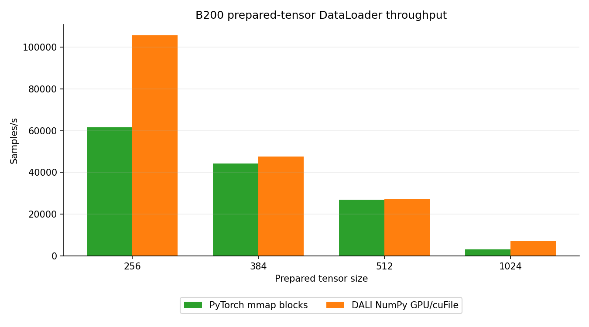
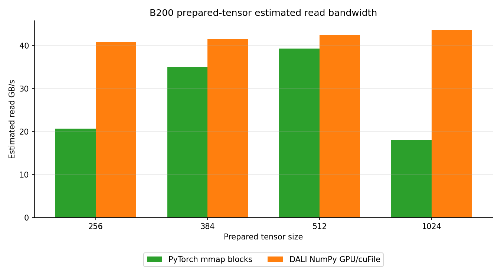

# B200 Prepared-Tensor GPU/cuFile DataLoader Transport

<!-- aicr-study-status: published -->

Purpose: document the B200 DataLoader-only prepared-block transport comparison
for PyTorch mmap and DALI NumPy GPU/cuFile paths.

This DataLoader study compares the CPU-safe PyTorch mmap block reader with
DALI's NumPy GPU/cuFile reader on the same ImageNet-derived
`numpy-fp16-blocks` representation.

## Study Question

This study asks whether DALI's NumPy GPU/cuFile reader improves B200
DataLoader prepared-tensor throughput over PyTorch mmap as tensor size
increases.

## Study Scope

The measured path is prepared-tensor transport:

- prepared fp16 image tensors stored as blocked NumPy files;
- PyTorch mmap over the blocked tensor layout as the CPU comparator;
- DALI `fn.readers.numpy(device="gpu", use_o_direct=True)` for the
  GPU/cuFile rows;
- DataLoader-only throughput and estimated prepared-tensor read bandwidth;
- same-node GDS verification and cuFile provenance for the GDS rows.

## Run Shape

| Field | Value |
| --- | --- |
| Module | DataLoader |
| Platform | B200 |
| Input representation | `numpy-fp16-blocks` |
| Dataset subset | `spc=64`, seed `1234` |
| Storage dtype/layout | prepared fp16 NCHW block files |
| NumPy block size | `512` images per block file |
| Comparator | `numpy-fp16-blocks-pytorch` |
| GPU/cuFile path | `dali-numpy-fp16-blocks-gds` |
| Aggregation | Three successful repeats, arithmetic mean |
| Measurement scope | DataLoader-only prepared-tensor transport |

`spc` means samples per class. The `spc=64` subset has `64,000` logical
ImageNet-derived samples, which keeps the prepared-input ladder compact enough
for repeated transport measurement.

## Result Summary

| Size | PyTorch block samples/s | PyTorch estimated read GB/s | DALI NumPy GPU/cuFile samples/s | DALI NumPy GPU/cuFile estimated read GB/s | DALI/PyTorch samples/s | Reading |
| ---: | ---: | ---: | ---: | ---: | ---: | --- |
| `256` | `61,558.71` | `20.72` | `105,577.78` | `40.83` | `1.71x` | strong DALI lead |
| `384` | `44,159.69` | `35.06` | `47,551.82` | `41.57` | `1.08x` | modest DALI lead |
| `512` | `26,855.27` | `39.33` | `27,282.93` | `42.41` | `1.02x` | near tie |
| `1024` | `3,095.04` | `18.07` | `7,066.03` | `43.63` | `2.28x` | strong DALI lead |

Jobs used in the repeated means:

| Size | PyTorch jobs | DALI NumPy GPU/cuFile jobs |
| ---: | --- | --- |
| `256` | `28915`, `28916`, `28917` | `28921`, `28922`, `28923` |
| `384` | `28970`, `28971`, `28972` | `28998`, `28999`, `29000` |
| `512` | `29001`, `29002`, `29003` | `29005`, `29006`, `29007` |
| `1024` | `29016`, `29017`, `29018` | `29020`, `29021`, `29022` |

The useful DataLoader conclusion is size-dependent. The DALI NumPy
GPU/cuFile path leads at `256` and `1024`, has a modest lead at `384`, and is
effectively tied with PyTorch mmap at `512`. The `512` row shows where the B200
ladder converges with the PyTorch mmap comparator.

## Figures

The throughput and estimated-read figures use the same focused three-repeat
means as the result table.

## Artifact Availability

This page records supporting DataLoader-only transport context for the B200
prepared-block endpoint. The exact job IDs and focused figures are listed
above. No standalone public artifact bundle is linked for this B200
DataLoader-only ladder.

Use the companion DDP studies for artifacted training-throughput evidence on
the same prepared input representation:

- [DDP prepared-tensor GPU/cuFile transport pilot](../../ddp/studies/prepared-tensor-gds-transport.md)
- [DDP prepared-tensor GPU/cuFile scale follow-up](../../ddp/studies/prepared-tensor-gds-scale-followup.md)

## Reader Path

The GDS rows use DALI's NumPy GPU/cuFile reader path:
`fn.readers.numpy(device="gpu", use_o_direct=True)`. DALI JPEG pages cover
image decode and input-pipeline behavior for JPEG files.

The primary CPU comparator is PyTorch mmap over the same blocked prepared
tensor layout. That keeps the comparison tied to transport over the same
prepared input representation rather than to online JPEG decode, resize/crop,
normalization, or training compute.

## Related Training Studies

The companion DDP studies report B200 prepared-tensor training-throughput
results using the same prepared input representation:

- [DDP prepared-tensor GPU/cuFile transport pilot](../../ddp/studies/prepared-tensor-gds-transport.md)
- [DDP prepared-tensor GPU/cuFile scale follow-up](../../ddp/studies/prepared-tensor-gds-scale-followup.md)

## Related Pages

- [DataLoader input pipeline reference](../input-pipeline-reference.md)
- [Where the input work lives](input-representations.md)
- [Derived ImageNet datasets](../derived-datasets.md)
