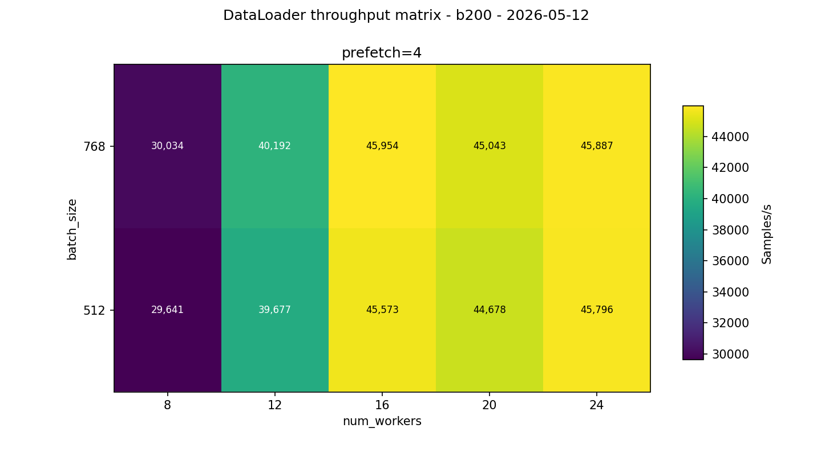
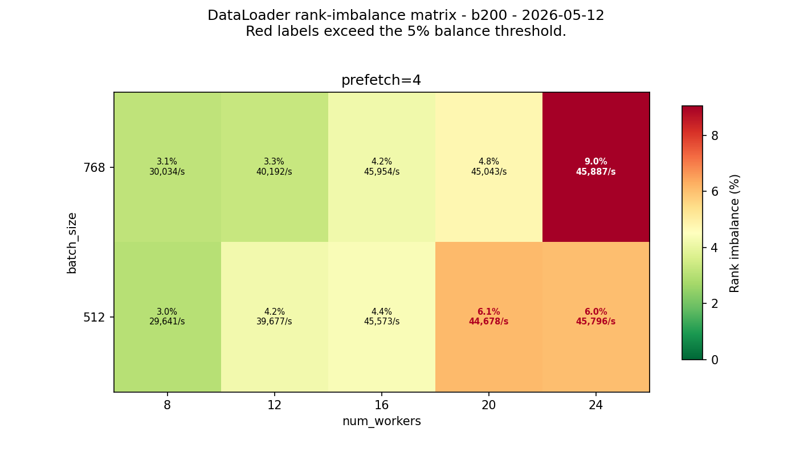
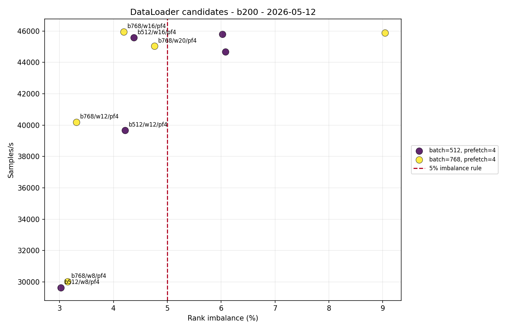

# DataLoader B200 One-Node 8-GPU Replicated

<!-- aicr-study-status: published -->


Purpose: report the B200 one-node replicated DataLoader worker scan that selects the first scale-facing input-pipeline setting.

This study follows the [B200 single-GPU surface](b200-single-gpu-surface.md).
The single-GPU run chose candidate regions. This one-node run asks which worker
count remains fast and balanced when eight replicated ranks share one B200 node.

## Run Shape

| Field | Value |
| --- | --- |
| Cluster | `b200` |
| Node | `b0021` |
| Mode | `replicated` |
| Nodes | `1` |
| GPUs per node | `8` |
| Batch sizes | `512,768` |
| Num workers | `8,12,16,20,24` |
| Prefetch factor | `4` |
| Pin memory | `1` |
| Persistent workers | `1` |
| CPUs per task | `16` |
| Warmup batches | `100` |
| Measured batches | `500` |
| Repeats | `5` |
| Aggregation | `olympic` |
| Intended jobs | `50` |
| Completed/passed | `50/50` |

Olympic aggregation drops the lowest and highest throughput samples for each
configuration, then computes throughput, jitter, and rank imbalance from the
same retained three jobs.

## Command Run

```bash
scripts/benchmark/sweep-dataloader.sh \
  --cluster b200 \
  --profile medium \
  --nodes-list 1 \
  --gpu-count 8 \
  --mode replicated \
  --nodelist b0021 \
  --batch-size-list 512,768 \
  --num-workers-list 8,12,16,20,24 \
  --prefetch-factor-list 4 \
  --pin-memory-list 1 \
  --persistent-workers-list 1 \
  --cpus-per-task 16 \
  --repeat-count 5 \
  --apply \
  -- --warmup-batches 100 --measured-batches 500 --byte-estimate-sample-count 0
```

## Result Summary

The B200 one-node result points to `batch_size=768`, `num_workers=16`, and
`prefetch_factor=4` for the first multi-node DataLoader pass. Workers below
`16` are more balanced but leave too much throughput on the table. Workers
above `16` sometimes match throughput, but their retained rank imbalance is
worse, which makes them a weaker default for scale-facing work.

## Result

| Batch | Workers | Prefetch | Samples/s | Retained imbalance | Retained jitter |
| ---: | ---: | ---: | ---: | ---: | ---: |
| 512 | 8 | 4 | 29,641 | 3.02% | 181 |
| 512 | 12 | 4 | 39,677 | 4.22% | 127 |
| 512 | 16 | 4 | 45,573 | 4.38% | 241 |
| 512 | 20 | 4 | 44,678 | 6.08% | 42 |
| 512 | 24 | 4 | 45,796 | 6.02% | 343 |
| 768 | 8 | 4 | 30,034 | 3.15% | 8 |
| 768 | 12 | 4 | 40,192 | 3.31% | 128 |
| 768 | 16 | 4 | 45,954 | 4.19% | 84 |
| 768 | 20 | 4 | 45,043 | 4.76% | 75 |
| 768 | 24 | 4 | 45,887 | 9.04% | 306 |

The `768/16/4` point is the scale-facing B200 default from this study:
`45,954 samples/s`, `4.19%` retained rank imbalance, and `84 samples/s`
retained jitter. The nearby `768/24/4` point does not become the default
because it has similar throughput but `9.04%` retained imbalance.

## Figures







## Artifact Bundle

| Artifact | Location |
| --- | --- |
| VAST bundle | `/work/aicr/commissioning/benchmarks/public-study-artifacts/aicr-public/e5bba11/dataloader/2026-05-12/dataloader-b200-rtx-one-node-replicated-worker-scan-olympic-2026-05-12.tar.gz` |
| VAST provenance | `/work/aicr/commissioning/benchmarks/public-study-artifacts/aicr-public/e5bba11/dataloader/2026-05-12/dataloader-b200-rtx-one-node-replicated-worker-scan-olympic-2026-05-12-provenance.json` |
| OSN bundle | <https://uma1.osn.mghpcc.org/csim-bmark/public-study-artifacts/aicr-public/e5bba11/dataloader/2026-05-12/dataloader-b200-rtx-one-node-replicated-worker-scan-olympic-2026-05-12.tar.gz> |
| OSN provenance | <https://uma1.osn.mghpcc.org/csim-bmark/public-study-artifacts/aicr-public/e5bba11/dataloader/2026-05-12/dataloader-b200-rtx-one-node-replicated-worker-scan-olympic-2026-05-12-provenance.json> |
| OSN checksum | <https://uma1.osn.mghpcc.org/csim-bmark/public-study-artifacts/aicr-public/e5bba11/dataloader/2026-05-12/dataloader-b200-rtx-one-node-replicated-worker-scan-olympic-2026-05-12.sha256> |
| Filtered B200 report | <https://uma1.osn.mghpcc.org/csim-bmark/public-study-artifacts/aicr-public/e5bba11/dataloader/2026-05-12/one-node-replicated-worker-scan/reports/dataloader-b200-2026-05-12.md> |
| Filtered B200 CSV | <https://uma1.osn.mghpcc.org/csim-bmark/public-study-artifacts/aicr-public/e5bba11/dataloader/2026-05-12/one-node-replicated-worker-scan/reports/dataloader-aggregated-summary-b200-2026-05-12.csv> |

## Retrieve And Verify

```bash
mkdir -p public-study-artifacts/dataloader-one-node-replicated
cd public-study-artifacts/dataloader-one-node-replicated
wget https://uma1.osn.mghpcc.org/csim-bmark/public-study-artifacts/aicr-public/e5bba11/dataloader/2026-05-12/dataloader-b200-rtx-one-node-replicated-worker-scan-olympic-2026-05-12.tar.gz
wget https://uma1.osn.mghpcc.org/csim-bmark/public-study-artifacts/aicr-public/e5bba11/dataloader/2026-05-12/dataloader-b200-rtx-one-node-replicated-worker-scan-olympic-2026-05-12.sha256
sha256sum -c dataloader-b200-rtx-one-node-replicated-worker-scan-olympic-2026-05-12.sha256
tar -tzf dataloader-b200-rtx-one-node-replicated-worker-scan-olympic-2026-05-12.tar.gz | head
```
