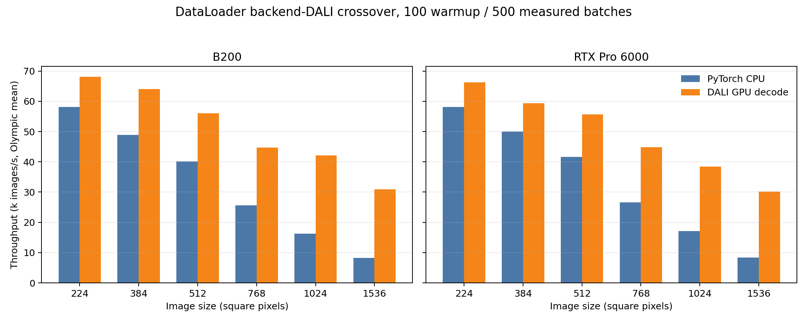
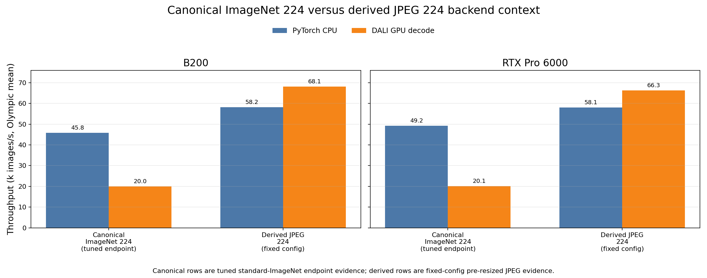

# DataLoader Backend DALI Crossover

<!-- aicr-study-status: appendix -->

**Appendix - Supporting Reference, Not A Standalone Study**

This fixed-config appendix shows how the PyTorch CPU and DALI backends compare
as derived JPEG image size increases. The tuned endpoint comparison is reported
separately in [optimized backend crossover](optimized-backend-crossover.md).

Purpose: find where DALI begins to beat PyTorch CPU DataLoader for same-size
pre-resized JPEG input work.

This is a DataLoader-only derived-JPEG comparison. It reports input-pipeline
throughput, not training throughput.

This page uses `100` warmup and `500` measured batches across `224` through
`1536`.

## Study Question

This fixed-config study asks how much JPEG decode and resize work must be
present before DALI overtakes PyTorch CPU DataLoader at the same derived image
size. Every row keeps the input representation and benchmark shape fixed while
changing only the backend.

## Run Shape

| Field | Value |
| --- | --- |
| Platforms | B200, RTX Pro 6000 |
| Nodes | `1` |
| GPUs | `8` |
| DataLoader mode | `replicated` |
| Dataset | pre-resized ImageNet-derived JPEG ImageFolder |
| Sizes | `224`, `384`, `512`, `768`, `1024`, `1536` |
| Backends | `pytorch-cpu-dataloader`, `dali-gpu-decode` |
| Batch size | `512` |
| Workers | `16` |
| Prefetch factor | `4` |
| DALI threads | `16` |
| DALI queue depth | `2` |
| DALI decode mode | `random-crop` |
| Warmup / measured | `100` / `500` batches |
| Aggregation | five-repeat Olympic average |

## Command Run

The command below shows the fixed-config derived JPEG sweep shape:

```bash
scripts/benchmark/sweep-dataloader.sh \
  --cluster <b200|rtxpro6000> \
  --partition <b200-batch|rtx-batch> \
  --time 00:25:00 \
  --nodes-list 1 \
  --gpu-count 8 \
  --mode replicated \
  --nodelist <b0003|a0002> \
  --input-backend-list pytorch-cpu-dataloader,dali-gpu-decode \
  --batch-size-list 512 \
  --num-workers-list 16 \
  --prefetch-factor-list 4 \
  --dali-num-threads-list 16 \
  --dali-prefetch-queue-depth-list 2 \
  --dali-decode-mode-list random-crop \
  --dali-hw-decoder-load-list 0.65 \
  --pin-memory-list 1 \
  --persistent-workers-list 1 \
  --cpus-per-task 16 \
  --mem-list 0 \
  --repeat-count 5 \
  --apply \
  -- --dataset-root /scratch/$USER/aicr-bench/studies/dataloader-ddp-v1/imagenet/train/spc-16-seed-1234/size-<size>/jpeg \
     --derived-root /scratch/$USER/aicr-bench/studies/dataloader-ddp-v1/imagenet/train/spc-16-seed-1234 \
     --derived-image-size <size> \
     --derived-samples-per-class 16 \
     --derived-seed 1234 \
     --warmup-batches 100 \
     --measured-batches 500 \
     --byte-estimate-sample-count 0
```

The artifact bundle includes expanded commands, job IDs, summaries, and
provenance.

## Result Summary

| Size | B200 PyTorch img/s | B200 DALI img/s | B200 DALI/PyTorch | RTX PyTorch img/s | RTX DALI img/s | RTX DALI/PyTorch |
| ---: | ---: | ---: | ---: | ---: | ---: | ---: |
| `224` | `58,164` | `68,091` | `1.171x` | `58,098` | `66,270` | `1.141x` |
| `384` | `48,882` | `64,042` | `1.310x` | `49,949` | `59,318` | `1.188x` |
| `512` | `40,195` | `55,982` | `1.393x` | `41,683` | `55,614` | `1.334x` |
| `768` | `25,575` | `44,691` | `1.747x` | `26,662` | `44,821` | `1.681x` |
| `1024` | `16,257` | `42,167` | `2.594x` | `17,130` | `38,476` | `2.246x` |
| `1536` | `8,214` | `30,891` | `3.761x` | `8,357` | `30,197` | `3.614x` |

With this fixed setting, DALI wins on both platforms at every tested derived
JPEG size. The advantage is modest at `224`, becomes material by `512`, and is
large by `1024` and `1536`, where decode and crop work dominate the input path.

The `224` row here is derived pre-resized JPEG, not canonical ImageNet. It
should be read separately from the standard ImageNet DALI study, where tuned
PyTorch CPU DataLoader remains faster at ordinary ImageNet shape.

### 224 Input-Representation Reference

The table below places the derived `224` row next to the canonical ImageNet
`224` endpoint from [DALI optimization on standard ImageNet](dali-standard-imagenet-optimization.md).
The canonical rows are tuned endpoint evidence from that study, not additional
fixed-config rows from this size ladder.

| Platform | Endpoint | CPU samples/s | DALI samples/s | DALI/CPU | Evidence source |
| --- | --- | ---: | ---: | ---: | --- |
| B200 | canonical ImageNet `224` | `45,800` | `19,982` | `0.44x` | Standard ImageNet tuned endpoint |
| B200 | derived JPEG `224` | `58,164` | `68,091` | `1.17x` | This fixed-config crossover |
| RTX Pro 6000 | canonical ImageNet `224` | `49,200` | `20,107` | `0.41x` | Standard ImageNet tuned endpoint |
| RTX Pro 6000 | derived JPEG `224` | `58,098` | `66,270` | `1.14x` | This fixed-config crossover |

This comparison is the reason the page labels the fixed-config `224` row as
derived JPEG evidence. At the same nominal image size, changing the input
representation changes the backend result.

## Figures



The size-ladder figure includes only the fixed-config derived JPEG rows from
this study.



The `224` context figure combines the fixed-config derived `224` row above
with the canonical ImageNet tuned endpoint from the standard-ImageNet DALI
study. It is an input-representation comparison, not an additional size-ladder
measurement.

## Interpretation

DALI is workload-conditional. This fixed-config derived JPEG sweep shows that
DALI can win even at `224` when both backends use the same high-throughput
batch, worker, and prefetch shape, but the small-size margin is much thinner
than the large-image margin. The larger the decoded/cropped JPEG payload, the
more the DALI path separates from CPU decode.

This fixed-config page should be read alongside the optimized endpoint
studies. Standard ImageNet `224` and derived `1024` each have separate tuning
studies, and the
[optimized backend crossover](optimized-backend-crossover.md) is the endpoint
comparison.

## Artifact Bundle

| Item | Path |
| --- | --- |
| VAST bundle | `/work/aicr/commissioning/benchmarks/public-study-artifacts/aicr-public/e4f0664/dataloader/2026-05-23/dataloader-backend-dali-crossover-100x500-2026-05-23.tar.gz` |
| VAST provenance | `/work/aicr/commissioning/benchmarks/public-study-artifacts/aicr-public/e4f0664/dataloader/2026-05-23/dataloader-backend-dali-crossover-100x500-2026-05-23-provenance.json` |
| OSN bundle | <https://uma1.osn.mghpcc.org/csim-bmark/public-study-artifacts/aicr-public/e4f0664/dataloader/2026-05-23/dataloader-backend-dali-crossover-100x500-2026-05-23.tar.gz> |
| OSN provenance | <https://uma1.osn.mghpcc.org/csim-bmark/public-study-artifacts/aicr-public/e4f0664/dataloader/2026-05-23/dataloader-backend-dali-crossover-100x500-2026-05-23-provenance.json> |
| OSN checksum | <https://uma1.osn.mghpcc.org/csim-bmark/public-study-artifacts/aicr-public/e4f0664/dataloader/2026-05-23/dataloader-backend-dali-crossover-100x500-2026-05-23.sha256> |

## Retrieve And Verify

```bash
mkdir -p public-study-artifacts/dataloader-backend-dali-crossover
cd public-study-artifacts/dataloader-backend-dali-crossover
wget https://uma1.osn.mghpcc.org/csim-bmark/public-study-artifacts/aicr-public/e4f0664/dataloader/2026-05-23/dataloader-backend-dali-crossover-100x500-2026-05-23.tar.gz
wget https://uma1.osn.mghpcc.org/csim-bmark/public-study-artifacts/aicr-public/e4f0664/dataloader/2026-05-23/dataloader-backend-dali-crossover-100x500-2026-05-23.sha256
sha256sum -c dataloader-backend-dali-crossover-100x500-2026-05-23.sha256
tar -tzf dataloader-backend-dali-crossover-100x500-2026-05-23.tar.gz | head
```

## How To Read This Result

- This is a fixed-config derived JPEG comparison, not a general DALI rule.
- The derived `224` row is separate from canonical ImageNet evidence.
- The table reports DataLoader-only throughput, not training throughput.
- The replacement `100/500` evidence supersedes earlier `20/100` rows.
