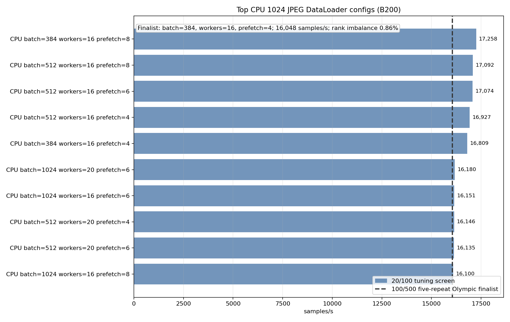
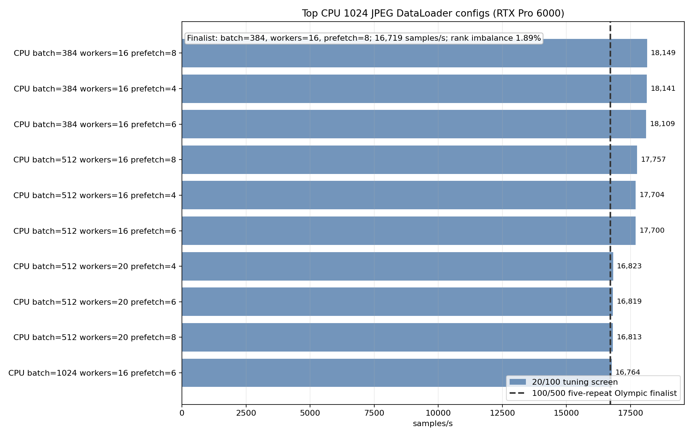

# CPU PyTorch DataLoader Optimization At 1024

<!-- aicr-study-status: published -->

Purpose: tune PyTorch CPU DataLoader settings for large pre-resized JPEG input.

This study is the CPU-side endpoint for the optimized backend crossover. It
asks what happens to batch, worker, and prefetch choices when the same
DataLoader module reads derived `1024` JPEGs instead of ordinary ImageNet
training images.

## Study Question

The standard ImageNet CPU studies found strong one-node settings for ordinary
training shape. Large pre-resized JPEG input changes the amount of work per
sample: more bytes are read, decode is heavier, tensor payloads are larger, and
prefetch can hold much more host memory.

This study tunes the CPU backend at the `1024` endpoint before comparing it
with the DALI finalist in
[Optimized 224/1024 backend crossover](optimized-backend-crossover.md). The
result identifies the tuned CPU endpoint candidate for large pre-resized JPEG
input.

## Run Shape

| Field | Value |
| --- | --- |
| Platforms | B200, RTX Pro 6000 |
| Nodes | `1` |
| GPUs | `8` |
| DataLoader mode | `replicated` |
| Dataset | pre-resized ImageNet-derived JPEG ImageFolder |
| Derived size | `1024` |
| Derived subset | `spc-16` (16 samples per ImageNet class), seed `1234` |
| Backend | `pytorch-cpu-dataloader` |
| Batch screen | `384`, `512`, `640`, `768`, `1024` |
| Worker screen | `12`, `16`, `20` |
| Prefetch screen | `4`, `6`, `8` |
| Tuning screen | warmup `20`, measured `100`, single-repeat candidates |
| Finalist rows | warmup `100`, measured `500`, five-repeat Olympic finalists |

## Command Run

The tuning screen used this sweep shape:

```bash
scripts/benchmark/sweep-dataloader.sh \
  --cluster <b200|rtxpro6000> \
  --partition <b200-batch|rtx-batch> \
  --gpu-count 8 \
  --mode replicated \
  --nodelist <node> \
  --repeat-count 1 \
  --input-backend-list pytorch-cpu-dataloader \
  --batch-size-list 384,512,640,768,1024 \
  --num-workers-list 12,16,20 \
  --prefetch-factor-list 4,6,8 \
  --pin-memory-list 1 \
  --persistent-workers-list 1 \
  --cpus-per-task 16 \
  --mem-list 0 \
  --time 00:45:00 \
  --apply \
  -- --dataset-root /scratch/$USER/aicr-bench/studies/dataloader-ddp-v1/imagenet/train/spc-16-seed-1234/size-1024/jpeg \
     --derived-root /scratch/$USER/aicr-bench/studies/dataloader-ddp-v1/imagenet/train/spc-16-seed-1234 \
     --derived-image-size 1024 \
     --derived-samples-per-class 16 \
     --derived-seed 1234 \
     --warmup-batches 20 \
     --measured-batches 100 \
     --byte-estimate-sample-count 0
```

The selected finalists were rerun with `--warmup-batches 100` and
`--measured-batches 500`.

## Result Summary

| Platform | CPU finalist | Olympic images/s | Repeat count | Job IDs |
| --- | --- | ---: | ---: | --- |
| B200 | batch `384`, workers `16`, prefetch `4` | `16,048` | `5` | `25223-25227` |
| RTX Pro 6000 | batch `384`, workers `16`, prefetch `8` | `16,719` | `5` | `25233-25237` |

The large-image CPU endpoint prefers a smaller batch than the standard
ImageNet one-node winner. At `1024`, the cost of each prefetched batch is much
larger, so the winning setting is less about filling the GPU with enormous
batches and more about keeping the host-side pipeline stable.

## Figures





The bars show the strongest tuning-screen configurations for each platform.
The dashed line marks the five-repeat finalist used by the optimized
crossover.

## Interpretation

Both platforms selected batch `384` with `16` workers. The prefetch winner
differs: B200 used prefetch `4`, while RTX Pro 6000 used prefetch `8`. That
difference is platform-specific. Large JPEG payloads move the CPU tuning
optimum away from the standard ImageNet batch `768` shape.

These are DataLoader-only endpoint candidates for the optimized backend
comparison.

## Artifact Bundle

| Item | Location |
| --- | --- |
| VAST bundle | `/work/aicr/commissioning/benchmarks/public-study-artifacts/aicr-public/a959091/dataloader/2026-05-20/dataloader-cpu-1024-optimization-2026-05-20.tar.gz` |
| VAST provenance | `/work/aicr/commissioning/benchmarks/public-study-artifacts/aicr-public/a959091/dataloader/2026-05-20/dataloader-cpu-1024-optimization-2026-05-20-provenance.json` |
| OSN bundle | <https://uma1.osn.mghpcc.org/csim-bmark/public-study-artifacts/aicr-public/a959091/dataloader/2026-05-20/dataloader-cpu-1024-optimization-2026-05-20.tar.gz> |
| OSN provenance | <https://uma1.osn.mghpcc.org/csim-bmark/public-study-artifacts/aicr-public/a959091/dataloader/2026-05-20/dataloader-cpu-1024-optimization-2026-05-20-provenance.json> |
| OSN checksum | <https://uma1.osn.mghpcc.org/csim-bmark/public-study-artifacts/aicr-public/a959091/dataloader/2026-05-20/dataloader-cpu-1024-optimization-2026-05-20.sha256> |
| SHA256 | `80baa5a9bffa26039e9c77a1a3c232c4fa2d1de632d26577a85fae8504378d55` |

The bundle includes screen rows, finalist aggregate CSV/JSON, figures,
commands, provenance, and checksum.

## Retrieve And Verify

```bash
mkdir -p public-study-artifacts/dataloader-cpu-1024-optimization
cd public-study-artifacts/dataloader-cpu-1024-optimization
wget https://uma1.osn.mghpcc.org/csim-bmark/public-study-artifacts/aicr-public/a959091/dataloader/2026-05-20/dataloader-cpu-1024-optimization-2026-05-20.tar.gz
wget https://uma1.osn.mghpcc.org/csim-bmark/public-study-artifacts/aicr-public/a959091/dataloader/2026-05-20/dataloader-cpu-1024-optimization-2026-05-20.sha256
sha256sum -c dataloader-cpu-1024-optimization-2026-05-20.sha256
tar -tzf dataloader-cpu-1024-optimization-2026-05-20.tar.gz | head
```

## How To Read This Result

- Final comparisons use the five-repeat finalist rows, not single-repeat
  tuning rows.
- This is DataLoader-only throughput, not training throughput.
- The `1024` CPU optimum is endpoint-specific and should be read separately
  from canonical ImageNet results.

## Related Results

- [DALI Optimization At 1024](dali-large-image-optimization.md)
- [Optimized 224/1024 backend crossover](optimized-backend-crossover.md)
