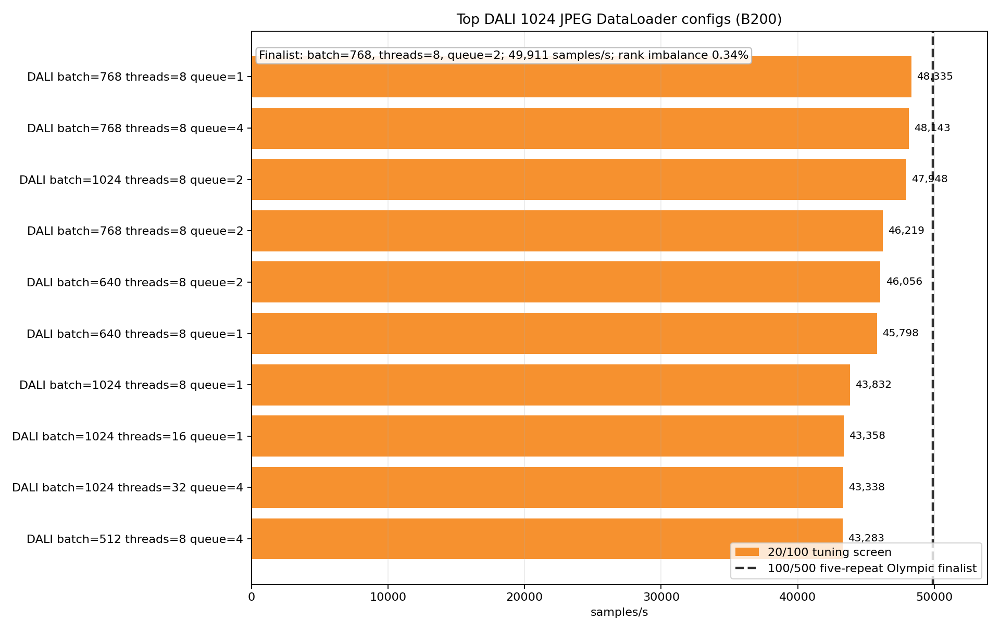
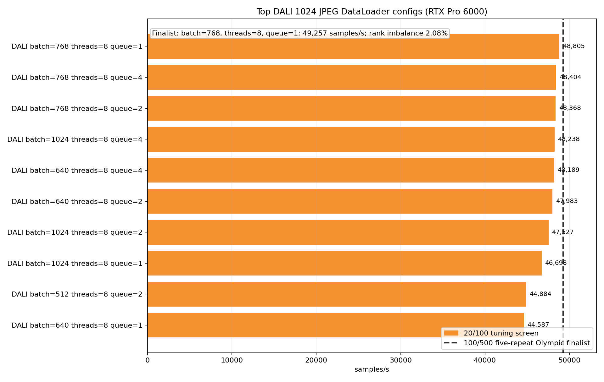

# DALI Optimization At 1024

<!-- aicr-study-status: published -->

Purpose: tune DALI settings for large pre-resized JPEG input.

This study is the DALI-side endpoint for the optimized backend crossover. It
asks which DALI batch and queue settings are stable when derived `1024` JPEGs
make decode, crop, and transfer work large enough for GPU-side preprocessing to
matter.

## Study Question

DALI has overhead at canonical ImageNet shape, but the fixed-config crossover
showed large gains once derived JPEG sizes became large. This study tunes DALI
at the `1024` endpoint before using the finalist in the optimized crossover.

The result is endpoint-specific: DALI benefits when decode and preprocessing
work are large enough to amortize pipeline overhead.

## Run Shape

| Field | Value |
| --- | --- |
| Platforms | B200, RTX Pro 6000 |
| Nodes | `1` |
| GPUs | `8` |
| DataLoader mode | `replicated` |
| Dataset | pre-resized ImageNet-derived JPEG ImageFolder |
| Derived size | `1024` |
| Derived subset | `spc-16` (16 samples per ImageNet class), seed `1234` |
| Backend | `dali-gpu-decode` |
| Main DALI mode | `random-crop` |
| Batch screen | `384`, `512`, `640`, `768`, `1024` |
| DALI thread screen | `8`, `16`, `32` |
| DALI queue screen | `1`, `2`, `4` |
| DALI hardware decoder load | `0.65` |
| Tuning screen | warmup `20`, measured `100`, single-repeat candidates |
| Finalist rows | warmup `100`, measured `500`, five-repeat Olympic finalists |

## Command Run

The tuning screen used the module sweep helper:

```bash
scripts/benchmark/sweep-dataloader.sh \
  --cluster <b200|rtxpro6000> \
  --partition <b200-batch|rtx-batch> \
  --gpu-count 8 \
  --mode replicated \
  --nodelist <node> \
  --repeat-count 1 \
  --input-backend-list dali-gpu-decode \
  --batch-size-list 384,512,640,768,1024 \
  --num-workers-list 16 \
  --prefetch-factor-list 4 \
  --dali-num-threads-list 8,16,32 \
  --dali-prefetch-queue-depth-list 1,2,4 \
  --dali-decode-mode-list random-crop \
  --dali-hw-decoder-load-list 0.65 \
  --pin-memory-list 1 \
  --persistent-workers-list 1 \
  --cpus-per-task 16 \
  --mem-list 0 \
  --time 00:45:00 \
  --apply \
  -- --dataset-root /scratch/$USER/aicr-bench/studies/dataloader-ddp-v1/imagenet/train/spc-16-seed-1234/size-1024/jpeg \
     --derived-root /scratch/$USER/aicr-bench/studies/dataloader-ddp-v1/imagenet/train/spc-16-seed-1234 \
     --derived-image-size 1024 \
     --derived-samples-per-class 16 \
     --derived-seed 1234 \
     --warmup-batches 20 \
     --measured-batches 100 \
     --byte-estimate-sample-count 0
```

The selected finalists were rerun with `--warmup-batches 100` and
`--measured-batches 500`.

## Result Summary

| Platform | DALI finalist | Olympic images/s | Rank imbalance | Repeat count | Job IDs |
| --- | --- | ---: | ---: | ---: | --- |
| B200 | batch `768`, threads `8`, queue `2` | `49,911` | `0.34%` | `5` | `25228-25232` |
| RTX Pro 6000 | batch `768`, threads `8`, queue `1` | `49,257` | `2.08%` | `5` | `25238-25242` |

Both platforms selected batch `768` and DALI threads `8`. Queue depth differed:
B200 selected queue `2`, while RTX Pro 6000 selected queue `1`. Rank imbalance
remained low in the five-repeat finalist rows.

## Figures





The bars show the strongest tuning-screen configurations. The dashed line
marks the five-repeat finalist used by the optimized crossover.

## Interpretation

DALI's large-image win is not a property of the library alone. It appears when
the image representation creates enough decode and preprocessing work for the
GPU-side pipeline to amortize its overhead. At `1024`, that condition is true
for both B200 and RTX Pro 6000 in the DataLoader-only benchmark.

The DALI endpoint should be compared against the tuned CPU endpoint, not an
untuned CPU row. That comparison happens in
[Optimized 224/1024 backend crossover](optimized-backend-crossover.md).

## Artifact Bundle

| Item | Location |
| --- | --- |
| VAST bundle | `/work/aicr/commissioning/benchmarks/public-study-artifacts/aicr-public/a959091/dataloader/2026-05-20/dataloader-dali-1024-optimization-2026-05-20.tar.gz` |
| VAST provenance | `/work/aicr/commissioning/benchmarks/public-study-artifacts/aicr-public/a959091/dataloader/2026-05-20/dataloader-dali-1024-optimization-2026-05-20-provenance.json` |
| OSN bundle | <https://uma1.osn.mghpcc.org/csim-bmark/public-study-artifacts/aicr-public/a959091/dataloader/2026-05-20/dataloader-dali-1024-optimization-2026-05-20.tar.gz> |
| OSN provenance | <https://uma1.osn.mghpcc.org/csim-bmark/public-study-artifacts/aicr-public/a959091/dataloader/2026-05-20/dataloader-dali-1024-optimization-2026-05-20-provenance.json> |
| OSN checksum | <https://uma1.osn.mghpcc.org/csim-bmark/public-study-artifacts/aicr-public/a959091/dataloader/2026-05-20/dataloader-dali-1024-optimization-2026-05-20.sha256> |
| SHA256 | `7581dc1ee62b8f4ca3521d9962eee20573bb7c81a3ed4a859ab465f9c00608ed` |

The bundle includes screen rows, finalist aggregate CSV/JSON, figures,
commands, provenance, and checksum.

## Retrieve And Verify

```bash
mkdir -p public-study-artifacts/dataloader-dali-1024-optimization
cd public-study-artifacts/dataloader-dali-1024-optimization
wget https://uma1.osn.mghpcc.org/csim-bmark/public-study-artifacts/aicr-public/a959091/dataloader/2026-05-20/dataloader-dali-1024-optimization-2026-05-20.tar.gz
wget https://uma1.osn.mghpcc.org/csim-bmark/public-study-artifacts/aicr-public/a959091/dataloader/2026-05-20/dataloader-dali-1024-optimization-2026-05-20.sha256
sha256sum -c dataloader-dali-1024-optimization-2026-05-20.sha256
tar -tzf dataloader-dali-1024-optimization-2026-05-20.tar.gz | head
```

## How To Read This Result

- Final comparisons use the five-repeat finalist rows, not single-repeat
  tuning rows.
- The optimized crossover compares this DALI finalist with the tuned CPU
  endpoint.
- This is DataLoader-only throughput, not training throughput.
- The `1024` DALI result is endpoint-specific, not a general DALI rule.

## Related Results

- [Optimized 224/1024 backend crossover](optimized-backend-crossover.md)
- [DDP DataLoader candidate follow-up](../../ddp/studies/dataloader-candidate-followup.md)
