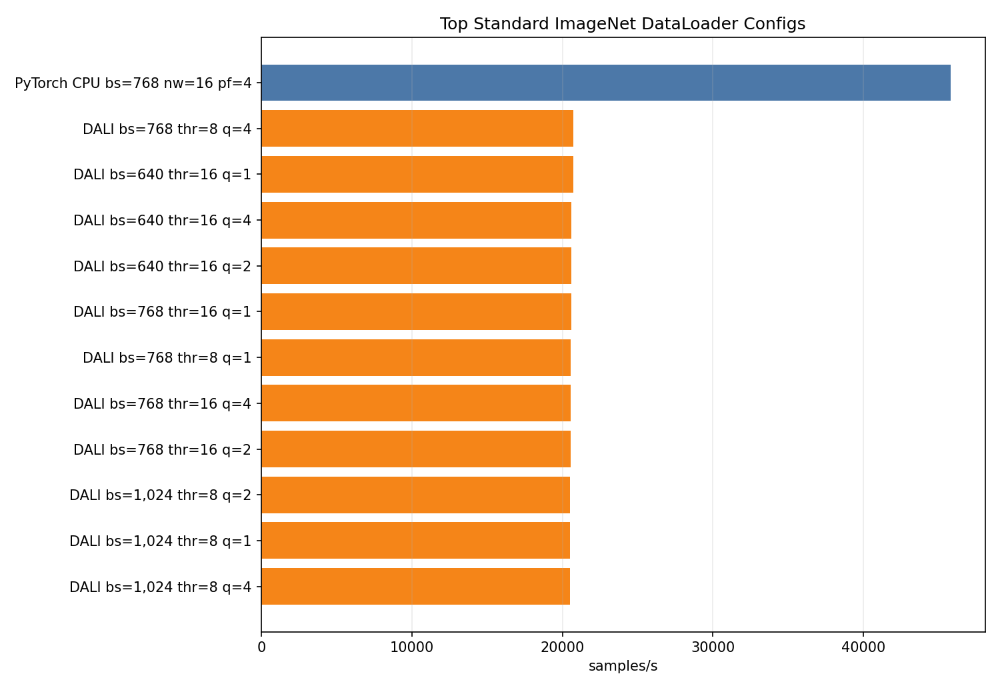
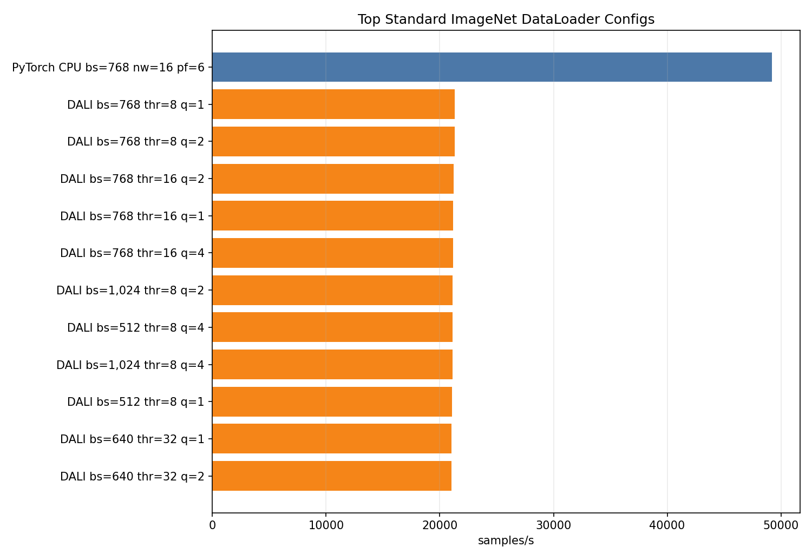

# DataLoader DALI Optimization On Standard ImageNet

<!-- aicr-study-status: published -->

Purpose: tune DALI on canonical ImageNet input before comparing it with the
optimized PyTorch CPU DataLoader baseline.

This is a DataLoader-only endpoint comparison for canonical ImageNet input. It
reports input-pipeline throughput, not training throughput.

## Study Question

The CPU DataLoader studies found strong PyTorch settings for ordinary ImageNet
JPEG input. This study asks the matching DALI question: if the input
representation stays canonical ImageNet, can GPU-side decode and preprocessing
beat a tuned CPU DataLoader?

For this run shape, DALI does not beat the tuned CPU DataLoader. Backend choice
depends on the input representation and amount of per-sample work.

## Run Shape

| Field | Value |
| --- | --- |
| Platforms | B200, RTX Pro 6000 |
| Nodes | `1` |
| GPUs | `8` |
| DataLoader mode | `replicated` |
| Dataset | canonical ImageNet ImageFolder train split |
| Main DALI mode | `random-crop` |
| Batch screen | `512`, `640`, `768`, `1024` |
| DALI thread screen | `8`, `16`, `32` |
| DALI queue screen | `1`, `2`, `4` |
| DALI hardware decoder load | `0.65` |
| Warmup / measured | `100` / `500` batches |
| Tuning screen aggregation | single repeat, finalist selection only |
| Published aggregation | five-repeat Olympic average for CPU anchors and DALI finalists |

The CPU anchor rows reran the previously selected one-node CPU DataLoader
settings on the same nodes used for this study:

| Platform | CPU anchor |
| --- | --- |
| B200 | batch `768`, workers `16`, prefetch `4` |
| RTX Pro 6000 | batch `768`, workers `16`, prefetch `6` |

## Command Run

CPU anchor rows:

```bash
scripts/benchmark/sweep-dataloader.sh \
  --cluster <b200|rtxpro6000> \
  --partition <b200-batch|rtx-batch> \
  --gpu-count 8 \
  --mode replicated \
  --nodelist <b0004|a0003> \
  --repeat-count 5 \
  --input-backend-list pytorch-cpu-dataloader \
  --batch-size-list 768 \
  --num-workers-list 16 \
  --prefetch-factor-list <4|6> \
  --dali-num-threads-list 0 \
  --dali-prefetch-queue-depth-list 2 \
  --dali-decode-mode-list random-crop \
  --dali-hw-decoder-load-list 0.65 \
  --pin-memory-list 1 \
  --persistent-workers-list 1 \
  --cpus-per-task 16 \
  --mem 0 \
  --time 00:45:00 \
  --apply \
  -- --warmup-batches 100 \
     --measured-batches 500 \
     --byte-estimate-sample-count 0
```

DALI tuning screen:

```bash
scripts/benchmark/sweep-dataloader.sh \
  --cluster <b200|rtxpro6000> \
  --partition <b200-batch|rtx-batch> \
  --gpu-count 8 \
  --mode replicated \
  --nodelist <b0004|a0003> \
  --repeat-count 1 \
  --input-backend-list dali-gpu-decode \
  --batch-size-list 512,640,768,1024 \
  --num-workers-list 16 \
  --prefetch-factor-list 4 \
  --dali-num-threads-list 8,16,32 \
  --dali-prefetch-queue-depth-list 1,2,4 \
  --dali-decode-mode-list random-crop \
  --dali-hw-decoder-load-list 0.65 \
  --pin-memory-list 1 \
  --persistent-workers-list 1 \
  --cpus-per-task 16 \
  --mem 0 \
  --time 00:45:00 \
  --apply \
  -- --warmup-batches 100 \
     --measured-batches 500 \
     --byte-estimate-sample-count 0
```

The best DALI finalist per platform was rerun to five repeats. The artifact
bundle includes expanded commands, job IDs, summaries, and provenance.

## Result Summary

| Platform | PyTorch CPU anchor | CPU samples/s | DALI finalist | DALI samples/s | DALI/CPU |
| --- | --- | ---: | --- | ---: | ---: |
| B200 | batch `768`, workers `16`, prefetch `4` | `45,800` | batch `768`, threads `8`, queue `2` | `19,982` | `0.44x` |
| RTX Pro 6000 | batch `768`, workers `16`, prefetch `6` | `49,200` | batch `768`, threads `8`, queue `4` | `20,107` | `0.41x` |

Both platforms show the same lesson: at canonical ImageNet shape, a tuned CPU
DataLoader is substantially faster than the tested DALI `random-crop` path.

## Figures



The B200 figure shows the tuned CPU anchor and the best repeated DALI finalist.



The RTX figure uses the same color and ordering convention for direct platform
comparison.

## Interpretation

DALI tuning matters, but the standard ImageNet workload is too small to
amortize DALI's pipeline overhead in this DataLoader-only loop. The CPU path
keeps decode, crop, normalization, batching, and transfer in a highly parallel
host-worker path and wins clearly at this endpoint.

This does not make DALI a bad backend. It sets the small-image endpoint for the
larger story: CPU wins when online input work is modest; DALI becomes valuable
when per-sample decode and preprocessing work grow.

## Artifact Bundle

| Item | Path |
| --- | --- |
| VAST bundle | `/work/aicr/commissioning/benchmarks/public-study-artifacts/aicr-public/78ac453/dataloader/2026-05-20/dataloader-dali-standard-imagenet-optimization-2026-05-20.tar.gz` |
| VAST provenance | `/work/aicr/commissioning/benchmarks/public-study-artifacts/aicr-public/78ac453/dataloader/2026-05-20/dataloader-dali-standard-imagenet-optimization-2026-05-20-provenance.json` |
| OSN bundle | <https://uma1.osn.mghpcc.org/csim-bmark/public-study-artifacts/aicr-public/78ac453/dataloader/2026-05-20/dataloader-dali-standard-imagenet-optimization-2026-05-20.tar.gz> |
| OSN provenance | <https://uma1.osn.mghpcc.org/csim-bmark/public-study-artifacts/aicr-public/78ac453/dataloader/2026-05-20/dataloader-dali-standard-imagenet-optimization-2026-05-20-provenance.json> |
| OSN checksum | <https://uma1.osn.mghpcc.org/csim-bmark/public-study-artifacts/aicr-public/78ac453/dataloader/2026-05-20/dataloader-dali-standard-imagenet-optimization-2026-05-20.sha256> |
| SHA-256 | `35320228f5671bfa2a5791b1c14edba3662e36fc9180d1da11f2dce028bc0056` |

## Retrieve And Verify

```bash
mkdir -p public-study-artifacts/dataloader-dali-standard-imagenet
cd public-study-artifacts/dataloader-dali-standard-imagenet
wget https://uma1.osn.mghpcc.org/csim-bmark/public-study-artifacts/aicr-public/78ac453/dataloader/2026-05-20/dataloader-dali-standard-imagenet-optimization-2026-05-20.tar.gz
wget https://uma1.osn.mghpcc.org/csim-bmark/public-study-artifacts/aicr-public/78ac453/dataloader/2026-05-20/dataloader-dali-standard-imagenet-optimization-2026-05-20.sha256
sha256sum -c dataloader-dali-standard-imagenet-optimization-2026-05-20.sha256
tar -tzf dataloader-dali-standard-imagenet-optimization-2026-05-20.tar.gz | head
```

## How To Read This Result

- This DALI result is endpoint-specific to canonical ImageNet input.
- It reports DataLoader-only throughput, not training throughput.
- It should be read separately from derived JPEG crossover results.
- The result does not make DALI generally better or generally worse.
