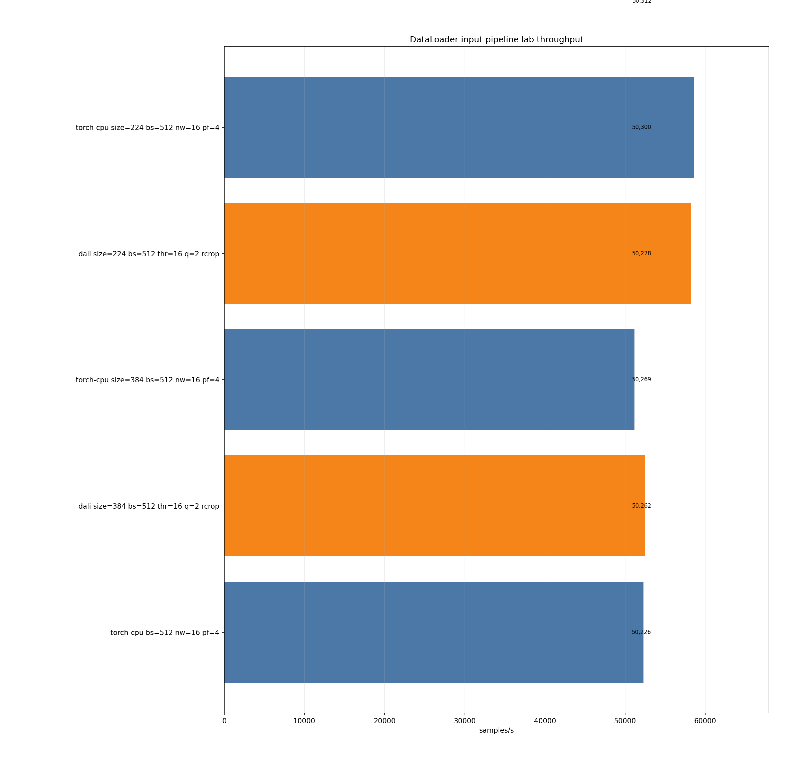
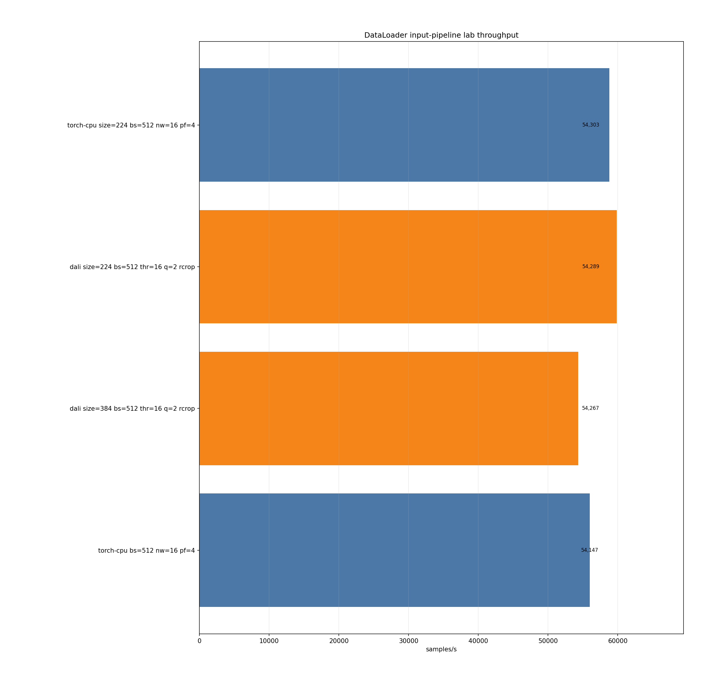
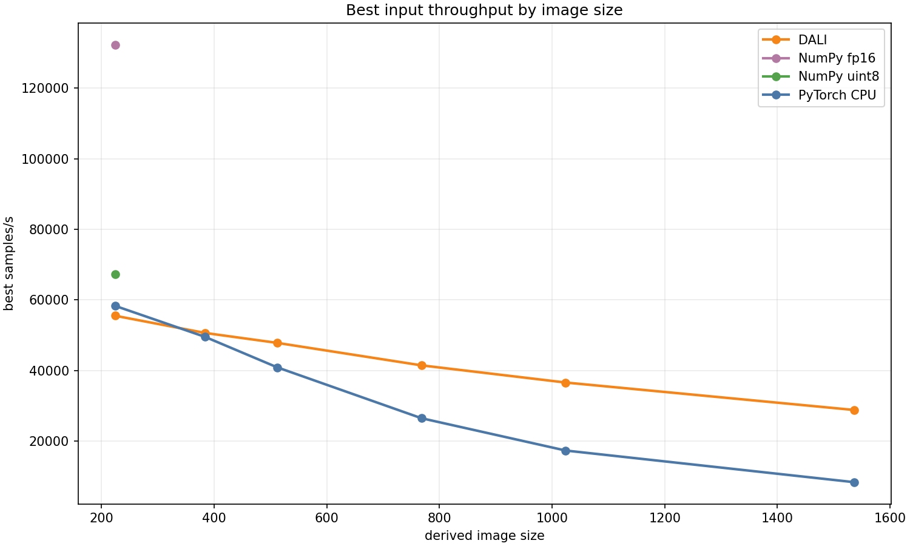
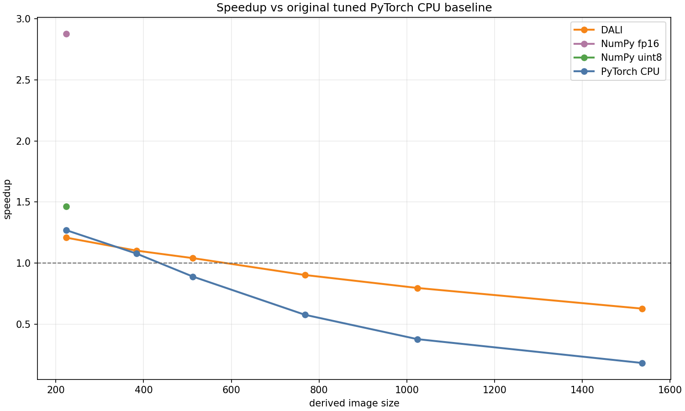
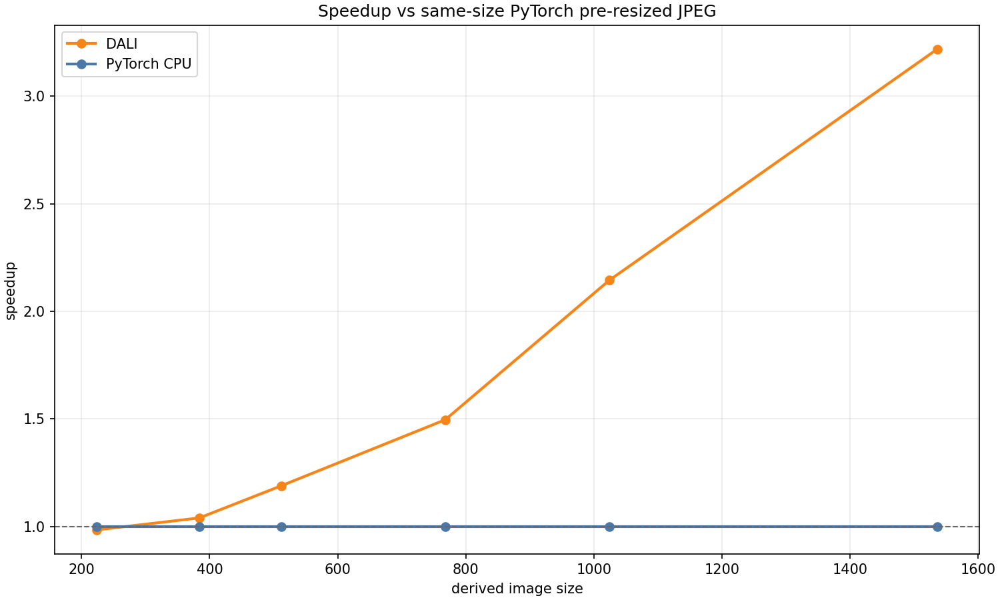

# DataLoader Input Pipeline Lab

<!-- aicr-study-status: appendix -->

Purpose: summarize how DataLoader throughput changes when the input
representation changes while the one-node benchmark shape stays fixed.

**Appendix - Supporting Reference, Not A Standalone Study**

This page is a supporting reference for DataLoader input representations. It
compares input paths under the same one-node, eight-GPU DataLoader-only shape:

- original ImageNet JPEG input;
- ImageNet-derived pre-resized JPEG input;
- prepared NumPy uint8 and fp16 shard inputs;
- prepared per-sample fp16 NumPy file inputs for DALI CPU-reader versus
  DALI NumPy GPU/cuFile reader transport;
- synthetic large JPEG decode-stress input.

The DALI NumPy GPU/cuFile rows describe prepared-tensor transport only. They
are separate from DALI JPEG rows and from DDP training results. The DALI JPEG
rows in this study remain JPEG decode and input-pipeline baselines.

The page shows when DALI starts to help, what prepared inputs remove from the
online path, and why synthetic JPEG rows remain separate from canonical
ImageNet evidence. Related result pages provide endpoint-specific results:
[DataLoader Backend DALI Crossover](backend-dali-crossover.md),
[DALI optimization on standard ImageNet](dali-standard-imagenet-optimization.md),
[Prepared-input ceilings](prepared-input-ceilings.md), and
[Synthetic large JPEG decode stress](synthetic-large-jpeg-decode-stress.md).

## Run Shape

| Field | Value |
| --- | --- |
| Module | `dataloader` |
| Clusters | `b200`, `rtxpro6000` |
| Mode | `replicated` |
| Nodes | `1` |
| GPUs per node | `8` |
| Batch size | `512` |
| Num workers | `16` |
| Prefetch factor | `4` |
| DALI threads | `16` for DALI rows |
| DALI queue depth | `2` for DALI rows |
| DALI decode mode | `random-crop` |
| Warmup batches | `20` |
| Measured batches | `100` |
| Aggregation | five-repeat Olympic aggregates for repeated crossover rows |

Dataset layout and derived-input preparation are documented separately in
[ImageNet Dataset Preparation](../../../resources/imagenet.md) and
[Derived ImageNet Datasets](../derived-datasets.md).

This page uses the earlier `20` warmup / `100` measured timing format. Newer
standalone studies use `100` warmup / `500` measured batches.

## Command Run

The command below shows the representative pre-resized JPEG crossover shape.
The artifact bundle includes expanded commands, job IDs, summaries, and
provenance.

```bash
scripts/benchmark/sweep-dataloader.sh \
  --cluster <b200|rtxpro6000> \
  --profile small \
  --nodes-list 1 \
  --gpu-count 8 \
  --mode replicated \
  --nodelist <node> \
  --input-backend-list pytorch-cpu-dataloader,dali-gpu-decode \
  --batch-size-list 512 \
  --num-workers-list 16 \
  --prefetch-factor-list 4 \
  --dali-num-threads-list 16 \
  --dali-prefetch-queue-depth-list 2 \
  --dali-decode-mode-list random-crop \
  --dali-hw-decoder-load-list 0.65 \
  --cpus-per-task 16 \
  --repeat-count 5 \
  --apply \
  -- --dataset-root /scratch/$USER/aicr-bench/derived-datasets/dataloader-lab/imagenet/train/spc-16-seed-1234/size-<size>/jpeg \
     --derived-root /scratch/$USER/aicr-bench/derived-datasets/dataloader-lab/imagenet/train/spc-16-seed-1234 \
     --derived-image-size <size> \
     --derived-samples-per-class 16 \
     --derived-seed 1234 \
     --warmup-batches 20 \
     --measured-batches 100 \
     --byte-estimate-sample-count 0
```

## Result Summary

Each result block answers a different input-path question, so comparisons
should stay within the same representation and image size unless stated
otherwise.

### Original JPEG Baseline

| Cluster | Backend | Samples/s | Aggregation |
| --- | --- | ---: | --- |
| B200 | PyTorch CPU DataLoader | 47,408 | 5 Olympic |
| RTX Pro 6000 | PyTorch CPU DataLoader | 50,442 | 5 Olympic |

### Pre-Resized JPEG Crossover

Same-size speedup compares DALI with PyTorch CPU DataLoader at the same derived
JPEG size.

The size ladder is intentional. `224` anchors the canonical ResNet/ImageNet
crop shape. `384` and `512` bracket the practical crossover region where DALI
starts to amortize pipeline overhead. `768` and `1024` continue in multiples of
`128` so the stress grows in an easy-to-read progression while image area, and
therefore decode/preprocess work, grows quadratically.

| Size | B200 DALI/PyTorch | RTX DALI/PyTorch |
| ---: | ---: | ---: |
| `224` | `0.952x` | `0.873x` |
| `384` | `1.023x` | `1.027x` |
| `512` | `1.100x` | `1.138x` |
| `768` | `1.507x` | `1.424x` |
| `1024` | `2.032x` | `1.971x` |

DALI is workload-conditional: it is weak or negative at canonical crop size,
crosses near `384`, becomes useful by `512`, and is strong by `768` and
`1024` in this DataLoader-only shape.

This crossover is a JPEG decode/input-pipeline result, not a GDS result. DALI
JPEG rows may use mixed JPEG decode and GPU image operators, but they do not
use the DALI NumPy GPU/cuFile reader path. For the GDS boundary, see
[DALI JPEG And GDS Boundary](../input-pipeline-reference.md#dali-jpeg-and-gds-boundary).

### Prepared-Input Ceilings

| Cluster | NumPy uint8 samples/s | NumPy fp16 samples/s | fp16 aggregation |
| --- | ---: | ---: | --- |
| B200 | 67,226 | 132,261 | 5 Olympic |
| RTX Pro 6000 | 68,099 | 129,452 | 5 Olympic |

The NumPy rows use derived image size `224`. They show the canonical
prepared-input ceiling, not the storage scaling curve for predecoded tensors.

NumPy uint8 shards remove JPEG decode, but runtime normalization still happens
in the measured path. NumPy fp16 shards store normalized NCHW tensors, so both
JPEG decode and normalization have already been paid before the benchmark. That
is why fp16 is a ceiling: it shows how fast a prepared tensor workflow can feed
the loop, but it fixes preprocessing semantics in the dataset.

Larger NumPy sizes would measure storage and memory-bandwidth scaling rather
than the JPEG crossover. They are separate from the DALI crossover result,
which compares runtime JPEG decode and preprocessing at matched JPEG sizes.

### Synthetic Large JPEG Decode Stress

| Size | B200 DALI/PyTorch | RTX DALI/PyTorch |
| ---: | ---: | ---: |
| `512` | `1.169x` | `1.105x` |
| `768` | `1.596x` | `1.546x` |
| `1024` | `2.159x` | `2.106x` |
| `1536` | `3.429x` | `3.415x` |

Synthetic large JPEG rows stress runtime JPEG decode and resize behavior. They
are separate from canonical ImageNet training and from GDS transport results.

## Figures

The plots show the same crossover shape on B200 and RTX Pro 6000. The table
above gives the exact platform values.











## Interpretation

The result should be read with these scope limits:

- Compare DALI against PyTorch CPU DataLoader at the same representation and
  image size.
- Treat NumPy fp16 as a prepared-input ceiling because preprocessing semantics
  are fixed into the stored tensors.
- Keep synthetic large JPEG rows scoped to decode-stress evidence.
- DataLoader-only throughput is not DDP training throughput.

Related DDP result:
[DDP DataLoader candidate follow-up](../../ddp/studies/dataloader-candidate-followup.md).

## Reference Appendices

The pages below split the interpretation by topic.

| Appendix | Use |
| --- | --- |
| [Input representations](input-representations.md) | Glossary for original JPEG, pre-resized JPEG, synthetic large JPEG, NumPy uint8/fp16, and DALI NumPy file input forms. |
| [Backend DALI crossover](backend-dali-crossover.md) | Published same-size backend crossover study for PyTorch CPU DataLoader versus DALI. |
| [Prepared-input ceilings](prepared-input-ceilings.md) | NumPy uint8/fp16 shard interpretation and why fp16 is a ceiling, not a general recipe. |
| [Synthetic large JPEG decode stress](synthetic-large-jpeg-decode-stress.md) | Decode-stress interpretation for large compressed JPEG rows. |

For input-path guidance after reading the study, see
[Input Path Guidance](../input-pipeline-reference.md#input-path-guidance).

## Artifact Bundle

| Artifact | Location |
| --- | --- |
| VAST bundle | `/work/aicr/commissioning/benchmarks/public-study-artifacts/aicr-public/8d17114/dataloader/2026-05-19/dataloader-input-pipeline-lab-2026-05-19.tar.gz` |
| VAST provenance | `/work/aicr/commissioning/benchmarks/public-study-artifacts/aicr-public/8d17114/dataloader/2026-05-19/dataloader-input-pipeline-lab-2026-05-19-provenance.json` |
| OSN bundle | <https://uma1.osn.mghpcc.org/csim-bmark/public-study-artifacts/aicr-public/8d17114/dataloader/2026-05-19/dataloader-input-pipeline-lab-2026-05-19.tar.gz> |
| OSN provenance | <https://uma1.osn.mghpcc.org/csim-bmark/public-study-artifacts/aicr-public/8d17114/dataloader/2026-05-19/dataloader-input-pipeline-lab-2026-05-19-provenance.json> |
| OSN checksum | <https://uma1.osn.mghpcc.org/csim-bmark/public-study-artifacts/aicr-public/8d17114/dataloader/2026-05-19/dataloader-input-pipeline-lab-2026-05-19.sha256> |
| SHA-256 | `bcfd26359e46209e6b455c5a78e9830a24d8ef7cc5d2d33d0d004dab5439c620` |

## Retrieve And Verify

```bash
mkdir -p public-study-artifacts/dataloader-input-pipeline-lab
cd public-study-artifacts/dataloader-input-pipeline-lab
wget https://uma1.osn.mghpcc.org/csim-bmark/public-study-artifacts/aicr-public/8d17114/dataloader/2026-05-19/dataloader-input-pipeline-lab-2026-05-19.tar.gz
wget https://uma1.osn.mghpcc.org/csim-bmark/public-study-artifacts/aicr-public/8d17114/dataloader/2026-05-19/dataloader-input-pipeline-lab-2026-05-19.sha256
sha256sum -c dataloader-input-pipeline-lab-2026-05-19.sha256
tar -tzf dataloader-input-pipeline-lab-2026-05-19.tar.gz | head
```
