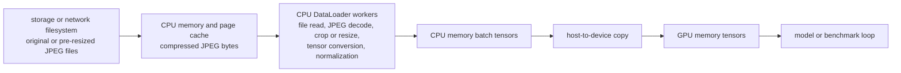
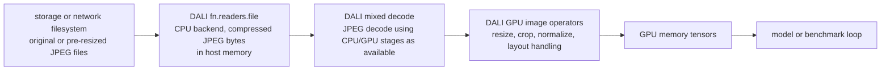
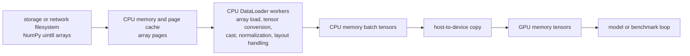
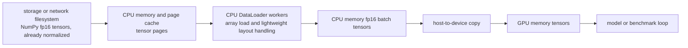
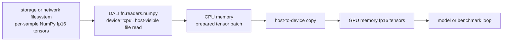
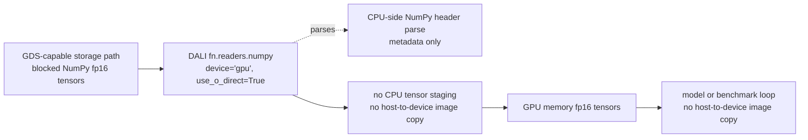
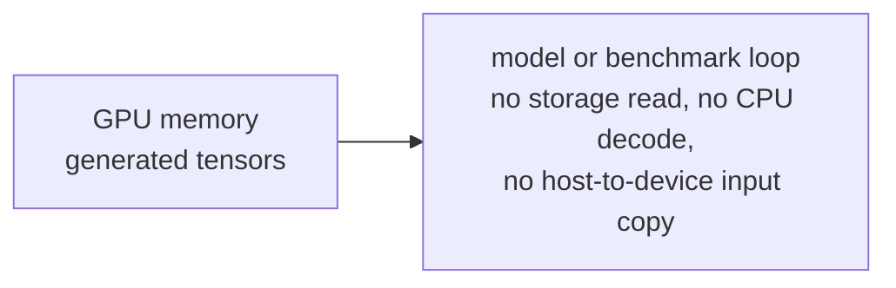
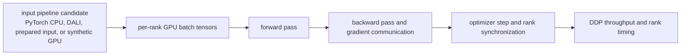

# DataLoader Where The Input Work Lives

Purpose: define the input representations and data paths used across the
DataLoader input-pipeline studies.

This page is the shared reference for DataLoader input-pipeline studies. It
explains what each representation puts on disk, what work remains at runtime,
and how the measured DataLoader paths relate to DDP training studies. It does
not publish a new benchmark result; the linked study pages provide run shape,
artifacts, verification steps, and interpretation.

DataLoader results depend on the input representation. A standard ImageNet
JPEG row measures online file read, JPEG decode, crop or resize,
normalization, batching, and GPU transfer. A prepared NumPy row measures a
different path because some of that work has already been moved offline.

## Representation Map

| Representation | On disk | Runtime work measured | Use in the DataLoader story |
| --- | --- | --- | --- |
| Original ImageNet JPEG | Variable-size ImageNet-style JPEG files. | File read, JPEG decode, crop or resize, tensor conversion, normalization, batch, copy. | Real-input reference for ordinary online ImageNet training recipes. |
| Pre-resized JPEG | Derived square JPEG ImageFolder trees such as `224`, `384`, `512`, `768`, or `1024`. | File read, JPEG decode, normalization, batch, copy. | Controlled JPEG input for studying how image size changes decode and resize pressure. |
| Synthetic large JPEG | Deterministic photo-like JPEG ImageFolder trees at large sizes. | File read, JPEG decode, crop or resize, normalization, batch, copy. | Decode-stress branch for large compressed inputs. |
| NumPy uint8 shards | Derived uint8 tensor shards. | Tensor read, tensor conversion, normalization, batch, copy. | Prepared-input path that removes JPEG decode but keeps normalization in the measured loop. |
| NumPy fp16 shards | Derived normalized fp16 NCHW tensor shards. | Tensor read, lightweight layout handling, batch, copy. | Prepared-input ceiling with decode and most normalization fixed ahead of time. |
| DALI NumPy fp16 files | Derived per-sample normalized fp16 NCHW `.npy` tensors. | DALI NumPy read, DALI NumPy GPU/cuFile reader path when configured, batch handoff; no JPEG decode, and no GDS performance claim without same-node `verify-gds` evidence. | Prepared-tensor GDS probe that compares DALI CPU-reader and GPU/cuFile reader paths; separate from DALI JPEG. |
| DALI NumPy fp16 blocks | Derived normalized fp16 NCHW `.npy` block files with multiple images per file. | DALI NumPy read over larger files, DALI NumPy GPU/cuFile reader path when configured, logical image counting from block contents; no JPEG decode. | Prepared-tensor GDS V2 probe that reduces per-sample file overhead before comparing CPU-reader and GPU/cuFile reader paths; separate from DALI JPEG. |

## How To Read Representation Results

Each representation answers a specific input-pipeline question.

| Representation | Question it answers | What it does not answer |
| --- | --- | --- |
| Original ImageNet JPEG | Which backend is strongest for the ordinary online ImageNet path? | Whether pre-resized, synthetic, or prepared inputs would behave the same way. |
| Pre-resized JPEG | How backend behavior changes when JPEG inputs have a controlled square size. | Whether the result replaces canonical ImageNet evidence. |
| Synthetic large JPEG | How compressed large-image decode pressure affects the input path. | Whether the result is canonical ImageNet training evidence. |
| NumPy uint8 shards | What remains after JPEG decode is moved offline while normalization stays in the measured path. | Whether a normal online augmentation recipe would reach the same throughput. |
| NumPy fp16 shards | What ceiling is visible after decode and most normalization are moved offline. | Whether prepared tensors are the recommended real-input training path. |
| DALI NumPy fp16 files | How prepared fp16 tensor transport changes when DALI reads per-sample `.npy` files through CPU memory versus a GPU/cuFile reader. | Whether the standard DALI JPEG path uses GDS or whether JPEG decode work improves. |
| DALI NumPy fp16 blocks | Whether larger blocked `.npy` files reduce file-open and small-read overhead for the same prepared fp16 transport question. | Whether blocked prepared tensors are a normal ImageNet training recipe or JPEG/GDS evidence. |

The result depends on the input representation. Tuned PyTorch CPU remains the
baseline for ordinary `canonical-224` ImageNet rows, while DALI is strongest
for large derived JPEG rows where decode and image processing dominate.
Prepared NumPy rows are ceiling evidence because they remove work from the
online path before the run starts.

The DALI NumPy GPU/cuFile reader path is specific to prepared fp16 tensor
transport. It is not a replacement for ordinary ImageNet JPEG rows and does
not show that JPEG decode benefits from GDS.

## Data Path Diagrams

The diagrams below show where bytes move and where compute happens. They are
conceptual, but they preserve the boundaries the studies compare: storage
transport, host memory, CPU work, GPU memory, GPU work, and host-to-device
transfer.

The standard DALI JPEG path shown here reads compressed files with DALI's CPU
file reader, then uses a mixed decode path and GPU-side image operators where
available. GDS can move file data directly into GPU memory only for
application paths that are GDS-enabled and configured for that mode; that is
not the normal
`fn.readers.file` ImageNet JPEG path shown here.

In DALI terms, the boundary is explicit. `fn.readers.file` is the JPEG file
reader path and is documented with a CPU backend. `fn.decoders.image` can use a
mixed JPEG decode path with nvJPEG or hardware decode where available, but that
does not make the preceding file read a GDS transfer. The GDS path used in this
module is `fn.readers.numpy(device="gpu", use_o_direct=True)` for prepared
`.npy` tensors. NVIDIA documents the GPU NumPy reader as requiring cuFile/GDS,
and a DALI maintainer has clarified that DALI's GDS support is for the GPU
NumPy reader variant because image decoding still needs initial CPU-side
parsing. See the shared
[DataLoader Input Pipeline Reference](../input-pipeline-reference.md#dali-jpeg-and-gds-boundary)
for source links.

### PyTorch CPU DataLoader With JPEG

### DALI With JPEG

DALI JPEG is an image decode/input-pipeline baseline, not a GDS path. It may
benefit from mixed JPEG decode and GPU image operators, but cuFile/GDS claims
require an explicitly configured and verified cuFile reader path.

### NumPy uint8 Prepared Images

### NumPy fp16 Prepared Tensors

### DALI NumPy fp16 Prepared Tensors Through CPU Reader

### DALI NumPy fp16 Prepared Tensor Blocks With GPU/cuFile

This path represents a GDS result only when the storage stack, driver, and DALI
NumPy reader are configured for GPU direct reads and cuFile logs confirm the
runtime path. It is separate from the DALI JPEG path.

Prepared NumPy transport results do not make per-sample `.npy` files a general
training representation and do not change the JPEG-path interpretation.

### Synthetic GPU Input

Synthetic GPU input is a ceiling path, not a dataset strategy.

### DDP Training Path

DataLoader studies measure the input path. DDP studies report end-to-end
training throughput for selected input candidates.

## Related DDP Study

Related DDP result:
[DDP DataLoader candidate follow-up](../../ddp/studies/dataloader-candidate-followup.md).
