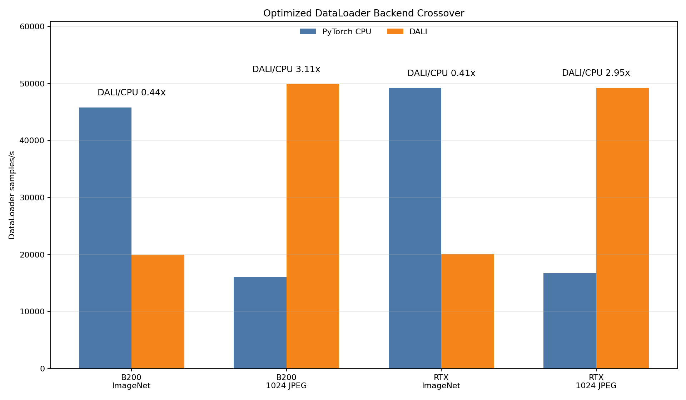

# Optimized 224/1024 Backend Crossover

<!-- aicr-study-status: published -->

Purpose: compare PyTorch CPU DataLoader and DALI after each backend has been
tuned at the small and large image endpoints.

This is a DataLoader-only endpoint comparison. It reports input-pipeline
throughput for the tuned endpoint choices later used in DDP training studies.

## Study Question

The fixed-config crossover holds settings constant and shows where DALI begins
to beat PyTorch CPU DataLoader as derived JPEG size grows. This study asks the
same question after each backend is tuned for the endpoint it is asked to run.

The endpoints are intentionally far apart:

- canonical ImageNet shape, where ordinary online JPEG work is small;
- derived `1024` JPEG, where image payload, decode, crop, and transfer work are
  much larger.

The large endpoint uses finalists from two focused tuning studies:
[CPU PyTorch DataLoader optimization at 1024](cpu-large-image-optimization.md)
and [DALI optimization at 1024](dali-large-image-optimization.md).

## Run Shape

| Field | Standard ImageNet endpoint | Large derived JPEG endpoint |
| --- | --- | --- |
| Platforms | B200, RTX Pro 6000 | B200, RTX Pro 6000 |
| Nodes | `1` | `1` |
| GPUs | `8` | `8` |
| DataLoader mode | `replicated` | `replicated` |
| Dataset | canonical ImageNet ImageFolder train split | pre-resized ImageNet-derived JPEG ImageFolder |
| Size | canonical training crop shape | `1024` |
| Backends | tuned PyTorch CPU, tuned DALI | tuned PyTorch CPU, tuned DALI |
| Warmup / measured | `100` / `500` batches | `100` / `500` batches for finalists |
| Aggregation | five-repeat Olympic average | five-repeat Olympic average |

## Command Run

The standard ImageNet endpoint uses the finalist rows from
[DALI optimization on standard ImageNet](dali-standard-imagenet-optimization.md).
The large endpoint uses finalists from
[CPU PyTorch DataLoader optimization at 1024](cpu-large-image-optimization.md)
and [DALI optimization at 1024](dali-large-image-optimization.md), with
explicit derived JPEG roots:

```bash
scripts/benchmark/sweep-dataloader.sh \
  --cluster <b200|rtxpro6000> \
  --partition <b200-batch|rtx-batch> \
  --gpu-count 8 \
  --mode replicated \
  --nodelist <b0004|a0003> \
  --repeat-count 5 \
  --input-backend-list <pytorch-cpu-dataloader|dali-gpu-decode> \
  --batch-size-list <384|768> \
  --num-workers-list 16 \
  --prefetch-factor-list <4|8> \
  --dali-num-threads-list <0|8> \
  --dali-prefetch-queue-depth-list <1|2> \
  --dali-decode-mode-list random-crop \
  --dali-hw-decoder-load-list 0.65 \
  --pin-memory-list 1 \
  --persistent-workers-list 1 \
  --cpus-per-task 16 \
  --mem-list 0 \
  --time 00:35:00 \
  --apply \
  -- --dataset-root /scratch/$USER/aicr-bench/studies/dataloader-ddp-v1/imagenet/train/spc-16-seed-1234/size-1024/jpeg \
     --derived-root /scratch/$USER/aicr-bench/studies/dataloader-ddp-v1/imagenet/train/spc-16-seed-1234 \
     --derived-image-size 1024 \
     --derived-samples-per-class 16 \
     --derived-seed 1234 \
     --warmup-batches 100 \
     --measured-batches 500 \
     --byte-estimate-sample-count 0
```

The artifact bundle includes expanded commands, job IDs, summaries, and
provenance.

## Result Summary

| Platform | Endpoint | Best CPU config | CPU samples/s | Best DALI config | DALI samples/s | DALI/CPU |
| --- | --- | --- | ---: | --- | ---: | ---: |
| B200 | ImageNet | batch `768`, workers `16`, prefetch `4` | `45,800` | batch `768`, threads `8`, queue `2` | `19,982` | `0.44x` |
| B200 | `1024` JPEG | batch `384`, workers `16`, prefetch `4` | `16,048` | batch `768`, threads `8`, queue `2` | `49,911` | `3.11x` |
| RTX Pro 6000 | ImageNet | batch `768`, workers `16`, prefetch `6` | `49,200` | batch `768`, threads `8`, queue `4` | `20,107` | `0.41x` |
| RTX Pro 6000 | `1024` JPEG | batch `384`, workers `16`, prefetch `8` | `16,719` | batch `768`, threads `8`, queue `1` | `49,257` | `2.95x` |

## Figure



The figure uses one color per backend and separates the standard ImageNet
endpoint from the derived `1024` JPEG endpoint. It is a DataLoader-only
comparison.

## Interpretation

The crossover is real, but it is not a property of the backend alone. It is a
property of the backend, input representation, image size, and tuned settings.

At the standard ImageNet endpoint, CPU workers are faster: the per-sample
decode and preprocessing work is modest, and DALI's pipeline overhead is not
amortized. At the `1024` endpoint, DALI is roughly three times faster in the
DataLoader-only loop because the input path contains much more work per sample.
The derived JPEG crossover evidence, including any derived `224` row, is
input-representation evidence; it does not replace the canonical ImageNet
result.

The endpoint result is backend-specific:

- use PyTorch CPU DataLoader at the small endpoint;
- use DALI at the large endpoint;
- evaluate the selected candidates separately in DDP training.

## Artifact Bundle

| Item | Path |
| --- | --- |
| VAST bundle | `/work/aicr/commissioning/benchmarks/public-study-artifacts/aicr-public/78ac453/dataloader/2026-05-20/dataloader-optimized-224-1024-backend-crossover-2026-05-20.tar.gz` |
| VAST provenance | `/work/aicr/commissioning/benchmarks/public-study-artifacts/aicr-public/78ac453/dataloader/2026-05-20/dataloader-optimized-224-1024-backend-crossover-2026-05-20-provenance.json` |
| OSN bundle | <https://uma1.osn.mghpcc.org/csim-bmark/public-study-artifacts/aicr-public/78ac453/dataloader/2026-05-20/dataloader-optimized-224-1024-backend-crossover-2026-05-20.tar.gz> |
| OSN provenance | <https://uma1.osn.mghpcc.org/csim-bmark/public-study-artifacts/aicr-public/78ac453/dataloader/2026-05-20/dataloader-optimized-224-1024-backend-crossover-2026-05-20-provenance.json> |
| OSN checksum | <https://uma1.osn.mghpcc.org/csim-bmark/public-study-artifacts/aicr-public/78ac453/dataloader/2026-05-20/dataloader-optimized-224-1024-backend-crossover-2026-05-20.sha256> |
| SHA-256 | `cf6dd17ff8ccea92b0e12861b7fe4708c08b208df09dc6ebaaff765e1eb907d6` |

## Retrieve And Verify

```bash
mkdir -p public-study-artifacts/dataloader-optimized-crossover
cd public-study-artifacts/dataloader-optimized-crossover
wget https://uma1.osn.mghpcc.org/csim-bmark/public-study-artifacts/aicr-public/78ac453/dataloader/2026-05-20/dataloader-optimized-224-1024-backend-crossover-2026-05-20.tar.gz
wget https://uma1.osn.mghpcc.org/csim-bmark/public-study-artifacts/aicr-public/78ac453/dataloader/2026-05-20/dataloader-optimized-224-1024-backend-crossover-2026-05-20.sha256
sha256sum -c dataloader-optimized-224-1024-backend-crossover-2026-05-20.sha256
tar -tzf dataloader-optimized-224-1024-backend-crossover-2026-05-20.tar.gz | head
```

## How To Read This Result

- The table reports DataLoader-only throughput, not training throughput.
- The backend choice is endpoint-specific: PyTorch CPU is stronger at the
  standard ImageNet endpoint, while DALI is stronger at the derived `1024`
  JPEG endpoint.
- Canonical ImageNet rows and derived JPEG rows are different input
  representations and should be read with their endpoint labels.
- The page compares two endpoints; it is not a full repeated size ladder.

## Related Training Study

Related DDP result:
[DDP DataLoader candidate follow-up](../../ddp/studies/dataloader-candidate-followup.md).
That page carries the tuned `224` CPU and `1024` DALI endpoint candidates into
ResNet-50 training.
