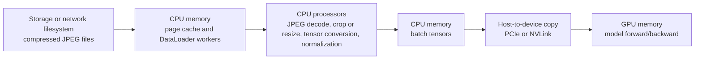
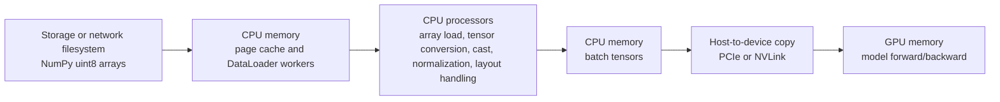
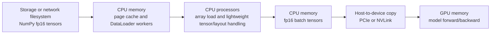
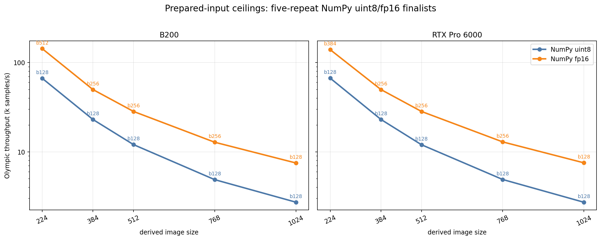
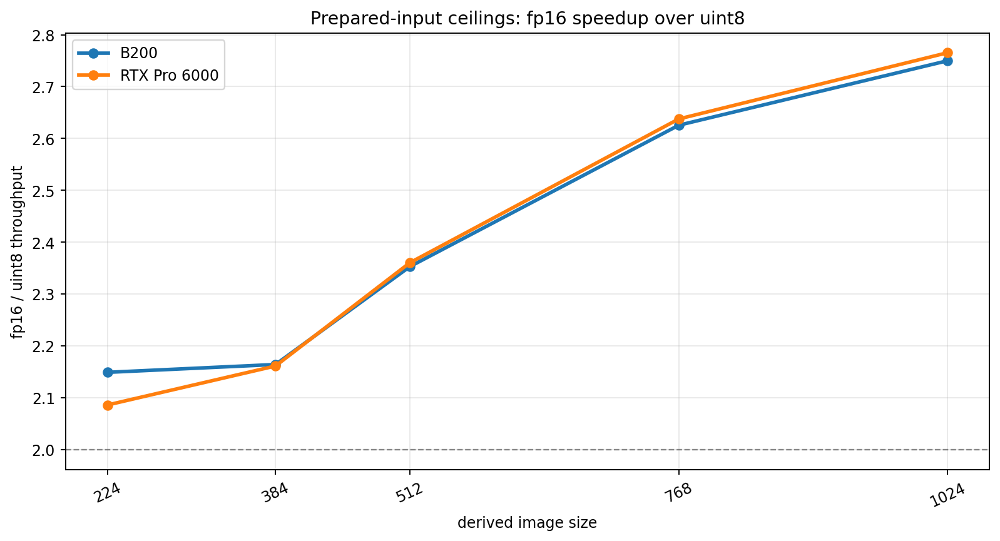
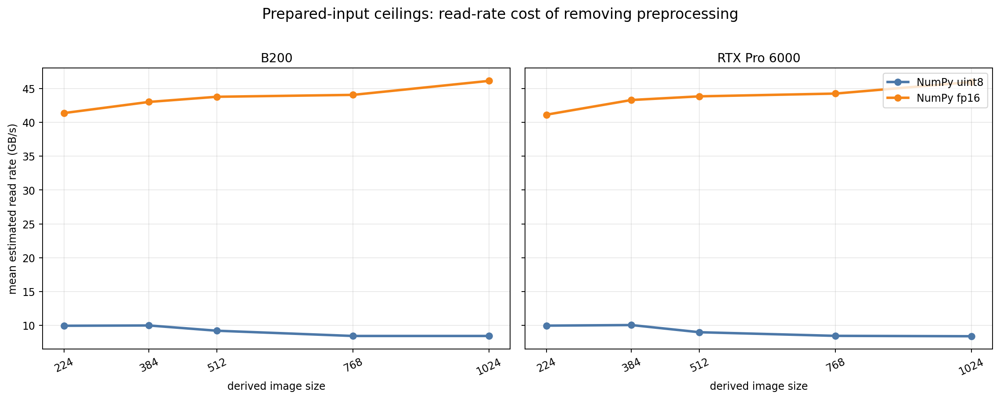

# Prepared-Input Ceilings

<!-- aicr-study-status: published -->

Purpose: study whether paying offline preprocessing and storing larger derived
inputs can remove enough online input work to justify the storage trade.

This is a DataLoader-only prepared-input ceiling study: it measures how much
throughput improves when JPEG decode and tensor preparation are moved offline.

## Study Question

The CPU and DALI studies ask where online JPEG decode and preprocessing should
run. Prepared-input studies ask a different question: can a workflow pay an
offline preprocessing cost once, store a larger derived dataset, and save
enough online CPU or GPU preprocessing time during repeated runs to make that
trade worthwhile?

Two prepared paths matter:

- **NumPy uint8:** image-shaped bytes are prepared, so JPEG decode is removed,
  but runtime tensor conversion, cast, normalization, batching, and
  host-to-device copy remain. This is the realistic "predecoded images" path
  when storage is cheap enough and runtime normalization still belongs in the
  measured job.
- **NumPy fp16:** tensor payloads are prepared, so JPEG decode, resize, cast,
  and most normalization are already paid before the run. This is a ceiling
  path, not a general online augmentation recipe, because preprocessing
  semantics are fixed in the stored tensors.

The study output is a decision framework: compare storage footprint, read
bandwidth, CPU utilization, GPU wait time, and, in a later DDP follow-up,
training throughput. If prepared inputs improve repeated training enough, they
may be worth preserving. If not, canonical JPEG plus a tuned PyTorch or DALI
path is cleaner.

## Run Shape

| Field | Value |
| --- | --- |
| Platforms | B200, RTX Pro 6000 |
| Nodes | `1` |
| GPUs | `8` |
| DataLoader mode | `replicated` |
| Input formats | NumPy uint8 shards, NumPy fp16 shards |
| Derived sizes | `224`, `384`, `512`, `768`, `1024` |
| Derived subset | `spc-16` (16 samples per ImageNet class), seed `1234` |
| Batch screen | `128`, `256`, `384`, `512` |
| Workers / prefetch | `16` / `4` |
| Warmup / measured | `100` / `500` batches |
| Published aggregation | five-repeat Olympic average for finalist rows |

The screen uses the same ImageNet-derived sample count for both platforms so
the first question is about data representation and payload size, not about a
different data subset.

## Data Paths

Prepared inputs split the input pipeline into visible places where bytes move
and compute happens: storage, host memory, host CPU work, GPU memory, and GPU
compute.

JPEG input keeps compression on disk and pays image decode during the run:



NumPy uint8 shards remove JPEG decode but still leave tensor preparation in the
hot path:



NumPy fp16 shards move most preprocessing offline. The run still reads bytes
from storage into host memory and copies tensors to the GPU, but decode,
normalization, and most conversion work are already paid before the job starts:



The prepared-input question is where the bottleneck moves. If uint8 is much
faster than JPEG, JPEG decode and image preparation were expensive. If fp16 is
much faster than uint8, runtime conversion and normalization still mattered.
If either path stops improving at larger image sizes, storage bytes, host
memory traffic, or host-to-device transfer may have replaced decode as the
limiter.

## Command Run

Derived data preparation:

```bash
scripts/benchmark/submit-dataloader-derived-dataset.sh \
  --dataset-root /work/<imagenet-root> \
  --derived-root /scratch/$USER/aicr-bench/studies/dataloader-ddp-v1 \
  --samples-per-class 16 \
  --image-size-list 224,384,512,768,1024 \
  --formats numpy-uint8,numpy-fp16 \
  --partition cpu \
  --time 04:00:00 \
  --write \
  --apply
```

DataLoader screen:

```bash
scripts/benchmark/sweep-dataloader.sh \
  --cluster <b200|rtxpro6000> \
  --partition <b200-batch|rtx-batch> \
  --gpu-count 8 \
  --mode replicated \
  --nodelist <node> \
  --repeat-count 1 \
  --input-backend-list numpy-uint8-shards,numpy-fp16-shards \
  --batch-size-list 128,256,384,512 \
  --num-workers-list 16 \
  --prefetch-factor-list 4 \
  --dali-num-threads-list 0 \
  --dali-prefetch-queue-depth-list 2 \
  --dali-decode-mode-list random-crop \
  --dali-hw-decoder-load-list 0.65 \
  --pin-memory-list 1 \
  --persistent-workers-list 1 \
  --cpus-per-task 16 \
  --mem-list 0 \
  --apply \
  -- --dataset-root /work/<imagenet-root> \
     --derived-root /scratch/$USER/aicr-bench/studies/dataloader-ddp-v1 \
     --derived-image-size <size> \
     --derived-samples-per-class 16 \
     --derived-seed 1234 \
     --warmup-batches 100 \
     --measured-batches 500 \
     --byte-estimate-sample-count 0
```

Finalist rows were rerun four additional times, using the screen row as repeat
one, so each published comparison has five repeats and Olympic aggregation.
The derived root is the study root. The DataLoader module resolves the concrete
format path under `imagenet/train/spc-16-seed-1234/size-<size>/<format>`.

## Result Summary

Published rows use `16` workers, prefetch `4`, warmup `100`, measured `500`,
and five-repeat Olympic aggregation.

| Platform | Size | Best uint8 row | uint8 samples/s | Best fp16 row | fp16 samples/s | fp16/uint8 |
| --- | ---: | --- | ---: | --- | ---: | ---: |
| B200 | `224` | batch `128` | `66,626` | batch `512` | `143,202` | `2.15x` |
| B200 | `384` | batch `128` | `23,023` | batch `256` | `49,832` | `2.16x` |
| B200 | `512` | batch `128` | `12,035` | batch `256` | `28,321` | `2.35x` |
| B200 | `768` | batch `128` | `4,874` | batch `256` | `12,797` | `2.63x` |
| B200 | `1024` | batch `128` | `2,725` | batch `128` | `7,494` | `2.75x` |
| RTX Pro 6000 | `224` | batch `128` | `66,861` | batch `384` | `139,500` | `2.09x` |
| RTX Pro 6000 | `384` | batch `128` | `23,053` | batch `256` | `49,831` | `2.16x` |
| RTX Pro 6000 | `512` | batch `128` | `11,992` | batch `256` | `28,309` | `2.36x` |
| RTX Pro 6000 | `768` | batch `128` | `4,893` | batch `256` | `12,906` | `2.64x` |
| RTX Pro 6000 | `1024` | batch `128` | `2,720` | batch `128` | `7,523` | `2.77x` |

The result is deliberately not "larger batch always wins." Prepared tensors
are already large. For uint8, batch `128` is the stable winner at every size in
this evidence set. For fp16, batch `256` wins through the middle sizes, while
the endpoints choose `512`, `384`, or `128` depending on platform and payload.

The batch-size screen also sets a practical scope boundary: for `1024` NumPy
uint8, batches `256`, `384`, and `512` failed on both platforms with PyTorch
DataLoader worker bus errors, consistent with shared-memory pressure. The
published table does not treat those failures as negative throughput evidence;
it uses them only to justify selecting the passing batch `128` finalist for the
`1024` uint8 row.

## Storage Footprint

The storage trade is explicit. For this `spc-16` subset, fp16 uses about twice
the storage of uint8 at every size.

| Size | uint8 sample bytes | uint8 dataset GiB | fp16 sample bytes | fp16 dataset GiB |
| ---: | ---: | ---: | ---: | ---: |
| `224` | `150,536` | `2.24` | `301,064` | `4.49` |
| `384` | `442,376` | `6.59` | `884,744` | `13.18` |
| `512` | `786,440` | `11.72` | `1,572,872` | `23.44` |
| `768` | `1,769,480` | `26.37` | `3,538,952` | `52.73` |
| `1024` | `3,145,736` | `46.88` | `6,291,464` | `93.75` |

The fp16 path can be faster even though it reads more bytes because it removes
more CPU-side preparation. The read-rate figure makes the trade visible: fp16
best rows pull much more data from storage, while uint8 best rows read fewer
bytes but still spend runtime work on CPU-side tensor preparation.

## Figures



The finalist-throughput figure uses the five-repeat Olympic aggregate for each
published row. The labels show the winning batch size at each platform, size,
and prepared format.



The speedup figure compares fp16 against uint8 at the same platform and image
size. It shows that removing more online preparation becomes more valuable as
the prepared image area grows.



The read-rate figure shows the ceiling moving from decode and CPU preparation
toward storage and memory bandwidth as preprocessing is baked into the input.

## Interpretation

Prepared inputs can be a real workflow choice, not only a benchmark trick. A
team that trains repeatedly on a stable preprocessed view of a dataset may
choose to pay an offline preprocessing cost and store a larger derived dataset
if it saves enough online input time.

The two NumPy formats answer different operational questions:

- use uint8 to ask what happens when JPEG decode is removed but runtime tensor
  preparation remains;
- use fp16 to ask how high the input path can go when decode, resize, cast,
  and most normalization are already paid offline.

That distinction matters. NumPy uint8 is closer to a reusable predecoded image
dataset. NumPy fp16 is a ceiling or special-purpose recipe because it fixes the
preprocessing policy into the stored tensors.

## Artifact Bundle

The public artifact bundle includes the supporting files for this study.

| Item | Location |
| --- | --- |
| VAST bundle | `/work/aicr/commissioning/benchmarks/public-study-artifacts/aicr-public/bda5b72/dataloader/2026-05-20/dataloader-prepared-input-ceilings-2026-05-20.tar.gz` |
| VAST provenance | `/work/aicr/commissioning/benchmarks/public-study-artifacts/aicr-public/bda5b72/dataloader/2026-05-20/dataloader-prepared-input-ceilings-2026-05-20-provenance.json` |
| OSN bundle | <https://uma1.osn.mghpcc.org/csim-bmark/public-study-artifacts/aicr-public/bda5b72/dataloader/2026-05-20/dataloader-prepared-input-ceilings-2026-05-20.tar.gz> |
| OSN provenance | <https://uma1.osn.mghpcc.org/csim-bmark/public-study-artifacts/aicr-public/bda5b72/dataloader/2026-05-20/dataloader-prepared-input-ceilings-2026-05-20-provenance.json> |
| OSN checksum | <https://uma1.osn.mghpcc.org/csim-bmark/public-study-artifacts/aicr-public/bda5b72/dataloader/2026-05-20/dataloader-prepared-input-ceilings-2026-05-20.sha256> |
| SHA256 | `91ad146c798edb08ad267e7a1651867c650769ddf201e5b6fa24b1384f705962` |

The bundle includes rendered Markdown, screen CSV/JSON, finalist aggregate
CSV/JSON, figures, exact commands, job IDs, provenance, and checksum.

## Retrieve And Verify

```bash
mkdir -p public-study-artifacts/dataloader-prepared-input-ceilings
cd public-study-artifacts/dataloader-prepared-input-ceilings
wget https://uma1.osn.mghpcc.org/csim-bmark/public-study-artifacts/aicr-public/bda5b72/dataloader/2026-05-20/dataloader-prepared-input-ceilings-2026-05-20.tar.gz
wget https://uma1.osn.mghpcc.org/csim-bmark/public-study-artifacts/aicr-public/bda5b72/dataloader/2026-05-20/dataloader-prepared-input-ceilings-2026-05-20.sha256
sha256sum -c dataloader-prepared-input-ceilings-2026-05-20.sha256
tar -tzf dataloader-prepared-input-ceilings-2026-05-20.tar.gz | head
```

## How To Read This Result

- NumPy fp16 is a prepared-input ceiling, not a general training recipe.
- NumPy uint8 removes JPEG decode but still does runtime tensor preparation.
- Larger NumPy sizes can become storage and memory-bandwidth studies rather
  than backend decode studies.
- DataLoader-only throughput is not DDP training throughput.
