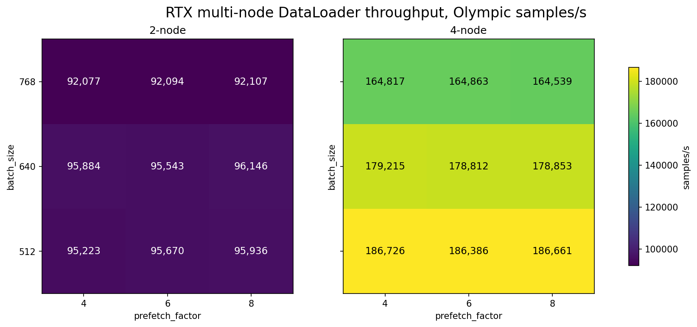
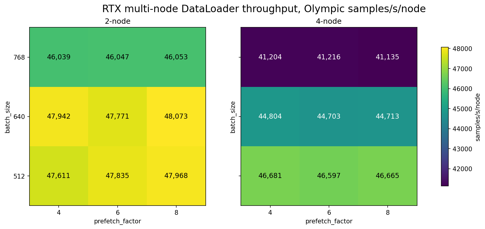
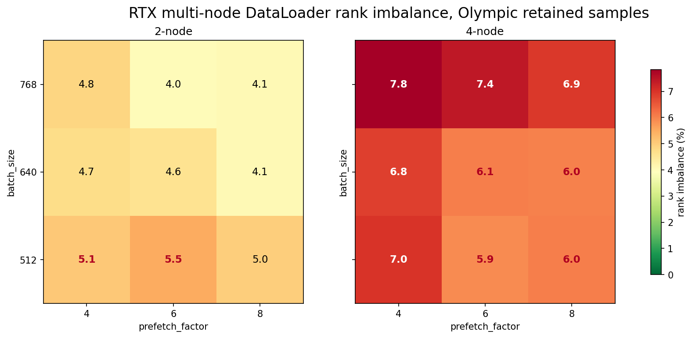
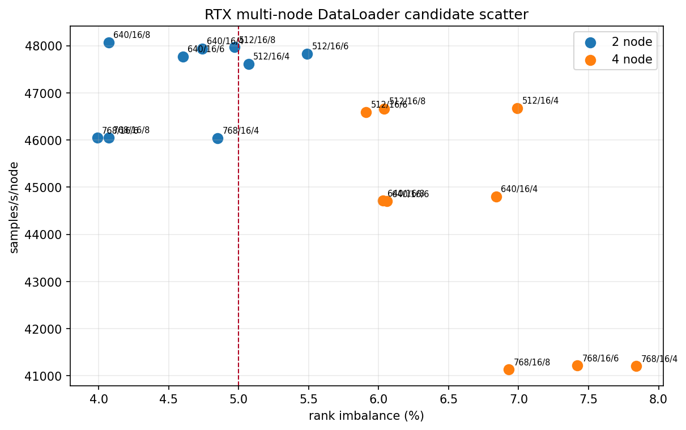
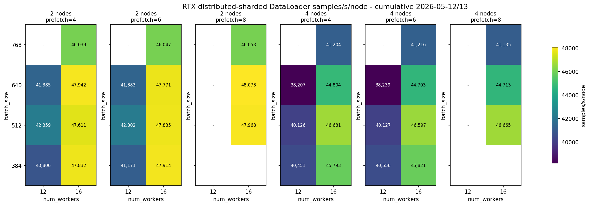
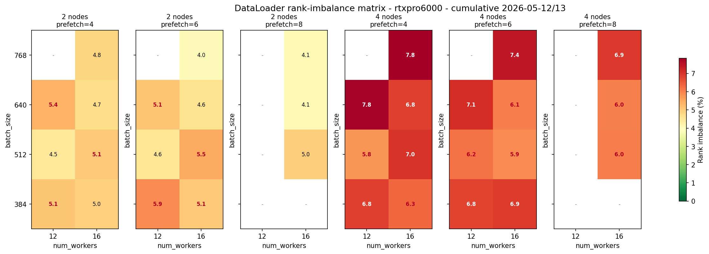
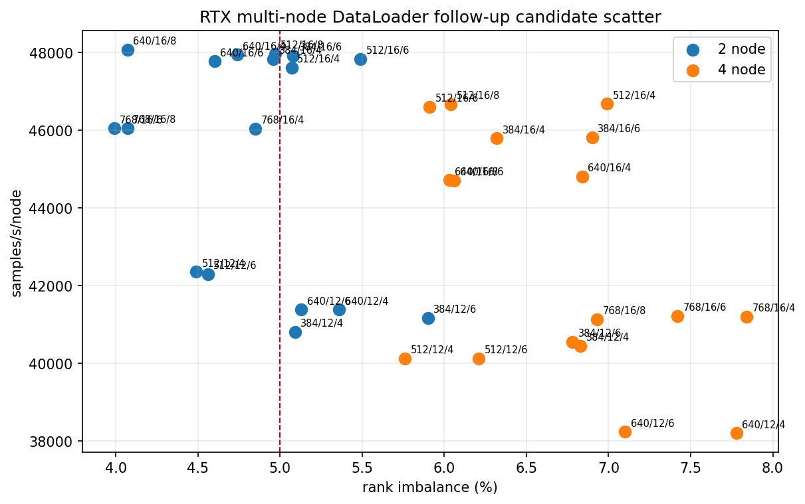

# DataLoader RTX Multi-Node Parameter Selection

<!-- aicr-study-status: published -->


Purpose: report the RTX distributed-sharded DataLoader two-node and four-node
parameter-selection study that follows RTX single-GPU and one-node validation.

It reports the RTX multi-node DataLoader campaign. The
first pass established the `512/640/768`, `num_workers=16`,
`prefetch_factor=4/6/8` scale surface. The follow-up pass added
`batch_size=384` and `num_workers=12` comparisons. The resulting 2/4/8-node
scale probe is reported separately in
[RTX 2/4/8-node DataLoader scale probe](rtx-multinode-scale-probe.md).

## Command Run

First stage:

```bash
scripts/benchmark/sweep-dataloader.sh \
  --cluster rtxpro6000 \
  --profile medium \
  --nodes-list 2,4 \
  --gpu-count 8 \
  --mode distributed-sharded \
  --nodelist a0002,a0003,a0004,a0005 \
  --batch-size-list 512,640,768 \
  --num-workers-list 16 \
  --prefetch-factor-list 4,6,8 \
  --pin-memory-list 1 \
  --persistent-workers-list 1 \
  --cpus-per-task 16 \
  --repeat-count 5 \
  --apply \
  -- --warmup-batches 100 --measured-batches 500 --byte-estimate-sample-count 0
```

Follow-up balance pass:

```bash
scripts/benchmark/sweep-dataloader.sh \
  --cluster rtxpro6000 \
  --profile medium \
  --nodes-list 2,4 \
  --gpu-count 8 \
  --mode distributed-sharded \
  --nodelist a0002,a0003,a0004,a0005 \
  --batch-size-list 384,512,640 \
  --num-workers-list 12,16 \
  --prefetch-factor-list 4,6 \
  --pin-memory-list 1 \
  --persistent-workers-list 1 \
  --cpus-per-task 16 \
  --repeat-count 5 \
  --apply \
  -- --warmup-batches 100 --measured-batches 500 --byte-estimate-sample-count 0
```

## Result Summary

The intended campaign completed cleanly as runtime evidence:

| Field | Value |
| --- | --- |
| Cluster | `rtxpro6000` |
| Mode | `distributed-sharded` |
| Node groups | `2` nodes: `a0002,a0003`; `4` nodes: `a0002,a0003,a0004,a0005` |
| First-stage batch sizes | `512,640,768` |
| First-stage num workers | `16` |
| First-stage prefetch factors | `4,6,8` |
| Follow-up batch sizes | `384,512,640` |
| Follow-up num workers | `12,16` |
| Follow-up prefetch factors | `4,6` |
| Pin memory / persistent workers | `1` / `1` |
| CPUs per task | `16` |
| Warmup / measured batches | `100` / `500` |
| Repeats | `5` |
| Aggregation | Olympic average, dropping lowest and highest throughput from five repeats |

The first-stage rows remain part of the study. The follow-up rows do not replace
them; they answer the next question: whether lower batch size or lower worker
count gives RTX better four-node balance before an eight-node run.

## Campaign Stages

| Stage | Purpose | Result |
| --- | --- | --- |
| First stage | Test `512/640/768`, `16` workers, `prefetch_factor=4/6/8` on 2 and 4 RTX nodes. | 90/90 summaries passed. Two-node rows were clean; four-node rows scaled throughput but exceeded the `5%` retained rank-imbalance threshold. |
| Follow-up balance pass | Add `384` batch size and `12` worker comparisons while keeping the strongest `16` worker rows visible. | The best four-node throughput stayed at `512/16/{4,6}`. The lower-worker rows reduced throughput substantially and did not fix four-node imbalance. |

The two-node rows are cleanest with `num_workers=16`. The strongest two-node
region remains around `batch_size=640`, while the four-node rows favor
`batch_size=512` for total throughput.

Four-node throughput scales strongly, but every tested four-node configuration
is above the `5%` retained rank-imbalance threshold. That makes this a useful
parameter-selection result, but not yet a final DDP handoff setting.

## First-Stage Aggregated Results

Repeated configuration rows use Olympic aggregation. `Jitter` is the retained
throughput range after dropping the lowest and highest throughput samples.
`Samples/s/node` normalizes the headline throughput by node count so the
two-node and four-node rows can be compared directly.

| Nodes | Batch | Workers | Prefetch | Samples | Included | Samples/s | Samples/s/node | Jitter | Rank imbalance % |
| ---: | ---: | ---: | ---: | ---: | ---: | ---: | ---: | ---: | ---: |
| 2 | 512 | 16 | 4 | 5 | 3 | 95,633.09 | 47,816.55 | 408.16 | 5.20 |
| 2 | 512 | 16 | 6 | 5 | 3 | 95,930.55 | 47,965.27 | 195.44 | 5.07 |
| 2 | 512 | 16 | 8 | 5 | 3 | 95,936.31 | 47,968.16 | 167.69 | 4.97 |
| 2 | 640 | 16 | 4 | 5 | 3 | 96,227.14 | 48,113.57 | 240.49 | 4.59 |
| 2 | 640 | 16 | 6 | 5 | 3 | 96,052.84 | 48,026.42 | 326.38 | 4.15 |
| 2 | 640 | 16 | 8 | 5 | 3 | 96,145.91 | 48,072.95 | 404.00 | 4.07 |
| 2 | 768 | 16 | 4 | 5 | 3 | 92,077.15 | 46,038.57 | 138.21 | 4.85 |
| 2 | 768 | 16 | 6 | 5 | 3 | 92,094.10 | 46,047.05 | 203.24 | 3.99 |
| 2 | 768 | 16 | 8 | 5 | 3 | 92,106.62 | 46,053.31 | 58.31 | 4.07 |
| 4 | 512 | 16 | 4 | 5 | 3 | 186,031.73 | 46,507.93 | 998.93 | 6.20 |
| 4 | 512 | 16 | 6 | 5 | 3 | 186,832.46 | 46,708.12 | 1,060.02 | 5.82 |
| 4 | 512 | 16 | 8 | 5 | 3 | 186,660.60 | 46,665.15 | 1,307.63 | 6.04 |
| 4 | 640 | 16 | 4 | 5 | 3 | 180,630.96 | 45,157.74 | 379.74 | 5.94 |
| 4 | 640 | 16 | 6 | 5 | 3 | 179,793.26 | 44,948.32 | 1,393.55 | 5.40 |
| 4 | 640 | 16 | 8 | 5 | 3 | 178,853.29 | 44,713.32 | 587.83 | 6.03 |
| 4 | 768 | 16 | 4 | 5 | 3 | 164,816.89 | 41,204.22 | 745.78 | 7.84 |
| 4 | 768 | 16 | 6 | 5 | 3 | 164,863.27 | 41,215.82 | 245.44 | 7.42 |
| 4 | 768 | 16 | 8 | 5 | 3 | 164,539.02 | 41,134.76 | 337.45 | 6.93 |

## Follow-Up Balance Pass

The follow-up pass adds `384` batch size and `num_workers=12` comparisons. Rows
that overlap the first stage can have more than five total samples because this
table is rendered cumulatively. The first-stage table above is retained so the
original `768` rows and initial `512/640` interpretation remain visible.

<details>
<summary>RTX follow-up aggregate table</summary>

| Nodes | Batch | Workers | Prefetch | Samples | Included | Samples/s | Samples/s/node | Jitter | Rank imbalance % |
| ---: | ---: | ---: | ---: | ---: | ---: | ---: | ---: | ---: | ---: |
| 2 | 384 | 12 | 4 | 5 | 3 | 81,613 | 40,806 | 330 | 5.09 |
| 2 | 384 | 12 | 6 | 5 | 3 | 82,342 | 41,171 | 209 | 5.90 |
| 2 | 384 | 16 | 4 | 5 | 3 | 95,663 | 47,832 | 342 | 4.96 |
| 2 | 384 | 16 | 6 | 5 | 3 | 95,828 | 47,914 | 28 | 5.08 |
| 2 | 512 | 12 | 4 | 5 | 3 | 84,718 | 42,359 | 394 | 4.49 |
| 2 | 512 | 12 | 6 | 5 | 3 | 84,604 | 42,302 | 27 | 4.56 |
| 2 | 512 | 16 | 4 | 10 | 8 | 95,223 | 47,611 | 2,529 | 5.07 |
| 2 | 512 | 16 | 6 | 10 | 8 | 95,670 | 47,835 | 716 | 5.49 |
| 2 | 512 | 16 | 8 | 5 | 3 | 95,936 | 47,968 | 168 | 4.97 |
| 2 | 640 | 12 | 4 | 5 | 3 | 82,769 | 41,385 | 74 | 5.36 |
| 2 | 640 | 12 | 6 | 5 | 3 | 82,765 | 41,383 | 224 | 5.13 |
| 2 | 640 | 16 | 4 | 10 | 8 | 95,884 | 47,942 | 1,115 | 4.74 |
| 2 | 640 | 16 | 6 | 10 | 8 | 95,543 | 47,771 | 1,673 | 4.60 |
| 2 | 640 | 16 | 8 | 5 | 3 | 96,146 | 48,073 | 404 | 4.07 |
| 2 | 768 | 16 | 4 | 5 | 3 | 92,077 | 46,039 | 138 | 4.85 |
| 2 | 768 | 16 | 6 | 5 | 3 | 92,094 | 46,047 | 203 | 3.99 |
| 2 | 768 | 16 | 8 | 5 | 3 | 92,107 | 46,053 | 58 | 4.07 |
| 4 | 384 | 12 | 4 | 5 | 3 | 161,803 | 40,451 | 440 | 6.83 |
| 4 | 384 | 12 | 6 | 5 | 3 | 162,223 | 40,556 | 298 | 6.78 |
| 4 | 384 | 16 | 4 | 5 | 3 | 183,173 | 45,793 | 193 | 6.32 |
| 4 | 384 | 16 | 6 | 5 | 3 | 183,283 | 45,821 | 284 | 6.90 |
| 4 | 512 | 12 | 4 | 5 | 3 | 160,504 | 40,126 | 303 | 5.76 |
| 4 | 512 | 12 | 6 | 5 | 3 | 160,510 | 40,127 | 338 | 6.21 |
| 4 | 512 | 16 | 4 | 5 | 3 | 186,726 | 46,681 | 108 | 6.99 |
| 4 | 512 | 16 | 6 | 5 | 3 | 186,386 | 46,597 | 64 | 5.91 |
| 4 | 640 | 12 | 4 | 5 | 3 | 152,828 | 38,207 | 736 | 7.78 |
| 4 | 640 | 12 | 6 | 5 | 3 | 152,955 | 38,239 | 636 | 7.10 |
| 4 | 640 | 16 | 4 | 5 | 3 | 179,215 | 44,804 | 816 | 6.84 |
| 4 | 640 | 16 | 6 | 6 | 4 | 178,812 | 44,703 | 1,202 | 6.06 |

</details>

## Per-Node Comparison

The `samples/s/node` view is the clearest way to compare the two-node and
four-node rows without letting total node count hide per-node throughput.

| View | Nodes | Batch | Workers | Prefetch | Samples/s | Samples/s/node | Rank imbalance % | Note |
| --- | ---: | ---: | ---: | ---: | ---: | ---: | ---: | --- |
| Best two-node retained row | 2 | 640 | 16 | 8 | 96,146 | 48,073 | 4.07 | Highest balanced two-node row in the cumulative view. |
| Best four-node throughput row | 4 | 512 | 16 | 4 | 186,726 | 46,681 | 6.99 | Highest total throughput, but balance is clearly over the balance threshold. |
| Best four-node compromise row | 4 | 512 | 16 | 6 | 186,386 | 46,597 | 5.91 | Nearly the same throughput as `512/16/4`, lower imbalance, and very low retained jitter. |
| Lower-batch comparison row | 4 | 384 | 16 | 4 | 183,173 | 45,793 | 6.32 | Useful balance comparison for the eight-node probe. |
| Lower-worker comparison row | 4 | 512 | 12 | 4 | 160,504 | 40,126 | 5.76 | Lower workers do not recover enough balance to justify the throughput loss. |

## Interpretation

The cumulative result is now clearer. `num_workers=16` remains the throughput
winner. The `num_workers=12` follow-up rows are more conservative, but they do
not recover enough four-node balance to justify the throughput loss.

The best two-node retained row is `640/16/8`: `96,146 samples/s`,
`48,073 samples/s/node`, `4.07%` retained rank imbalance, and `404 samples/s`
retained jitter. The nearby `640/16/4`, `640/16/6`, and `512/16/8` rows are
effectively in the same two-node region.

For four nodes, `512/16/6` is the cleanest scale-probe choice: `186,386
samples/s`, `46,597 samples/s/node`, `5.91%` retained rank imbalance, and only
`64 samples/s` retained jitter. It is not under the `5%` retained rank-imbalance threshold,
but it is the best compromise between total throughput, per-node throughput,
imbalance, and repeat stability. That selection feeds the
[RTX 2/4/8-node DataLoader scale probe](rtx-multinode-scale-probe.md).

## Figures

The durable GitHub record for this study is static matplotlib figures plus the
tables above. The figures below are rendered from the aggregate rows
on this page so repeated settings appear consistently across the tables and
heatmaps. Heatmaps use batch size from small at the bottom to large at the top.

First-stage figures:









Follow-up balance-pass figures:







## Artifact Bundle

| Artifact | Location |
| --- | --- |
| VAST bundle | `/work/aicr/commissioning/benchmarks/public-study-artifacts/aicr-public/d741793/dataloader/2026-05-12/dataloader-rtx-multinode-sharded-entry-olympic-2026-05-12.tar.gz` |
| VAST provenance | `/work/aicr/commissioning/benchmarks/public-study-artifacts/aicr-public/d741793/dataloader/2026-05-12/dataloader-rtx-multinode-sharded-entry-olympic-2026-05-12-provenance.json` |
| OSN bundle | <https://uma1.osn.mghpcc.org/csim-bmark/public-study-artifacts/aicr-public/d741793/dataloader/2026-05-12/dataloader-rtx-multinode-sharded-entry-olympic-2026-05-12.tar.gz> |
| OSN provenance | <https://uma1.osn.mghpcc.org/csim-bmark/public-study-artifacts/aicr-public/d741793/dataloader/2026-05-12/dataloader-rtx-multinode-sharded-entry-olympic-2026-05-12-provenance.json> |
| OSN checksum | <https://uma1.osn.mghpcc.org/csim-bmark/public-study-artifacts/aicr-public/d741793/dataloader/2026-05-12/dataloader-rtx-multinode-sharded-entry-olympic-2026-05-12.sha256> |
| Filtered RTX report | <https://uma1.osn.mghpcc.org/csim-bmark/public-study-artifacts/aicr-public/d741793/dataloader/2026-05-12/dataloader-rtx-multinode-sharded-entry-olympic-2026-05-12/reports/dataloader-rtx-multinode-2026-05-12-13.md> |
| Filtered RTX CSV | <https://uma1.osn.mghpcc.org/csim-bmark/public-study-artifacts/aicr-public/d741793/dataloader/2026-05-12/dataloader-rtx-multinode-sharded-entry-olympic-2026-05-12/reports/dataloader-rtx-multinode-aggregated-2026-05-12-13.csv> |

## Retrieve And Verify

```bash
mkdir -p public-study-artifacts/dataloader-rtx-multinode
cd public-study-artifacts/dataloader-rtx-multinode
wget https://uma1.osn.mghpcc.org/csim-bmark/public-study-artifacts/aicr-public/d741793/dataloader/2026-05-12/dataloader-rtx-multinode-sharded-entry-olympic-2026-05-12.tar.gz
wget https://uma1.osn.mghpcc.org/csim-bmark/public-study-artifacts/aicr-public/d741793/dataloader/2026-05-12/dataloader-rtx-multinode-sharded-entry-olympic-2026-05-12.sha256
sha256sum -c dataloader-rtx-multinode-sharded-entry-olympic-2026-05-12.sha256
tar -tzf dataloader-rtx-multinode-sharded-entry-olympic-2026-05-12.tar.gz | head
```
