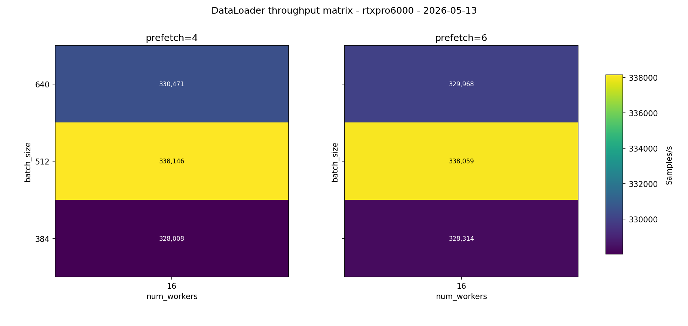
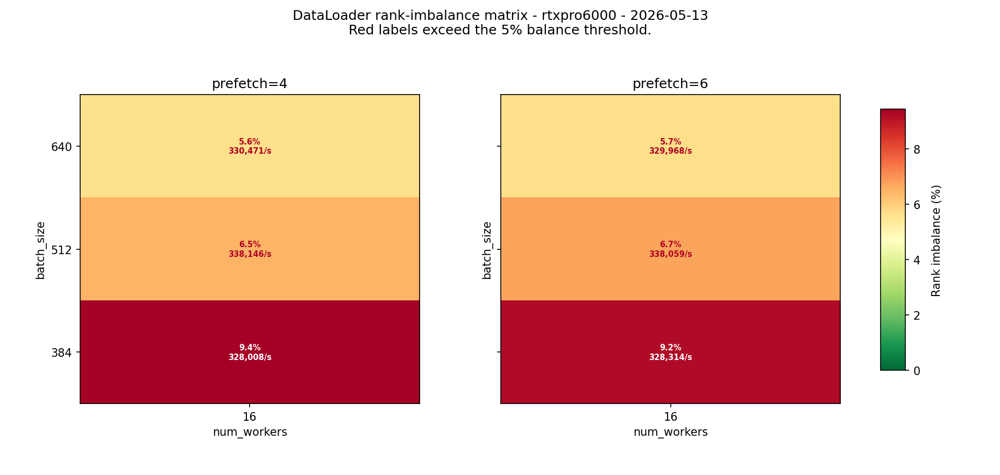
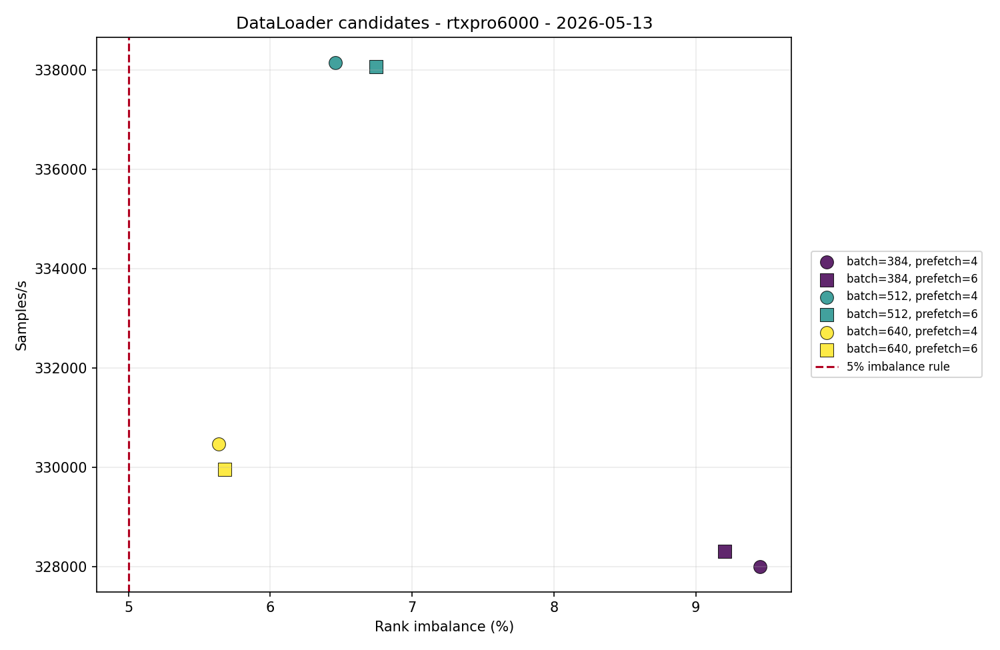
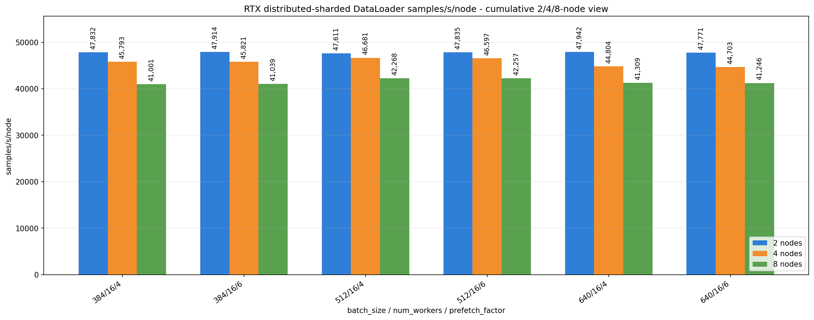
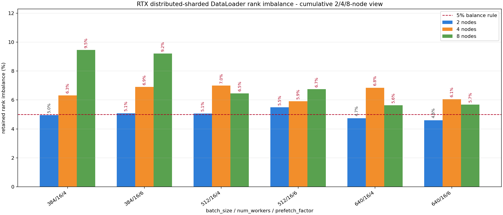

# DataLoader RTX 2/4/8-Node Scale Probe

<!-- aicr-study-status: published -->


Purpose: report the focused RTX distributed-sharded DataLoader scale probe
that carries selected two-node and four-node settings to eight nodes.

It follows the
[RTX multi-node parameter-selection study](rtx-multinode-dataloader.md), which
identified `num_workers=16` and the `384/512/640` batch-size subset for the
eight-node run.

## Command Run

```bash
scripts/benchmark/sweep-dataloader.sh \
  --cluster rtxpro6000 \
  --profile medium \
  --nodes-list 8 \
  --gpu-count 8 \
  --mode distributed-sharded \
  --nodelist a0002,a0003,a0004,a0005,a0006,a0007,a0008,a0009 \
  --batch-size-list 384,512,640 \
  --num-workers-list 16 \
  --prefetch-factor-list 4,6 \
  --pin-memory-list 1 \
  --persistent-workers-list 1 \
  --cpus-per-task 16 \
  --repeat-count 5 \
  --apply \
  -- --warmup-batches 100 --measured-batches 500 --byte-estimate-sample-count 0
```

## Result Summary

The eight-node probe completed all intended jobs:

| Field | Value |
| --- | --- |
| Cluster | `rtxpro6000` |
| Mode | `distributed-sharded` |
| Two-node group | `a0002,a0003` |
| Four-node group | `a0002,a0003,a0004,a0005` |
| Eight-node group | `a0002-a0009` |
| Eight-node job IDs | `18762-18791` |
| Eight-node summaries | `30/30` matched intended job IDs, `30/30` passed |
| Batch sizes | `384,512,640` |
| Num workers | `16` |
| Prefetch factors | `4,6` |
| Pin memory / persistent workers | `1` / `1` |
| CPUs per task | `16` |
| Warmup / measured batches | `100` / `500` |
| Repeats | `5` |
| Aggregation | Olympic average, dropping lowest and highest throughput from five repeats |

Total throughput rises at eight nodes, but `samples/s/node` is lower than the
two-node and four-node rows. Retained rank imbalance remains above `5%` for all
six eight-node rows.

## Eight-Node Aggregate Table

The eight-node rows use intended job IDs `18762-18791` only. The filtered
renderer matched `30/30` summaries and all matched jobs passed.

| Nodes | Batch | Workers | Prefetch | Samples | Included | Samples/s | Samples/s/node | Jitter | Rank imbalance % |
| ---: | ---: | ---: | ---: | ---: | ---: | ---: | ---: | ---: | ---: |
| 8 | 384 | 16 | 4 | 5 | 3 | 328,008 | 41,001 | 478 | 9.45 |
| 8 | 384 | 16 | 6 | 5 | 3 | 328,314 | 41,039 | 321 | 9.20 |
| 8 | 512 | 16 | 4 | 5 | 3 | 338,146 | 42,268 | 400 | 6.46 |
| 8 | 512 | 16 | 6 | 5 | 3 | 338,059 | 42,257 | 118 | 6.74 |
| 8 | 640 | 16 | 4 | 5 | 3 | 330,471 | 41,309 | 316 | 5.64 |
| 8 | 640 | 16 | 6 | 5 | 3 | 329,968 | 41,246 | 320 | 5.68 |

## 2/4/8-Node Comparison

The `samples/s/node` view compares scale behavior without letting total node
count hide per-node throughput.

| Config | 2-node samples/s/node | 4-node samples/s/node | 8-node samples/s/node | 8-node rank imbalance % | Read |
| --- | ---: | ---: | ---: | ---: | --- |
| `384/16/4` | 47,832 | 45,793 | 41,001 | 9.45 | Lower batch does not fix eight-node balance. |
| `384/16/6` | 47,914 | 45,821 | 41,039 | 9.20 | Similar to `384/16/4`, with slightly lower imbalance. |
| `512/16/4` | 47,611 | 46,681 | 42,268 | 6.46 | Best eight-node total throughput. |
| `512/16/6` | 47,835 | 46,597 | 42,257 | 6.74 | Nearly tied with `512/16/4`, lowest eight-node jitter. |
| `640/16/4` | 47,942 | 44,804 | 41,309 | 5.64 | Best eight-node balance among tested rows, but lower throughput. |
| `640/16/6` | 47,771 | 44,703 | 41,246 | 5.68 | Similar to `640/16/4`. |

| View | Nodes | Batch | Workers | Prefetch | Samples/s | Samples/s/node | Rank imbalance % | Note |
| --- | ---: | ---: | ---: | ---: | ---: | ---: | ---: | --- |
| Best two-node retained row | 2 | 640 | 16 | 8 | 96,146 | 48,073 | 4.07 | Highest balanced two-node row in the cumulative view. |
| Best four-node throughput row | 4 | 512 | 16 | 4 | 186,726 | 46,681 | 6.99 | Highest four-node total throughput, but balance is over the balance threshold. |
| Best four-node compromise row | 4 | 512 | 16 | 6 | 186,386 | 46,597 | 5.91 | Nearly the same throughput as `512/16/4`, lower imbalance, and very low retained jitter. |
| Best eight-node throughput row | 8 | 512 | 16 | 4 | 338,146 | 42,268 | 6.46 | Best total throughput at eight nodes, but per-node throughput falls. |
| Best eight-node balance row | 8 | 640 | 16 | 4 | 330,471 | 41,309 | 5.64 | Lowest retained eight-node imbalance among tested rows, still above the balance threshold. |

## Interpretation

The selected parameter family scales in total throughput: the best eight-node
row reaches `338,146 samples/s` at `512/16/4`. After normalizing by node count,
the best eight-node row is `42,268 samples/s/node`, while the matching two-node
and four-node rows are `47,611` and `46,681 samples/s/node`.

The lowest eight-node imbalance row is `640/16/4` at `5.64%`. The lower-batch
`384` rows have higher imbalance at eight nodes, so this run does not show a
batch-size fix for the distributed-sharded imbalance.

## Figures











## Artifact Bundle

| Artifact | Location |
| --- | --- |
| VAST bundle | `/work/aicr/commissioning/benchmarks/public-study-artifacts/aicr-public/c54a4b2/dataloader/2026-05-13/dataloader-rtx-8node-scale-probe-2026-05-13.tar.gz` |
| VAST provenance | `/work/aicr/commissioning/benchmarks/public-study-artifacts/aicr-public/c54a4b2/dataloader/2026-05-13/dataloader-rtx-8node-scale-probe-2026-05-13-provenance.json` |
| OSN bundle | <https://uma1.osn.mghpcc.org/csim-bmark/public-study-artifacts/aicr-public/c54a4b2/dataloader/2026-05-13/dataloader-rtx-8node-scale-probe-2026-05-13.tar.gz> |
| OSN provenance | <https://uma1.osn.mghpcc.org/csim-bmark/public-study-artifacts/aicr-public/c54a4b2/dataloader/2026-05-13/dataloader-rtx-8node-scale-probe-2026-05-13-provenance.json> |
| OSN checksum | <https://uma1.osn.mghpcc.org/csim-bmark/public-study-artifacts/aicr-public/c54a4b2/dataloader/2026-05-13/dataloader-rtx-8node-scale-probe-2026-05-13.sha256> |
| Aggregated CSV | <https://uma1.osn.mghpcc.org/csim-bmark/public-study-artifacts/aicr-public/c54a4b2/dataloader/2026-05-13/dataloader-rtx-8node-scale-probe-2026-05-13/reports/dataloader-rtx-8node-aggregated-2026-05-13.csv> |
| Detail CSV | <https://uma1.osn.mghpcc.org/csim-bmark/public-study-artifacts/aicr-public/c54a4b2/dataloader/2026-05-13/dataloader-rtx-8node-scale-probe-2026-05-13/reports/dataloader-rtx-8node-detail-2026-05-13.csv> |
| Metadata JSON | <https://uma1.osn.mghpcc.org/csim-bmark/public-study-artifacts/aicr-public/c54a4b2/dataloader/2026-05-13/dataloader-rtx-8node-scale-probe-2026-05-13/data/metadata.json> |

## Retrieve And Verify

```bash
mkdir -p public-study-artifacts/dataloader-rtx-8node-scale-probe
cd public-study-artifacts/dataloader-rtx-8node-scale-probe
wget https://uma1.osn.mghpcc.org/csim-bmark/public-study-artifacts/aicr-public/c54a4b2/dataloader/2026-05-13/dataloader-rtx-8node-scale-probe-2026-05-13.tar.gz
wget https://uma1.osn.mghpcc.org/csim-bmark/public-study-artifacts/aicr-public/c54a4b2/dataloader/2026-05-13/dataloader-rtx-8node-scale-probe-2026-05-13.sha256
sha256sum -c dataloader-rtx-8node-scale-probe-2026-05-13.sha256
tar -xzf dataloader-rtx-8node-scale-probe-2026-05-13.tar.gz
```
