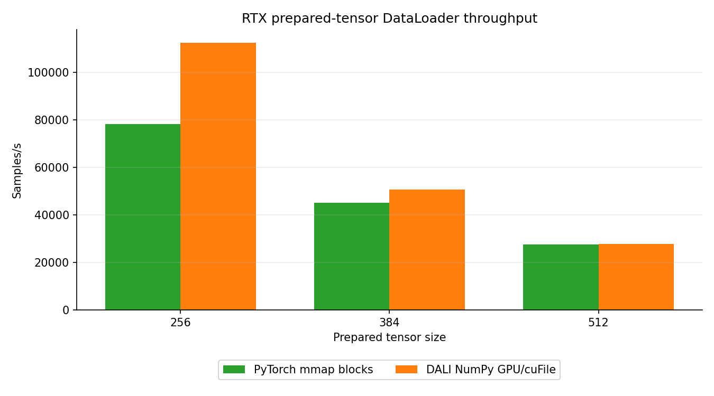
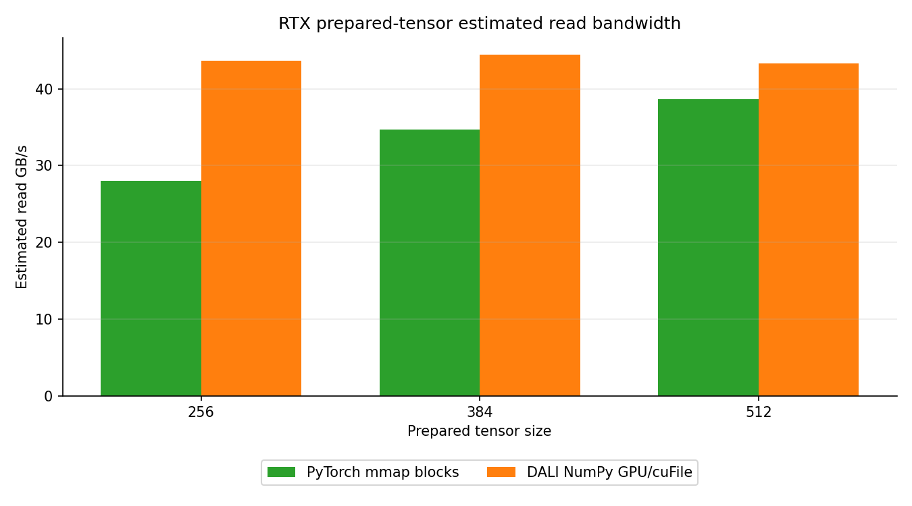

# RTX Prepared-Tensor GPU/cuFile DataLoader Transport

<!-- aicr-study-status: published -->

Purpose: document the RTX Pro 6000 DataLoader-only prepared-block transport
comparison for PyTorch mmap and DALI NumPy GPU/cuFile paths.

This DataLoader study compares the CPU-safe PyTorch mmap block reader with
DALI's NumPy GPU/cuFile reader on the same ImageNet-derived
`numpy-fp16-blocks` representation.

## Study Scope

The measured path is prepared-tensor transport:

- prepared fp16 image tensors stored as blocked NumPy files;
- PyTorch mmap over the blocked tensor layout as the CPU comparator;
- DALI `fn.readers.numpy(device="gpu", use_o_direct=True)` for the
  GPU/cuFile rows;
- one-node RTX Pro 6000 DataLoader throughput and estimated prepared-tensor
  read bandwidth;
- same-node GDS verification and cuFile provenance for the GDS rows.

## Run Shape

| Field | Value |
| --- | --- |
| Module | DataLoader |
| Platform | RTX Pro 6000 |
| Node shape | One node, eight GPUs |
| Input representation | `numpy-fp16-blocks` |
| Image tensor shape | prepared fp16 NCHW, `size=256/384/512` |
| Dataset subset | `spc=64`, seed `1234` |
| Dataset path | `/scratch/csim/aicr-bench/dataloader-gds-v2-block512/imagenet/train/spc-64-seed-1234/size-<size>/numpy-fp16-blocks` |
| NumPy block size | `512` images per block file |
| Comparator | `numpy-fp16-blocks-pytorch` |
| GPU/cuFile path | `dali-numpy-fp16-blocks-gds` |
| Timing | `100` warmup batches, `500` measured batches |
| Aggregation | Five successful repeats, Olympic mean |
| Measurement scope | DataLoader-only prepared-tensor transport |

`spc` means samples per class. The `spc=64` subset has `64,000` logical
ImageNet-derived samples, which is enough for DataLoader candidate selection
and keeps the prepared-input ladder compact enough for repeated measurement.

## Result Summary

| Size | PyTorch block samples/s | PyTorch estimated read GB/s | DALI NumPy GPU/cuFile samples/s | DALI NumPy GPU/cuFile estimated read GB/s | DALI/PyTorch samples/s | Reading |
| ---: | ---: | ---: | ---: | ---: | ---: | --- |
| `256` | `78,156.07` | `28.03` | `112,379.21` | `43.64` | `1.44x` | clear GDS candidate |
| `384` | `45,101.94` | `34.70` | `50,624.43` | `44.42` | `1.12x` | modest GDS candidate |
| `512` | `27,662.47` | `38.68` | `27,676.51` | `43.26` | `1.00x` | convergence with CPU comparator |

Jobs used in the repeated Olympic means:

| Size | PyTorch jobs | DALI NumPy GPU/cuFile jobs |
| ---: | --- | --- |
| `256` | `29538`, `29539`, `29540`, `29541`, `29542` | `29543`, `29544`, `29545`, `29546`, `29547` |
| `384` | `29548`, `29549`, `29550`, `29551`, `29552` | `29553`, `29554`, `29555`, `29556`, `29557` |
| `512` | `29558`, `29559`, `29560`, `29561`, `29562` | `29563`, `29564`, `29565`, `29566`, `29567` |

RTX Pro 6000 uses a one-node `256`/`384`/`512` prepared-tensor transport
ladder. The ladder stops at `512` because the DALI GPU/cuFile row has
converged with the PyTorch mmap comparator by that size.

The useful DataLoader conclusion is size-dependent. The DALI NumPy
GPU/cuFile path is a strong prepared-tensor transport candidate at `256`, a
modest candidate at `384`, and effectively tied with PyTorch mmap at `512`.
The `512` row shows where the RTX one-node ladder converges with the PyTorch
mmap comparator.

## Block-Size Sensitivity

After the `size=512`, `numpy_block_size=512` row converged with the PyTorch
mmap comparator, a one-node RTX block-size sensitivity probe tested smaller
prepared-tensor block files at the same `size=512`, `spc=64`, seed `1234`,
backend settings, and `100`/`500` timing shape. The comparison checks whether
`numpy_block_size=128` or `64` changes the DALI GPU/cuFile result at the
crossing point.

It did not. Smaller blocks improved the DALI row relative to `128` blocks when
moving to `64` blocks, but neither smaller block size beat the PyTorch mmap
comparator. The original `numpy_block_size=512` row remains the RTX prepared
DataLoader crossing point.

| NumPy block size | Backend | Repeats | Olympic samples/s | Min | Max | Estimated read GB/s | DALI/PyTorch samples/s | Jobs |
| ---: | --- | ---: | ---: | ---: | ---: | ---: | ---: | --- |
| `512` | `numpy-fp16-blocks-pytorch` | `5` | `27,662.47` | `27,264.48` | `28,833.06` | `38.68` | `1.00x` | `29558`, `29559`, `29560`, `29561`, `29562` |
| `512` | `dali-numpy-fp16-blocks-gds` | `5` | `27,676.51` | `27,507.92` | `27,781.99` | `43.26` | `1.00x` | `29563`, `29564`, `29565`, `29566`, `29567` |
| `128` | `numpy-fp16-blocks-pytorch` | `5` | `27,286.91` | `27,162.01` | `28,568.43` | `40.46` | `1.00x` | `29804`, `29807`, `29810`, `29813`, `29820` |
| `128` | `dali-numpy-fp16-blocks-gds` | `5` | `14,158.68` | `13,841.87` | `18,895.91` | `22.06` | `0.52x` | `29805`, `29808`, `29811`, `29814`, `29822` |
| `64` | `numpy-fp16-blocks-pytorch` | `5` | `27,587.41` | `27,318.97` | `28,841.41` | `41.46` | `1.00x` | `29826`, `29829`, `29832`, `29834`, `29836` |
| `64` | `dali-numpy-fp16-blocks-gds` | `5` | `19,029.51` | `16,134.54` | `20,834.47` | `29.45` | `0.69x` | `29827`, `29830`, `29833`, `29835`, `29837` |

The smaller-block DALI rows each produced rank-local cuFile logs for all eight
ranks in all five full repeats. Smoke jobs `29803` (`block_size=128`) and
`29824` (`block_size=64`) also passed before the full rows were submitted.

On RTX Pro 6000 at `size=512`, reducing the prepared NumPy block size below
`512` did not improve the DALI GPU/cuFile transport result enough to beat the
CPU-safe PyTorch mmap comparator.

## Figures

The throughput and estimated-read figures use the same focused five-repeat
Olympic means as the result table. They are DataLoader-only prepared-tensor
transport figures.





## Artifact Bundle

The public OSN bundle below covers the one-node `256`/`384`/`512`
DataLoader ladder, the `size=512` block-size sensitivity probe, same-node
GDS verification records, rank-local cuFile logs for GDS rows, focused
CSV/JSON summaries, rendered reports, provenance, and expanded `SHA256SUMS`
manifest. It was clean-room verified from the public OSN URLs with `2,211`
expanded files checked.

| Item | Path |
| --- | --- |
| Bundle scope | RTX DataLoader prepared-tensor GPU/cuFile one-node `256`/`384`/`512` ladder plus `size=512` block-size sensitivity probe. |
| OSN bundle | <https://uma1.osn.mghpcc.org/csim-bmark/public-study-artifacts/aicr-public/28272e3/dataloader/2026-05-28/dataloader-rtx-prepared-tensor-gds-transport-100x500-2026-05-28.tar.gz> |
| OSN provenance | <https://uma1.osn.mghpcc.org/csim-bmark/public-study-artifacts/aicr-public/28272e3/dataloader/2026-05-28/dataloader-rtx-prepared-tensor-gds-transport-100x500-2026-05-28/provenance.json> |
| OSN checksum | <https://uma1.osn.mghpcc.org/csim-bmark/public-study-artifacts/aicr-public/28272e3/dataloader/2026-05-28/dataloader-rtx-prepared-tensor-gds-transport-100x500-2026-05-28.sha256> |
| AICR retained bundle | `/work/aicr/commissioning/benchmarks/public-study-artifacts/aicr-public/28272e3/dataloader/2026-05-28/dataloader-rtx-prepared-tensor-gds-transport-100x500-2026-05-28.tar.gz` |
| AICR retained expanded bundle | `/work/aicr/commissioning/benchmarks/public-study-artifacts/aicr-public/28272e3/dataloader/2026-05-28/dataloader-rtx-prepared-tensor-gds-transport-100x500-2026-05-28/` |
| SHA-256 | `1efc085b6733074f860bf17261581183df1ecf2278daa06eae6a59da1f5b8fa6` |

Retrieve and verify:

```bash
mkdir -p public-study-artifacts/dataloader-rtx-prepared-tensor-gds
cd public-study-artifacts/dataloader-rtx-prepared-tensor-gds
wget https://uma1.osn.mghpcc.org/csim-bmark/public-study-artifacts/aicr-public/28272e3/dataloader/2026-05-28/dataloader-rtx-prepared-tensor-gds-transport-100x500-2026-05-28.tar.gz
wget https://uma1.osn.mghpcc.org/csim-bmark/public-study-artifacts/aicr-public/28272e3/dataloader/2026-05-28/dataloader-rtx-prepared-tensor-gds-transport-100x500-2026-05-28.sha256
sha256sum -c dataloader-rtx-prepared-tensor-gds-transport-100x500-2026-05-28.sha256
tar -xzf dataloader-rtx-prepared-tensor-gds-transport-100x500-2026-05-28.tar.gz
cd dataloader-rtx-prepared-tensor-gds-transport-100x500-2026-05-28
sha256sum -c SHA256SUMS
```

## Reader Path

The GDS rows use DALI's NumPy GPU/cuFile reader path:
`fn.readers.numpy(device="gpu", use_o_direct=True)`. DALI JPEG pages cover
image decode and input-pipeline behavior for JPEG files.

The CPU-safe comparator is PyTorch mmap over the same blocked prepared tensor
layout. That keeps the comparison tied to transport over the same prepared
input representation rather than to online JPEG decode, resize/crop,
normalization, or training compute.

## Related Training Study

The companion DDP study reports RTX prepared-tensor training-throughput results
using the same prepared input representation:

- [DDP RTX prepared-tensor GPU/cuFile transport study](../../ddp/studies/rtx-prepared-tensor-gds-transport.md)

## Related Pages

- [DataLoader input pipeline reference](../input-pipeline-reference.md)
- [Where the input work lives](input-representations.md)
- [Derived ImageNet datasets](../derived-datasets.md)
