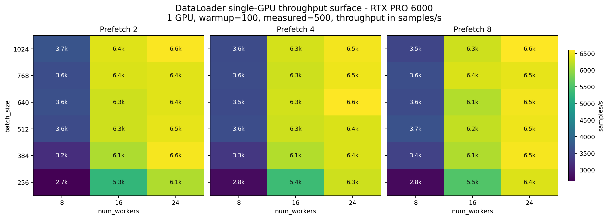

# DataLoader RTX Single-GPU Surface

<!-- aicr-study-status: published -->


Purpose: map the RTX one-rank DataLoader batch, worker, and prefetch surface before one-node 8-GPU validation.

## Run Shape

| Field | Value |
| --- | --- |
| Cluster | `rtxpro6000` |
| Mode | `single` |
| Nodes | `1` |
| GPUs per node | `1` |
| Batch sizes | `256,384,512,640,768,1024` |
| Num workers | `8,16,24` |
| Prefetch factors | `2,4,8` |
| Pin memory | `1` |
| Persistent workers | `1` |
| CPUs per task | `16` |
| Warmup batches | `100` |
| Measured batches | `500` |
| Repeats | `1` |
| Jobs | `6 x 3 x 3 = 54` |

## Command Run

```bash
scripts/benchmark/sweep-dataloader.sh \
  --cluster rtxpro6000 \
  --profile medium \
  --nodes-list 1 \
  --gpu-count 1 \
  --mode single \
  --batch-size-list 256,384,512,640,768,1024 \
  --num-workers-list 8,16,24 \
  --prefetch-factor-list 2,4,8 \
  --pin-memory-list 1 \
  --persistent-workers-list 1 \
  --cpus-per-task 16 \
  --repeat-count 1 \
  --apply \
  -- --warmup-batches 100 --measured-batches 500 --byte-estimate-sample-count 0
```

## Result Summary

Single-GPU runs rank candidate settings by `samples/s`. Rank imbalance is
undefined with one rank, and is reintroduced on the one-node replicated page
where eight ranks share the node. This surface records where RTX throughput
plateaus across batch size, worker count, and prefetch factor before one-node
8-GPU validation.

## Figures

The May 12, 2026 single-GPU surface is summarized as a static throughput
heatmap. This figure summarizes the candidate-selection run before one-node 8-GPU validation.



The first-pass RTX surface favored `num_workers=24` on a single GPU. The
highest-throughput cell was batch `640`, workers `24`, prefetch `4` at about
`6.6k samples/s`; several `384`, `512`, `768`, and `1024` cells with
`24` workers were close enough to carry a small candidate set into one-node
8-GPU validation. The one-node run checks whether the single-rank gain remains
when eight ranks share the node.

## Artifact Bundle

| Artifact | Location |
| --- | --- |
| VAST CSV | `/work/aicr/commissioning/benchmarks/public-study-artifacts/aicr-public/9d4402f/dataloader/2026-05-12/single-gpu-surface/dataloader-single-gpu-surface.csv` |
| VAST checksum | `/work/aicr/commissioning/benchmarks/public-study-artifacts/aicr-public/9d4402f/dataloader/2026-05-12/single-gpu-surface/SHA256SUMS` |
| OSN CSV | <https://uma1.osn.mghpcc.org/csim-bmark/public-study-artifacts/aicr-public/9d4402f/dataloader/2026-05-12/single-gpu-surface/dataloader-single-gpu-surface.csv> |
| OSN checksum | <https://uma1.osn.mghpcc.org/csim-bmark/public-study-artifacts/aicr-public/9d4402f/dataloader/2026-05-12/single-gpu-surface/SHA256SUMS> |

## Retrieve And Verify

```bash
mkdir -p public-study-artifacts/dataloader-single-gpu-surface
cd public-study-artifacts/dataloader-single-gpu-surface
wget https://uma1.osn.mghpcc.org/csim-bmark/public-study-artifacts/aicr-public/9d4402f/dataloader/2026-05-12/single-gpu-surface/dataloader-single-gpu-surface.csv
wget https://uma1.osn.mghpcc.org/csim-bmark/public-study-artifacts/aicr-public/9d4402f/dataloader/2026-05-12/single-gpu-surface/SHA256SUMS
sha256sum -c SHA256SUMS
```
