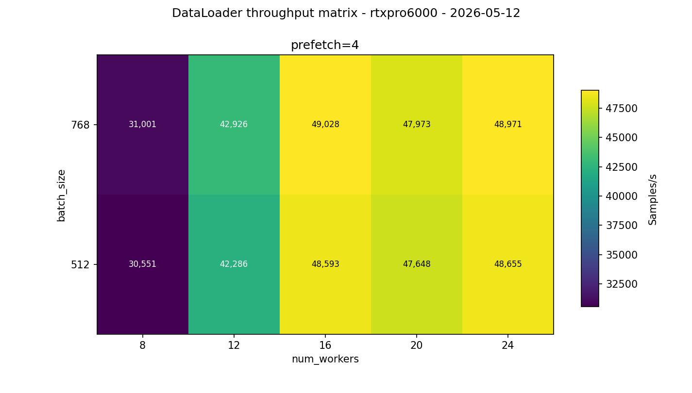
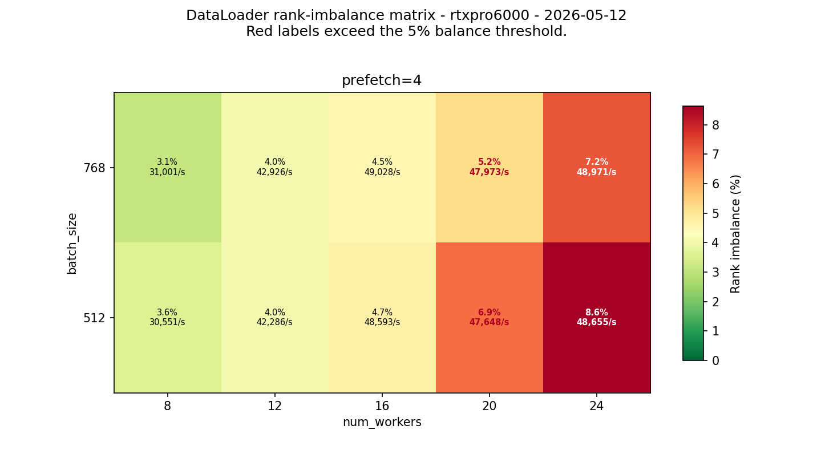
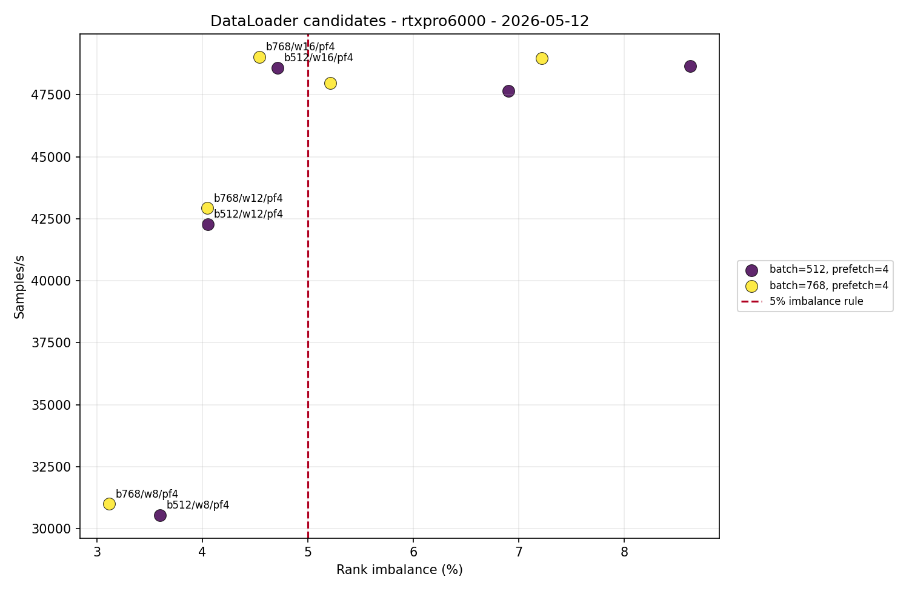
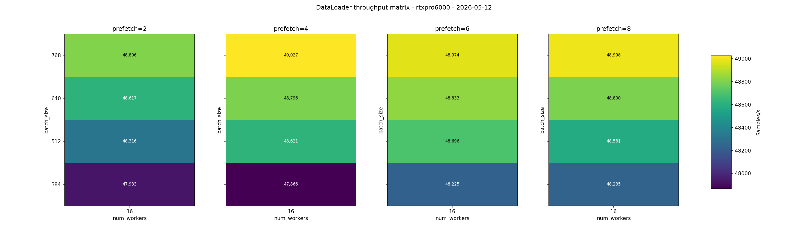
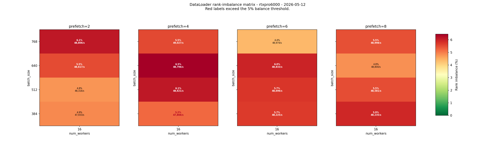
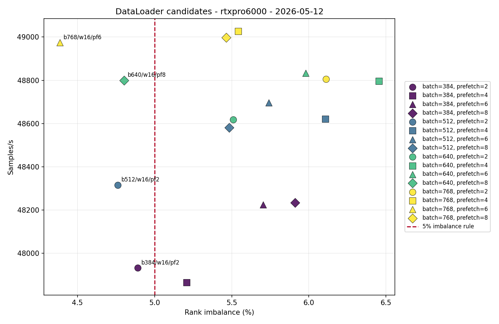

# DataLoader RTX One-Node 8-GPU Replicated

<!-- aicr-study-status: published -->


Purpose: report the RTX one-node replicated DataLoader worker scan that selects the first multi-node candidate input-pipeline setting.

This study follows the [RTX single-GPU surface](rtx-single-gpu-surface.md).
The single-GPU run chose candidate regions. This one-node run asks which worker
count remains fast and balanced when eight replicated ranks share one RTX PRO
6000 node.

## Run Shape

| Field | Value |
| --- | --- |
| Cluster | `rtxpro6000` |
| Node | `a0001` |
| Mode | `replicated` |
| Nodes | `1` |
| GPUs per node | `8` |
| Batch sizes | `512,768` |
| Num workers | `8,12,16,20,24` |
| Prefetch factor | `4` |
| Pin memory | `1` |
| Persistent workers | `1` |
| CPUs per task | `16` |
| Warmup batches | `100` |
| Measured batches | `500` |
| Repeats | `5` |
| Aggregation | `olympic` |
| Intended jobs | `50` |
| Completed/passed | `50/50` |

Olympic aggregation drops the lowest and highest throughput samples for each
configuration, then computes throughput, jitter, and rank imbalance from the
same retained three jobs. The rendered report is filtered by intended job ID
so the two summaries from the earlier cancelled/restarted attempt are not
included.

## Command Run

Worker scan:

```bash
scripts/benchmark/sweep-dataloader.sh \
  --cluster rtxpro6000 \
  --profile medium \
  --nodes-list 1 \
  --gpu-count 8 \
  --mode replicated \
  --nodelist a0001 \
  --batch-size-list 512,768 \
  --num-workers-list 8,12,16,20,24 \
  --prefetch-factor-list 4 \
  --pin-memory-list 1 \
  --persistent-workers-list 1 \
  --cpus-per-task 16 \
  --repeat-count 5 \
  --apply \
  -- --warmup-batches 100 --measured-batches 500 --byte-estimate-sample-count 0
```

Batch/prefetch refinement:

```bash
scripts/benchmark/sweep-dataloader.sh \
  --cluster rtxpro6000 \
  --profile medium \
  --nodes-list 1 \
  --gpu-count 8 \
  --mode replicated \
  --nodelist a0009 \
  --batch-size-list 384,512,640,768 \
  --num-workers-list 16 \
  --prefetch-factor-list 2,4,6,8 \
  --pin-memory-list 1 \
  --persistent-workers-list 1 \
  --cpus-per-task 16 \
  --repeat-count 5 \
  --apply \
  -- --warmup-batches 100 --measured-batches 500 --byte-estimate-sample-count 0
```

## Result Summary

The RTX one-node result has two layers. The worker scan below shows that
`num_workers=16` is the defensible multi-node worker count: workers below
`16` are more balanced but leave too much throughput on the table, while
workers above `16` sometimes match throughput with worse retained rank
imbalance. The appended batch/prefetch refinement then keeps
`num_workers=16` fixed and points to `batch_size=768`,
`prefetch_factor=6` as the cleaner RTX candidate for the first multi-node
DataLoader pass.

## Worker Scan Result

| Batch | Workers | Prefetch | Samples/s | Retained imbalance | Retained jitter |
| ---: | ---: | ---: | ---: | ---: | ---: |
| 512 | 8 | 4 | 30,551 | 3.60% | 168 |
| 512 | 12 | 4 | 42,286 | 4.05% | 200 |
| 512 | 16 | 4 | 48,593 | 4.71% | 174 |
| 512 | 20 | 4 | 47,648 | 6.90% | 136 |
| 512 | 24 | 4 | 48,655 | 8.63% | 93 |
| 768 | 8 | 4 | 31,001 | 3.12% | 126 |
| 768 | 12 | 4 | 42,926 | 4.05% | 92 |
| 768 | 16 | 4 | 49,028 | 4.54% | 184 |
| 768 | 20 | 4 | 47,973 | 5.22% | 79 |
| 768 | 24 | 4 | 48,971 | 7.22% | 72 |

The worker scan selects `num_workers=16`. At the original fixed
`prefetch_factor=4`, the `768/16/4` point gives `49,028 samples/s`,
`4.54%` retained rank imbalance, and `184 samples/s` retained jitter. The
nearby `768/24/4` point does not become the worker default because it has
similar throughput but `7.22%` retained imbalance.

## Batch/Prefetch Refinement

After the worker scan fixed `num_workers=16`, the next RTX run swept
`batch_size=384,512,640,768` and `prefetch_factor=2,4,6,8` with the same
one-node, eight-rank replicated shape. Each configuration used `5` samples
with Olympic aggregation. The renderer matched all `80/80` intended jobs,
all rows passed, and no rows needed review.

| Field | Value |
| --- | --- |
| Cluster | `rtxpro6000` |
| Node | `a0009` |
| Mode | `replicated` |
| Nodes | `1` |
| Ranks | `8` |
| Batch sizes | `384,512,640,768` |
| Num workers | `16` |
| Prefetch factors | `2,4,6,8` |
| Warmup batches | `100` |
| Measured batches | `500` |
| Repeats | `5` |
| Aggregation | `olympic` |
| Intended jobs | `80` |
| Completed/passed | `80/80` |

### Refinement Result

| Batch | Workers | Prefetch | Samples/s | Retained imbalance | Retained jitter |
| ---: | ---: | ---: | ---: | ---: | ---: |
| 384 | 16 | 2 | 47,933 | 4.89% | 205 |
| 384 | 16 | 4 | 47,866 | 5.21% | 448 |
| 384 | 16 | 6 | 48,225 | 5.70% | 170 |
| 384 | 16 | 8 | 48,235 | 5.91% | 64 |
| 512 | 16 | 2 | 48,316 | 4.76% | 193 |
| 512 | 16 | 4 | 48,621 | 6.11% | 354 |
| 512 | 16 | 6 | 48,696 | 5.74% | 161 |
| 512 | 16 | 8 | 48,581 | 5.48% | 80 |
| 640 | 16 | 2 | 48,617 | 5.51% | 146 |
| 640 | 16 | 4 | 48,796 | 6.46% | 479 |
| 640 | 16 | 6 | 48,833 | 5.98% | 54 |
| 640 | 16 | 8 | 48,800 | 4.80% | 129 |
| 768 | 16 | 2 | 48,806 | 6.11% | 204 |
| 768 | 16 | 4 | 49,027 | 5.54% | 118 |
| 768 | 16 | 6 | 48,974 | 4.39% | 27 |
| 768 | 16 | 8 | 48,998 | 5.46% | 146 |

The fastest retained center is `768/16/4` at `49,027 samples/s`, but its
retained imbalance is `5.54%`. The `768/16/6` point is only `53 samples/s`
lower, has the lowest retained jitter among the top RTX configurations, and
keeps retained imbalance below the `5%` retained rank-imbalance threshold at `4.39%`.
For the first RTX multi-node pass, carry forward `batch_size=768`,
`num_workers=16`, and `prefetch_factor=6`.

## Figures

The scatter plots show throughput against retained rank imbalance for the candidate rows.

Worker scan figures:







Batch/prefetch refinement figures:







## Artifact Bundle

| Artifact | Location |
| --- | --- |
| VAST bundle | `/work/aicr/commissioning/benchmarks/public-study-artifacts/aicr-public/e5bba11/dataloader/2026-05-12/dataloader-b200-rtx-one-node-replicated-worker-scan-olympic-2026-05-12.tar.gz` |
| VAST provenance | `/work/aicr/commissioning/benchmarks/public-study-artifacts/aicr-public/e5bba11/dataloader/2026-05-12/dataloader-b200-rtx-one-node-replicated-worker-scan-olympic-2026-05-12-provenance.json` |
| OSN bundle | <https://uma1.osn.mghpcc.org/csim-bmark/public-study-artifacts/aicr-public/e5bba11/dataloader/2026-05-12/dataloader-b200-rtx-one-node-replicated-worker-scan-olympic-2026-05-12.tar.gz> |
| OSN provenance | <https://uma1.osn.mghpcc.org/csim-bmark/public-study-artifacts/aicr-public/e5bba11/dataloader/2026-05-12/dataloader-b200-rtx-one-node-replicated-worker-scan-olympic-2026-05-12-provenance.json> |
| OSN checksum | <https://uma1.osn.mghpcc.org/csim-bmark/public-study-artifacts/aicr-public/e5bba11/dataloader/2026-05-12/dataloader-b200-rtx-one-node-replicated-worker-scan-olympic-2026-05-12.sha256> |
| Filtered RTX report | <https://uma1.osn.mghpcc.org/csim-bmark/public-study-artifacts/aicr-public/e5bba11/dataloader/2026-05-12/one-node-replicated-worker-scan/reports/dataloader-rtxpro6000-2026-05-12.md> |
| Filtered RTX CSV | <https://uma1.osn.mghpcc.org/csim-bmark/public-study-artifacts/aicr-public/e5bba11/dataloader/2026-05-12/one-node-replicated-worker-scan/reports/dataloader-aggregated-summary-rtxpro6000-2026-05-12.csv> |

## Retrieve And Verify

```bash
mkdir -p public-study-artifacts/dataloader-one-node-replicated
cd public-study-artifacts/dataloader-one-node-replicated
wget https://uma1.osn.mghpcc.org/csim-bmark/public-study-artifacts/aicr-public/e5bba11/dataloader/2026-05-12/dataloader-b200-rtx-one-node-replicated-worker-scan-olympic-2026-05-12.tar.gz
wget https://uma1.osn.mghpcc.org/csim-bmark/public-study-artifacts/aicr-public/e5bba11/dataloader/2026-05-12/dataloader-b200-rtx-one-node-replicated-worker-scan-olympic-2026-05-12.sha256
sha256sum -c dataloader-b200-rtx-one-node-replicated-worker-scan-olympic-2026-05-12.sha256
tar -tzf dataloader-b200-rtx-one-node-replicated-worker-scan-olympic-2026-05-12.tar.gz | head
```
