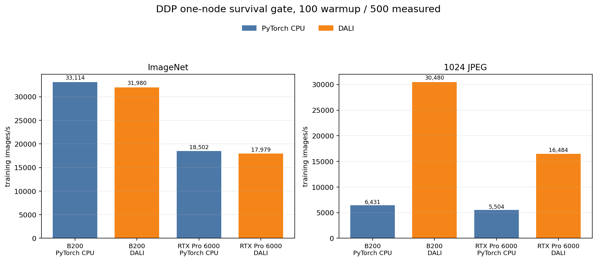
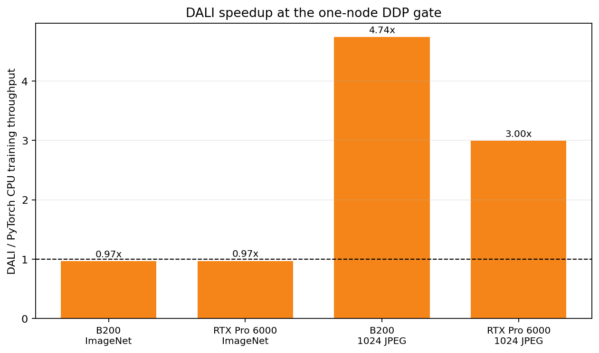

# DDP DataLoader Training Validation

<!-- aicr-study-status: published -->

Purpose: test whether optimized DataLoader input-pipeline candidates improve
end-to-end ResNet-50 DDP training.

## Study Question

Do the selected DataLoader endpoint candidates still improve throughput once
ResNet-50 model compute, backward pass, optimizer work, rank timing, and
distributed sharding are included?

This study follows the
[DataLoader optimized 224/1024 backend crossover](../../dataloader/studies/optimized-backend-crossover.md)
by carrying its selected endpoint candidates into one-node DDP training.
At canonical ImageNet shape, tuned PyTorch CPU DataLoader beat tuned DALI in
DataLoader-only throughput. At derived `1024` JPEG, tuned DALI beat tuned
PyTorch CPU DataLoader by about three times.

This DDP study carries those endpoint candidates into one-node ResNet-50
training and measures whether the input-side result remains visible in
training throughput.

## Evidence Role

Labels: `canonical-224`, `derived-jpeg-1024`.

These rows provide one-node ResNet-50 DDP training-throughput evidence for the
selected DataLoader candidates. Multi-node behavior is reported separately in
the [DDP multi-node scale validation](multinode-scale-validation.md).

## Run Shape

| Field | Value |
| --- | --- |
| Module | `ddp` |
| Model | ResNet-50 |
| Launcher | `torchrun` |
| Platforms | B200, RTX Pro 6000 |
| Nodes | `1` |
| GPUs per node | `8` |
| Precision | `bf16` |
| Endpoints | canonical ImageNet, derived `1024` JPEG |
| Backends | optimized `pytorch-cpu-dataloader`, optimized `dali-gpu-decode` |
| Standard ImageNet CPU configs | B200 batch `768`/workers `16`/prefetch `4`; RTX batch `768`/workers `16`/prefetch `6` |
| Standard ImageNet DALI configs | B200 batch `768`/threads `8`/queue `2`; RTX batch `768`/threads `8`/queue `4` |
| `1024` CPU configs | B200 batch `384`/workers `16`/prefetch `4`; RTX batch `384`/workers `16`/prefetch `8` |
| `1024` DALI configs | B200 batch `768`/threads `8`/queue `1`; RTX batch `768`/threads `8`/queue `1` |
| Warmup / measured | `100` / `500` iterations |
| Aggregation | five-repeat Olympic average |

The published-row timing floor for DataLoader/DDP study rows is at least `100`
warmup iterations and `500` measured iterations. Earlier `20`/`100` DDP rows
are diagnostic context only and are not used for the published result table
below.

## Command Run

The study uses the DDP ResNet-50 submitter with the selected DataLoader
candidate settings. The submitted jobs used `--mem=0` so Slurm granted the full
node memory cgroup.

Standard ImageNet endpoint:

```bash
scripts/benchmark/submit-ddp-resnet50.sh \
  --cluster <b200|rtxpro6000> \
  --nodes 1 \
  --nodelist <b0004|a0003> \
  --partition <b200-batch|rtx-batch> \
  --time 00:30:00 \
  --repeat-count 5 \
  --mem 0 \
  --apply \
  -- \
  --dataset-root /work/aicr/commissioning/benchmarks/imagenet/ILSVRC/Data/CLS-LOC \
  --input-backend <pytorch-cpu-dataloader|dali-gpu-decode> \
  --batch-size 768 \
  --num-workers 16 \
  --prefetch-factor <4|6> \
  --dali-num-threads <0|8> \
  --dali-prefetch-queue-depth <2|4> \
  --dali-decode-mode random-crop \
  --dali-hw-decoder-load 0.65 \
  --pin-memory 1 \
  --persistent-workers 1 \
  --warmup-iters 100 \
  --measured-iters 500 \
  --precision bf16 \
  --channels-last 1 \
  --drop-last 1
```

Derived `1024` endpoint:

```bash
scripts/benchmark/submit-ddp-resnet50.sh \
  --cluster <b200|rtxpro6000> \
  --nodes 1 \
  --nodelist <b0001|a0018> \
  --partition <b200-batch|rtx-devel> \
  --time 04:00:00 \
  --repeat-count 5 \
  --mem 0 \
  --apply \
  -- \
  --dataset-root /scratch/$USER/aicr-bench/studies/dataloader-ddp-v1/imagenet/train/<spc-16-or-spc-80>/size-1024/jpeg \
  --input-backend <pytorch-cpu-dataloader|dali-gpu-decode> \
  --derived-root /scratch/$USER/aicr-bench/studies/dataloader-ddp-v1/imagenet/train/<spc-16-or-spc-80> \
  --derived-image-size 1024 \
  --derived-samples-per-class <16|80> \
  --derived-seed 1234 \
  --batch-size <384|768> \
  --num-workers 16 \
  --prefetch-factor <4|8> \
  --dali-num-threads <0|8> \
  --dali-prefetch-queue-depth <1|2> \
  --dali-decode-mode random-crop \
  --dali-hw-decoder-load 0.65 \
  --pin-memory 1 \
  --persistent-workers 1 \
  --warmup-iters 100 \
  --measured-iters 500 \
  --precision bf16 \
  --channels-last 1 \
  --drop-last 1
```

Exact expanded commands and job IDs are in the artifact bundle.

## Result Summary

| Platform | Endpoint | PyTorch CPU images/s | DALI images/s | DALI/PyTorch | Outcome |
| --- | --- | ---: | ---: | ---: | --- |
| B200 | ImageNet | `33,114` | `31,980` | `0.97x` | CPU remains ahead. |
| B200 | `1024` JPEG | `6,431` | `30,480` | `4.74x` | DALI remains strong. |
| RTX Pro 6000 | ImageNet | `18,502` | `17,979` | `0.97x` | CPU remains slightly ahead. |
| RTX Pro 6000 | `1024` JPEG | `5,504` | `16,484` | `3.00x` | DALI remains strong. |

## Figure





The figure keeps the same endpoint/backend vocabulary as the DataLoader
crossover and changes the y-axis to training images/s.

## Interpretation

For canonical ImageNet `224`, the tuned CPU DataLoader remains the better
one-node ResNet-50 DDP path on both platforms. DALI reached `0.97x` of CPU
throughput on B200 and RTX Pro 6000, so the DataLoader-only DALI result does
not become a training-throughput win at this input shape.

For derived `1024` JPEG input, DALI remains the stronger one-node training
path. It reached `4.74x` CPU throughput on B200 and `3.00x` on RTX Pro 6000,
showing that the larger JPEG decode and preprocessing path still affects
training throughput after the DDP training loop is included.

| Endpoint | B200 | RTX Pro 6000 |
| --- | ---: | ---: |
| `canonical-224` | `0.97x` | `0.97x` |
| `derived-jpeg-1024` | `4.74x` | `3.00x` |

For multi-node results, see the
[DDP multi-node scale validation](multinode-scale-validation.md).

## Artifact Bundle

| Item | Path |
| --- | --- |
| OSN bundle | <https://uma1.osn.mghpcc.org/csim-bmark/public-study-artifacts/aicr-public/ee8c84f/ddp/ddp-training-validation-100x500.tar.gz> |
| OSN provenance | <https://uma1.osn.mghpcc.org/csim-bmark/public-study-artifacts/aicr-public/ee8c84f/ddp/training-validation-100x500/ddp-training-validation-100x500-provenance.json> |
| OSN checksum | <https://uma1.osn.mghpcc.org/csim-bmark/public-study-artifacts/aicr-public/ee8c84f/ddp/ddp-training-validation-100x500.sha256> |
| SHA-256 | `2417576c39eb74039fdeb494c52fb0f0c78f8ff970a1e340ea4247f9e7223641` |

The artifact bundle records the evidence used for these published aggregates.

## Retrieve And Verify

```bash
mkdir -p public-study-artifacts/ddp-training-validation
cd public-study-artifacts/ddp-training-validation
wget https://uma1.osn.mghpcc.org/csim-bmark/public-study-artifacts/aicr-public/ee8c84f/ddp/ddp-training-validation-100x500.tar.gz
wget https://uma1.osn.mghpcc.org/csim-bmark/public-study-artifacts/aicr-public/ee8c84f/ddp/ddp-training-validation-100x500.sha256
sha256sum -c ddp-training-validation-100x500.sha256
tar -tzf ddp-training-validation-100x500.tar.gz | head
```
