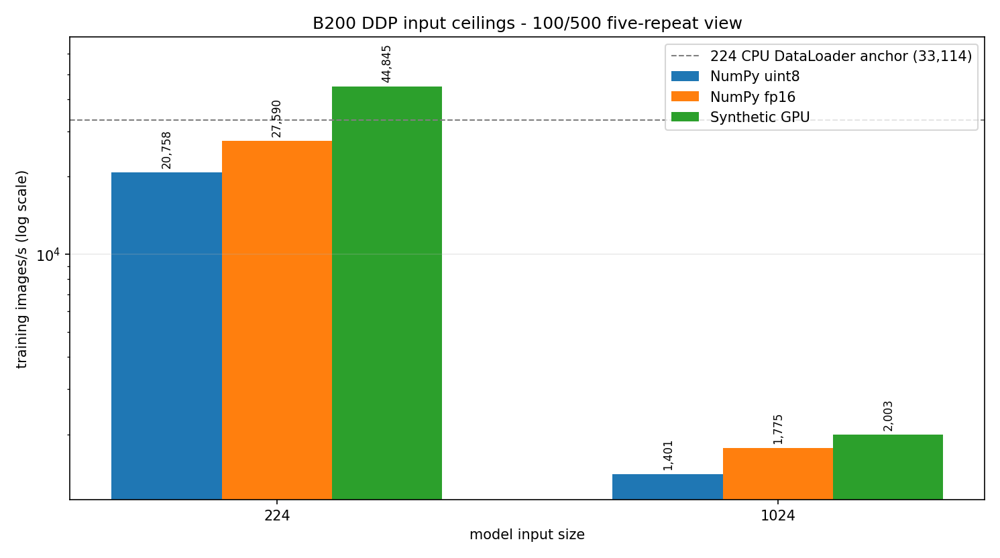
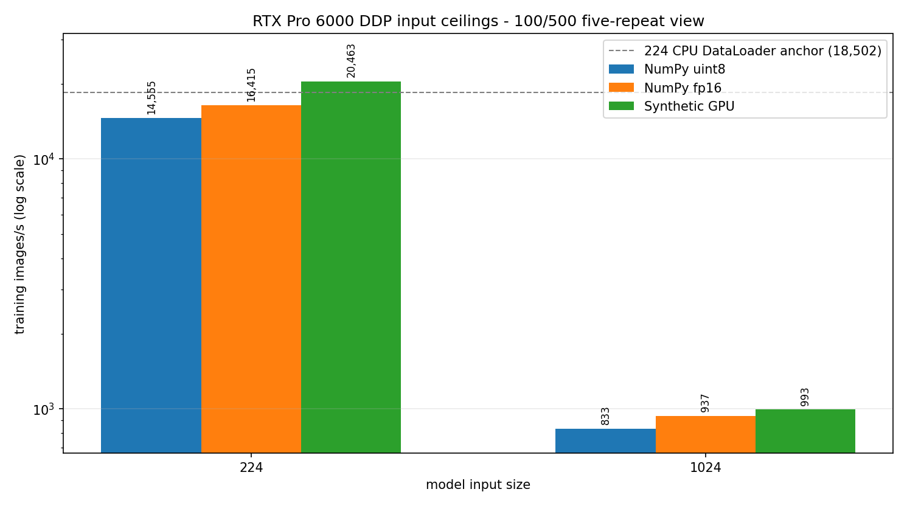

# DDP Input Ceilings

<!-- aicr-study-status: published -->

Purpose: measure how prepared NumPy inputs and synthetic GPU input bound
one-node ResNet-50 DDP throughput after removing increasing amounts of online
input work.

## Study Question

How close do prepared inputs get to the synthetic GPU compute ceiling during
one-node ResNet-50 DDP training, and when does full-resolution `1024` model
compute dominate input preparation?

This study follows the
[DataLoader prepared-input ceilings](../../dataloader/studies/prepared-input-ceilings.md)
study by comparing prepared-input rows with a synthetic GPU ceiling inside
one-node DDP training:

- NumPy uint8 removes JPEG decode, but still does tensor conversion,
  normalization, batching, and host-to-device copy at runtime.
- NumPy fp16 removes more online preparation, but fixes preprocessing
  semantics into the stored tensors.
- Synthetic GPU input removes filesystem reads, CPU staging, and H2D transfer,
  and therefore acts as a compute/input-free ceiling rather than a dataset
  strategy.

## Evidence Role

Labels: `prepared-input-ceiling`, `synthetic-gpu-ceiling`,
`full-res-1024`.

These rows show how close prepared NumPy inputs get to the training compute
ceiling at model input sizes `224` and full-resolution `1024`. They are ceiling
evidence for the measured input representations, not a general replacement for
real-dataset DDP training rows.

## Run Shape

| Field | Value |
| --- | --- |
| Module | `ddp` |
| Model | ResNet-50 |
| Launcher | `torchrun` |
| Platforms | B200, RTX Pro 6000 |
| Nodes | `1` |
| GPUs per node | `8` |
| Precision | `bf16` |
| Channels-last | enabled |
| Prepared backends | `numpy-uint8-shards`, `numpy-fp16-shards` |
| Ceiling backend | `synthetic-gpu` |
| Model input sizes | `224`, `1024` |
| Prepared derived subset | `spc-16` (16 samples per ImageNet class), seed `1234` |
| Warmup / measured | `100` / `500` iterations |
| Aggregation | five-repeat Olympic average |

The `1024` rows are full-resolution model-input rows. They are not
semantically identical to the derived JPEG DALI rows in the
[DDP training validation](dataloader-candidate-followup.md), where the JPEG pipeline
decodes large source images and then crops or resizes to `224` for ResNet-50.

## Command Run

The snippets below show the per-job submit shape used for the published rows.
Submit the per-job shape five times for each row; the
published aggregates come from five successful submissions per row, recorded
in the artifact bundle, and then Olympic-aggregated.

Prepared NumPy rows:

```bash
scripts/benchmark/submit-ddp-resnet50.sh \
  --cluster <b200|rtxpro6000> \
  --nodes 1 \
  --nodelist <node> \
  --partition <b200-batch|rtx-batch> \
  --time 01:00:00 \
  --repeat-count 1 \
  --mem 0 \
  --apply \
  -- \
  --dataset-root /work/aicr/commissioning/benchmarks/imagenet/ILSVRC/Data/CLS-LOC \
  --input-backend <numpy-uint8-shards|numpy-fp16-shards> \
  --derived-root /scratch/$USER/aicr-bench/studies/dataloader-ddp-v1 \
  --derived-image-size <224|1024> \
  --derived-samples-per-class 16 \
  --derived-seed 1234 \
  --batch-size <128|384|512|16> \
  --num-workers 16 \
  --prefetch-factor 4 \
  --pin-memory 1 \
  --persistent-workers 1 \
  --warmup-iters 100 \
  --measured-iters 500 \
  --precision bf16 \
  --channels-last 1 \
  --drop-last 1
```

Synthetic GPU rows:

```bash
scripts/benchmark/submit-ddp-resnet50.sh \
  --cluster <b200|rtxpro6000> \
  --nodes 1 \
  --nodelist <node> \
  --partition <b200-batch|rtx-batch> \
  --time 00:30:00 \
  --repeat-count 1 \
  --mem 0 \
  --apply \
  -- \
  --dataset-root /work/aicr/commissioning/benchmarks/imagenet/ILSVRC/Data/CLS-LOC \
  --input-backend synthetic-gpu \
  --synthetic-image-size <224|1024> \
  --synthetic-dtype bfloat16 \
  --synthetic-class-count 1000 \
  --batch-size <768|16> \
  --num-workers 0 \
  --prefetch-factor 4 \
  --pin-memory 0 \
  --persistent-workers 0 \
  --warmup-iters 100 \
  --measured-iters 500 \
  --precision bf16 \
  --channels-last 1 \
  --drop-last 1
```

Exact expanded Slurm commands, job IDs, run IDs, summaries, and aggregates are
in the artifact bundle.

## Result Summary

| Platform | Size | Input | Batch/rank | Images/s | Reading |
| --- | ---: | --- | ---: | ---: | --- |
| B200 | `224` | NumPy uint8 | `128` | `20,758` | Decode removed, runtime tensor prep remains. |
| B200 | `224` | NumPy fp16 | `512` | `27,590` | More preparation is offline. |
| B200 | `224` | Synthetic GPU | `768` | `44,845` | Input path removed. |
| B200 | `1024` | NumPy uint8 | `16` | `1,401` | Full-resolution training. |
| B200 | `1024` | NumPy fp16 | `16` | `1,775` | Full-resolution training, near compute ceiling. |
| B200 | `1024` | Synthetic GPU | `16` | `2,003` | Full-resolution compute/input-free ceiling. |
| RTX Pro 6000 | `224` | NumPy uint8 | `128` | `14,555` | Decode removed, runtime tensor prep remains. |
| RTX Pro 6000 | `224` | NumPy fp16 | `384` | `16,415` | More preparation is offline. |
| RTX Pro 6000 | `224` | Synthetic GPU | `768` | `20,463` | Input path removed. |
| RTX Pro 6000 | `1024` | NumPy uint8 | `16` | `833` | Full-resolution training. |
| RTX Pro 6000 | `1024` | NumPy fp16 | `16` | `937` | Full-resolution training, near compute ceiling. |
| RTX Pro 6000 | `1024` | Synthetic GPU | `16` | `993` | Full-resolution compute/input-free ceiling. |

At `224`, prepared fp16 improves over prepared uint8, but it does not become
the best training recommendation. The published optimized DDP training
validation still favors the tuned CPU DataLoader on standard ImageNet:
`33,114` images/s on B200 and `18,502` images/s on RTX Pro 6000.

At `1024`, prepared and synthetic rows are dominated by full-resolution model
compute. The synthetic ceiling is only slightly above prepared fp16, so the
bottleneck is no longer primarily online input preparation.

## Figures





The y-axis is logarithmic because full-resolution `1024` training is much
slower than `224` training. Batch labels are shown above bars because the
winning feasible batch size is part of the interpretation.
The dashed reference line marks the tuned `224` CPU DataLoader training-validation
throughput so prepared-input ceiling rows can be read against the current
real-input training anchor.

## Interpretation

Prepared inputs show where preprocessing work affects the training loop. These
rows measure one-node DDP throughput after moving different parts of the input
path offline or removing the input path entirely.

For `224`, the prepared paths remove input work but do not beat the tuned CPU
DataLoader training anchor. Synthetic GPU shows headroom exists, but the
prepared representation alone is not enough to make this the best real-input
training path.

For full-resolution `1024`, the story changes: prepared fp16 is close to the
synthetic GPU ceiling, which means the run is dominated by model compute at
that resolution. That makes these rows a model-compute-bound result, not a
direct replacement for the DALI large-JPEG training result.

The real-input training and scale pages remain the evidence for online
ImageNet-like training. Full-resolution `1024` prepared/synthetic rows use a
different model-input shape than JPEG DALI rows that crop or resize to `224`.

## Artifact Bundle

| Item | Path |
| --- | --- |
| VAST bundle | `/work/aicr/commissioning/benchmarks/public-study-artifacts/aicr-public/f798897/ddp/ddp-input-ceilings-100x500.tar.gz` |
| VAST provenance | `/work/aicr/commissioning/benchmarks/public-study-artifacts/aicr-public/f798897/ddp/input-ceilings-100x500/provenance.json` |
| OSN bundle | <https://uma1.osn.mghpcc.org/csim-bmark/public-study-artifacts/aicr-public/f798897/ddp/ddp-input-ceilings-100x500.tar.gz> |
| OSN provenance | <https://uma1.osn.mghpcc.org/csim-bmark/public-study-artifacts/aicr-public/f798897/ddp/input-ceilings-100x500/provenance.json> |
| OSN checksum | <https://uma1.osn.mghpcc.org/csim-bmark/public-study-artifacts/aicr-public/f798897/ddp/ddp-input-ceilings-100x500.sha256> |
| SHA-256 | `ee5f37fcfd7be404da2909db8b0c35ecf07a0340db2a7ef783ec18e8a026b0a0` |

The artifact bundle records the evidence used for these published aggregates.

## Retrieve And Verify

```bash
mkdir -p public-study-artifacts/ddp-input-ceilings
cd public-study-artifacts/ddp-input-ceilings
wget https://uma1.osn.mghpcc.org/csim-bmark/public-study-artifacts/aicr-public/f798897/ddp/ddp-input-ceilings-100x500.tar.gz
wget https://uma1.osn.mghpcc.org/csim-bmark/public-study-artifacts/aicr-public/f798897/ddp/ddp-input-ceilings-100x500.sha256
sha256sum -c ddp-input-ceilings-100x500.sha256
tar -tzf ddp-input-ceilings-100x500.tar.gz | head
```
