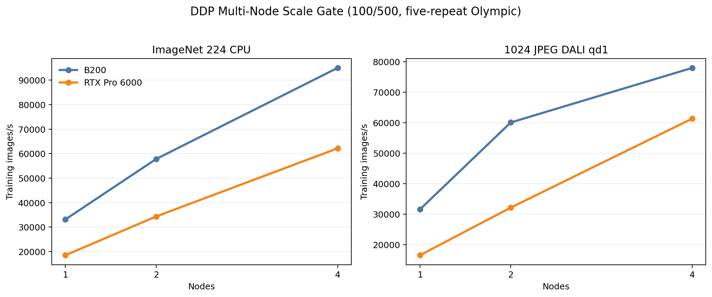
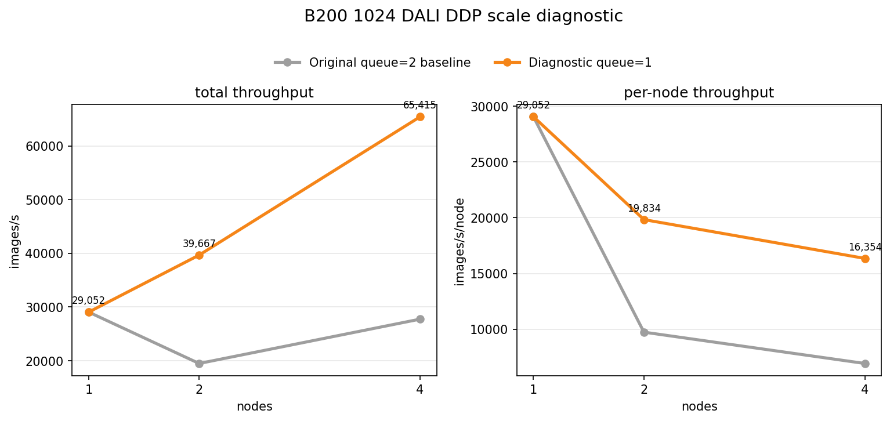
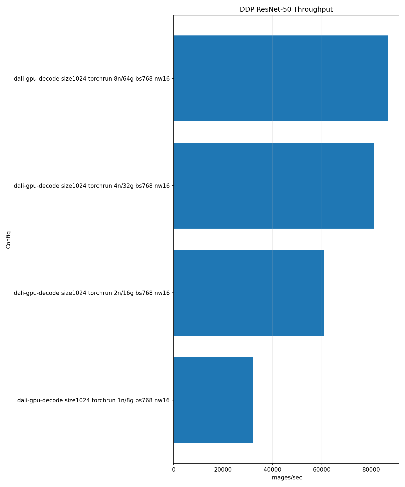

# DDP Multi-Node Scale Validation

<!-- aicr-study-status: published -->

Purpose: compare B200 and RTX Pro 6000 ResNet-50 DDP scaling for selected
ImageNet `224` and derived `1024` JPEG input candidates.

The one-node [DataLoader training validation](dataloader-candidate-followup.md)
shows how the selected input candidates behave inside one-node ResNet-50 DDP
training. This study carries those endpoint candidates to `2` and `4` nodes.

The candidates come from the
[DataLoader optimized 224/1024 backend crossover](../../dataloader/studies/optimized-backend-crossover.md)
and the one-node [DDP DataLoader training validation](dataloader-candidate-followup.md).

## Study Questions

- How do the selected `224` and `1024` input candidates scale from one to four
  nodes?
- How do total throughput, per-node throughput, and input wait change at scale?
- For B200 derived `1024` JPEG DALI rows, how does DALI queue depth affect the
  multi-node input-wait pattern?

## Input Candidates

The endpoint story has two very different candidates:

- standard ImageNet `224`, where tuned PyTorch CPU DataLoader remains the
  best real-input path;
- derived `1024` JPEG, where tuned DALI is the best large-JPEG candidate.

This study carries the selected endpoint candidates to `1`, `2`, and `4`
nodes and checks total training throughput, throughput per node, and data-wait
behavior.

## Run Shape

| Field | Value |
| --- | --- |
| Module | `ddp` |
| Model | ResNet-50 |
| Launcher | `torchrun` |
| Platforms | B200, RTX Pro 6000 |
| Nodes | `1`, `2`, `4` |
| GPUs per node | `8` |
| Precision | `bf16` |
| Standard input candidate | full ImageNet `224`, PyTorch CPU DataLoader |
| Large input candidate | scratch-hosted `spc-80` (80 samples per ImageNet class) derived `1024` JPEG, DALI |
| B200 CPU config | batch `768`, workers `16`, prefetch `4` |
| RTX CPU config | batch `768`, workers `16`, prefetch `6` |
| B200 DALI config | batch `768`, DALI threads `8`, queue `1` |
| RTX DALI config | batch `768`, DALI threads `8`, queue `1`, prefetch `8` |
| Warmup / measured | `100` / `500` iterations |
| Aggregation | five-repeat Olympic average |

The `1024` DALI rows use `spc-80` derived JPEGs rather than the earlier
`spc-16` endpoint rows, meaning 80 rather than 16 samples per ImageNet class,
so the multi-node run has a larger finite input pool.
That changes sample count, not the representation: both are derived `1024`
JPEG ImageFolder trees. Use this page's `spc-80` paths when replaying the
multi-node rows.

The B200 queue-depth follow-up uses `100` warmup and `500` measured iterations.
Shorter `20`/`100` rows are excluded from the queue-depth result.

## Command Run

Standard ImageNet CPU scale rows:

```bash
scripts/benchmark/submit-ddp-resnet50.sh \
  --cluster <b200|rtxpro6000> \
  --nodes <1|2|4> \
  --partition <b200-batch|rtx-batch> \
  --time 01:00:00 \
  --repeat-count 5 \
  --mem 0 \
  --apply \
  -- \
  --dataset-root /work/aicr/commissioning/benchmarks/imagenet/ILSVRC/Data/CLS-LOC \
  --input-backend pytorch-cpu-dataloader \
  --batch-size 768 \
  --num-workers 16 \
  --prefetch-factor <4|6> \
  --pin-memory 1 \
  --persistent-workers 1 \
  --warmup-iters 100 \
  --measured-iters 500 \
  --precision bf16 \
  --channels-last 1 \
  --drop-last 1
```

Derived `1024` DALI scale rows:

```bash
scripts/benchmark/submit-ddp-resnet50.sh \
  --cluster <b200|rtxpro6000> \
  --nodes <1|2|4> \
  --partition <b200-batch|rtx-batch|rtx-devel> \
  --time 01:00:00 \
  --repeat-count 5 \
  --mem 0 \
  --apply \
  -- \
  --dataset-root /scratch/$USER/aicr-bench/studies/dataloader-ddp-v1/imagenet/train/spc-80-seed-1234/size-1024/jpeg \
  --input-backend dali-gpu-decode \
  --derived-root /scratch/$USER/aicr-bench/studies/dataloader-ddp-v1/imagenet/train/spc-80-seed-1234 \
  --derived-image-size 1024 \
  --derived-samples-per-class 80 \
  --derived-seed 1234 \
  --batch-size 768 \
  --num-workers 16 \
  --prefetch-factor <4|8> \
  --dali-num-threads 8 \
  --dali-prefetch-queue-depth <1|2> \
  --dali-decode-mode random-crop \
  --dali-hw-decoder-load 0.65 \
  --pin-memory 1 \
  --persistent-workers 1 \
  --warmup-iters 100 \
  --measured-iters 500 \
  --precision bf16 \
  --channels-last 1 \
  --drop-last 1
```

Exact expanded Slurm rows, job IDs, summaries, aggregates, and rendered reports
are in the artifact bundle.

## Result Summary

| Platform | Candidate | 1 node img/s | 2 node img/s | 4 node img/s | 4-node efficiency | Reading |
| --- | --- | ---: | ---: | ---: | ---: | --- |
| B200 | ImageNet `224` PyTorch CPU | `33,114` | `57,780` | `94,997` | `72%` | Scales usefully, with expected per-node taper. |
| B200 | Derived `1024` JPEG DALI qd1 | `31,536` | `60,071` | `78,007` | `62%` | Queue-depth tuning corrects the earlier B200 queue-depth-2 input-wait pattern through four nodes. |
| RTX Pro 6000 | ImageNet `224` PyTorch CPU | `18,502` | `34,323` | `62,146` | `84%` | Scales cleanly through `4` nodes. |
| RTX Pro 6000 | Derived `1024` JPEG DALI qd1 | `16,484` | `32,116` | `61,352` | `93%` | Large-JPEG DALI candidate scales cleanly. |

## Figure



The upper panels show total training throughput. The lower panels show
throughput per node so the scale cost is visible without mentally dividing the
bars or lines.

## Interpretation

The standard ImageNet CPU path scales on both platforms. It remains the
cleanest training recommendation for canonical `224` ImageNet-like work.

The derived `1024` DALI candidate is queue-depth-sensitive at scale. The older
B200 queue-depth `2` rows exposed an input-wait pattern; the `100`/`500`
queue-depth `1` rows recover useful two-node and four-node scaling.
RTX Pro 6000 also scales cleanly with the tuned queue-depth `1` shape.

## B200 1024 DALI Queue-Depth Follow-Up

A bounded B200 follow-up kept the same `spc-80` derived `1024` JPEG dataset,
same four-node placement, and same batch/thread shape, then varied the DALI
queue depth and a small number of nearby controls. The queue-depth `1` row was
the clear winner and was repeated to five samples at both `2` and `4` nodes.
The one-node anchor in this section is inherited from the parent scale
validation queue-depth `2` row; a separate one-node queue-depth `1` anchor is
included below with the final `100`/`500` rows.

| Shape | Queue | Samples | Olympic img/s | Data wait | Reading |
| --- | ---: | ---: | ---: | ---: | --- |
| Original 2-node DALI row | `2` | `5` | `19,486` | `0.465s` | Baseline two-node row showing the queue-depth-2 input-wait pattern. |
| Queue-depth 1 two-node DALI row | `1` | `5` | `39,667` | `0.170s` | Queue depth is a major part of the bottleneck. |
| Original 4-node DALI row | `2` | `5` | `27,741` | `0.703s` | Original four-node row did not scale beyond the two-node throughput. |
| Queue-depth 1 four-node DALI row | `1` | `5` | `65,415` | `0.183s` | More than `2x` the original 4-node row. |



### B200 Queue-Depth `1` Rows

The queue-depth follow-up was rerun with `100` warmup and `500` measured
iterations, and with five-repeat Olympic aggregation at each scale. These rows
keep the same `spc-80` derived `1024` JPEG root, B200 nodes, batch, worker,
thread, and `random-crop` DALI semantics, but use DALI queue depth `1`.

| Nodes | Jobs | Olympic img/s | Per-node img/s | Olympic data wait | Reading |
| ---: | --- | ---: | ---: | ---: | --- |
| `1` | `26571-26575` | `31,536` | `31,536` | `0.045s` | One-node anchor with the tuned queue-depth shape. |
| `2` | `26576-26580` | `60,071` | `30,036` | `0.054s` | Corrects the original B200 two-node cliff. |
| `4` | `26581-26585` | `78,007` | `19,502` | `0.121s` | More than `2x` the original queue-depth `2` four-node row. |
| `8` | `26586-26590` | `83,207` | `10,401` | `0.379s` | Extends the queue-depth `1` run to eight nodes; input wait rises again. |



This follow-up narrows the B200 cliff to DALI queueing behavior under this
multi-node derived-JPEG workload. Queue depth `1` is the tuned B200 `1024` DALI
shape for this study.

## Artifact Bundle

| Item | Path |
| --- | --- |
| OSN bundle | <https://uma1.osn.mghpcc.org/csim-bmark/public-study-artifacts/aicr-public/f798897/ddp/ddp-multinode-scale-validation-100x500.tar.gz> |
| OSN provenance | <https://uma1.osn.mghpcc.org/csim-bmark/public-study-artifacts/aicr-public/f798897/ddp/multinode-scale-validation-100x500/provenance.json> |
| OSN checksum | <https://uma1.osn.mghpcc.org/csim-bmark/public-study-artifacts/aicr-public/f798897/ddp/ddp-multinode-scale-validation-100x500.sha256> |

The bundle is filtered to the `100`/`500` rows. Earlier `20`/`100` rows are
excluded from the CSV/JSON.

## Retrieve And Verify

```bash
mkdir -p public-study-artifacts/ddp-multinode-scale-validation
cd public-study-artifacts/ddp-multinode-scale-validation
wget https://uma1.osn.mghpcc.org/csim-bmark/public-study-artifacts/aicr-public/f798897/ddp/ddp-multinode-scale-validation-100x500.tar.gz
wget https://uma1.osn.mghpcc.org/csim-bmark/public-study-artifacts/aicr-public/f798897/ddp/ddp-multinode-scale-validation-100x500.sha256
sha256sum -c ddp-multinode-scale-validation-100x500.sha256
tar -tzf ddp-multinode-scale-validation-100x500.tar.gz | head
```

## Related Pages

- [DDP DataLoader training validation](dataloader-candidate-followup.md)
- [DDP input ceilings](input-ceilings.md)
