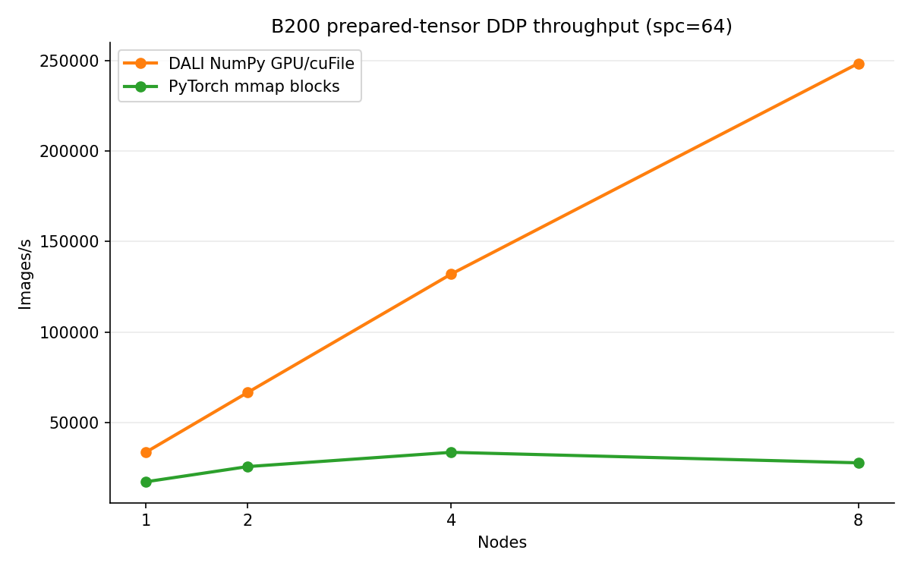
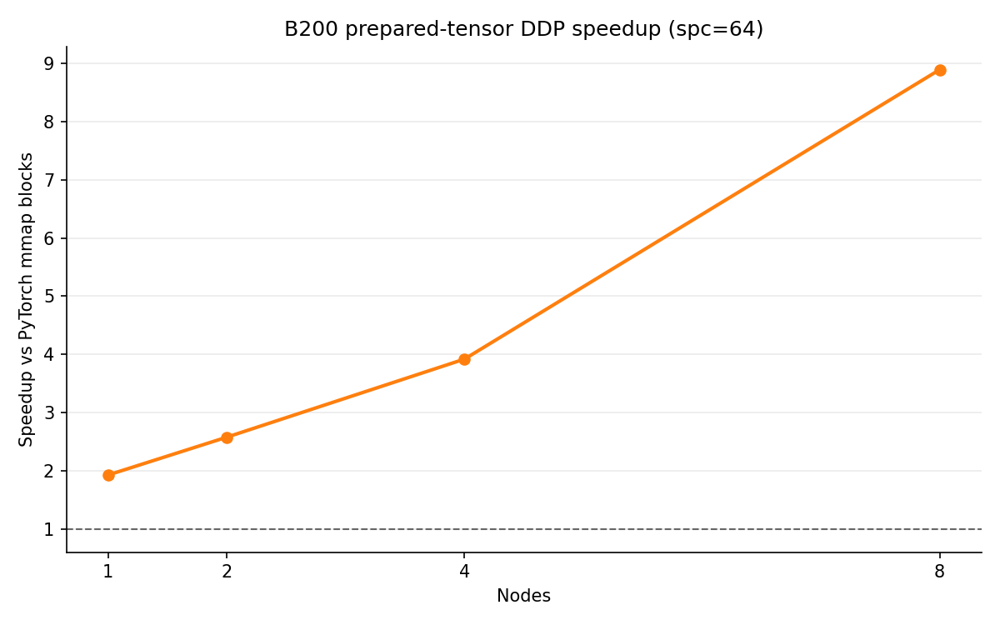

# DDP Prepared-Tensor GPU/cuFile Scale Follow-Up

<!-- aicr-study-status: published -->

Purpose: compare B200 ResNet-50 DDP scaling for prepared fp16 tensor blocks
through PyTorch CPU mmap and DALI GPU/cuFile paths.

`spc` means samples per class. For ImageNet-derived prepared sets, `spc=64`
means `64,000` logical samples and `spc=128` means `128,000` logical samples.
The `spc=64` and `spc=128` ladders below are separate evidence slices and
use different logical sample budgets.

This study extends the one-node
[DDP prepared-tensor GPU/cuFile transport pilot](prepared-tensor-gds-transport.md)
with repeated multi-node rows for the same prepared-block representation.

## Study Question

How does the DALI NumPy GPU/cuFile prepared-block path compare with a PyTorch
CPU mmap prepared-block comparator as the B200 DDP job scales across nodes?

## Measured Paths

The tested GDS path is DALI `fn.readers.numpy(device="gpu",
use_o_direct=True)` over prepared `numpy-fp16-blocks` files. The comparator is
PyTorch CPU mmap over the same blocked tensor layout. The DALI rows use
synthetic GPU labels, so the result tests the image transport path rather than
the complete dataset-label path.

## Run Shape

| Field | Value |
| --- | --- |
| Module | DDP ResNet-50 |
| Platform | B200 |
| Launcher | `torchrun` |
| Precision | `bf16`, channels-last |
| Image tensor shape | prepared fp16 NCHW, `size=256` |
| Storage layout | `numpy-fp16-blocks` |
| NumPy block size | `512` images per block file |
| Logical batch | `512` images per GPU |
| Timing | `100` warmup iterations, `500` measured iterations |
| Aggregation | Five-run Olympic aggregation |

`spc` means samples per class. For ImageNet-derived prepared sets, `spc=64`
means `64,000` logical samples and `spc=128` means `128,000` logical samples.

## `spc=64` Scale Follow-Up

The `spc=64` ladder is the same-input scale follow-up for one, two, four, and
eight B200 nodes. It stops at eight nodes because the `spc=64` prepared set is
too small for the tested sixteen-node shape with this block and batch policy.

| Nodes | World size | Backend | Jobs | Olympic img/s | Mean img/s | Min img/s | Max img/s | Img/s per rank | Estimated read GB/s | Speedup vs PyTorch block | cuFile evidence |
| ---: | ---: | --- | --- | ---: | ---: | ---: | ---: | ---: | ---: | ---: | --- |
| `1` | `8` | `dali-numpy-fp16-blocks-gds` | `29043`-`29047` | `33,799.04` | `33,792.21` | `33,753.05` | `33,810.89` | `4,224.88` | `13.29` | `1.93x` | `8/8` ranks logged cuFile init |
| `1` | `8` | `numpy-fp16-blocks-pytorch` | `29048`-`29052` | `17,471.25` | `17,301.33` | `16,517.69` | `17,575.23` | `2,183.91` | `6.87` | baseline | not a cuFile path |
| `2` | `16` | `dali-numpy-fp16-blocks-gds` | `29054`, `29056`-`29059` | `66,771.71` | `66,133.88` | `63,344.16` | `67,010.13` | `4,173.23` | `26.26` | `2.58x` | `16/16` ranks logged cuFile init |
| `2` | `16` | `numpy-fp16-blocks-pytorch` | `29055`, `29060`-`29063` | `25,850.19` | `26,012.02` | `25,145.64` | `27,363.89` | `1,615.64` | `10.16` | baseline | not a cuFile path |
| `4` | `32` | `dali-numpy-fp16-blocks-gds` | `29085`, `29087`, `29089`, `29091`, `29093` | `132,099.42` | `131,407.28` | `127,808.88` | `132,929.29` | `4,128.11` | `51.94` | `3.92x` | `32/32` ranks logged cuFile init |
| `4` | `32` | `numpy-fp16-blocks-pytorch` | `29086`, `29088`, `29090`, `29092`, `29094` | `33,717.13` | `33,578.03` | `32,283.34` | `34,455.43` | `1,053.66` | `13.26` | baseline | not a cuFile path |
| `8` | `64` | `dali-numpy-fp16-blocks-gds` | `29096`, `29098`, `29100`, `29102`, `29104` | `248,318.06` | `245,823.70` | `231,377.80` | `252,786.50` | `3,879.97` | `97.64` | `8.89x` | `64/64` ranks logged cuFile init |
| `8` | `64` | `numpy-fp16-blocks-pytorch` | `29095`, `29097`, `29099`, `29101`, `29103` | `27,924.64` | `27,836.98` | `26,722.71` | `28,688.30` | `436.32` | `10.98` | baseline | not a cuFile path |

Speedup ladder, interpreted with the PyTorch-dip caveat below: `1.93x` at one
node, `2.58x` at two nodes, `3.92x` at four nodes, and `8.89x` at eight nodes.
Per-rank DALI NumPy GPU/cuFile throughput stays near the one-node level
(`4,224.88`, `4,173.23`, `4,128.11`, then `3,879.97` img/s per rank), while
per-rank PyTorch CPU mmap throughput falls more sharply (`2,183.91`,
`1,615.64`, `1,053.66`, then `436.32` img/s per rank).

The eight-node `8.89x` ratio is an endpoint comparison that includes both the
DALI NumPy GPU/cuFile result and the PyTorch CPU mmap comparator behavior. The
DALI NumPy GPU/cuFile row remains high through eight nodes, while the PyTorch
CPU mmap comparator drops below its four-node result. The prepared-tensor
GPU/cuFile path remains faster than this CPU mmap comparator through eight
B200 nodes.

## `spc=64` Figures

These figures use only the same-input `spc=64` one-, two-, four-, and
eight-node ladder. The separate `spc=128` ladder below uses a different
logical sample budget and has its own result table.





## `spc=128` Five-Repeat 1/2/4/8/16-Node Ladder

This is a separate five-repeat `spc=128` prepared-block ladder at one, two,
four, eight, and sixteen B200 nodes. It uses `spc=128` (`128,000` logical
samples), while the earlier ladder uses `spc=64` (`64,000` logical samples).
The two ladders have different logical sample budgets and different per-rank
sample counts at the same node count, so cache, file-open, and per-rank I/O
behavior differ.

| Nodes | World size | Backend | Jobs | Olympic img/s | Min img/s | Max img/s | Img/s per rank | Estimated read GB/s | Speedup vs PyTorch block | cuFile evidence |
| ---: | ---: | --- | --- | ---: | ---: | ---: | ---: | ---: | ---: | --- |
| `1` | `8` | `dali-numpy-fp16-blocks-gds` | `29373`-`29377` | `33,722.56` | `32,149.68` | `33,780.85` | `4,215.32` | `13.26` | `1.64x` | `8/8` ranks logged cuFile init |
| `1` | `8` | `numpy-fp16-blocks-pytorch` | `29466`-`29470` | `20,595.18` | `20,346.01` | `20,837.92` | `2,574.40` | `8.10` | baseline | not a cuFile path |
| `2` | `16` | `dali-numpy-fp16-blocks-gds` | `29383`-`29387` | `66,921.16` | `66,731.66` | `67,064.08` | `4,182.57` | `26.32` | `2.02x` | `16/16` ranks logged cuFile init |
| `2` | `16` | `numpy-fp16-blocks-pytorch` | `29471`-`29473`, `29475`-`29476` | `33,079.30` | `32,502.47` | `33,647.58` | `2,067.46` | `13.01` | baseline | not a cuFile path |
| `4` | `32` | `dali-numpy-fp16-blocks-gds` | `29393`-`29397` | `132,439.53` | `128,360.28` | `132,672.23` | `4,138.74` | `52.08` | `2.59x` | `32/32` ranks logged cuFile init |
| `4` | `32` | `numpy-fp16-blocks-pytorch` | `29477`, `29480`, `29521`-`29523` | `51,206.92` | `50,000.15` | `54,384.65` | `1,600.22` | `20.14` | baseline | not a cuFile path |
| `8` | `64` | `dali-numpy-fp16-blocks-gds` | `29403`-`29407` | `259,291.69` | `253,351.10` | `261,103.85` | `4,051.43` | `101.96` | `4.03x` | `64/64` ranks logged cuFile init |
| `8` | `64` | `numpy-fp16-blocks-pytorch` | `29524`-`29528` | `64,377.57` | `58,547.34` | `68,964.58` | `1,005.90` | `25.31` | baseline | not a cuFile path |
| `16` | `128` | `dali-numpy-fp16-blocks-gds` | `29413`-`29417` | `390,725.78` | `371,255.92` | `408,247.32` | `3,052.55` | `153.64` | `7.24x` | `128/128` ranks logged cuFile init |
| `16` | `128` | `numpy-fp16-blocks-pytorch` | `29529`-`29530`, `29532`, `29534`, `29537` | `54,002.21` | `51,102.83` | `55,974.72` | `421.89` | `21.23` | baseline | not a cuFile path |

Speedups are endpoint comparisons against this prepared-block PyTorch CPU mmap
comparator. Per-rank DALI NumPy GPU/cuFile throughput tapers from `4,215.32`
to `3,052.55` img/s per rank from one to sixteen nodes, while per-rank PyTorch
CPU mmap drops from `2,574.40` to `421.89` img/s per rank. The `7.24x`
sixteen-node ratio is therefore an endpoint comparison for this prepared-tensor
block layout.

The first-launcher PyTorch submissions `29378`-`29382`, `29388`-`29392`,
`29398`-`29402`, `29408`-`29412`, and `29418`-`29422` are excluded from this
table because an empty `--dali-gds-chunk-size` value shifted positional
arguments at submission time. The resubmitted PyTorch runs in the table above
use the corrected launcher and all completed with status passed.

## Artifact Bundle

The public OSN artifacts below cover both result slices on this page. The
original scale-follow-up bundle covers the `spc=64` ladder plus the earlier
single sixteen-node `spc=128` comparator slice. The expanded-ladder bundle
covers the five-repeat `spc=128` one-, two-, four-, eight-, and sixteen-node
table above. Use the OSN URLs for public retrieval.

| Original scale-follow-up item | Path |
| --- | --- |
| Bundle scope | B200 DDP prepared-tensor GPU/cuFile `spc=64` scale ladder plus the earlier single sixteen-node `spc=128` comparator slice. |
| OSN bundle | <https://uma1.osn.mghpcc.org/csim-bmark/public-study-artifacts/aicr-public/18e1fb4/ddp/2026-05-26/ddp-b200-prepared-tensor-gds-scale-followup-100x500-2026-05-26.tar.gz> |
| OSN provenance | <https://uma1.osn.mghpcc.org/csim-bmark/public-study-artifacts/aicr-public/18e1fb4/ddp/2026-05-26/ddp-b200-prepared-tensor-gds-scale-followup-100x500-2026-05-26/provenance.json> |
| OSN checksum | <https://uma1.osn.mghpcc.org/csim-bmark/public-study-artifacts/aicr-public/18e1fb4/ddp/2026-05-26/ddp-b200-prepared-tensor-gds-scale-followup-100x500-2026-05-26.sha256> |
| AICR source bundle | `/work/aicr/commissioning/benchmarks/public-study-artifacts/aicr-public/18e1fb4/ddp/2026-05-26/ddp-b200-prepared-tensor-gds-scale-followup-100x500-2026-05-26.tar.gz` |
| AICR source expanded bundle | `/work/aicr/commissioning/benchmarks/public-study-artifacts/aicr-public/18e1fb4/ddp/2026-05-26/ddp-b200-prepared-tensor-gds-scale-followup-100x500-2026-05-26/` |
| SHA-256 | `2bf5e22f985f6f1f3fc9dcd231ead592aa42c4d3553d6d59bafee6320d178518` |

| Expanded `spc=128` ladder item | Path |
| --- | --- |
| Bundle scope | B200 DDP prepared-tensor GPU/cuFile expanded `spc=128` one-, two-, four-, eight-, and sixteen-node ladder only. |
| OSN bundle | <https://uma1.osn.mghpcc.org/csim-bmark/public-study-artifacts/aicr-public/a2491b8/ddp/2026-05-26/ddp-b200-prepared-tensor-gds-spc128-ladder-100x500-2026-05-26.tar.gz> |
| OSN provenance | <https://uma1.osn.mghpcc.org/csim-bmark/public-study-artifacts/aicr-public/a2491b8/ddp/2026-05-26/ddp-b200-prepared-tensor-gds-spc128-ladder-100x500-2026-05-26/provenance.json> |
| OSN checksum | <https://uma1.osn.mghpcc.org/csim-bmark/public-study-artifacts/aicr-public/a2491b8/ddp/2026-05-26/ddp-b200-prepared-tensor-gds-spc128-ladder-100x500-2026-05-26.sha256> |
| AICR source bundle | `/work/aicr/commissioning/benchmarks/public-study-artifacts/aicr-public/a2491b8/ddp/2026-05-26/ddp-b200-prepared-tensor-gds-spc128-ladder-100x500-2026-05-26.tar.gz` |
| AICR source expanded bundle | `/work/aicr/commissioning/benchmarks/public-study-artifacts/aicr-public/a2491b8/ddp/2026-05-26/ddp-b200-prepared-tensor-gds-spc128-ladder-100x500-2026-05-26/` |
| SHA-256 | `795a52a66f0f9345facb0bac24b93becf9ff52349d14bab99f02f1224059268c` |

Together, the bundles contain rendered DDP reports, aggregate CSV/JSON,
selected parsed summaries/status files, DDP command records, rank-local cuFile
logs for the GDS rows, same-node `verify-gds` evidence, provenance JSON, and
expanded `SHA256SUMS` manifests. Public retrieve/verify checked `4,265`
expanded files from the `spc=128` OSN bundle against `SHA256SUMS`.

## Retrieve And Verify

Retrieve the public OSN bundle and verify both the archive checksum and the
expanded file manifest:

```bash
mkdir -p public-study-artifacts/ddp-b200-prepared-tensor-gds-scale-followup
cd public-study-artifacts/ddp-b200-prepared-tensor-gds-scale-followup
wget https://uma1.osn.mghpcc.org/csim-bmark/public-study-artifacts/aicr-public/18e1fb4/ddp/2026-05-26/ddp-b200-prepared-tensor-gds-scale-followup-100x500-2026-05-26.tar.gz
wget https://uma1.osn.mghpcc.org/csim-bmark/public-study-artifacts/aicr-public/18e1fb4/ddp/2026-05-26/ddp-b200-prepared-tensor-gds-scale-followup-100x500-2026-05-26.sha256
sha256sum -c ddp-b200-prepared-tensor-gds-scale-followup-100x500-2026-05-26.sha256
tar -xzf ddp-b200-prepared-tensor-gds-scale-followup-100x500-2026-05-26.tar.gz
cd ddp-b200-prepared-tensor-gds-scale-followup-100x500-2026-05-26
sha256sum -c SHA256SUMS
```

Retrieve and verify the expanded `spc=128` ladder bundle:

```bash
mkdir -p public-study-artifacts/ddp-b200-prepared-tensor-gds-spc128-ladder
cd public-study-artifacts/ddp-b200-prepared-tensor-gds-spc128-ladder
wget https://uma1.osn.mghpcc.org/csim-bmark/public-study-artifacts/aicr-public/a2491b8/ddp/2026-05-26/ddp-b200-prepared-tensor-gds-spc128-ladder-100x500-2026-05-26.tar.gz
wget https://uma1.osn.mghpcc.org/csim-bmark/public-study-artifacts/aicr-public/a2491b8/ddp/2026-05-26/ddp-b200-prepared-tensor-gds-spc128-ladder-100x500-2026-05-26.sha256
sha256sum -c ddp-b200-prepared-tensor-gds-spc128-ladder-100x500-2026-05-26.sha256
tar -xzf ddp-b200-prepared-tensor-gds-spc128-ladder-100x500-2026-05-26.tar.gz
cd ddp-b200-prepared-tensor-gds-spc128-ladder-100x500-2026-05-26
sha256sum -c SHA256SUMS
```

## Interpretation

For the tested prepared-block DDP endpoint, the DALI NumPy GPU/cuFile path is
faster than the equivalent PyTorch CPU mmap path on B200. The measured DALI
GPU/cuFile path is `fn.readers.numpy(device="gpu", use_o_direct=True)` over
prepared `numpy-fp16-blocks` tensors. DALI JPEG file input through GDS is a
separate path from the one measured here.

## Related Pages

- [DDP prepared-tensor GPU/cuFile transport pilot](prepared-tensor-gds-transport.md)
- [DataLoader input pipeline reference](../../dataloader/input-pipeline-reference.md)
- [Where the input work lives](../../dataloader/studies/input-representations.md)
