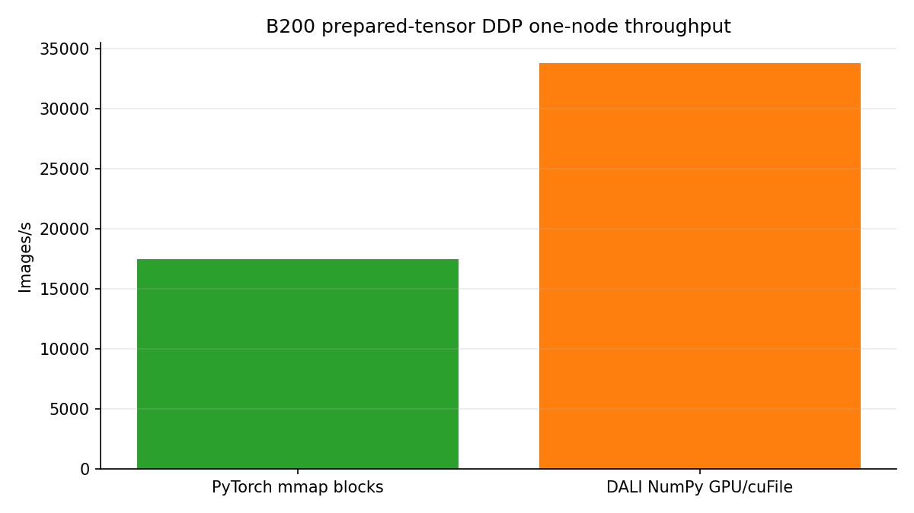
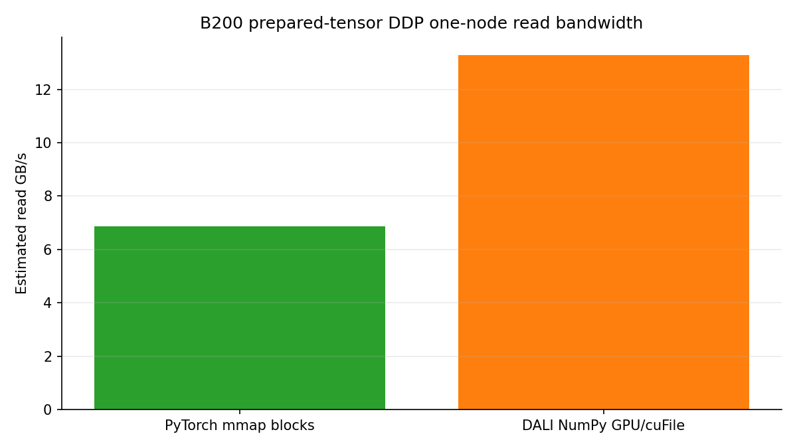

# DDP Prepared-Tensor GPU/cuFile Transport Pilot

<!-- aicr-study-status: published -->

Purpose: compare one-node B200 ResNet-50 DDP throughput for prepared fp16
tensor blocks through PyTorch CPU mmap and DALI GPU/cuFile paths.

This study reports five `100`-warmup / `500`-measured fixed-iteration rows for
`numpy-fp16-blocks-pytorch` and `dali-numpy-fp16-blocks-gds` on one B200 node.
It measures prepared-tensor transport throughput for the DALI NumPy GPU/cuFile
path.

## Study Question

How does the DALI NumPy GPU/cuFile prepared-block path compare with a PyTorch
CPU mmap prepared-block comparator during fixed-iteration ResNet-50 DDP
training on one B200 node?

## Measured Paths

- real prepared fp16 image tensors stored as blocked NumPy files;
- DALI `fn.readers.numpy(device="gpu", use_o_direct=True)` for the GPU/cuFile
  row;
- PyTorch CPU mmap over the same blocked tensor layout as the comparator;
- fixed-iteration DDP throughput on one B200 node;
- synthetic GPU labels for the DALI row.

## Run Shape

| Field | Value |
| --- | --- |
| Module | DDP ResNet-50 |
| Platform | B200 |
| Node shape | One node, eight GPUs |
| Node | `b0011` |
| Launcher | `torchrun` |
| Precision | `bf16`, channels-last |
| Image tensor shape | prepared fp16 NCHW, `size=256` |
| Dataset subset | `spc=64`, seed `1234` |
| Storage layout | `numpy-fp16-blocks` |
| NumPy block size | `512` images per block file |
| Logical batch | `512` images per GPU, `4096` global |
| DALI reader batch | `1` block file per GPU step |
| Timing | `100` warmup iterations, `500` measured iterations |
| Aggregation | Five-run Olympic aggregation |

The DALI row uses synthetic GPU labels because DALI NumPy GPU delivery produces
GPU-resident image tensors. That choice measures image transport without adding
a CPU label-transfer path, but it also means the row is throughput-path
evidence only.

## Result Summary

The DALI NumPy GPU/cuFile path reached `33,799` images/s by Olympic aggregate,
`1.93x` faster than the PyTorch CPU mmap prepared-block comparator on the same
one-node B200 shape. The DALI row uses synthetic GPU labels, so the result
measures image-transport throughput rather than the full dataset label path.

| Backend | Runs | Jobs | Olympic img/s | Mean img/s | Min img/s | Max img/s | Estimated read GB/s | Speedup vs PyTorch block | Storage path | Labels | cuFile evidence |
| --- | --- | --- | ---: | ---: | ---: | ---: | ---: | ---: | --- | --- | --- |
| `dali-numpy-fp16-blocks-gds` | `072108Z-r01`, `072313Z-r01`, `072521Z-r01`, `072729Z-r01`, `072934Z-r01` | `29043`, `29044`, `29045`, `29046`, `29047` | `33,799.04` | `33,792.21` | `33,753.05` | `33,810.89` | `13.29` | `1.93x` | `dali-numpy-block-gpu-gds` | synthetic GPU | eight cuFile logs per run; eight init lines |
| `numpy-fp16-blocks-pytorch` | `073140Z-r01`, `073427Z-r01`, `073713Z-r01`, `073958Z-r01`, `074248Z-r01` | `29048`, `29049`, `29050`, `29051`, `29052` | `17,471.25` | `17,301.33` | `16,517.69` | `17,575.23` | `6.87` | baseline | `pytorch-numpy-block-cpu-mmap` | dataset labels | not a cuFile path |

The cuFile logs record the GPU/cuFile reader path for the DALI rows. Canonical
ImageNet JPEG training, DALI JPEG/GDS, model accuracy, training quality, and
multi-node scaling are separate questions.

## Figures

The one-node throughput and estimated-read figures use the same five-run
Olympic aggregate as the result table. They are DDP training-loop figures for
the prepared-tensor endpoint, not DataLoader-only figures.





## Input Candidate

The input-side candidate selection for this DDP pilot is documented in the
DataLoader module:
[B200 prepared-tensor GPU/cuFile DataLoader transport](../../dataloader/studies/b200-prepared-tensor-gds-transport.md).
That page reports the DataLoader-only size ladder and reader-path comparison.
This page measures fixed-iteration DDP training throughput for the selected
prepared-block endpoint.

## Interpretation

- DataLoader found that per-sample `.npy` files were too inefficient for useful
  training evidence.
- Blocking prepared fp16 tensors reduced file-count overhead and made the DALI
  NumPy GPU/cuFile path competitive.
- In this pilot, the DALI NumPy GPU/cuFile path beat the equivalent PyTorch CPU
  mmap prepared-block comparator under fixed-iteration DDP.
- DALI JPEG file input through GDS is a separate path from the DALI NumPy
  GPU/cuFile path measured here.

## Artifact Bundle

| Item | Path |
| --- | --- |
| Bundle scope | B200 one-node DDP prepared-tensor GPU/cuFile pilot. |
| OSN bundle | <https://uma1.osn.mghpcc.org/csim-bmark/public-study-artifacts/aicr-public/18e1fb4/ddp/2026-05-26/ddp-prepared-tensor-gds-transport-100x500-2026-05-26.tar.gz> |
| OSN provenance | <https://uma1.osn.mghpcc.org/csim-bmark/public-study-artifacts/aicr-public/18e1fb4/ddp/2026-05-26/ddp-prepared-tensor-gds-transport-100x500-2026-05-26/provenance.json> |
| OSN checksum | <https://uma1.osn.mghpcc.org/csim-bmark/public-study-artifacts/aicr-public/18e1fb4/ddp/2026-05-26/ddp-prepared-tensor-gds-transport-100x500-2026-05-26.sha256> |
| AICR source bundle | `/work/aicr/commissioning/benchmarks/public-study-artifacts/aicr-public/18e1fb4/ddp/2026-05-26/ddp-prepared-tensor-gds-transport-100x500-2026-05-26.tar.gz` |
| AICR source expanded bundle | `/work/aicr/commissioning/benchmarks/public-study-artifacts/aicr-public/18e1fb4/ddp/2026-05-26/ddp-prepared-tensor-gds-transport-100x500-2026-05-26/` |
| SHA-256 | `c01174fa2ec98b638b6fec0737dc422ef8ea2da9073f4dcbd0351e405452ce73` |

The bundle contains the rendered DDP report, five-run CSV/JSON, selected
parsed summaries/status files, DDP command records, rank-local cuFile logs for
the GDS rows, and same-node `verify-gds` evidence for `b0011`
(`033552Z-r01`). The OSN links are the public retrieval path.

## Retrieve And Verify

Retrieve the public OSN bundle and verify both the archive checksum and the
expanded file manifest:

```bash
mkdir -p public-study-artifacts/ddp-prepared-tensor-gds-transport
cd public-study-artifacts/ddp-prepared-tensor-gds-transport
wget https://uma1.osn.mghpcc.org/csim-bmark/public-study-artifacts/aicr-public/18e1fb4/ddp/2026-05-26/ddp-prepared-tensor-gds-transport-100x500-2026-05-26.tar.gz
wget https://uma1.osn.mghpcc.org/csim-bmark/public-study-artifacts/aicr-public/18e1fb4/ddp/2026-05-26/ddp-prepared-tensor-gds-transport-100x500-2026-05-26.sha256
sha256sum -c ddp-prepared-tensor-gds-transport-100x500-2026-05-26.sha256
tar -xzf ddp-prepared-tensor-gds-transport-100x500-2026-05-26.tar.gz
cd ddp-prepared-tensor-gds-transport-100x500-2026-05-26
sha256sum -c SHA256SUMS
```

## Related Pages

- [B200 prepared-tensor GPU/cuFile DataLoader transport](../../dataloader/studies/b200-prepared-tensor-gds-transport.md)
- [DataLoader input pipeline reference](../../dataloader/input-pipeline-reference.md)
- [Where the input work lives](../../dataloader/studies/input-representations.md)
- [DDP input ceilings](input-ceilings.md)
