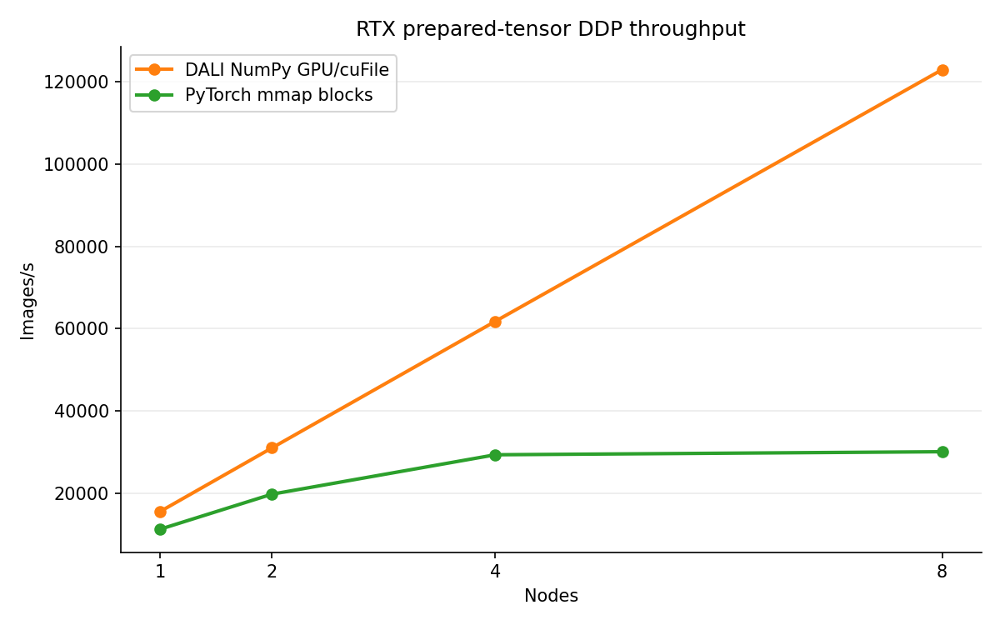
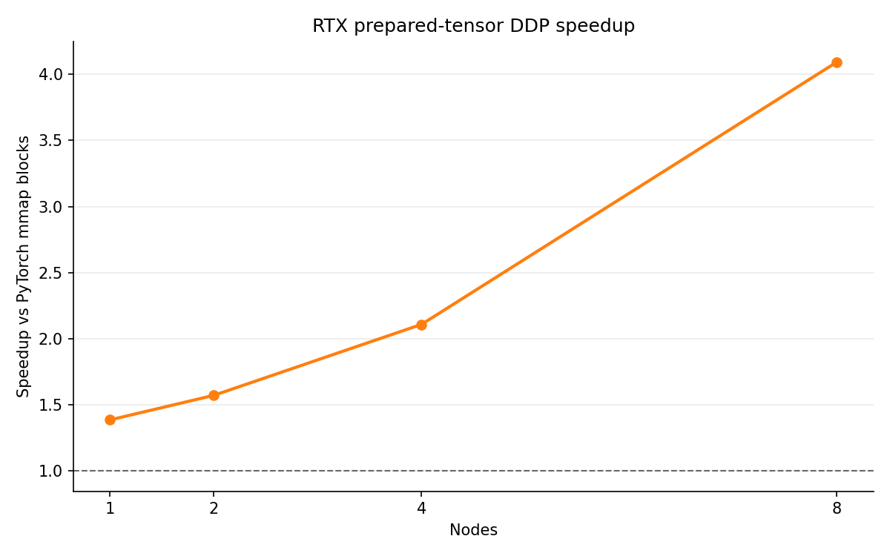

# DDP RTX Prepared-Tensor GPU/cuFile Transport Study

<!-- aicr-study-status: published -->

Purpose: compare RTX Pro 6000 ResNet-50 DDP throughput for prepared fp16 tensor
blocks through PyTorch CPU mmap and DALI GPU/cuFile paths.

This study reports completed five-repeat `100`-warmup / `500`-measured
fixed-iteration rows for `numpy-fp16-blocks-pytorch` and
`dali-numpy-fp16-blocks-gds` at one, two, four, and eight RTX Pro 6000 nodes.

The DALI DDP rows use real prepared fp16 image tensors with synthetic GPU
labels, and rank-local cuFile logs are archived. The measurements cover
prepared-tensor transport throughput. Canonical ImageNet JPEG training, DALI
JPEG/GDS, model accuracy, and training quality are separate questions.

## Study Question

How does the DALI NumPy GPU/cuFile prepared-block path compare with a PyTorch
CPU mmap prepared-block comparator during fixed-iteration ResNet-50 DDP
training on RTX Pro 6000 nodes?

## Measured Paths

- real prepared fp16 image tensors stored as blocked NumPy files;
- DALI `fn.readers.numpy(device="gpu", use_o_direct=True)` for the GPU/cuFile
  row;
- PyTorch CPU mmap over the same blocked tensor layout as the comparator;
- fixed-iteration DDP throughput on RTX Pro 6000 nodes;
- synthetic GPU labels for the DALI DDP row.

## Run Shape

| Field | Value |
| --- | --- |
| Module | DDP ResNet-50 |
| Platform | RTX Pro 6000 |
| Source checkout | `/work/aicr/commissioning/benchmarks/git/aicr-public/Cambridge/aicr-bench-rtx-prepared-gds-run/` |
| Commit | `8bdd675` on `dataloader-gds-prepared-blocks` |
| Launcher | `torchrun` for DDP |
| Precision | `bf16`, channels-last |
| Image tensor shape | prepared fp16 NCHW, `size=256` |
| Dataset subset | `spc=64`, seed `1234` |
| Storage layout | `numpy-fp16-blocks` |
| NumPy block size | `512` images per block file |
| DDP logical batch | `512` images per GPU, `4096` global per node |
| DALI DDP reader batch | `1` block file per GPU step |
| Full timing | `100` warmup iterations/batches, `500` measured iterations/batches |
| Smoke timing | `20` warmup iterations, `100` measured iterations |
| Scope | Prepared-tensor transport throughput |

The DALI DDP row uses synthetic GPU labels because DALI NumPy GPU delivery
produces GPU-resident image tensors. That keeps the study focused on image
transport and avoids adding a CPU label-transfer path, but it also means the
row is throughput-path evidence only.

Partition note: result tables preserve the Slurm partition names recorded at
run time. Current AICR submissions should use the site partition names
documented for the target GPU class.

## Run Checks

| Check | Evidence |
| --- | --- |
| RTX visible-GPU preflight | Repeatability nodes exposed 8 RTX Pro 6000 GPUs per node before DDP rows were submitted. The 8-node repeatability closeout used `a0008`-`a0015` preflight jobs `29333`-`29340`. |
| Same-node GDS verification | `make verify-gds` / `run-gds-fleet.sh` small profile passed on the nodes used for GDS rows. The 8-node repeatability closeout used `a0008`-`a0015` verification jobs `29341`-`29348`. Earlier one-, two-, and four-node rows used same-node verification before their GDS rows. |
| Dataset visibility | `/scratch/csim/aicr-bench/dataloader-gds-v2-block512/imagenet/train/spc-64-seed-1234/size-256/numpy-fp16-blocks`; `metadata.json` reports `sample_count=64000`, `class_count=1000`, `format=numpy-fp16-blocks`, `block_size=512`. |
| Slurm memory | Full-node jobs used `--mem=0`. |
| cuFile disclosure | GDS DDP rows produced per-rank `cufile.log` files. |

## Input Candidate

The input-side candidate selection for this DDP study is documented in the
DataLoader module:
[RTX prepared-tensor GPU/cuFile DataLoader transport](../../dataloader/studies/rtx-prepared-tensor-gds-transport.md).
That page reports the DataLoader-only one-node reader-path comparison. This
page measures fixed-iteration DDP training throughput for the selected
prepared-block endpoint.

## Result Summary

The RTX one-, two-, four-, and eight-node ladder uses `spc=64`. It should be
compared separately from the B200 `spc=64` ladder and the separate B200
`spc=128` ladder because the platform, input subset, and node ranges differ.

Completed `100/500` DDP repeatability rows:

The DALI rows in this table use real prepared fp16 image tensors with synthetic
GPU labels. They are DALI NumPy GPU/cuFile path rows with per-rank cuFile logs.
The rows below are filtered to the repeatability job set only; earlier same-day
single-sample rows are not included in these medians. CoV is the population
coefficient of variation across the five repeats.

| Nodes | Backend | Jobs | GDS verify jobs | Node list | Global batch | Median samples/s | Min samples/s | Max samples/s | CoV | Speedup vs PyTorch block | Storage path | cuFile evidence |
| ---: | --- | --- | --- | --- | ---: | ---: | ---: | ---: | ---: | ---: | --- | --- |
| `1` | `dali-numpy-fp16-blocks-gds` | `29233`-`29237` | `29229` | `a0001` | `4096` | `15,516.05` | `15,502.68` | `15,522.12` | `0.041%` | `1.385x` | `dali-numpy-block-gpu-gds` | eight cuFile logs per run |
| `1` | `numpy-fp16-blocks-pytorch` | `29238`-`29242` | not a GDS row | `a0001` | `4096` | `11,204.54` | `11,168.61` | `11,226.18` | `0.181%` | baseline | `pytorch-numpy-block-cpu-mmap` | not a cuFile path |
| `2` | `dali-numpy-fp16-blocks-gds` | `29243`-`29247` | `29229`-`29230` | `a0001,a0002` | `8192` | `30,978.19` | `30,965.01` | `30,982.07` | `0.022%` | `1.571x` | `dali-numpy-block-gpu-gds` | sixteen cuFile logs per run |
| `2` | `numpy-fp16-blocks-pytorch` | `29248`-`29252` | not a GDS row | `a0001,a0002` | `8192` | `19,720.05` | `19,618.86` | `19,812.42` | `0.322%` | baseline | `pytorch-numpy-block-cpu-mmap` | not a cuFile path |
| `4` | `dali-numpy-fp16-blocks-gds` | `29253`-`29257` | `29229`-`29232` | `a0001,a0002,a0003,a0004` | `16384` | `61,788.28` | `61,763.87` | `61,813.22` | `0.029%` | `2.108x` | `dali-numpy-block-gpu-gds` | thirty-two cuFile logs per run |
| `4` | `numpy-fp16-blocks-pytorch` | `29258`-`29262` | not a GDS row | `a0001,a0002,a0003,a0004` | `16384` | `29,310.72` | `28,702.52` | `29,496.29` | `0.927%` | baseline | `pytorch-numpy-block-cpu-mmap` | not a cuFile path |
| `8` | `dali-numpy-fp16-blocks-gds` | `29287`, `29349`-`29352` | `29279`-`29286`, `29341`-`29348` | `a0008,a0009,a0010,a0011,a0012,a0013,a0014,a0015` | `32768` | `123,023.05` | `122,901.88` | `123,090.43` | `0.056%` | `4.094x` | `dali-numpy-block-gpu-gds` | sixty-four cuFile logs per run |
| `8` | `numpy-fp16-blocks-pytorch` | `29288`, `29353`-`29356` | not a GDS row | `a0008,a0009,a0010,a0011,a0012,a0013,a0014,a0015` | `32768` | `30,051.79` | `29,843.94` | `30,330.27` | `0.598%` | baseline | `pytorch-numpy-block-cpu-mmap` | not a cuFile path |

Short `20/100` DDP scale-smoke rows:

These rows showed launch and transport feasibility before the `100/500` rows
completed. They are listed for run context only; the repeatability medians
above do not include them.

| Nodes | Partition | Node list | Backend | Job | Run | Global batch | Samples/s | Speedup vs PyTorch block | Status |
| ---: | --- | --- | --- | --- | --- | ---: | ---: | ---: | --- |
| `4` | `rtx-batch` | `a0001,a0002,a0003,a0004` | `dali-numpy-fp16-blocks-gds` | `29177` | `170734Z-r01` | `16384` | `61,623.98` | `2.10x` | passed |
| `4` | `rtx-batch` | `a0001,a0002,a0003,a0004` | `numpy-fp16-blocks-pytorch` | `29178` | `170907Z-r01` | `16384` | `29,388.03` | baseline | passed |

Completed one-node, two-node, four-node, and eight-node `100/500` RTX rows
show that the DALI NumPy GPU/cuFile prepared-block path is faster than the
PyTorch CPU mmap prepared-block comparator for this fixed-iteration DDP
study. The result is scoped to this prepared fp16 tensor transport path at
`size=256` with block size `512` and synthetic GPU labels for the DALI row.

## Figures

These figures use the completed `100/500` one-, two-, four-, and eight-node
repeatability rows.





## Eight-Node Repeatability Rows

The eight-node `100/500` repeatability rows completed after visible-GPU
preflight and same-node GDS verification:

| Stage | Jobs | Nodes | Dependency |
| --- | --- | --- | --- |
| Visible-GPU preflight | `29333`-`29340` | `a0008`-`a0015` | resources |
| Same-node `verify-gds` | `29341`-`29348` | `a0008`-`a0015` | after successful preflight |
| GDS DDP `100/500` additional repeats | `29349`-`29352` | `a0008`-`a0015` | after successful `verify-gds` on all eight nodes |
| PyTorch DDP `100/500` additional repeats | `29353`-`29356` | `a0008`-`a0015` | after successful GDS DDP repeats |

All stages completed successfully. Combined with the original 8-node
pair (`29287` and `29288`), this provides five completed `100/500` rows for
each 8-node backend. Each 8-node GDS DDP row produced `64` rank-local cuFile
logs.

## Interpretation

- Blocking prepared fp16 tensors avoids the per-sample `.npy` overhead that
  made earlier prepared-file experiments less useful.
- On RTX Pro 6000, the DALI NumPy GPU/cuFile path is faster than the PyTorch
  mmap prepared-block comparator in completed one-node, two-node, four-node,
  and eight-node DDP repeatability rows.
- The row uses real prepared fp16 image tensors but synthetic GPU labels, so it
  is image-transport throughput evidence only.
- DALI JPEG file input through GDS is a separate path from the DALI NumPy
  GPU/cuFile path measured here.

## Artifact Bundle

The public OSN artifact below covers the one-, two-, four-, and eight-node
repeatability rows on this page. The bundle includes selected raw and parsed
run evidence, rank-local cuFile logs for GDS rows, same-node `verify-gds`
evidence, visible-GPU preflight logs for the eight-node rows, rendered reports,
CSV/JSON summaries, provenance, and expanded `SHA256SUMS` manifest. Public
retrieve/verify checked `2,436` expanded files from the OSN URLs.

The AICR `/work` paths identify source copies; use the OSN URLs for public
retrieval.

| Item | Path |
| --- | --- |
| Bundle scope | RTX DDP prepared-tensor GPU/cuFile one-, two-, four-, and eight-node repeatability rows. |
| OSN bundle | <https://uma1.osn.mghpcc.org/csim-bmark/public-study-artifacts/aicr-public/28272e3/ddp/2026-05-28/ddp-rtx-prepared-tensor-gds-repeatability-100x500-2026-05-28.tar.gz> |
| OSN provenance | <https://uma1.osn.mghpcc.org/csim-bmark/public-study-artifacts/aicr-public/28272e3/ddp/2026-05-28/ddp-rtx-prepared-tensor-gds-repeatability-100x500-2026-05-28/provenance.json> |
| OSN checksum | <https://uma1.osn.mghpcc.org/csim-bmark/public-study-artifacts/aicr-public/28272e3/ddp/2026-05-28/ddp-rtx-prepared-tensor-gds-repeatability-100x500-2026-05-28.sha256> |
| AICR source bundle | `/work/aicr/commissioning/benchmarks/public-study-artifacts/aicr-public/28272e3/ddp/2026-05-28/ddp-rtx-prepared-tensor-gds-repeatability-100x500-2026-05-28.tar.gz` |
| AICR source expanded bundle | `/work/aicr/commissioning/benchmarks/public-study-artifacts/aicr-public/28272e3/ddp/2026-05-28/ddp-rtx-prepared-tensor-gds-repeatability-100x500-2026-05-28/` |
| SHA-256 | `7d20fd70fc3d64be1be3d2a4ba51e8857dc27ece0013bb1bf44cad2244acb913` |

Retrieve and verify:

```bash
mkdir -p public-study-artifacts/ddp-rtx-prepared-tensor-gds
cd public-study-artifacts/ddp-rtx-prepared-tensor-gds
wget https://uma1.osn.mghpcc.org/csim-bmark/public-study-artifacts/aicr-public/28272e3/ddp/2026-05-28/ddp-rtx-prepared-tensor-gds-repeatability-100x500-2026-05-28.tar.gz
wget https://uma1.osn.mghpcc.org/csim-bmark/public-study-artifacts/aicr-public/28272e3/ddp/2026-05-28/ddp-rtx-prepared-tensor-gds-repeatability-100x500-2026-05-28.sha256
sha256sum -c ddp-rtx-prepared-tensor-gds-repeatability-100x500-2026-05-28.sha256
tar -xzf ddp-rtx-prepared-tensor-gds-repeatability-100x500-2026-05-28.tar.gz
cd ddp-rtx-prepared-tensor-gds-repeatability-100x500-2026-05-28
sha256sum -c SHA256SUMS
```

## Source Paths

The rows were generated from the public checkout on AICR HPC. These paths
identify the source report and run locations; use the OSN artifact links above
for public retrieval.

| Item | Path |
| --- | --- |
| DDP report | `results/reports/2026-05-26/ddp/ddp-resnet50-rtxpro6000-2026-05-26.md` |
| GDS report | `results/reports/2026-05-26/gds-rtxpro6000.md` |
| DDP parsed summaries | `results/by-date/2026-05-26/parsed/rtxpro6000/multi-node/ddp-resnet50/<run_id>/summary.json` |
| DDP raw run artifacts | `results/by-date/2026-05-26/raw/rtxpro6000/multi-node/ddp-resnet50/<run_id>/` |

## Related Pages

Related context:

- [RTX prepared-tensor GPU/cuFile DataLoader transport](../../dataloader/studies/rtx-prepared-tensor-gds-transport.md):
  input-side candidate evidence before DDP training.
- [B200 prepared-tensor GPU/cuFile transport pilot](prepared-tensor-gds-transport.md):
  prepared-tensor transport evidence on the B200 platform.
- [DDP Results Summary](../results-summary.md): canonical-224 ImageNet and
  derived-jpeg-1024 DDP summaries.
- [DataLoader input pipeline reference](../../dataloader/input-pipeline-reference.md):
  `prepared-gds-probe` definitions, metric definitions, and DALI JPEG/GDS
  scope.
- [Where the input work lives](../../dataloader/studies/input-representations.md):
  input-representation map and data-path diagrams; the DALI NumPy fp16 blocks
  diagram is the path measured by this page.
- [Derived ImageNet datasets](../../dataloader/derived-datasets.md): derived
  dataset format and purpose for the `spc-64-seed-1234`, `size=256`,
  `numpy-fp16-blocks`, block-size `512` dataset used by this page.
- [DDP studies index](../studies.md): places this page with prepared-GDS
  studies.
