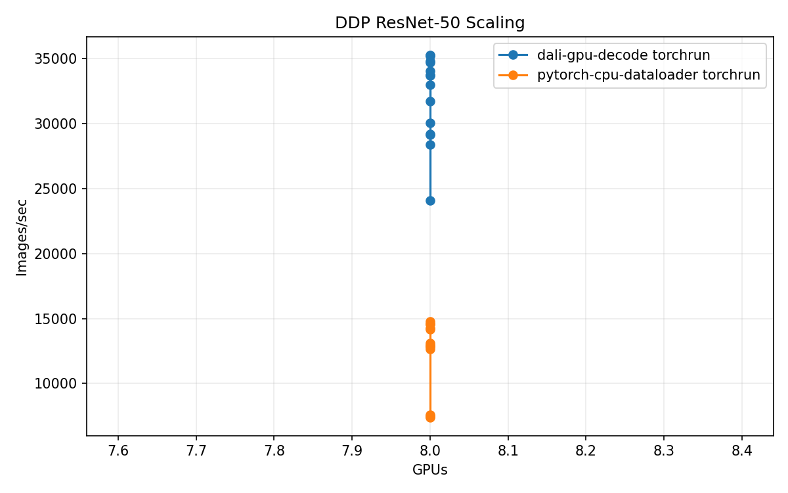
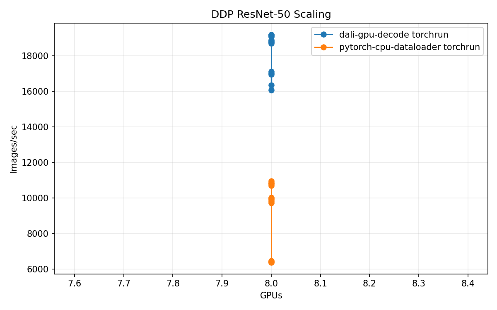

# DDP Synthetic GPU Ceiling

<!-- aicr-study-status: appendix -->

Purpose: show the ResNet-50 DDP compute/network ceiling when the input pipeline
is removed.

For the current prepared-input and synthetic ceiling context, see
[DDP Input Ceilings](input-ceilings.md). That page contains the current
`100`/`500` ceiling comparison; this appendix keeps the earlier scale-oriented
synthetic GPU rows in one place.

## Appendix - Supporting Reference, Not A Standalone Study

## Study Question

How fast does ResNet-50 DDP run when each rank receives GPU-resident synthetic
input tensors and the online input path is removed?

Synthetic GPU input generates GPU-resident tensors. It is not a dataset
strategy. It is ceiling evidence for the training stack when filesystem reads,
CPU decode, normalization, host staging, and host-to-device copies are not
limiting the run.

## Synthetic GPU Ceiling Rows

| Platform | Nodes | Samples/s |
| --- | ---: | ---: |
| B200 | `1` | `43,614` |
| B200 | `2` | `87,098` |
| B200 | `4` | `174,071` |
| B200 | `8` | `347,565` |
| B200 | `16` | `694,185` |
| RTX Pro 6000 | `1` | `20,491` |
| RTX Pro 6000 | `2` | `40,641` |
| RTX Pro 6000 | `4` | `81,286` |

These rows show that the training stack can scale cleanly when input cost is
removed.

## Figures

## How To Use This Ceiling

Compare real-input DDP rows to this ceiling to see whether the input pipeline
is limiting the training run. A large gap between a real-input row and the
synthetic GPU ceiling points to remaining input-path cost under training.

## Scope

These rows measure synthetic GPU input only. They are separate from canonical
ImageNet JPEG training, DataLoader-only throughput, prepared-input ceiling
rows, and synthetic large-JPEG decode-stress rows.
