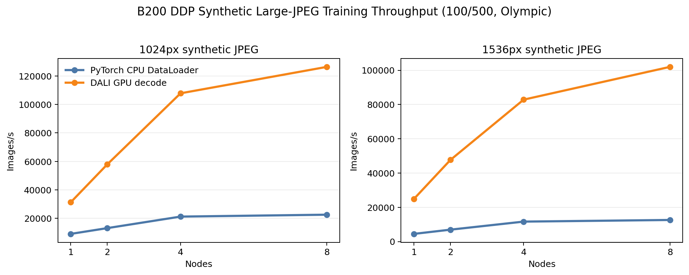
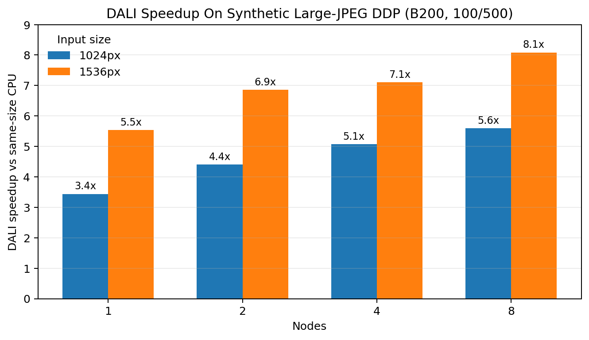
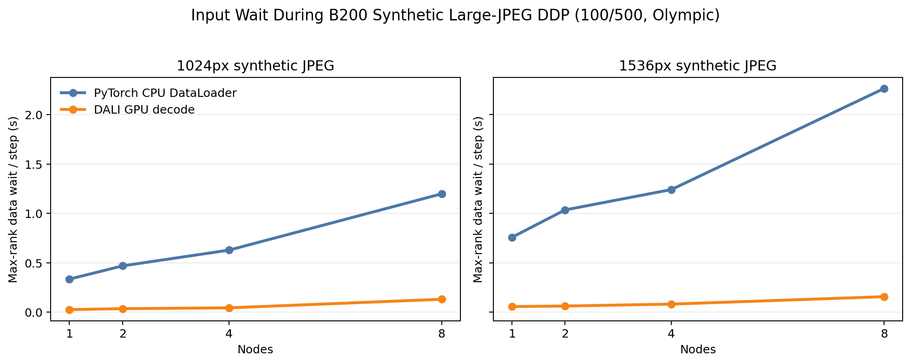
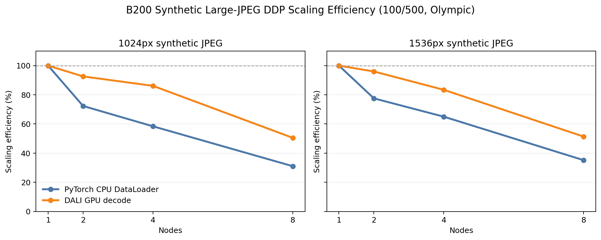

# DDP Synthetic Large JPEG Training

<!-- aicr-study-status: published -->

Purpose: compare B200 ResNet-50 DDP training throughput for synthetic large-JPEG
inputs through PyTorch CPU DataLoader and DALI GPU decode paths.

This study follows the DataLoader
[synthetic large JPEG decode stress](../../dataloader/studies/synthetic-large-jpeg-decode-stress.md)
study and measures the same input representation inside fixed-iteration
ResNet-50 DDP training.

## Study Questions

- How do PyTorch CPU DataLoader and DALI GPU decode compare for synthetic
  large-JPEG ImageFolder inputs during ResNet-50 DDP training?
- How do throughput, input wait, and scaling efficiency change from one to
  eight B200 nodes?
- Does the compressed large-JPEG input representation make JPEG decode and
  image preparation visible in full training-loop timing?

## Method

The study uses B200 nodes, `spc-80` synthetic JPEG ImageFolder trees, seed
`20260514`, image sizes `1024` and `1536`, and fixed `100` warmup plus `500`
measured iterations. Rows shorter than `100`/`500` are not included in the
tables or figures.

Each backend/size/node row includes five successful repeats with Olympic
aggregation. Failed, partial, cancelled, single-sample, mismatched-root,
fio-overlap, and mixed-shape rows are excluded.

Large compressed images move substantial work into decode, crop/resize, tensor
preparation, and data movement. The study compares same synthetic-JPEG dataset
roots through two training input paths:

- PyTorch CPU DataLoader: file reads, CPU JPEG decode, CPU transform work,
  batching, and host-to-device copy happen in the PyTorch input path.
- DALI GPU decode: file reads feed DALI; JPEG decode and image preparation move
  toward the GPU-side DALI pipeline.

## Run Shape

| Field | Value |
| --- | --- |
| Module | `ddp` |
| Model | ResNet-50 |
| Launcher | `torchrun` |
| Platform | B200 |
| Nodes | `1`, `2`, `4`, `8` |
| GPUs per node | `8` |
| Precision | `bf16` |
| Channels-last | enabled |
| Input representation | synthetic large JPEG ImageFolder trees |
| Dataset subset | `spc-80` (80 samples per ImageNet class), seed `20260514` |
| Image sizes | `1024`, `1536` |
| Batch per rank | `512` |
| Workers / prefetch | `8` / `4` |
| DALI config | threads `8`, queue `1`, `random-crop`, hardware decoder load `0.65` |
| Warmup / measured | `100` / `500` iterations |
| Aggregation | five-repeat Olympic average |

The `spc-80` subset gives the multi-node runs a larger finite input pool than
the smaller mechanism-discovery subsets used elsewhere. It changes sample
count, not the study question: the inputs are still synthetic JPEG decode-stress
datasets rather than canonical ImageNet.

## Command Run

The snippets below show the per-job submit shape used for the rows in this
study. The tables aggregate five successful submissions per backend/size/node
row.

PyTorch CPU DataLoader rows:

```bash
scripts/benchmark/submit-ddp-resnet50.sh \
  --cluster b200 \
  --nodes <1|2|4|8> \
  --nodelist <explicit-b200-nodelist> \
  --partition b200-batch \
  --time 04:00:00 \
  --repeat-count 1 \
  --cpus-per-task 16 \
  --mem 0 \
  --apply \
  -- \
  --dataset-root /scratch/$USER/aicr-bench/derived-datasets/dataloader-lab/imagenet/train/spc-80-seed-20260514/size-<1024|1536>/synthetic-jpeg \
  --input-backend pytorch-cpu-dataloader \
  --batch-size 512 \
  --num-workers 8 \
  --prefetch-factor 4 \
  --pin-memory 1 \
  --persistent-workers 1 \
  --derived-root /scratch/$USER/aicr-bench/derived-datasets/dataloader-lab/imagenet/train/spc-80-seed-20260514 \
  --derived-image-size <1024|1536> \
  --derived-samples-per-class 80 \
  --derived-seed 20260514 \
  --warmup-iters 100 \
  --measured-iters 500 \
  --precision bf16 \
  --channels-last 1
```

DALI rows:

```bash
scripts/benchmark/submit-ddp-resnet50.sh \
  --cluster b200 \
  --nodes <1|2|4|8> \
  --nodelist <explicit-b200-nodelist> \
  --partition b200-batch \
  --time 04:00:00 \
  --repeat-count 1 \
  --cpus-per-task 16 \
  --mem 0 \
  --apply \
  -- \
  --dataset-root /scratch/$USER/aicr-bench/derived-datasets/dataloader-lab/imagenet/train/spc-80-seed-20260514/size-<1024|1536>/synthetic-jpeg \
  --input-backend dali-gpu-decode \
  --dali-num-threads 8 \
  --dali-prefetch-queue-depth 1 \
  --dali-decode-mode random-crop \
  --dali-hw-decoder-load 0.65 \
  --batch-size 512 \
  --num-workers 8 \
  --prefetch-factor 4 \
  --pin-memory 1 \
  --persistent-workers 1 \
  --derived-root /scratch/$USER/aicr-bench/derived-datasets/dataloader-lab/imagenet/train/spc-80-seed-20260514 \
  --derived-image-size <1024|1536> \
  --derived-samples-per-class 80 \
  --derived-seed 20260514 \
  --warmup-iters 100 \
  --measured-iters 500 \
  --precision bf16 \
  --channels-last 1
```

Exact expanded Slurm rows, job IDs, summaries, aggregates, and rendered reports
are in the artifact bundle.

## Result Summary

DALI remained faster than same-size PyTorch CPU DataLoader for the tested
synthetic large-JPEG training rows. The advantage grows with image size and
node count: DALI is about `3.4x` faster at `1024` on one node and about `8.1x`
faster at `1536` on eight nodes.

| Size | Nodes | PyTorch CPU img/s | DALI img/s | DALI speedup | Data wait CPU/DALI | Efficiency CPU/DALI |
| ---: | ---: | ---: | ---: | ---: | ---: | ---: |
| `1024` | `1` | `9,098` | `31,298` | `3.44x` | `0.336` / `0.027` s | `100%` / `100%` |
| `1024` | `2` | `13,161` | `57,973` | `4.40x` | `0.470` / `0.036` s | `72%` / `93%` |
| `1024` | `4` | `21,246` | `107,833` | `5.08x` | `0.629` / `0.045` s | `58%` / `86%` |
| `1024` | `8` | `22,585` | `126,409` | `5.60x` | `1.199` / `0.132` s | `31%` / `50%` |
| `1536` | `1` | `4,484` | `24,836` | `5.54x` | `0.758` / `0.058` s | `100%` / `100%` |
| `1536` | `2` | `6,955` | `47,680` | `6.86x` | `1.036` / `0.063` s | `78%` / `96%` |
| `1536` | `4` | `11,656` | `82,872` | `7.11x` | `1.242` / `0.083` s | `65%` / `83%` |
| `1536` | `8` | `12,617` | `102,021` | `8.09x` | `2.265` / `0.158` s | `35%` / `51%` |

All table rows are five-repeat Olympic aggregates from the selected job-ID set.
Cancelled or fio-overlap rows are excluded.

## Figures



Throughput rises with node count for both backends, and DALI keeps a higher
training throughput for the tested synthetic large-JPEG inputs.



DALI speedup increases with image size and remains large through the tested
eight-node range.



The CPU path spends much more max-rank step time waiting on input work. DALI
keeps data wait low even as image size and node count increase.



Scaling efficiency falls at larger node counts for both paths, while DALI
retains the higher absolute throughput.

## Interpretation

For this synthetic large-JPEG branch, moving decode and image preparation
toward DALI produces higher ResNet-50 DDP throughput than the same synthetic
JPEG inputs through PyTorch CPU DataLoader.

The result is scoped to compressed synthetic JPEG inputs at the tested runtime
shape. DALI reduces input wait for these rows, while scaling efficiency still
shows multi-node coordination and shared-input pressure at larger node counts.

The data-wait view explains the mechanism. CPU rows spend roughly `0.34` to
`2.27` seconds per step waiting on input work, depending on size and scale.
DALI rows keep that wait near `0.03` to `0.16` seconds per step, so more of the
training loop can be spent on model work and distributed coordination.

## Artifact Bundle

| Artifact | Location |
| --- | --- |
| VAST bundle | `/work/aicr/commissioning/benchmarks/public-study-artifacts/aicr-public/f798897/ddp/ddp-synthetic-large-jpeg-training-100x500.tar.gz` |
| VAST provenance | `/work/aicr/commissioning/benchmarks/public-study-artifacts/aicr-public/f798897/ddp/synthetic-large-jpeg-training-100x500/provenance.json` |
| VAST checksum | `/work/aicr/commissioning/benchmarks/public-study-artifacts/aicr-public/f798897/ddp/ddp-synthetic-large-jpeg-training-100x500.sha256` |
| OSN bundle | <https://uma1.osn.mghpcc.org/csim-bmark/public-study-artifacts/aicr-public/f798897/ddp/ddp-synthetic-large-jpeg-training-100x500.tar.gz> |
| OSN provenance | <https://uma1.osn.mghpcc.org/csim-bmark/public-study-artifacts/aicr-public/f798897/ddp/synthetic-large-jpeg-training-100x500/provenance.json> |
| OSN checksum | <https://uma1.osn.mghpcc.org/csim-bmark/public-study-artifacts/aicr-public/f798897/ddp/ddp-synthetic-large-jpeg-training-100x500.sha256> |
| SHA-256 | `f6ebfe26e1b6ad99653aee5c3ccae1fc490f9e8a980c3f0189576bc0b08aa1c3` |

The bundle contains rendered reports, per-run CSV/JSON, five-repeat aggregate
CSV/JSON, curated figures, submission logs, provenance, and checksum.

## Retrieve And Verify

```bash
mkdir -p public-study-artifacts/ddp-synthetic-large-jpeg-training
cd public-study-artifacts/ddp-synthetic-large-jpeg-training
wget https://uma1.osn.mghpcc.org/csim-bmark/public-study-artifacts/aicr-public/f798897/ddp/ddp-synthetic-large-jpeg-training-100x500.tar.gz
wget https://uma1.osn.mghpcc.org/csim-bmark/public-study-artifacts/aicr-public/f798897/ddp/ddp-synthetic-large-jpeg-training-100x500.sha256
sha256sum -c ddp-synthetic-large-jpeg-training-100x500.sha256
tar -tzf ddp-synthetic-large-jpeg-training-100x500.tar.gz | head
```

## Scope

These rows measure fixed-iteration DDP training on synthetic large-JPEG inputs.
They are separate from canonical ImageNet JPEG training, DataLoader-only
throughput, prepared-input ceiling rows, and synthetic GPU ceiling rows.

The `spc-80` subset is an 80-sample-per-class finite-input dataset used for
stable multi-node timing. It is not a production dataset recommendation.

The next comparable study would use larger real-data image inputs or separate
storage/load-path measurements from JPEG decode work.
