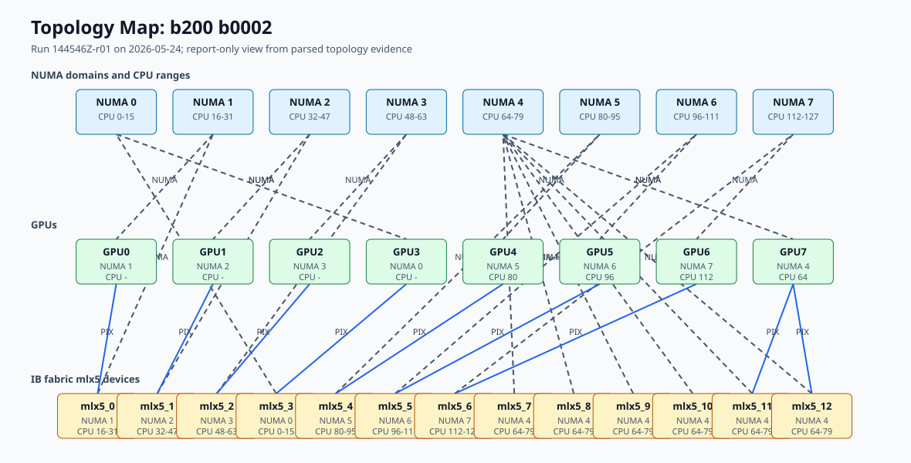
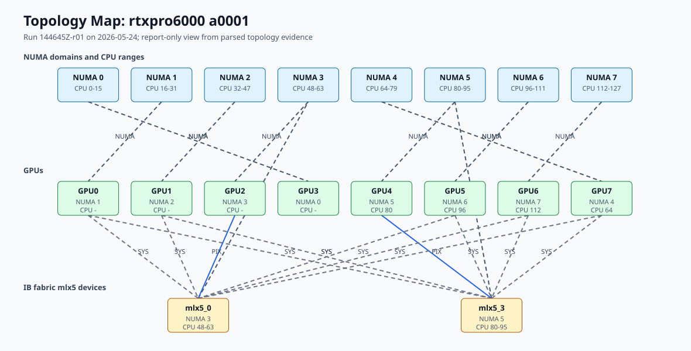

# GPU Topology Map

Purpose: render a report-only graphical view of one node's CPU, NUMA, GPU, PCIe/NVLink, and resolved IB fabric mlx5 locality.

Topology Map consumes existing GPU topology `summary.json` files and optional
raw captures. It renders standalone HTML/SVG plus a structured graph JSON
sidecar. The output helps review how GPUs communicate within a node and how
resolved IB fabric mlx5 devices sit relative to those GPUs. The renderer reads
existing artifacts and does not submit jobs.

## Inspect The Interface

<!-- aicr-test
id: gpu-topology-map-help
suite: gpu-topology
kind: local
safety: help
cwd: install-root
expect:
  mode: contains
  patterns:
    - "Render a report-only GPU topology map"
    - "--summary"
    - "--format"
-->
```bash
scripts/lib/run-repo-python.sh scripts/report/render-topology-map.py --help
```

## Fixture Replay

<!-- aicr-test
id: gpu-topology-map-fixture
suite: gpu-topology
kind: local
safety: inspect
cwd: install-root
expect:
  mode: contains
  patterns:
    - "topology_map_shape=passed"
-->
```bash
scripts/lib/run-repo-python.sh tests/scripts/check-topology-map-fixture.py
```

## Direct Rendering

Render a single parsed topology summary:

```bash
scripts/lib/run-repo-python.sh scripts/report/render-topology-map.py \
  --summary results/by-date/<date>/parsed/<cluster>/nodes/<node>/gpu-topology/<run_id>/summary.json \
  --output-dir results/reports/<date>/topology-map \
  --format both
```

Lookup mode selects the latest parsed run for a node:

```bash
scripts/lib/run-repo-python.sh scripts/report/render-topology-map.py \
  --date <date> \
  --cluster b200 \
  --node <node> \
  --output-dir results/reports/<date>/topology-map \
  --format html
```

## Output Contract

The renderer writes:

- `topology-map-<cluster>-<node>-<run_id>.html`
- `topology-map-<cluster>-<node>-<run_id>.svg`
- `topology-map-<cluster>-<node>-<run_id>.json`

The JSON sidecar uses schema `aicr.topology_graph.v1`. It contains source
artifact paths, graph nodes, graph edges, parser warnings, and source summary
metadata.

## Rendered Examples

These examples are static SVG renderings from representative B200 and RTX PRO
6000 topology captures. They are renderer examples, not benchmark studies.
Topology Map renders single-node hardware locality from collected topology
artifacts. It is not a benchmark result, not a full cluster fabric diagram, and
not a workload launch-policy recommendation.

`PIX` means a GPU and NIC are reached through the same PCIe switch. In the B200
example, each benchmark GPU has a nearby IB fabric mlx5 device on a `PIX` path.

`SYS` means the path crosses the system interconnect between CPU/NUMA domains.
In the RTX PRO 6000 example, the GPUs share the available IB fabric mlx5
devices across `SYS` paths.

The diagram focuses on GPU topology and resolved IB fabric mlx5 locality. It is
not a complete network diagram for the node or cluster.

### B200 Example



### RTX PRO 6000 Example


