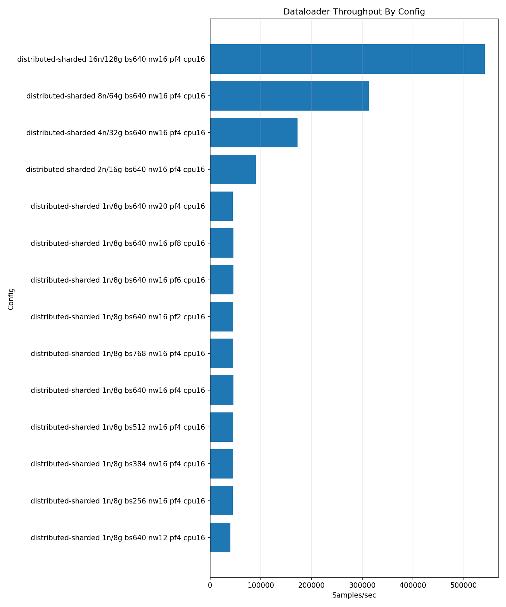
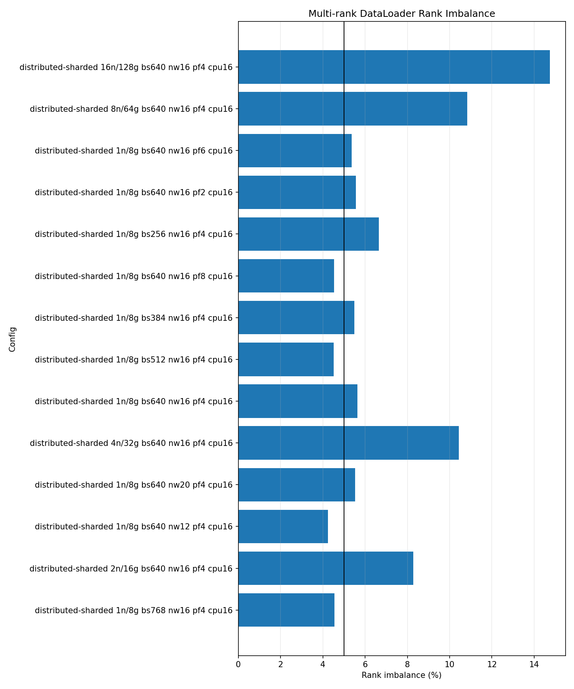

# DataLoader Benchmark Results B200 2026-05-16

| Field | Value |
| --- | --- |
| Date Run | 2026-05-16 |
| Cluster | b200 |
| Type | benchmarking |
| Status | completed |
| Input path | PyTorch CPU DataLoader, ImageFolder |
| Mode | distributed-sharded |
| GPUs per node | 8 |
| Repeated rows | 80 rendered, 80 passed |
| Aggregation | Olympic mean for repeated rows |

## Memo Conformance

Requirements come from `AICR-Benchmarking-Campaign-Expected-Metrics-and-Results-Memo-for-MGHPCC-v2.pdf`, dated February 27, 2026.

| Memo Requirement | Delivered | Status |
| --- | --- | --- |
| Scope: B200 DataLoader | May 16 B200 report with one-node tuning and 1, 2, 4, 8, and 16 node scale rows | Met (superset) |
| Memo-listed parameter values | May 16 OFAT campaign differs for batch and worker axes; May 17 memo-listed OFAT rows collected | Met with supplemental evidence |
| PyTorch CPU ImageFolder input | PyTorch CPU DataLoader, ImageFolder | Met |
| Metrics | Images/sec, images/sec/node, images/sec/GPU, load ms/batch, estimated VAST read GB/s from JPEG bytes, worker CPU mean | Met |

Full conformance matrix: [Memo conformance 2026-05-16](../../../../memo-conformance-2026-05-16.md).

## Run Shape

| Setting | Value |
| --- | --- |
| Selected config | batch `640`, workers `16`, prefetch `4`, pin memory `true`, persistent workers `true` |
| Runner length | 100 warmup batches, 1000 measured batches |
| CPU allocation | 16 CPUs per task |
| H2D transfer | enabled |
| One-node tuning axes | one-factor-at-a-time (OFAT): batch size, workers, prefetch, pin memory |
| Scale rows | 1, 2, 4, 8, and 16 nodes |
| Node pool | `b0002,b0003,b0004,b0005,b0006,b0007,b0008,b0009,b0010,b0011,b0012,b0013,b0014,b0015,b0016,b0017` |
| PyTorch version | not published in selected artifacts |
| Container digest | not published in selected artifacts |

## Command Runbook

Commands are shown with the public Make interface. Each applied launch was preceded by a Slurm queue check and was run only when no same-cluster DataLoader job was active.

```bash
squeue -u $USER -o "%.18i %.9P %.32j %.8T %.10M %.10l %.6D %R"
```

1. Batch-size OFAT on `b0002`.

```bash
make benchmark-dataloader CLUSTER=b200 PROFILE=small GPU_COUNT=8 MODE=distributed-sharded NODELIST=b0002 \
  DATALOADER_NODES=1 DATALOADER_REPEAT_COUNT=5 \
  DATALOADER_BATCH_SIZES=256,384,512,640,768 \
  DATALOADER_NUM_WORKERS=16 DATALOADER_PREFETCH_FACTORS=4 \
  DATALOADER_PIN_MEMORY=1 DATALOADER_PERSISTENT_WORKERS=1 \
  DATALOADER_CPUS_PER_TASK=16 \
  DATALOADER_RUN_ARGS="--warmup-batches 100 --measured-batches 1000" \
  APPLY=1
```

2. Worker OFAT at batch `640`.

```bash
make benchmark-dataloader CLUSTER=b200 PROFILE=small GPU_COUNT=8 MODE=distributed-sharded NODELIST=b0002 \
  DATALOADER_NODES=1 DATALOADER_REPEAT_COUNT=5 \
  DATALOADER_BATCH_SIZES=640 DATALOADER_NUM_WORKERS=12,20 \
  DATALOADER_PREFETCH_FACTORS=4 DATALOADER_PIN_MEMORY=1 \
  DATALOADER_PERSISTENT_WORKERS=1 DATALOADER_CPUS_PER_TASK=16 \
  DATALOADER_RUN_ARGS="--warmup-batches 100 --measured-batches 1000" \
  APPLY=1
```

3. Prefetch OFAT at batch `640`, workers `16`.

```bash
make benchmark-dataloader CLUSTER=b200 PROFILE=small GPU_COUNT=8 MODE=distributed-sharded NODELIST=b0002 \
  DATALOADER_NODES=1 DATALOADER_REPEAT_COUNT=5 \
  DATALOADER_BATCH_SIZES=640 DATALOADER_NUM_WORKERS=16 \
  DATALOADER_PREFETCH_FACTORS=2,6,8 DATALOADER_PIN_MEMORY=1 \
  DATALOADER_PERSISTENT_WORKERS=1 DATALOADER_CPUS_PER_TASK=16 \
  DATALOADER_RUN_ARGS="--warmup-batches 100 --measured-batches 1000" \
  APPLY=1
```

4. Pin-memory comparison at batch `640`, workers `16`, prefetch `4`. This one-node pin-memory comparison was collected before the multinode scale rows.

```bash
make benchmark-dataloader CLUSTER=b200 PROFILE=small GPU_COUNT=8 MODE=distributed-sharded NODELIST=b0002 \
  DATALOADER_NODES=1 DATALOADER_REPEAT_COUNT=5 \
  DATALOADER_BATCH_SIZES=640 DATALOADER_NUM_WORKERS=16 \
  DATALOADER_PREFETCH_FACTORS=4 DATALOADER_PIN_MEMORY=0 \
  DATALOADER_PERSISTENT_WORKERS=1 DATALOADER_CPUS_PER_TASK=16 \
  DATALOADER_RUN_ARGS="--warmup-batches 100 --measured-batches 1000" \
  APPLY=1
```

5. Scale rows with the selected config.

```bash
make benchmark-dataloader CLUSTER=b200 PROFILE=small GPU_COUNT=8 MODE=distributed-sharded NODELIST=b0002,b0003,b0004,b0005,b0006,b0007,b0008,b0009,b0010,b0011,b0012,b0013,b0014,b0015,b0016,b0017 \
  DATALOADER_NODES=2,4,8,16 DATALOADER_REPEAT_COUNT=5 \
  DATALOADER_BATCH_SIZES=640 DATALOADER_NUM_WORKERS=16 \
  DATALOADER_PREFETCH_FACTORS=4 DATALOADER_PIN_MEMORY=1 \
  DATALOADER_PERSISTENT_WORKERS=1 DATALOADER_CPUS_PER_TASK=16 \
  DATALOADER_RUN_ARGS="--warmup-batches 100 --measured-batches 1000" \
  APPLY=1
```

6. Render the public summary.

```bash
make render-dataloader CLUSTER=b200 REPORT_DATE=2026-05-16 DATALOADER_REPEAT_AGGREGATION=olympic
```

## Final Scale Results

| Nodes | GPUs | Samples | Batch | Workers | Prefetch | Pin memory | Images/sec | Images/sec/node | Images/sec/GPU | Estimated VAST read GB/s from JPEG bytes | Worker CPU mean % | Load ms/batch | Imbalance % |
| ---: | ---: | ---: | ---: | ---: | ---: | --- | ---: | ---: | ---: | ---: | ---: | ---: | ---: |
| 1 | 8 | 10 | 640 | 16 | 4 | true | 45,632.38 | 45,632.38 | 5,704.05 | 4.98 | 85.22 | 108.57 | 4.67 |
| 2 | 16 | 5 | 640 | 16 | 4 | true | 89,242.83 | 44,621.41 | 5,577.68 | 9.84 | 82.99 | 109.47 | 3.64 |
| 4 | 32 | 5 | 640 | 16 | 4 | true | 169,270.57 | 42,317.64 | 5,289.71 | 18.05 | 77.66 | 119.98 | 8.69 |
| 8 | 64 | 5 | 640 | 16 | 4 | true | 311,569.01 | 38,946.13 | 4,868.27 | 33.59 | 69.80 | 127.53 | 8.22 |
| 16 | 128 | 5 | 640 | 16 | 4 | true | 533,864.30 | 33,366.52 | 4,170.81 | 56.01 | 57.32 | 154.62 | 14.17 |

Estimated VAST read GB/s from JPEG bytes is computed from ImageFolder JPEG bytes consumed by the workload; it is not direct VAST or storage telemetry.

## Memo Shape Supplemental Rows

Supplemental rows dated 2026-05-17 use 3 samples, PyTorch CPU ImageFolder input, memo-listed one-factor-at-a-time values for batch size and workers, and the same 8-GPU distributed-sharded runner shape.

| Supplemental set | Values | Held settings | Samples | Status |
| --- | --- | --- | ---: | --- |
| Batch size | `64,128,256,512` | workers `16`, prefetch `4`, pin `true` | 3 each | collected |
| Workers | `2,4,8,32` | batch `512`, prefetch `4`, pin `true` | 3 each | collected |
| Prefetch | `2,8` | batch `512`, workers `16`, pin `true` | 3 each | collected |
| Pin memory | `false` | batch `512`, workers `16`, prefetch `4` | 3 | collected |
| Scale | `4,8,16` nodes | batch `512`, workers `16`, prefetch `4`, pin `true` | 3 each | collected |

### Memo Shape Result Summary

| Nodes | GPUs | Batch | Workers | Prefetch | Pin | Samples | Mean images/sec | Best images/sec | Estimated VAST read GB/s from JPEG bytes | Worker CPU mean % | Imbalance % | Status |
| ---: | ---: | ---: | ---: | ---: | --- | ---: | ---: | ---: | ---: | ---: | ---: | --- |
| 1 | 8 | 64 | 16 | 4 | true | 3 | 41,276.61 | 42,263.31 | 4.43 | 80.29 | 7.70 | collected |
| 1 | 8 | 128 | 16 | 4 | true | 3 | 42,351.11 | 42,993.68 | 4.56 | 81.92 | 7.77 | collected |
| 1 | 8 | 256 | 16 | 4 | true | 3 | 43,127.46 | 43,833.97 | 4.68 | 82.45 | 5.85 | collected |
| 1 | 8 | 512 | 2 | 4 | true | 3 | 8,102.29 | 8,110.45 | 0.90 | 89.05 | 1.85 | collected |
| 1 | 8 | 512 | 4 | 4 | true | 3 | 15,951.57 | 15,981.40 | 1.79 | 88.85 | 1.51 | collected |
| 1 | 8 | 512 | 8 | 4 | true | 3 | 29,625.77 | 29,807.81 | 3.27 | 88.28 | 3.36 | collected |
| 1 | 8 | 512 | 16 | 2 | true | 3 | 44,524.77 | 44,727.18 | 4.85 | 84.21 | 5.00 | collected |
| 1 | 8 | 512 | 16 | 4 | false | 3 | 44,905.28 | 45,142.50 | 4.92 | 84.16 | 4.40 | collected |
| 1 | 8 | 512 | 16 | 4 | true | 3 | 45,576.53 | 45,781.56 | 4.93 | 85.11 | 5.48 | collected |
| 1 | 8 | 512 | 16 | 8 | true | 3 | 45,318.54 | 45,459.33 | 4.92 | 84.49 | 5.32 | collected |
| 1 | 8 | 512 | 32 | 4 | true | 3 | 44,455.99 | 44,642.41 | 4.88 | 43.46 | 5.18 | collected |
| 4 | 32 | 512 | 16 | 4 | true | 3 | 172,615.86 | 175,535.62 | 18.60 | 79.22 | 8.09 | collected |
| 8 | 64 | 512 | 16 | 4 | true | 3 | 313,918.23 | 316,403.50 | 33.06 | 67.50 | 11.13 | collected |
| 16 | 128 | 512 | 16 | 4 | true | 3 | 509,561.44 | 512,656.37 | 52.96 | 53.67 | 16.32 | collected |

Estimated VAST read GB/s from JPEG bytes has the same interpretation in the
supplemental rows: it is computed from ImageFolder JPEG bytes consumed by the
workload, not direct VAST or storage telemetry.

Supplemental command runbook:

1. Batch-size memo-listed OFAT on `b0003`.

```bash
make benchmark-dataloader CLUSTER=b200 PROFILE=small GPU_COUNT=8 MODE=distributed-sharded NODELIST=b0003 \
  DATALOADER_NODES=1 DATALOADER_REPEAT_COUNT=3 \
  DATALOADER_BATCH_SIZES=64,128,256,512 \
  DATALOADER_NUM_WORKERS=16 DATALOADER_PREFETCH_FACTORS=4 \
  DATALOADER_PIN_MEMORY=1 DATALOADER_PERSISTENT_WORKERS=1 \
  DATALOADER_CPUS_PER_TASK=16 \
  DATALOADER_RUN_ARGS="--warmup-batches 100 --measured-batches 500" \
  APPLY=1
```

2. Worker memo-listed OFAT at batch `512`.

```bash
make benchmark-dataloader CLUSTER=b200 PROFILE=small GPU_COUNT=8 MODE=distributed-sharded NODELIST=b0003 \
  DATALOADER_NODES=1 DATALOADER_REPEAT_COUNT=3 \
  DATALOADER_BATCH_SIZES=512 DATALOADER_NUM_WORKERS=2,4,8,32 \
  DATALOADER_PREFETCH_FACTORS=4 DATALOADER_PIN_MEMORY=1 \
  DATALOADER_PERSISTENT_WORKERS=1 DATALOADER_CPUS_PER_TASK=16 \
  DATALOADER_RUN_ARGS="--warmup-batches 100 --measured-batches 500" \
  APPLY=1
```

3. Prefetch memo-listed OFAT at batch `512`, workers `16`.

```bash
make benchmark-dataloader CLUSTER=b200 PROFILE=small GPU_COUNT=8 MODE=distributed-sharded NODELIST=b0003 \
  DATALOADER_NODES=1 DATALOADER_REPEAT_COUNT=3 \
  DATALOADER_BATCH_SIZES=512 DATALOADER_NUM_WORKERS=16 \
  DATALOADER_PREFETCH_FACTORS=2,8 DATALOADER_PIN_MEMORY=1 \
  DATALOADER_PERSISTENT_WORKERS=1 DATALOADER_CPUS_PER_TASK=16 \
  DATALOADER_RUN_ARGS="--warmup-batches 100 --measured-batches 500" \
  APPLY=1
```

4. Pin-memory memo comparison at batch `512`, workers `16`, prefetch `4`.

```bash
make benchmark-dataloader CLUSTER=b200 PROFILE=small GPU_COUNT=8 MODE=distributed-sharded NODELIST=b0003 \
  DATALOADER_NODES=1 DATALOADER_REPEAT_COUNT=3 \
  DATALOADER_BATCH_SIZES=512 DATALOADER_NUM_WORKERS=16 \
  DATALOADER_PREFETCH_FACTORS=4 DATALOADER_PIN_MEMORY=0 \
  DATALOADER_PERSISTENT_WORKERS=1 DATALOADER_CPUS_PER_TASK=16 \
  DATALOADER_RUN_ARGS="--warmup-batches 100 --measured-batches 500" \
  APPLY=1
```

5. B200 memo scale rows.

```bash
make benchmark-dataloader CLUSTER=b200 PROFILE=small GPU_COUNT=8 MODE=distributed-sharded NODELIST=b0003,b0004,b0005,b0006,b0007,b0008,b0009,b0010,b0011,b0012,b0013,b0014,b0015,b0016,b0017,b0018 \
  DATALOADER_NODES=4,8,16 DATALOADER_REPEAT_COUNT=3 \
  DATALOADER_BATCH_SIZES=512 DATALOADER_NUM_WORKERS=16 \
  DATALOADER_PREFETCH_FACTORS=4 DATALOADER_PIN_MEMORY=1 \
  DATALOADER_PERSISTENT_WORKERS=1 DATALOADER_CPUS_PER_TASK=16 \
  DATALOADER_RUN_ARGS="--warmup-batches 100 --measured-batches 500" \
  APPLY=1
```

6. Render the supplemental summary.

```bash
make render-dataloader CLUSTER=b200 REPORT_DATE=2026-05-17 DATALOADER_REPEAT_AGGREGATION=olympic
```

Supplemental artifacts:

| Artifact | Location | Status |
| --- | --- | --- |
| May 17 supplemental summary CSV | [dataloader-summary-b200-2026-05-17.csv](../../../2026-05-17/benchmarks/dataloader/dataloader-summary-b200-2026-05-17.csv) | collected |
| May 17 supplemental report JSON | [dataloader-report-b200-2026-05-17.json](../../../2026-05-17/benchmarks/dataloader/dataloader-report-b200-2026-05-17.json) | collected |
| May 17 supplemental throughput PNG | [dataloader-throughput-b200-2026-05-17.png](../../../2026-05-17/benchmarks/dataloader/dataloader-throughput-b200-2026-05-17.png) | collected |
| May 17 supplemental rank-imbalance PNG | [dataloader-rank-imbalance-b200-2026-05-17.png](../../../2026-05-17/benchmarks/dataloader/dataloader-rank-imbalance-b200-2026-05-17.png) | collected |
| May 17 operator staging note (AICR HPC) | retained in public artifact staging for the May 17 supplemental DataLoader rows | collected |
| May 17 OSN bundle | <https://uma1.osn.mghpcc.org/csim-bmark/public-study-artifacts/aicr-public/607a330/dataloader/2026-05-17/dataloader-b200-%73%6f%77-supplemental-2026-05-17.tar.gz> | collected |
| May 17 provenance JSON | <https://uma1.osn.mghpcc.org/csim-bmark/public-study-artifacts/aicr-public/607a330/dataloader/2026-05-17/dataloader-b200-%73%6f%77-supplemental-2026-05-17-provenance.json> | collected |
| May 17 checksum | <https://uma1.osn.mghpcc.org/csim-bmark/public-study-artifacts/aicr-public/607a330/dataloader/2026-05-17/dataloader-b200-%73%6f%77-supplemental-2026-05-17.sha256> | collected |
| May 17 tarball SHA-256 | `210df8b38158686dada32f924f38db45fb2bebdf7c4b985cc9b3f5550318ddb2` | collected |

## OFAT Sweep Coverage

| Axis | Values Collected | Held Settings |
| --- | --- | --- |
| Batch size | `256,384,512,640,768` | workers `16`, prefetch `4`, pin `true` |
| Workers | `12,16,20` | batch `640`, prefetch `4`, pin `true` |
| Prefetch | `2,4,6,8` | batch `640`, workers `16`, pin `true` |
| Pin memory | `true,false` | batch `640`, workers `16`, prefetch `4` |
| Scale | `1,2,4,8,16` nodes | batch `640`, workers `16`, prefetch `4`, pin `true` |

## Repeated Config Summary

| Nodes | GPUs | Batch | Workers | Prefetch | Pin | Warmup | Measured | Samples | Olympic images/sec | Min | Max | Dropped min/max | Stddev | Aggregation | Jobs |
| ---: | ---: | ---: | ---: | ---: | --- | ---: | ---: | ---: | ---: | ---: | ---: | --- | ---: | --- | --- |
| 1 | 8 | 256 | 16 | 4 | true | 100 | 1000 | 5 | 44,034.16 | 40,321.77 | 44,926.52 | 40,321.77/44,926.52 | 1,671.63 | olympic 3/5 | `21441,21443,21445,21446,21448` |
| 1 | 8 | 384 | 16 | 4 | true | 100 | 1000 | 5 | 45,026.30 | 44,764.95 | 45,238.87 | 44,764.95/45,238.87 | 162.75 | olympic 3/5 | `21449,21451,21453,21455,21457` |
| 1 | 8 | 512 | 16 | 4 | true | 100 | 1000 | 5 | 45,367.26 | 45,277.56 | 45,542.45 | 45,277.56/45,542.45 | 94.38 | olympic 3/5 | `21458,21460,21462,21464,21466` |
| 1 | 8 | 640 | 12 | 4 | true | 100 | 1000 | 5 | 40,107.02 | 40,070.14 | 40,203.18 | 40,070.14/40,203.18 | 47.59 | olympic 3/5 | `21489,21492,21494,21495,21496` |
| 1 | 8 | 640 | 16 | 2 | true | 100 | 1000 | 5 | 45,398.62 | 44,870.26 | 45,531.92 | 44,870.26/45,531.92 | 239.59 | olympic 3/5 | `21512,21515,21518,21521,21524` |
| 1 | 8 | 640 | 16 | 4 | false | 100 | 1000 | 5 | 45,627.27 | 45,149.31 | 45,898.43 | 45,149.31/45,898.43 | 254.62 | olympic 3/5 | `21572,21573,21574,21575,21576` |
| 1 | 8 | 640 | 16 | 4 | true | 100 | 1000 | 10 | 45,632.38 | 45,417.06 | 45,812.90 | 45,417.06/45,812.90 | 107.47 | olympic 8/10 | `21468,21470,21472,21474,21476,21498,21500,21502,21504,21506` |
| 1 | 8 | 640 | 16 | 6 | true | 100 | 1000 | 5 | 44,990.75 | 43,405.00 | 45,824.97 | 43,405.00/45,824.97 | 901.17 | olympic 3/5 | `21513,21516,21519,21522,21525` |
| 1 | 8 | 640 | 16 | 8 | true | 100 | 1000 | 5 | 45,436.59 | 45,142.28 | 45,759.33 | 45,142.28/45,759.33 | 241.13 | olympic 3/5 | `21514,21517,21520,21523,21526` |
| 1 | 8 | 640 | 20 | 4 | true | 100 | 1000 | 5 | 44,489.27 | 44,271.81 | 44,589.93 | 44,271.81/44,589.93 | 105.60 | olympic 3/5 | `21507,21508,21509,21510,21511` |
| 1 | 8 | 768 | 16 | 4 | true | 100 | 1000 | 5 | 45,258.62 | 43,443.53 | 45,322.19 | 43,443.53/45,322.19 | 733.33 | olympic 3/5 | `21478,21480,21482,21484,21487` |
| 2 | 16 | 640 | 16 | 4 | true | 100 | 1000 | 5 | 89,242.83 | 88,019.64 | 90,101.63 | 88,019.64/90,101.63 | 860.06 | olympic 3/5 | `21552,21553,21554,21555,21556` |
| 4 | 32 | 640 | 16 | 4 | true | 100 | 1000 | 5 | 169,270.57 | 167,812.30 | 172,652.33 | 167,812.30/172,652.33 | 1,671.76 | olympic 3/5 | `21557,21558,21559,21560,21561` |
| 8 | 64 | 640 | 16 | 4 | true | 100 | 1000 | 5 | 311,569.01 | 309,106.48 | 312,633.65 | 309,106.48/312,633.65 | 1,485.44 | olympic 3/5 | `21562,21563,21564,21565,21566` |
| 16 | 128 | 640 | 16 | 4 | true | 100 | 1000 | 5 | 533,864.30 | 530,979.93 | 541,403.81 | 530,979.93/541,403.81 | 3,531.70 | olympic 3/5 | `21567,21568,21569,21570,21571` |

## Top One-Node Rows

| Run | Batch | Workers | Prefetch | Pin | Node List | Images/sec | Images/sec/GPU | Load ms/batch | Imbalance % |
| --- | ---: | ---: | ---: | --- | --- | ---: | ---: | ---: | ---: |
| 212047Z-r01 | 640 | 16 | 4 | false | b0002 | 45,898.43 | 5,737.30 | 73.11 | 4.21 |
| 200432Z-r01 | 640 | 16 | 6 | true | b0002 | 45,824.97 | 5,728.12 | 107.93 | 4.41 |
| 190806Z-r01 | 640 | 16 | 4 | true | b0002 | 45,812.90 | 5,726.61 | 107.65 | 4.34 |
| 195212Z-r01 | 640 | 16 | 8 | true | b0002 | 45,759.33 | 5,719.92 | 108.07 | 4.53 |
| 191036Z-r01 | 640 | 16 | 4 | true | b0002 | 45,750.57 | 5,718.82 | 108.63 | 4.61 |

## Figures





## Artifacts And Provenance

| Artifact | Location |
| --- | --- |
| Summary CSV | [dataloader-summary-b200-2026-05-16.csv](./dataloader-summary-b200-2026-05-16.csv) |
| Report JSON | [dataloader-report-b200-2026-05-16.json](./dataloader-report-b200-2026-05-16.json) |
| Throughput PNG | [dataloader-throughput-b200-2026-05-16.png](./dataloader-throughput-b200-2026-05-16.png) |
| Rank imbalance PNG | [dataloader-rank-imbalance-b200-2026-05-16.png](./dataloader-rank-imbalance-b200-2026-05-16.png) |
| Retained HPC parsed evidence | `results/by-date/2026-05-16/parsed/b200/**/dataloader/*/summary.json` |
| May 16 operator staging path (AICR HPC) | `/work/aicr/commissioning/benchmarks/public-study-artifacts/aicr-public/87f29c0/dataloader/2026-05-16/dataloader-b200-campaign-2026-05-16.tar.gz` |
| May 16 OSN bundle | <https://uma1.osn.mghpcc.org/csim-bmark/public-study-artifacts/aicr-public/87f29c0/dataloader/2026-05-16/dataloader-b200-campaign-2026-05-16.tar.gz> |
| May 16 provenance JSON | <https://uma1.osn.mghpcc.org/csim-bmark/public-study-artifacts/aicr-public/87f29c0/dataloader/2026-05-16/dataloader-b200-campaign-2026-05-16-provenance.json> |
| May 16 checksum | <https://uma1.osn.mghpcc.org/csim-bmark/public-study-artifacts/aicr-public/87f29c0/dataloader/2026-05-16/dataloader-b200-campaign-2026-05-16.sha256> |
| May 16 tarball SHA-256 | `7d321cfe94166e21f96050bf99cd897cb6c671aab2047b9c49bfb70c444bae04` |

## Retrieve And Verify

```bash
mkdir -p public-study-artifacts/dataloader-b200-2026-05-16
cd public-study-artifacts/dataloader-b200-2026-05-16
wget https://uma1.osn.mghpcc.org/csim-bmark/public-study-artifacts/aicr-public/87f29c0/dataloader/2026-05-16/dataloader-b200-campaign-2026-05-16.tar.gz
wget https://uma1.osn.mghpcc.org/csim-bmark/public-study-artifacts/aicr-public/87f29c0/dataloader/2026-05-16/dataloader-b200-campaign-2026-05-16.sha256
sed 's#  .*/#  #' dataloader-b200-campaign-2026-05-16.sha256 | sha256sum -c -
tar -tzf dataloader-b200-campaign-2026-05-16.tar.gz | head
```

Related earlier B200 DataLoader study bundles remain available for the pre-campaign study pages:

| Study | Operator Staging Path (AICR HPC) | OSN Bundle |
| --- | --- | --- |
| B200 one-node worker scan, 2026-05-12 | `/work/aicr/commissioning/benchmarks/public-study-artifacts/aicr-public/e5bba11/dataloader/2026-05-12/dataloader-b200-rtx-one-node-replicated-worker-scan-olympic-2026-05-12.tar.gz` | <https://uma1.osn.mghpcc.org/csim-bmark/public-study-artifacts/aicr-public/e5bba11/dataloader/2026-05-12/dataloader-b200-rtx-one-node-replicated-worker-scan-olympic-2026-05-12.tar.gz> |
| B200 multinode sharded entry, 2026-05-13 | `/work/aicr/commissioning/benchmarks/public-study-artifacts/aicr-public/c54a4b2/dataloader/2026-05-13/dataloader-b200-multinode-sharded-olympic-2026-05-13.tar.gz` | <https://uma1.osn.mghpcc.org/csim-bmark/public-study-artifacts/aicr-public/c54a4b2/dataloader/2026-05-13/dataloader-b200-multinode-sharded-olympic-2026-05-13.tar.gz> |
| B200 2/4/8/16 scale probe, 2026-05-14 | `/work/aicr/commissioning/benchmarks/public-study-artifacts/aicr-public/bbcc5f7/dataloader/2026-05-14/dataloader-b200-2-4-8-16-scale-probe-2026-05-14.tar.gz` | <https://uma1.osn.mghpcc.org/csim-bmark/public-study-artifacts/aicr-public/bbcc5f7/dataloader/2026-05-14/dataloader-b200-2-4-8-16-scale-probe-2026-05-14.tar.gz> |
