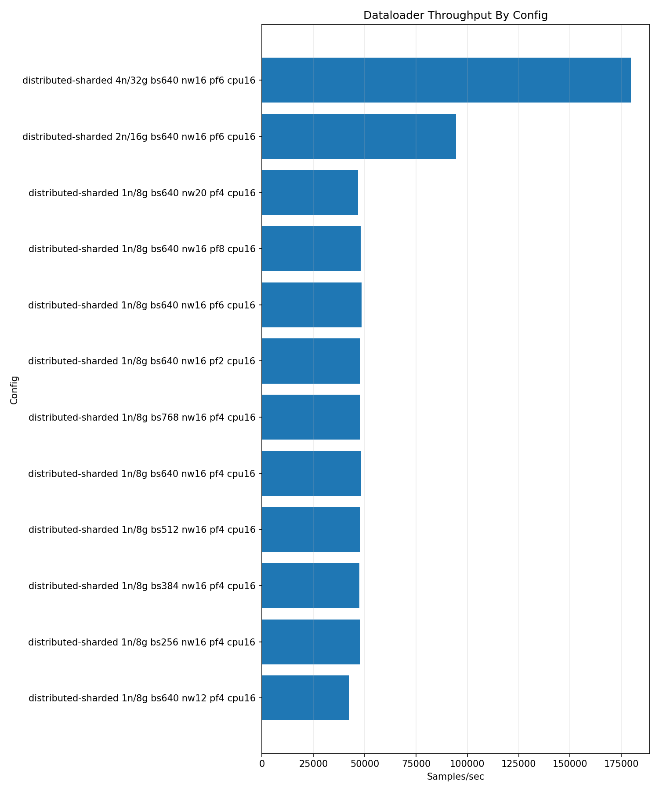
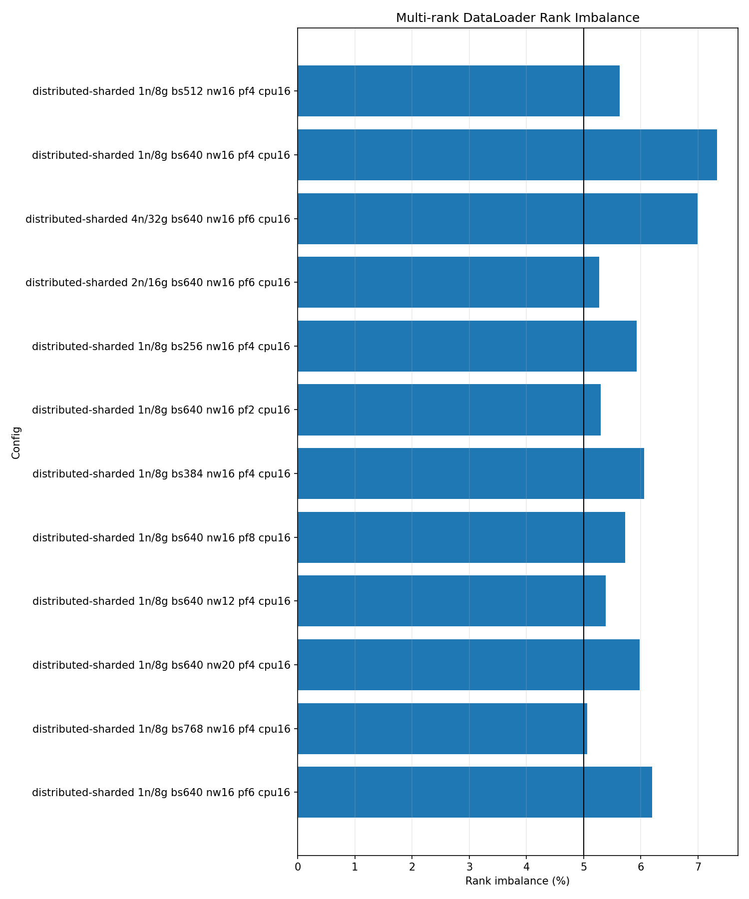

# DataLoader Benchmark Results RTX Pro 6000 2026-05-16

| Field | Value |
| --- | --- |
| Date Run | 2026-05-16 |
| Cluster | rtxpro6000 |
| Type | benchmarking |
| Status | completed |
| Input path | PyTorch CPU DataLoader, ImageFolder |
| Mode | distributed-sharded |
| GPUs per node | 8 |
| Repeated rows | 70 rendered, 70 passed |
| Aggregation | Olympic mean for repeated rows |

## SOW Conformance

Requirements come from the AICR Benchmarking Campaign Expected Metrics and Results memo (v2).

| SOW Requirement | Delivered | Status |
| --- | --- | --- |
| Scope: RTX Pro 6000 DataLoader | May 16 RTX report with one-node tuning and 1, 2, and 4 node scale rows; May 17 supplemental rows add 8 and 16 node scale rows | Met with supplemental evidence |
| SOW parameter values | May 16 OFAT campaign differs for batch and worker axes; May 17 SOW-value OFAT rows collected | Met with supplemental evidence |
| PyTorch CPU ImageFolder input | PyTorch CPU DataLoader, ImageFolder | Met |
| Metrics | Images/sec, images/sec/node, images/sec/GPU, load ms/batch, estimated VAST read GB/s from JPEG bytes, worker CPU mean | Met |

Full conformance matrix: [SOW conformance 2026-05-16](../../../../sow-conformance-2026-05-16.md).

## Run Shape

| Setting | Value |
| --- | --- |
| Selected config | batch `640`, workers `16`, prefetch `6`, pin memory `true`, persistent workers `true` |
| Runner length | 100 warmup batches, 1000 measured batches |
| CPU allocation | 16 CPUs per task |
| H2D transfer | enabled |
| One-node tuning axes | one-factor-at-a-time (OFAT): batch size, workers, prefetch, pin memory |
| Scale rows | 1, 2, and 4 nodes |
| Node pool | `a0002,a0003,a0004,a0005` |
| PyTorch version | not published in selected artifacts |
| Container digest | not published in selected artifacts |

## Command Runbook

Commands are shown with the public Make interface. Each applied launch was preceded by a Slurm queue check and was run only when no same-cluster DataLoader job was active.

```bash
squeue -u $USER -o "%.18i %.9P %.32j %.8T %.10M %.10l %.6D %R"
```

1. Batch-size OFAT on `a0002`.

```bash
make benchmark-dataloader CLUSTER=rtxpro6000 PROFILE=small GPU_COUNT=8 MODE=distributed-sharded NODELIST=a0002 \
  DATALOADER_NODES=1 DATALOADER_REPEAT_COUNT=5 \
  DATALOADER_BATCH_SIZES=256,384,512,640,768 \
  DATALOADER_NUM_WORKERS=16 DATALOADER_PREFETCH_FACTORS=4 \
  DATALOADER_PIN_MEMORY=1 DATALOADER_PERSISTENT_WORKERS=1 \
  DATALOADER_CPUS_PER_TASK=16 \
  DATALOADER_RUN_ARGS="--warmup-batches 100 --measured-batches 1000" \
  APPLY=1
```

2. Worker OFAT at batch `640`.

```bash
make benchmark-dataloader CLUSTER=rtxpro6000 PROFILE=small GPU_COUNT=8 MODE=distributed-sharded NODELIST=a0002 \
  DATALOADER_NODES=1 DATALOADER_REPEAT_COUNT=5 \
  DATALOADER_BATCH_SIZES=640 DATALOADER_NUM_WORKERS=12,20 \
  DATALOADER_PREFETCH_FACTORS=4 DATALOADER_PIN_MEMORY=1 \
  DATALOADER_PERSISTENT_WORKERS=1 DATALOADER_CPUS_PER_TASK=16 \
  DATALOADER_RUN_ARGS="--warmup-batches 100 --measured-batches 1000" \
  APPLY=1
```

3. Prefetch OFAT at batch `640`, workers `16`.

```bash
make benchmark-dataloader CLUSTER=rtxpro6000 PROFILE=small GPU_COUNT=8 MODE=distributed-sharded NODELIST=a0002 \
  DATALOADER_NODES=1 DATALOADER_REPEAT_COUNT=5 \
  DATALOADER_BATCH_SIZES=640 DATALOADER_NUM_WORKERS=16 \
  DATALOADER_PREFETCH_FACTORS=2,6,8 DATALOADER_PIN_MEMORY=1 \
  DATALOADER_PERSISTENT_WORKERS=1 DATALOADER_CPUS_PER_TASK=16 \
  DATALOADER_RUN_ARGS="--warmup-batches 100 --measured-batches 1000" \
  APPLY=1
```

4. Pin-memory comparison at batch `640`, workers `16`, prefetch `6`.

```bash
make benchmark-dataloader CLUSTER=rtxpro6000 PROFILE=small GPU_COUNT=8 MODE=distributed-sharded NODELIST=a0002 \
  DATALOADER_NODES=1 DATALOADER_REPEAT_COUNT=5 \
  DATALOADER_BATCH_SIZES=640 DATALOADER_NUM_WORKERS=16 \
  DATALOADER_PREFETCH_FACTORS=6 DATALOADER_PIN_MEMORY=0 \
  DATALOADER_PERSISTENT_WORKERS=1 DATALOADER_CPUS_PER_TASK=16 \
  DATALOADER_RUN_ARGS="--warmup-batches 100 --measured-batches 1000" \
  APPLY=1
```

5. Scale rows with the selected config.

```bash
make benchmark-dataloader CLUSTER=rtxpro6000 PROFILE=small GPU_COUNT=8 MODE=distributed-sharded NODELIST=a0002,a0003,a0004,a0005 \
  DATALOADER_NODES=2,4 DATALOADER_REPEAT_COUNT=5 \
  DATALOADER_BATCH_SIZES=640 DATALOADER_NUM_WORKERS=16 \
  DATALOADER_PREFETCH_FACTORS=6 DATALOADER_PIN_MEMORY=1 \
  DATALOADER_PERSISTENT_WORKERS=1 DATALOADER_CPUS_PER_TASK=16 \
  DATALOADER_RUN_ARGS="--warmup-batches 100 --measured-batches 1000" \
  APPLY=1
```

6. Render the public summary.

```bash
make render-dataloader CLUSTER=rtxpro6000 REPORT_DATE=2026-05-16 DATALOADER_REPEAT_AGGREGATION=olympic
```

## Final Scale Results

| Nodes | GPUs | Samples | Batch | Workers | Prefetch | Pin memory | Images/sec | Images/sec/node | Images/sec/GPU | Estimated VAST read GB/s from JPEG bytes | Worker CPU mean % | Load ms/batch | Imbalance % |
| ---: | ---: | ---: | ---: | ---: | ---: | --- | ---: | ---: | ---: | ---: | ---: | ---: | ---: |
| 1 | 8 | 5 | 640 | 16 | 6 | true | 48,130.39 | 48,130.39 | 6,016.30 | 5.24 | 84.74 | 102.63 | 4.65 |
| 2 | 16 | 5 | 640 | 16 | 6 | true | 94,200.62 | 47,100.31 | 5,887.54 | 10.26 | 82.63 | 104.45 | 4.94 |
| 4 | 32 | 5 | 640 | 16 | 6 | true | 178,780.85 | 44,695.21 | 5,586.90 | 19.41 | 78.11 | 110.95 | 5.73 |

Estimated VAST read GB/s is the workload-observed DataLoader read-bandwidth metric for SOW reporting. It is derived from ImageNet JPEG byte counts read by the ImageFolder workload, not from direct VAST telemetry.

## SOW-Shape Supplemental Rows

Supplemental rows dated 2026-05-17 use 3 samples, PyTorch CPU ImageFolder input, SOW one-factor-at-a-time values for batch size and workers, and the same 8-GPU distributed-sharded runner shape. The supplemental scale rows add RTX 8-node and 16-node coverage at the held SOW base shape.

| Supplemental set | Values | Held settings | Samples | Status |
| --- | --- | --- | ---: | --- |
| Batch size | `64,128,256,512` | workers `16`, prefetch `4`, pin `true` | 3 each | collected |
| Workers | `2,4,8,32` | batch `512`, prefetch `4`, pin `true` | 3 each | collected |
| Prefetch | `2,8` | batch `512`, workers `16`, pin `true` | 3 each | collected |
| Pin memory | `false` | batch `512`, workers `16`, prefetch `4` | 3 | collected |
| Scale | `4,8,16` nodes | batch `512`, workers `16`, prefetch `4`, pin `true` | 3 each | collected |

### SOW-Shape Result Summary

| Nodes | GPUs | Batch | Workers | Prefetch | Pin | Samples | Mean images/sec | Best images/sec | Estimated VAST read GB/s from JPEG bytes | Worker CPU mean % | Imbalance % | Status |
| ---: | ---: | ---: | ---: | ---: | --- | ---: | ---: | ---: | ---: | ---: | ---: | --- |
| 1 | 8 | 64 | 16 | 4 | true | 3 | 42,555.96 | 45,198.57 | 4.56 | 75.82 | 7.81 | collected |
| 1 | 8 | 128 | 16 | 4 | true | 3 | 44,056.15 | 45,860.83 | 4.71 | 78.30 | 7.56 | collected |
| 1 | 8 | 256 | 16 | 4 | true | 3 | 44,564.67 | 46,435.93 | 4.80 | 78.57 | 6.62 | collected |
| 1 | 8 | 512 | 2 | 4 | true | 3 | 8,074.62 | 8,104.85 | 0.90 | 88.62 | 1.74 | collected |
| 1 | 8 | 512 | 4 | 4 | true | 3 | 15,912.23 | 15,940.77 | 1.77 | 88.68 | 2.37 | collected |
| 1 | 8 | 512 | 8 | 4 | true | 3 | 30,509.77 | 30,597.91 | 3.39 | 88.61 | 3.11 | collected |
| 1 | 8 | 512 | 16 | 2 | true | 3 | 47,607.90 | 47,885.34 | 5.20 | 84.33 | 4.83 | collected |
| 1 | 8 | 512 | 16 | 4 | false | 3 | 47,148.81 | 47,399.62 | 5.11 | 82.61 | 5.56 | collected |
| 1 | 8 | 512 | 16 | 4 | true | 3 | 47,977.97 | 48,372.99 | 5.24 | 83.66 | 4.49 | collected |
| 1 | 8 | 512 | 16 | 8 | true | 3 | 48,201.65 | 48,422.38 | 5.26 | 84.35 | 4.54 | collected |
| 1 | 8 | 512 | 32 | 4 | true | 3 | 46,256.47 | 46,659.06 | 5.10 | 43.04 | 5.22 | collected |
| 4 | 32 | 512 | 16 | 4 | true | 3 | 181,574.43 | 184,554.94 | 19.72 | 78.36 | 5.67 | collected |
| 8 | 64 | 512 | 16 | 4 | true | 3 | 331,736.91 | 338,141.33 | 36.00 | 68.10 | 6.40 | collected |
| 16 | 128 | 512 | 16 | 4 | true | 3 | 523,863.65 | 532,928.29 | 56.49 | 53.58 | 8.92 | collected |

Supplemental command runbook:

1. Batch-size SOW OFAT on `a0006`.

```bash
make benchmark-dataloader CLUSTER=rtxpro6000 PROFILE=small GPU_COUNT=8 MODE=distributed-sharded NODELIST=a0006 \
  DATALOADER_NODES=1 DATALOADER_REPEAT_COUNT=3 \
  DATALOADER_BATCH_SIZES=64,128,256,512 \
  DATALOADER_NUM_WORKERS=16 DATALOADER_PREFETCH_FACTORS=4 \
  DATALOADER_PIN_MEMORY=1 DATALOADER_PERSISTENT_WORKERS=1 \
  DATALOADER_CPUS_PER_TASK=16 \
  DATALOADER_RUN_ARGS="--warmup-batches 100 --measured-batches 500" \
  APPLY=1
```

2. Worker SOW OFAT at batch `512`.

```bash
make benchmark-dataloader CLUSTER=rtxpro6000 PROFILE=small GPU_COUNT=8 MODE=distributed-sharded NODELIST=a0006 \
  DATALOADER_NODES=1 DATALOADER_REPEAT_COUNT=3 \
  DATALOADER_BATCH_SIZES=512 DATALOADER_NUM_WORKERS=2,4,8,32 \
  DATALOADER_PREFETCH_FACTORS=4 DATALOADER_PIN_MEMORY=1 \
  DATALOADER_PERSISTENT_WORKERS=1 DATALOADER_CPUS_PER_TASK=16 \
  DATALOADER_RUN_ARGS="--warmup-batches 100 --measured-batches 500" \
  APPLY=1
```

3. Prefetch SOW OFAT at batch `512`, workers `16`.

```bash
make benchmark-dataloader CLUSTER=rtxpro6000 PROFILE=small GPU_COUNT=8 MODE=distributed-sharded NODELIST=a0006 \
  DATALOADER_NODES=1 DATALOADER_REPEAT_COUNT=3 \
  DATALOADER_BATCH_SIZES=512 DATALOADER_NUM_WORKERS=16 \
  DATALOADER_PREFETCH_FACTORS=2,8 DATALOADER_PIN_MEMORY=1 \
  DATALOADER_PERSISTENT_WORKERS=1 DATALOADER_CPUS_PER_TASK=16 \
  DATALOADER_RUN_ARGS="--warmup-batches 100 --measured-batches 500" \
  APPLY=1
```

4. Pin-memory SOW comparison at batch `512`, workers `16`, prefetch `4`.

```bash
make benchmark-dataloader CLUSTER=rtxpro6000 PROFILE=small GPU_COUNT=8 MODE=distributed-sharded NODELIST=a0006 \
  DATALOADER_NODES=1 DATALOADER_REPEAT_COUNT=3 \
  DATALOADER_BATCH_SIZES=512 DATALOADER_NUM_WORKERS=16 \
  DATALOADER_PREFETCH_FACTORS=4 DATALOADER_PIN_MEMORY=0 \
  DATALOADER_PERSISTENT_WORKERS=1 DATALOADER_CPUS_PER_TASK=16 \
  DATALOADER_RUN_ARGS="--warmup-batches 100 --measured-batches 500" \
  APPLY=1
```

5. Four-node SOW scale row.

```bash
make benchmark-dataloader CLUSTER=rtxpro6000 PROFILE=small GPU_COUNT=8 MODE=distributed-sharded NODELIST=a0006,a0007,a0008,a0009 \
  DATALOADER_NODES=4 DATALOADER_REPEAT_COUNT=3 \
  DATALOADER_BATCH_SIZES=512 DATALOADER_NUM_WORKERS=16 \
  DATALOADER_PREFETCH_FACTORS=4 DATALOADER_PIN_MEMORY=1 \
  DATALOADER_PERSISTENT_WORKERS=1 DATALOADER_CPUS_PER_TASK=16 \
  DATALOADER_RUN_ARGS="--warmup-batches 100 --measured-batches 500" \
  APPLY=1
```

6. Eight-node SOW scale row.

```bash
make benchmark-dataloader CLUSTER=rtxpro6000 PROFILE=small GPU_COUNT=8 MODE=distributed-sharded NODELIST=a0002,a0003,a0004,a0005,a0006,a0007,a0008,a0009 \
  DATALOADER_NODES=8 DATALOADER_REPEAT_COUNT=3 \
  DATALOADER_BATCH_SIZES=512 DATALOADER_NUM_WORKERS=16 \
  DATALOADER_PREFETCH_FACTORS=4 DATALOADER_PIN_MEMORY=1 \
  DATALOADER_PERSISTENT_WORKERS=1 DATALOADER_CPUS_PER_TASK=16 \
  DATALOADER_RUN_ARGS="--warmup-batches 100 --measured-batches 500" \
  APPLY=1
```

7. Sixteen-node SOW scale row.

```bash
make benchmark-dataloader CLUSTER=rtxpro6000 PROFILE=small GPU_COUNT=8 MODE=distributed-sharded NODELIST=a0002,a0003,a0004,a0005,a0006,a0007,a0008,a0009,a0010,a0011,a0012,a0013,a0014,a0015,a0016,a0019 \
  DATALOADER_NODES=16 DATALOADER_REPEAT_COUNT=3 \
  DATALOADER_BATCH_SIZES=512 DATALOADER_NUM_WORKERS=16 \
  DATALOADER_PREFETCH_FACTORS=4 DATALOADER_PIN_MEMORY=1 \
  DATALOADER_PERSISTENT_WORKERS=1 DATALOADER_CPUS_PER_TASK=16 \
  DATALOADER_RUN_ARGS="--warmup-batches 100 --measured-batches 500" \
  APPLY=1
```

8. Render the supplemental summary.

```bash
make render-dataloader CLUSTER=rtxpro6000 REPORT_DATE=2026-05-17 DATALOADER_REPEAT_AGGREGATION=olympic
```

Supplemental artifacts:

| Artifact | Location | Status |
| --- | --- | --- |
| May 17 supplemental summary CSV | [dataloader-summary-rtxpro6000-2026-05-17.csv](../../../2026-05-17/benchmarks/dataloader/dataloader-summary-rtxpro6000-2026-05-17.csv) | collected |
| May 17 supplemental report JSON | [dataloader-report-rtxpro6000-2026-05-17.json](../../../2026-05-17/benchmarks/dataloader/dataloader-report-rtxpro6000-2026-05-17.json) | collected |
| May 17 supplemental throughput PNG | [dataloader-throughput-rtxpro6000-2026-05-17.png](../../../2026-05-17/benchmarks/dataloader/dataloader-throughput-rtxpro6000-2026-05-17.png) | collected |
| May 17 supplemental rank-imbalance PNG | [dataloader-rank-imbalance-rtxpro6000-2026-05-17.png](../../../2026-05-17/benchmarks/dataloader/dataloader-rank-imbalance-rtxpro6000-2026-05-17.png) | collected |
| May 17 VAST bundle | `/work/aicr/commissioning/benchmarks/public-study-artifacts/aicr-public/c28cafb/dataloader/2026-05-17/dataloader-rtxpro6000-sow-supplemental-2026-05-17.tar.gz` | collected |
| May 17 OSN bundle | <https://uma1.osn.mghpcc.org/csim-bmark/public-study-artifacts/aicr-public/c28cafb/dataloader/2026-05-17/dataloader-rtxpro6000-sow-supplemental-2026-05-17.tar.gz> | collected |
| May 17 provenance JSON | <https://uma1.osn.mghpcc.org/csim-bmark/public-study-artifacts/aicr-public/c28cafb/dataloader/2026-05-17/dataloader-rtxpro6000-sow-supplemental-2026-05-17-provenance.json> | collected |
| May 17 checksum | <https://uma1.osn.mghpcc.org/csim-bmark/public-study-artifacts/aicr-public/c28cafb/dataloader/2026-05-17/dataloader-rtxpro6000-sow-supplemental-2026-05-17.sha256> | collected |
| May 17 tarball SHA-256 | `71ba04bff9d23d888d519129e8d5779f1209f69a6be0ebe3d6d38773733fe7e1` | collected |

## OFAT Sweep Coverage

| Axis | Values Collected | Held Settings |
| --- | --- | --- |
| Batch size | `256,384,512,640,768` | workers `16`, prefetch `4`, pin `true` |
| Workers | `12,16,20` | batch `640`, prefetch `4`, pin `true` |
| Prefetch | `2,4,6,8` | batch `640`, workers `16`, pin `true` |
| Pin memory | `true,false` | batch `640`, workers `16`, prefetch `6` |
| Scale | `1,2,4` nodes | batch `640`, workers `16`, prefetch `6`, pin `true` |

## Repeated Config Summary

| Nodes | GPUs | Batch | Workers | Prefetch | Pin | Warmup | Measured | Samples | Olympic images/sec | Min | Max | Dropped min/max | Stddev | Aggregation | Jobs |
| ---: | ---: | ---: | ---: | ---: | --- | ---: | ---: | ---: | ---: | ---: | ---: | --- | ---: | --- | --- |
| 1 | 8 | 256 | 16 | 4 | true | 100 | 1000 | 5 | 47,342.82 | 46,660.09 | 47,565.48 | 46,660.09/47,565.48 | 325.32 | olympic 3/5 | `21351,21352,21353,21354,21357` |
| 1 | 8 | 384 | 16 | 4 | true | 100 | 1000 | 5 | 47,455.41 | 47,103.66 | 47,528.67 | 47,103.66/47,528.67 | 161.18 | olympic 3/5 | `21358,21359,21360,21361,21362` |
| 1 | 8 | 512 | 16 | 4 | true | 100 | 1000 | 5 | 47,535.14 | 46,827.36 | 47,843.91 | 46,827.36/47,843.91 | 395.41 | olympic 3/5 | `21363,21370,21395,21396,21397` |
| 1 | 8 | 640 | 12 | 4 | true | 100 | 1000 | 5 | 42,419.91 | 42,127.06 | 42,467.18 | 42,127.06/42,467.18 | 130.51 | olympic 3/5 | `21437,21438,21439,21440,21442` |
| 1 | 8 | 640 | 16 | 2 | true | 100 | 1000 | 5 | 47,852.12 | 47,636.53 | 47,956.87 | 47,636.53/47,956.87 | 111.79 | olympic 3/5 | `21467,21469,21471,21473,21475` |
| 1 | 8 | 640 | 16 | 4 | true | 100 | 1000 | 10 | 48,037.14 | 47,718.93 | 48,283.17 | 47,718.93/48,283.17 | 178.42 | olympic 8/10 | `21413,21414,21423,21424,21425,21444,21447,21450,21452,21454` |
| 1 | 8 | 640 | 16 | 6 | false | 100 | 1000 | 5 | 48,103.34 | 47,777.48 | 48,425.39 | 47,777.48/48,425.39 | 238.63 | olympic 3/5 | `21497,21499,21501,21503,21505` |
| 1 | 8 | 640 | 16 | 6 | true | 100 | 1000 | 5 | 48,130.39 | 47,882.24 | 48,229.13 | 47,882.24/48,229.13 | 119.70 | olympic 3/5 | `21477,21479,21481,21483,21485` |
| 1 | 8 | 640 | 16 | 8 | true | 100 | 1000 | 5 | 48,025.54 | 47,803.56 | 48,132.88 | 47,803.56/48,132.88 | 109.67 | olympic 3/5 | `21486,21488,21490,21491,21493` |
| 1 | 8 | 640 | 20 | 4 | true | 100 | 1000 | 5 | 46,739.09 | 46,632.35 | 46,858.34 | 46,632.35/46,858.34 | 82.02 | olympic 3/5 | `21456,21459,21461,21463,21465` |
| 1 | 8 | 768 | 16 | 4 | true | 100 | 1000 | 5 | 47,793.04 | 47,613.73 | 47,868.58 | 47,613.73/47,868.58 | 101.88 | olympic 3/5 | `21426,21431,21432,21433,21436` |
| 2 | 16 | 640 | 16 | 6 | true | 100 | 1000 | 5 | 94,200.62 | 93,597.40 | 94,447.18 | 93,597.40/94,447.18 | 297.08 | olympic 3/5 | `21527,21528,21529,21530,21531` |
| 4 | 32 | 640 | 16 | 6 | true | 100 | 1000 | 5 | 178,780.85 | 175,950.41 | 179,537.73 | 175,950.41/179,537.73 | 1,357.16 | olympic 3/5 | `21532,21533,21534,21535,21536` |

## Top One-Node Rows

| Run | Batch | Workers | Prefetch | Pin | Node List | Images/sec | Images/sec/GPU | Load ms/batch | Imbalance % |
| --- | ---: | ---: | ---: | --- | --- | ---: | ---: | ---: | ---: |
| 190606Z-r01 | 640 | 16 | 6 | false | a0002 | 48,425.39 | 6,053.17 | 66.69 | 3.92 |
| 191106Z-r01 | 640 | 16 | 6 | false | a0002 | 48,299.35 | 6,037.42 | 66.41 | 3.99 |
| 171731Z-r01 | 640 | 16 | 4 | true | a0002 | 48,283.17 | 6,035.40 | 102.89 | 5.62 |
| 184605Z-r01 | 640 | 16 | 6 | true | a0002 | 48,229.13 | 6,028.64 | 101.59 | 4.27 |
| 171501Z-r01 | 640 | 16 | 4 | true | a0002 | 48,227.61 | 6,028.45 | 104.03 | 6.56 |

## Figures





## Artifacts And Provenance

| Artifact | Location |
| --- | --- |
| Summary CSV | [dataloader-summary-rtxpro6000-2026-05-16.csv](./dataloader-summary-rtxpro6000-2026-05-16.csv) |
| Report JSON | [dataloader-report-rtxpro6000-2026-05-16.json](./dataloader-report-rtxpro6000-2026-05-16.json) |
| Throughput PNG | [dataloader-throughput-rtxpro6000-2026-05-16.png](./dataloader-throughput-rtxpro6000-2026-05-16.png) |
| Rank imbalance PNG | [dataloader-rank-imbalance-rtxpro6000-2026-05-16.png](./dataloader-rank-imbalance-rtxpro6000-2026-05-16.png) |
| Retained HPC parsed evidence | `results/by-date/2026-05-16/parsed/rtxpro6000/**/dataloader/*/summary.json` |
| May 16 VAST bundle | `/work/aicr/commissioning/benchmarks/public-study-artifacts/aicr-public/87f29c0/dataloader/2026-05-16/dataloader-rtxpro6000-campaign-2026-05-16.tar.gz` |
| May 16 OSN bundle | <https://uma1.osn.mghpcc.org/csim-bmark/public-study-artifacts/aicr-public/87f29c0/dataloader/2026-05-16/dataloader-rtxpro6000-campaign-2026-05-16.tar.gz> |
| May 16 provenance JSON | <https://uma1.osn.mghpcc.org/csim-bmark/public-study-artifacts/aicr-public/87f29c0/dataloader/2026-05-16/dataloader-rtxpro6000-campaign-2026-05-16-provenance.json> |
| May 16 checksum | <https://uma1.osn.mghpcc.org/csim-bmark/public-study-artifacts/aicr-public/87f29c0/dataloader/2026-05-16/dataloader-rtxpro6000-campaign-2026-05-16.sha256> |
| May 16 tarball SHA-256 | `1a4964916b4cf924e88f09945df4367c20359e71225ddb70bf859787ac75ee6e` |

## Retrieve And Verify

```bash
mkdir -p public-study-artifacts/dataloader-rtxpro6000-2026-05-16
cd public-study-artifacts/dataloader-rtxpro6000-2026-05-16
wget https://uma1.osn.mghpcc.org/csim-bmark/public-study-artifacts/aicr-public/87f29c0/dataloader/2026-05-16/dataloader-rtxpro6000-campaign-2026-05-16.tar.gz
wget https://uma1.osn.mghpcc.org/csim-bmark/public-study-artifacts/aicr-public/87f29c0/dataloader/2026-05-16/dataloader-rtxpro6000-campaign-2026-05-16.sha256
sed 's#  .*/#  #' dataloader-rtxpro6000-campaign-2026-05-16.sha256 | sha256sum -c -
tar -tzf dataloader-rtxpro6000-campaign-2026-05-16.tar.gz | head
```

Related earlier RTX DataLoader study bundles remain available for the pre-campaign study pages:

| Study | VAST Bundle | OSN Bundle |
| --- | --- | --- |
| RTX one-node worker scan, 2026-05-12 | `/work/aicr/commissioning/benchmarks/public-study-artifacts/aicr-public/e5bba11/dataloader/2026-05-12/dataloader-b200-rtx-one-node-replicated-worker-scan-olympic-2026-05-12.tar.gz` | <https://uma1.osn.mghpcc.org/csim-bmark/public-study-artifacts/aicr-public/e5bba11/dataloader/2026-05-12/dataloader-b200-rtx-one-node-replicated-worker-scan-olympic-2026-05-12.tar.gz> |
| RTX multinode sharded entry, 2026-05-12 | `/work/aicr/commissioning/benchmarks/public-study-artifacts/aicr-public/d741793/dataloader/2026-05-12/dataloader-rtx-multinode-sharded-entry-olympic-2026-05-12.tar.gz` | <https://uma1.osn.mghpcc.org/csim-bmark/public-study-artifacts/aicr-public/d741793/dataloader/2026-05-12/dataloader-rtx-multinode-sharded-entry-olympic-2026-05-12.tar.gz> |
| RTX 8-node scale probe, 2026-05-13 | `/work/aicr/commissioning/benchmarks/public-study-artifacts/aicr-public/c54a4b2/dataloader/2026-05-13/dataloader-rtx-8node-scale-probe-2026-05-13.tar.gz` | <https://uma1.osn.mghpcc.org/csim-bmark/public-study-artifacts/aicr-public/c54a4b2/dataloader/2026-05-13/dataloader-rtx-8node-scale-probe-2026-05-13.tar.gz> |
