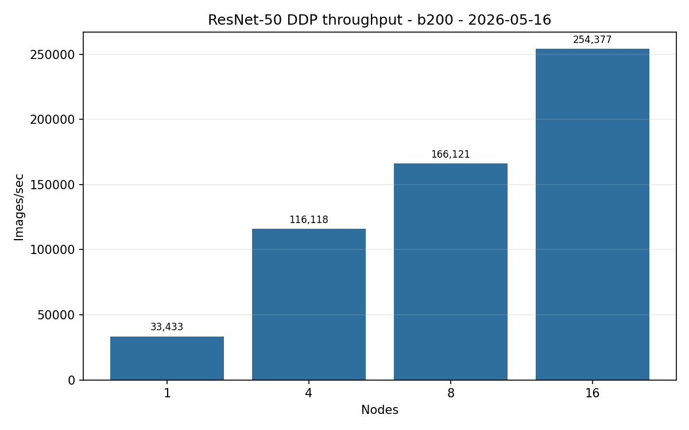
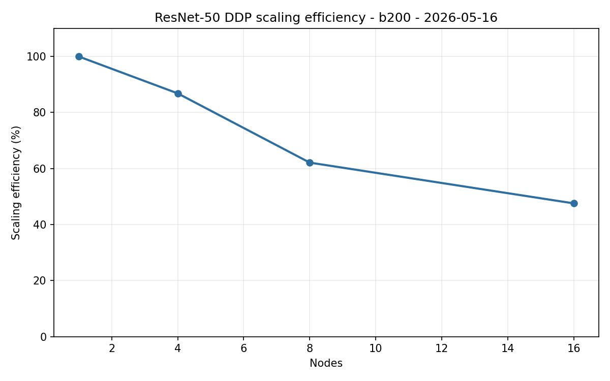

# ResNet-50 DDP Benchmark Results B200 2026-05-16

| Field | Value |
| --- | --- |
| Date Run | 2026-05-16 |
| Cluster | b200 |
| Type | benchmarking |
| Status | completed |
| Launcher | torchrun |
| Precision | bf16 |
| Input backend | PyTorch CPU DataLoader |
| Dataset | Base ImageNet train images |
| Dataset root (AICR HPC) | `/work/aicr/commissioning/benchmarks/imagenet/ILSVRC/Data/CLS-LOC` |
| GPU-resident input | false |
| Aggregation | Olympic mean for repeated rows |

## Memo Conformance

Requirements come from `AICR-Benchmarking-Campaign-Expected-Metrics-and-Results-Memo-for-MGHPCC-v2.pdf`, dated February 27, 2026.

| Memo Requirement | Delivered | Status |
| --- | --- | --- |
| ResNet-50 on ImageNet | ResNet-50 with base ImageNet train images | Met |
| PyTorch DDP, NCCL backend, `torchrun` | `torchrun` launcher with NCCL communication backend | Met |
| B200 scale `{1,4,8,16}` nodes | 1, 4, 8, and 16 node rows | Met |
| Metrics | Images/sec, epoch minutes, scaling efficiency | Met |

Full conformance matrix: [Memo conformance 2026-05-16](../../../../memo-conformance-2026-05-16.md).

## Run Shape

| Setting | Value |
| --- | --- |
| Communication backend | NCCL via torchrun |
| PyTorch version | not published in selected artifacts |
| Batch per rank | 640 |
| Workers per rank | 16 |
| Prefetch factor | 4 |
| Pin memory | true |
| Persistent workers | true |
| Warmup / measured iterations | 20 / 100 |
| Scale rows | 1, 4, 8, and 16 nodes |
| Node pool | `b0002,b0003,b0004,b0005,b0006,b0007,b0008,b0009,b0010,b0011,b0012,b0013,b0014,b0015,b0016,b0017` |
| Published sample rows | 20 |

## Command Runbook

Commands are shown with the public Make interface. Each command below was submitted five times for the row shown. Each applied launch was preceded by a Slurm queue check and was run only when no same-cluster DDP job was active.

```bash
squeue -u $USER -o "%.18i %.9P %.32j %.8T %.10M %.10l %.6D %R"
```

1. One-node DDP scale row on `b0002`.

```bash
make benchmark-ddp-resnet50 CLUSTER=b200 NODES=1 LAUNCHER=torchrun FROM_NODE_REPORT=1 NODE_REPORT_DATE=2026-05-16 NODELIST=b0002 DDP_REPEAT_COUNT=5 \
  DDP_RUN_ARGS="--input-backend pytorch-cpu-dataloader --batch-size 640 --num-workers 16 --prefetch-factor 4 --pin-memory 1 --persistent-workers 1 --warmup-iters 20 --measured-iters 100 --precision bf16 --channels-last 1 --drop-last 1" \
  APPLY=1
```

2. Four-node DDP scale row on `b0002,b0003,b0004,b0005`.

```bash
make benchmark-ddp-resnet50 CLUSTER=b200 NODES=4 LAUNCHER=torchrun FROM_NODE_REPORT=1 NODE_REPORT_DATE=2026-05-16 NODELIST=b0002,b0003,b0004,b0005 DDP_REPEAT_COUNT=5 \
  DDP_RUN_ARGS="--input-backend pytorch-cpu-dataloader --batch-size 640 --num-workers 16 --prefetch-factor 4 --pin-memory 1 --persistent-workers 1 --warmup-iters 20 --measured-iters 100 --precision bf16 --channels-last 1 --drop-last 1" \
  APPLY=1
```

3. Eight-node DDP scale row on `b0002,b0003,b0004,b0005,b0006,b0007,b0008,b0009`.

```bash
make benchmark-ddp-resnet50 CLUSTER=b200 NODES=8 LAUNCHER=torchrun FROM_NODE_REPORT=1 NODE_REPORT_DATE=2026-05-16 NODELIST=b0002,b0003,b0004,b0005,b0006,b0007,b0008,b0009 DDP_REPEAT_COUNT=5 \
  DDP_RUN_ARGS="--input-backend pytorch-cpu-dataloader --batch-size 640 --num-workers 16 --prefetch-factor 4 --pin-memory 1 --persistent-workers 1 --warmup-iters 20 --measured-iters 100 --precision bf16 --channels-last 1 --drop-last 1" \
  APPLY=1
```

4. Sixteen-node DDP scale row on `b0002,b0003,b0004,b0005,b0006,b0007,b0008,b0009,b0010,b0011,b0012,b0013,b0014,b0015,b0016,b0017`.

```bash
make benchmark-ddp-resnet50 CLUSTER=b200 NODES=16 LAUNCHER=torchrun FROM_NODE_REPORT=1 NODE_REPORT_DATE=2026-05-16 NODELIST=b0002,b0003,b0004,b0005,b0006,b0007,b0008,b0009,b0010,b0011,b0012,b0013,b0014,b0015,b0016,b0017 DDP_REPEAT_COUNT=5 \
  DDP_RUN_ARGS="--input-backend pytorch-cpu-dataloader --batch-size 640 --num-workers 16 --prefetch-factor 4 --pin-memory 1 --persistent-workers 1 --warmup-iters 20 --measured-iters 100 --precision bf16 --channels-last 1 --drop-last 1" \
  APPLY=1
```

5. Render the public summary.

```bash
make render-ddp-resnet50 CLUSTER=b200 REPORT_DATE=2026-05-16
```

## Results

| Nodes | GPUs | Samples | Batch/GPU | Workers | Prefetch | Images/sec | Images/sec/node | Images/sec/GPU | Epoch min | Scaling efficiency % | Rank imbalance % | Data wait s | Train s | Jobs |
| ---: | ---: | ---: | ---: | ---: | ---: | ---: | ---: | ---: | ---: | ---: | ---: | ---: | ---: | --- |
| 1 | 8 | 5 | 640 | 16 | 4 | 33,433.22 | 33,433.22 | 4,179.15 | 0.64 | 100.00 | 0.0128 | 0.0068 | 0.1357 | `21655,21656,21657,21658,21659` |
| 4 | 32 | 5 | 640 | 16 | 4 | 116,117.68 | 29,029.42 | 3,628.68 | 0.18 | 86.83 | 0.0035 | 0.0378 | 0.1472 | `21650,21651,21652,21653,21654` |
| 8 | 64 | 5 | 640 | 16 | 4 | 166,121.03 | 20,765.13 | 2,595.64 | 0.13 | 62.11 | 0.0021 | 0.1098 | 0.1831 | `21645,21646,21647,21648,21649` |
| 16 | 128 | 5 | 640 | 16 | 4 | 254,376.58 | 15,898.54 | 1,987.32 | 0.08 | 47.55 | 0.0021 | 0.1656 | 0.2154 | `21640,21641,21642,21643,21644` |

## Findings

The 16-node B200 row reached 47.55% scaling efficiency with PyTorch CPU DataLoader input. Data wait rose from 0.0068 seconds at 1 node to 0.1656 seconds at 16 nodes, while images/sec/GPU fell from 4,179.15 to 1,987.32. The data-input pipeline is the suspected bottleneck in the tested 16-node shape.

## Figures





## Artifacts And Provenance

| Artifact | Location |
| --- | --- |
| Summary CSV | [ddp-resnet50-summary-b200-2026-05-16.csv](./ddp-resnet50-summary-b200-2026-05-16.csv) |
| Repeat CSV | [ddp-resnet50-repeat-aggregation-b200-2026-05-16.csv](./ddp-resnet50-repeat-aggregation-b200-2026-05-16.csv) |
| Report JSON | [ddp-resnet50-report-b200-2026-05-16.json](./ddp-resnet50-report-b200-2026-05-16.json) |
| Throughput PNG | [ddp-resnet50-throughput-b200-2026-05-16.png](./ddp-resnet50-throughput-b200-2026-05-16.png) |
| Scaling PNG | [ddp-resnet50-scaling-b200-2026-05-16.png](./ddp-resnet50-scaling-b200-2026-05-16.png) |
| Retained HPC parsed evidence | `results/by-date/2026-05-16/parsed/b200/multi-node/ddp-resnet50/<selected-run-id>/summary.json` |
| May 16 operator staging path (AICR HPC) | `/work/aicr/commissioning/benchmarks/public-study-artifacts/aicr-public/c1a0cf3/ddp/2026-05-16/ddp-resnet50-b200-cpu-pytorch-campaign-2026-05-16.tar.gz` |
| May 16 OSN bundle | <https://uma1.osn.mghpcc.org/csim-bmark/public-study-artifacts/aicr-public/c1a0cf3/ddp/2026-05-16/ddp-resnet50-b200-cpu-pytorch-campaign-2026-05-16.tar.gz> |
| May 16 provenance JSON | <https://uma1.osn.mghpcc.org/csim-bmark/public-study-artifacts/aicr-public/c1a0cf3/ddp/2026-05-16/ddp-resnet50-b200-cpu-pytorch-campaign-2026-05-16-provenance.json> |
| May 16 checksum | <https://uma1.osn.mghpcc.org/csim-bmark/public-study-artifacts/aicr-public/c1a0cf3/ddp/2026-05-16/ddp-resnet50-b200-cpu-pytorch-campaign-2026-05-16.sha256> |
| May 16 tarball SHA-256 | `a0fb090c11c22586617b8c3db7a30987778af4e0f2e2660f5ffb506f98897b24` |

## Retrieve And Verify

```bash
mkdir -p public-study-artifacts/ddp-b200-2026-05-16
cd public-study-artifacts/ddp-b200-2026-05-16
wget https://uma1.osn.mghpcc.org/csim-bmark/public-study-artifacts/aicr-public/c1a0cf3/ddp/2026-05-16/ddp-resnet50-b200-cpu-pytorch-campaign-2026-05-16.tar.gz
wget https://uma1.osn.mghpcc.org/csim-bmark/public-study-artifacts/aicr-public/c1a0cf3/ddp/2026-05-16/ddp-resnet50-b200-cpu-pytorch-campaign-2026-05-16.sha256
sed 's#  .*/#  #' ddp-resnet50-b200-cpu-pytorch-campaign-2026-05-16.sha256 | sha256sum -c -
tar -tzf ddp-resnet50-b200-cpu-pytorch-campaign-2026-05-16.tar.gz | head
```
