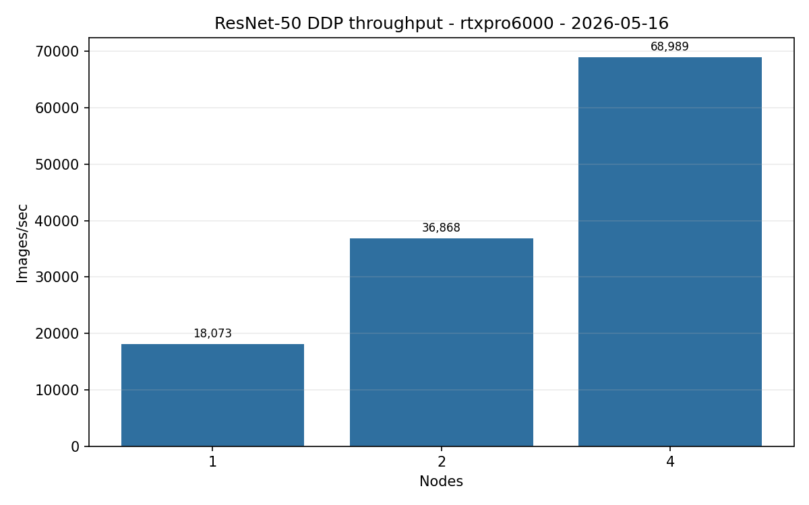
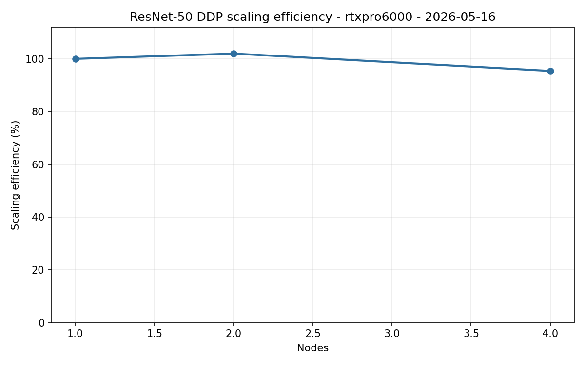

# ResNet-50 DDP Benchmark Results RTX Pro 6000 2026-05-16

| Field | Value |
| --- | --- |
| Date Run | 2026-05-16 |
| Cluster | rtxpro6000 |
| Type | benchmarking |
| Status | completed |
| Launcher | torchrun |
| Precision | bf16 |
| Input backend | PyTorch CPU DataLoader |
| Dataset | Base ImageNet train images |
| Dataset root | `/work/aicr/commissioning/benchmarks/imagenet/ILSVRC/Data/CLS-LOC` |
| GPU-resident input | false |
| Aggregation | Olympic mean for repeated rows |

## SOW Conformance

Requirements come from the AICR Benchmarking Campaign Expected Metrics and Results memo (v2).

| SOW Requirement | Delivered | Status |
| --- | --- | --- |
| ResNet-50 on ImageNet | ResNet-50 with base ImageNet train images | Met |
| PyTorch DDP, NCCL backend, `torchrun` | `torchrun` launcher with NCCL communication backend | Met |
| RTX Pro 6000 scale `{1,4}` nodes | 1, 2, and 4 node rows | Met (superset) |
| Metrics | Images/sec, epoch minutes, scaling efficiency | Met |

Full conformance matrix: [SOW conformance 2026-05-16](../../../../sow-conformance-2026-05-16.md).

## Run Shape

| Setting | Value |
| --- | --- |
| Communication backend | NCCL via torchrun |
| PyTorch version | not published in selected artifacts |
| Batch per rank | 640 |
| Workers per rank | 16 |
| Prefetch factor | 6 |
| Pin memory | true |
| Persistent workers | true |
| Warmup / measured iterations | 20 / 100 |
| Scale rows | 1, 2, and 4 nodes |
| Node pool | `a0002,a0003,a0004,a0005` |
| Published sample rows | 15 |

## Command Runbook

Commands are shown with the public Make interface. Each command below was submitted five times for the row shown. Each applied launch was preceded by a Slurm queue check and was run only when no same-cluster DDP job was active.

```bash
squeue -u $USER -o "%.18i %.9P %.32j %.8T %.10M %.10l %.6D %R"
```

1. One-node DDP scale row on `a0002`.

```bash
make benchmark-ddp-resnet50 CLUSTER=rtxpro6000 NODES=1 LAUNCHER=torchrun FROM_NODE_REPORT=1 NODE_REPORT_DATE=2026-05-16 NODELIST=a0002 DDP_REPEAT_COUNT=5 \
  DDP_RUN_ARGS="--input-backend pytorch-cpu-dataloader --batch-size 640 --num-workers 16 --prefetch-factor 6 --pin-memory 1 --persistent-workers 1 --warmup-iters 20 --measured-iters 100 --precision bf16 --channels-last 1 --drop-last 1" \
  APPLY=1
```

2. Two-node DDP scale row on `a0002,a0003`.

```bash
make benchmark-ddp-resnet50 CLUSTER=rtxpro6000 NODES=2 LAUNCHER=torchrun FROM_NODE_REPORT=1 NODE_REPORT_DATE=2026-05-16 NODELIST=a0002,a0003 DDP_REPEAT_COUNT=5 \
  DDP_RUN_ARGS="--input-backend pytorch-cpu-dataloader --batch-size 640 --num-workers 16 --prefetch-factor 6 --pin-memory 1 --persistent-workers 1 --warmup-iters 20 --measured-iters 100 --precision bf16 --channels-last 1 --drop-last 1" \
  APPLY=1
```

3. Four-node DDP scale row on `a0002,a0003,a0004,a0005`.

```bash
make benchmark-ddp-resnet50 CLUSTER=rtxpro6000 NODES=4 LAUNCHER=torchrun FROM_NODE_REPORT=1 NODE_REPORT_DATE=2026-05-16 NODELIST=a0002,a0003,a0004,a0005 DDP_REPEAT_COUNT=5 \
  DDP_RUN_ARGS="--input-backend pytorch-cpu-dataloader --batch-size 640 --num-workers 16 --prefetch-factor 6 --pin-memory 1 --persistent-workers 1 --warmup-iters 20 --measured-iters 100 --precision bf16 --channels-last 1 --drop-last 1" \
  APPLY=1
```

4. Render the public summary.

```bash
make render-ddp-resnet50 CLUSTER=rtxpro6000 REPORT_DATE=2026-05-16
```

## Results

| Nodes | GPUs | Samples | Batch/GPU | Workers | Prefetch | Images/sec | Images/sec/node | Images/sec/GPU | Epoch min | Scaling efficiency % | Rank imbalance % | Data wait s | Train s | Jobs |
| ---: | ---: | ---: | ---: | ---: | ---: | ---: | ---: | ---: | ---: | ---: | ---: | ---: | ---: | --- |
| 1 | 8 | 5 | 640 | 16 | 6 | 18,072.99 | 18,072.99 | 2,259.12 | 1.18 | 100.00 | 0.0004 | 0.0093 | 0.2679 | `21537,21538,21539,21540,21541` |
| 2 | 16 | 5 | 640 | 16 | 6 | 36,868.22 | 18,434.11 | 2,304.26 | 0.58 | 102.00 | 0.0028 | 0.0080 | 0.2662 | `21542,21543,21544,21545,21546` |
| 4 | 32 | 5 | 640 | 16 | 6 | 68,989.11 | 17,247.28 | 2,155.91 | 0.31 | 95.43 | 0.0023 | 0.0308 | 0.2699 | `21547,21548,21549,21550,21551` |

## Findings

RTX Pro 6000 scaling efficiency stayed at 95.43% at 4 nodes in the tested range. Data wait remained at or below 0.0308 seconds, and no data-input bottleneck was identified in the 1, 2, and 4 node rows.

## Figures





## Artifacts And Provenance

| Artifact | Location |
| --- | --- |
| Summary CSV | [ddp-resnet50-summary-rtxpro6000-2026-05-16.csv](./ddp-resnet50-summary-rtxpro6000-2026-05-16.csv) |
| Repeat CSV | [ddp-resnet50-repeat-aggregation-rtxpro6000-2026-05-16.csv](./ddp-resnet50-repeat-aggregation-rtxpro6000-2026-05-16.csv) |
| Report JSON | [ddp-resnet50-report-rtxpro6000-2026-05-16.json](./ddp-resnet50-report-rtxpro6000-2026-05-16.json) |
| Throughput PNG | [ddp-resnet50-throughput-rtxpro6000-2026-05-16.png](./ddp-resnet50-throughput-rtxpro6000-2026-05-16.png) |
| Scaling PNG | [ddp-resnet50-scaling-rtxpro6000-2026-05-16.png](./ddp-resnet50-scaling-rtxpro6000-2026-05-16.png) |
| Retained HPC parsed evidence | `results/by-date/2026-05-16/parsed/rtxpro6000/multi-node/ddp-resnet50/<selected-run-id>/summary.json` |
| May 16 VAST bundle | `/work/aicr/commissioning/benchmarks/public-study-artifacts/aicr-public/c1a0cf3/ddp/2026-05-16/ddp-resnet50-rtxpro6000-cpu-pytorch-campaign-2026-05-16.tar.gz` |
| May 16 OSN bundle | <https://uma1.osn.mghpcc.org/csim-bmark/public-study-artifacts/aicr-public/c1a0cf3/ddp/2026-05-16/ddp-resnet50-rtxpro6000-cpu-pytorch-campaign-2026-05-16.tar.gz> |
| May 16 provenance JSON | <https://uma1.osn.mghpcc.org/csim-bmark/public-study-artifacts/aicr-public/c1a0cf3/ddp/2026-05-16/ddp-resnet50-rtxpro6000-cpu-pytorch-campaign-2026-05-16-provenance.json> |
| May 16 checksum | <https://uma1.osn.mghpcc.org/csim-bmark/public-study-artifacts/aicr-public/c1a0cf3/ddp/2026-05-16/ddp-resnet50-rtxpro6000-cpu-pytorch-campaign-2026-05-16.sha256> |
| May 16 tarball SHA-256 | `1379c1b68f04586e273a551a75193e7c1b210bcaa221cefba9852dee11c2505d` |

## Retrieve And Verify

```bash
mkdir -p public-study-artifacts/ddp-rtxpro6000-2026-05-16
cd public-study-artifacts/ddp-rtxpro6000-2026-05-16
wget https://uma1.osn.mghpcc.org/csim-bmark/public-study-artifacts/aicr-public/c1a0cf3/ddp/2026-05-16/ddp-resnet50-rtxpro6000-cpu-pytorch-campaign-2026-05-16.tar.gz
wget https://uma1.osn.mghpcc.org/csim-bmark/public-study-artifacts/aicr-public/c1a0cf3/ddp/2026-05-16/ddp-resnet50-rtxpro6000-cpu-pytorch-campaign-2026-05-16.sha256
sed 's#  .*/#  #' ddp-resnet50-rtxpro6000-cpu-pytorch-campaign-2026-05-16.sha256 | sha256sum -c -
tar -tzf ddp-resnet50-rtxpro6000-cpu-pytorch-campaign-2026-05-16.tar.gz | head
```
